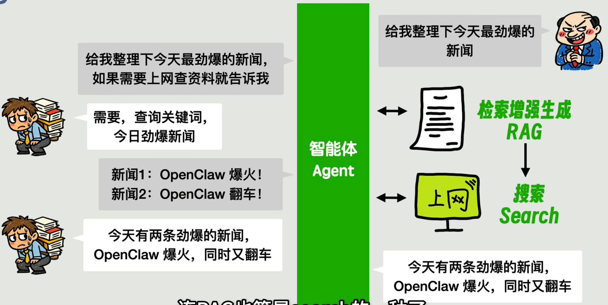
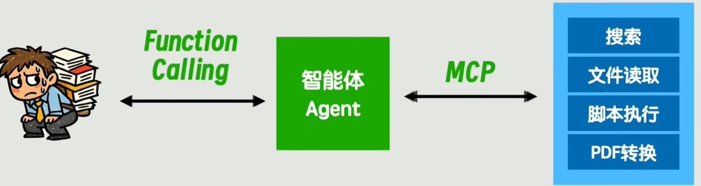
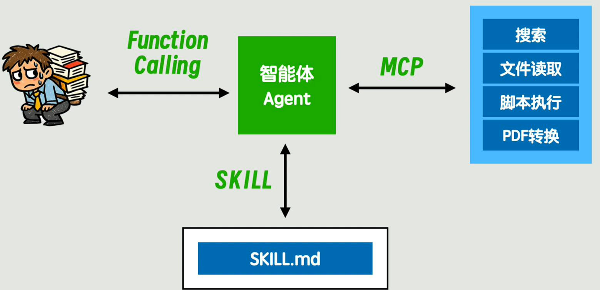

# 目录  
1.介绍  
2.学习路线  

## 1.介绍  
**目录:**  
1.1 相关术语  
1.2 大模型推荐  

### 1.1 相关术语  
1.LLM(大语言模型)  

2.Prompt(提示词)  
每次与AI对话时当前发送的信息就称为提示词Prompt  

3.Context(上下文)  
LLM非常傻,只能一次问一次答,为了解决这个问题,则将上一次的Prompt+LLM的Response作为下一次的Context,每次问答由Context+Prompt组成  
简单理解为,AI把所有的历史问答记录放到Context便于理解,而Prompt永远指代每次的新问题  

4.Memory  
将上下文信息进行压缩便形成了Memory,AI通过Memory+Prompt来生成下一次的Response  

5.Agent(智能体)  
智能体的翻译不恰当,翻译为代理更加合适  
由于LLM本身只具备文字推理的功能,假设现在要让LLM总结查询及时的互联网信息,那么LLM就做不到,为了解决这一问题,在用户与LLM沟通的桥梁中添加了一个中间代理(Agent),假设用户让AI去查询实时新闻,由于AI做不到,所以它就把这个请求委派给Agent去执行,让Agent去互联网搜索然后再将结果返回给LLM,LLM整合之后再返回给用户,这个搜索的过程就是RAG  
  
*提示:看完本节之后,实际上Agent做的工作就是加context到LLM中,最终离不开大模型,有点茴香豆的五种写法,Agent帮助你更好地编写上下文内容,也是所有环节中最不需要智能的地方,即一个流程中所有能通过固定程序解决而不用大模型解决的地方就是Agent发挥作用的地方*  

6.RAG检索增强生成  
能够读取你的私有资料,让回答更加真实可靠,该技术先把你的资料切成小片段存入知识库,当你提问时系统检索出最相关的片段,以此作为背景资料与你的问题拼接,模型阅读这段增强后的上下文给你准确的回复  
其实这个功能MCP也可以做,但MCP的功能是更加强大的,所以MCP包含了RAG  
> R-Retrieval-检索
> A-Augmentation-增强(系统把你最初的问题和刚刚搜出来的相关文档"拼"在一起,组成一个信息更丰富的提示词Prompt)
> G-Generation-生成

7.Function Call  
现在LLM可以委派Agent去执行一些增强服务的功能,但大模型本身就只有文字生成功能,Agent只能通过判断大模型返回的语义来去调用相应的接口,但是每次大模型返回的内容都不相同,Agent不好识别大模型具体需要哪个功能,于是乎  
通过一种称为Function Call的约定在LLM和Agent之间,当LLM需要调用Agent增强功能的时候,必须以指定的格式(例如JSON)写明当前需要调用那个具体的Agent服务  

7.MCP  
目前Agent的增强服务都是写在主程序里的,没有解耦;所以现在将Agent提供的这些增强服务抽离出来,成为单独的服务,并在Agent和增强服务之间通过MCP来约定当前有哪些服务、怎么调用这些服务  
  

8.大模型的交互方式  
目前有CLI、IDE集成、桌面程序  
CLI:Claude Code、CodeX、IFlow、KimiCLI  
IDE:Cursor、Antigravity、Trae、KimiCode  
桌面程序:Clawdbot、Moltbot、OpenClaw  

9.LangChain  
现在用户让Agent完成,读取某个PDF并将其翻译为中文并保存为HTML格式的需求,首先Agent会调用MCP进行读取,然后把读取到的内容传给LLM,LLM翻译完成之后再传给Agent让Agent将内容转为HTML  
像这种具有重复性任务且流程相对稳定的任务,如果每次都交由Agent自由发挥会导致Agent发挥不稳定且浪费token,为此把整个流程中固定的这些部分用LangChain(硬编码实现)来实现,直接用编程的方式解决,仅仅在翻译的这一部分由LLM接手  

10.WorkFlow(工作流)  
为了方便LangChain的编写创造出的一套低代码平台,允许通过网页直接操作工作流的方式称为WorkFlow  

11.Skills  
如果转换的文件格式种类十分繁多,就需要编写很多的工作流去处理这些转换  
为此准备一个目录,将所有可能涉及到的转换操作都提前编写成相应的脚本固定,对这些脚本编写一个统一的说明文件SKILL.MD,该说明文件需要描述整体的流程  
然后在每次与Agent交互的时候,后台添加一条提示词为根据SKILL.MD格式做相应的内容处理,进一步优化就是Agent提前约定好某个文件夹为所有SKILL存放的路径,Agent就会从该路径下自动读取并选择对应的SKILL  
SKILL.MD的本质就是提示词  
  
Agent-Skills已经成为通用标准Claude Code、Cursor、Vscode都支持  

12.渐进式披露  
LLM执行任务时会通过Agent扫描约定好的SKILLS文件夹下的所有SKILL,但不会把所有SKILL.MD的内容全部加载到context,而是只读取每个SKILL的元数据,如果SKILL的描述和任务相关就使用该SKILL  

13.Skill-Creator  
技能创建者,该技能专门用于生成其它的技能  

14.SubAgent  
随着任务的扩展,Agent的上下文可能会变得非常大,为此可以对不同的独立的子任务产生一个单独的SubAgent,其本质就是上下文隔离,SubAgent的上下文不会保留在主Agent中,分治思想  

15.Token  
token是模型用来表示自然语言文本的基本单位(大模型以token为单位进行输出),也是我们的计费单元,可以直观的理解为"字"或"词",通常1个中文词语、1个英文单词、1个数字或1个符号计为1个token,一般情况下token的换算  
1 个英文字符 ≈ 0.3个token  
1 个中文字符 ≈ 0.6个token  

15.1 上下文窗口  
上下文窗口是"输入+输出"的总和(全局大小);总窗口=已用输入Token数+已用输出Token数  
15.2 输入token
输入token是怎么计算的,因为AI没有所谓的记忆,所以每次回答新问题的时候都需要把之前的所有回答全塞给AI,假设现在问第一个问题消耗10token,然后AI给出相应的回答,那么我问第二个问题的时候,此时的输入token总量=第一个问题的token+第一个回答的token+第二个问题的token  
15.3 输出token
它指的是模型一次性生成回答的最大长度  
一般输入token和输出token的计费规则是不一样的
15.4 窗口占用  
随着对话变长,这累积的(System+历史Q&A+当前Q总和),就是占用的上下文窗口;如果总和超过模型的128K限制,就会报错或强制截断(失忆),所以有时候看到128K限制就是上下文窗口的限制,如果没有限制的话费用就爆炸了  
15.5 提示词归纳  
其实AI本身不会做提示词归纳这件事,而是你使用的AI编程工具(Cursor、Claude Code)在完成这件事,当这些工具发现token快逼近128K的窗口时,就把历史对话打包交给大模型让大模型来进行一次提示词归纳,然后再继续下一轮的代码生成  

16.参数  
单位为B,代表十亿;3B拥有30亿个参数、0.9B拥有9亿个参数  
* 参数越多:模型通常越聪明,能理解更复杂的逻辑,知识储备更丰富,但也更占空间,运行更慢
* 参数越少:模型更轻巧,运行速度极快,可以跑在手机或普通笔记本电脑上,但在处理复杂问题时容易"胡言乱语"

16.1 激活参数  
对于DeepSeek-V4-Pro而言,它的总参数是1.6T(1.6万亿)这是模型文件存储在硬盘上的"总体积",代表模型拥有的全部知识储备和"专家"模块的总和,但他的激活参数是49B在处理你的具体提问时,模型内部有一个"路由器",它不会笨拙地调用全部1.6T参数(那样太慢且太贵),而是根据当前问题的特征,精准地只激活其中最相关的 490亿参数来进行计算和回答  
就像专家模式一样,现在的模型训练出来是一个整体,但实际上这个整体由多个局部的专家构成,当用户使用模型的时候会调用某个专家来解决该领域的问题  

17.Training/Inference  
运行在个人设备上的模型,例如3B-9B的模型;会分为两个步骤,首先是各大厂商先训练Training模型,这个过程需要上千张显卡花几个月时间进行训练;厂商训练好之后会发布一个几GB大小的权重文件,把该文件下载到手机或电脑上运行(称为Inference)  
* 计算量差异:不同参数量的计算差异,每生成一个Token,电脑需要把所有的参数全部算一遍,例如0.9B每一轮只需要9亿次计算,而7B每一轮需要70亿次计算  
* 内存带宽瓶颈:模型运行需要把参数从内存(RAM)搬运到处理器GPU里;3B模型可能只有 2GB大小,搬运很快;70B模型有40GB以上,搬运速度慢,出字自然就卡

18.端侧AI
像这种运行在个人手机/电脑上的模型称为端侧AI,它有两种部署方式  
* 云端模型(ChatGPT,Claude)
* 端侧模型:模型文件直接存在你的手机闪存里,调用手机自带的NPU
  响应快,隐私安全,断网可用

19.私有化部署  
买云服务部署跑模型,这种叫私有化部署;如果自建机房跑内网模型,这种也叫私有化部署,不叫端侧AI  
区别在于算力在哪里,如果算力就在发送请求的那台设备上(比如手机、电脑)那它就是端侧AI,如果算力在远处/在公司内网机房,只要你把指令传给服务器,服务器再把结果返回给你就叫私有化部署  

20.Harness Engineering(驾驭工程)  
Harness能够约束agent的行为,Harness首先将最全面的上下文提供给模型避免其失忆,同时给agent划定边界明确哪些红线坚决不能碰,最后能自动验收任务成果,第一时间给出反馈并且引导修复,它的核心就是构造一个AI友好工作环境,确保在可控的范围内爆发生产力  

### 1.2 大模型推荐  
1.总览  
* Anthropic-Claude 4.6/4.5:目前最强
* OpenAI-GPT-5.2/o3:非常不错
* Google-Gemini 3 Pro/Flash:多模态、超长上下文  
* Grok
* deepseek-V3.2/R1:性价比之光
* Kimi-K2 Thinking:擅长超长文本分析和深度思考模式

2.Claude Code  
Claude Code就是一个编程Agent,并不是大模型,它是CLI交互形式的类似Cursor的IDE,它的功能是直接操作文件、理解上下文、使用工具  
Claude Code原生仅支持Anthropic自家的Claude系列模型(如Claude 4.5或4.6系列)  
但可以通过代理(Proxy)或路由(Router)技术实现了对其他模型的支持,可以通过第三方中间件如Claude Code Router让Claude Code这个Agent去调用GPT或Gemini
只要目标模型支持Anthropic协议就可以接入到Claude Code中  
官方支持:Claude 4.5/4.6 Opus(擅长复杂架构)、Claude 3.5 Sonnet(默认)、Claude 3.5 Haiku(极速且廉价)  
如果确定要用Claude的模型,那就用Claude Code这个Agent  

Vscode+AI插件与Cursor的区别:  
| 维度           | VS Code + AI 插件             | Cursor(AI原生IDE)                       |
|:---------------|:------------------------------|:----------------------------------------|
| **底层架构**   | AI是个"旁听生"(插件API限制多) | AI 是"主理人"(深度修改了内核)           |
| **上下文范围** | 仅限当前打开的文件            | **整个项目/代码库** (Local Indexing)    |
| **多文件协作** | 基本靠手动复制粘贴            | **Composer模式**(一句话改全身)          |
| **终端理解**   | 你复制报错信息给它            | 它能**自动读报错**并写出修复方案        |
| **上手难度**   | 需要折腾各种插件配置          | 一键导入 VS Code 所有插件/配置,无痛迁移 |

Claude Code与Cursor的区别:  
| 维度         | Cursor (IDE)                                      | Claude Code (CLI)                                                       |
|:-------------|:--------------------------------------------------|:------------------------------------------------------------------------|
| **交互逻辑** | **你写代码,它辅助** 它更像是一个极其智能的输入法  | **你下命令,它写代码** 它更像是一个初级程序员(Agent)                     |
| **自主权**   | 它修改文件后,通常需要你一个个手动确认(Apply/Diff) | 它能**自主**运行命令、读日志、跑测试、修复报错,直到任务成功             |
| **处理广度** | 强于当前打开的文件或相关联的代码上下文            | 强于**整个项目**。例如："帮我把整个项目的数据库从MySQL迁移到PostgreSQL" |
| **工具调用** | 局限于编辑器内的操作(搜索、替换、跳转)            | 能调用 Git、终端命令、浏览器甚至系统工具(如搜索本地文件)                |

VsCode(手动挡)、Cursor(辅助驾驶)、Claude Code(无人驾驶)  

3.OpenCode  
也是一款CLI工具,和Claude Code在功能上很类似,主要特点在于100%开源、不绑定特定模型  
Claude Code是闭源的,默认只能调用Claude系列模型  
但是现在OpenCode已经无法使用Claude模型了  

4.CodeX  
Claude Code:自主权极高,只能使用Claude的相关模型  
CodeX:多样性支持多种模型,自主权较低,它是OpenAI出的一款对标Claude Code的CLI,它不支持SKILLS、Sub Agent目前还是追赶者,但它最强的效果在于和自家的GPT整合效果非常强  
CodeX的客户端目前只支持mac  

5.IFlow  

6.KimiCLI

7.Cursor  
vibe coding的鼻祖,整合了大量的国外/国产模型,例如OpenAI-GPT-5.2、Anthropic-Claude 4.5/4.6Opus、Google-Gemini 3 Pro  
它的卖点就是Composer模式(Agent模式),可以全局改文件、可视化确认、Tab补全,Cursor本身并不提供模型,但就是它能自动帮你修改代码这一功能它要卖你钱,如果你用自已的api-key,依旧可以聊天,但它的这一整套Agent功能你完全无法使用  

8.Trae  
字节推出的IDE,基于vscode,内置模型为豆包,可以切换到其它不同的模型  
它的特点是高级模型的价格非常便宜,是Cursor的竞品,它的卖点也是Agent哪一套,能够自动全局修改文件、TAB补全,但它的模型并不全面,基本只有国产模型  

9.Qoder  
阿里推出的一个IDE,特点是原生支持JetBrains的IDE、上下文长度很长(有10万+)  

9.Clawdbot、Moltbot、OpenClaw  
开源的桌面客户端,提供了比网页版更强的功能,比如支持本地知识库挂载、长对话管理,或者是绕过某些限制的API调用界面  

10.小总结  
* ⭐️Claude Code+Claude 4.5 Sonnet / 4.6 Opus(这套搭配地表最强)  
* ⭐️CodeX + GPT(也很强,但比Claude更省钱)  
* ⭐️OpenCode + deepseek R1/GLM4.7
  (开源+不绑定特定模型,这个可能不符合我胃口,可以一步到位用Claude,反正最后还得是用具体模型,而且现在OpenCode也不支持Claude了)  
  这个如果使用国内的deepseek模型,它的性价比是极高的,如果非常在意成本,这个很省钱  
  也可以切换为GLM来使用,GLM也非常不错
* ⭐️Cursor(AI-IDE无脑选这个就行了)  
* ⭐️Qoder(如果是jetbrains可以用)  
* Trae(价格比Cursor便宜,但没有Claude模型,需要下载国际版,可能存在token消耗过快的问题,实测会浪费token生成无意义的内容)  

## 2.学习路线  
**目录:**  
2.1 大模型应用开发  
2.2 AI编程  
2.3 NLP  
2.4 Agent应用开发  
2.5 LangChain  
2.6 RAG  

### 2.1 大模型应用开发  
1.大模型应用开发  
和传统AI开发不同‍‍‍‍‍,大模型应用开发的核心不是从头训练模型,而是通过工程化手段释放现成模型的潜力,这就像⁡⁡⁡⁡⁡组装乐高积木——开发者需要巧妙组合Prom​​​​​pt工程、向量数据库、业务逻辑等模块,将通用大模型训练为特定场景的解决方案  
AI应用开发的关键,不是研究AI本身,而是学会如何围绕AI设计出好用的产品  

2.学习路线  
大模型基础>AI大模型和RAG应用开发工程>大模型Agent应用架构>大模型微调和私有化部署  

### 2.2 AI编程  
1.主流AI编程工具  
> AI代码编辑器:Cursor、Codex、Trae
> AI命令行工具:Claude Code、Codex CLI
> AI编程辅助​​​​​​​插件:GitHub Copilot
> 
> AI零代码平台:Lovable、美团NoCode、百度秒哒
> AI应用开发平台:Dify、Coze、百炼
  可视化配置AI​应用,适合做智能客服、知识库问答等AI应用
  它采用了低代码/零代码的可视化工作流形式,帮助开发者和企业快速搭建、运营和优化基于大语言模型(LLM)的各类AI创新应用
> AI智能体平台:Flowith、Manus
  AI自主规划和执​行复杂任务,可以持续运行几个小时甚至几天
  你只需要描‍述目标,AI会自己规划步骤、调用工⁡具、执行任务，直到完​成为止

2.三大主流工具  
Cursor:Cursor‍‍‍‍‍‍‍是基于VS Code的AI代码编辑器  
Codex:是OpenAI推出的AI编程工具,有⁡⁡⁡⁡⁡⁡桌面端和CLI版本​⁡​​​​​,默认使用GPT系列​模型,性价比很高  
Claude C‍‍‍‍‍‍‍ode:是终端编程Agent,处理复杂任务的能力最强  

### 2.3 NLP  
1.基本介绍  
自然语言处理(Natur‍al‍‍ Language Processing,NLP)是人工智能的重要分支,让计算机能够理解⁡、处理和生成人类语言,NLP⁡⁡的目标是让机器具​备人类的语言能力,实现机器翻译、文本分类​​、情感分析、问答系统、对话系统等任务  
NLP主要包括几大任务‍‍‍:文本分类(比如情感分析、垃圾邮件识别)、命名实体识别(NER)、关系抽取、机器翻译、问答系⁡⁡⁡统、文本生成、对话系统等.经典的NLP模型​​​包括Word2Vec、LSTM、Transformer、BERT、GPT等  

### 2.4 Agent应用开发  
AI Agent就是能够感知环境、自主决策、执行任务的⁡⁡⁡智能体,它不仅能理解你的需求,还能调用各种工具、规划执行步骤、与其他Age​​​nt协作,最终完成复杂的任务,从智能客服到代码助手、从自动化运营到智能决策系统,AI Agent正在重塑各个行业的工作方式  

### 2.5 LangChain  
1.基本介绍  
LangChain为开发者提供了一套完整的工具和组件,LangChain提供了丰富的组件和‍‍‍‍‍‍‍工具,包括模型封装、Prompt 模板、输出解析、记忆管理、文档加载、向量存储、链(Chains)、Agent等,LangChain的核心理念是⁡⁡⁡⁡⁡⁡⁡"组合",通过组合不同的组件,可以快速构建出功能强大的AI应用  

2.就业方向  
* AI应用开发工程师:使用LangChain开发各类AI应用,包括问答系统、文档处理、智能助手等
* 全栈AI工程师:不仅能开发AI应用,还能处理前端、后端、数据库等全栈开发工作
* LangChain技术专家:深入研究LangChain框架,为团队提供技术支持和最佳实践
* AI产品经理:理解LangChain的能力边界,能够更好地规划AI产品功能
* 独立开发者:使用LangChain快速开发 AI 产品,实现个人创业梦想(谨慎)

### 2.6 RAG 
1.基本介绍  
RAG的核心价值在于让AI‍能够‍‍‍‍‍‍访问和利用外部知识,企业可以让AI基于自己的知识库回答问题,提供个性化服务;个人可以建立专属知识库,让AI 成为私人助手,应用场景十分广泛,从⁡⁡⁡⁡⁡⁡企业智能客服到文档问答系统​,从知识库管理到专业咨询助手,从代码助手到学习辅​​​​​​导系统,从法律咨询到医疗问答,RAG技术都能发挥重要作用  

2.就业方向  
* AI 应用开发工程师:使用RAG技术开发各类AI应用,是最主要的就业方向
* RAG 架构师:负责设计企业级RAG系统的架构,优化检索和生成效果
* 知识工程师:负责知识库的构建、管理和优化,保证RAG系统的知识质量
* AI 产品经理:理解 RAG的能力边界,能够更好地规划AI产品功能
* 数据工程师:负责 RAG 系统的数据处理、向量化、存储等工作
