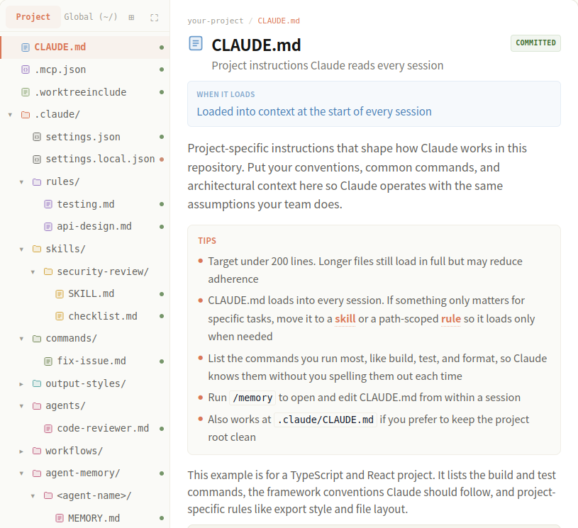
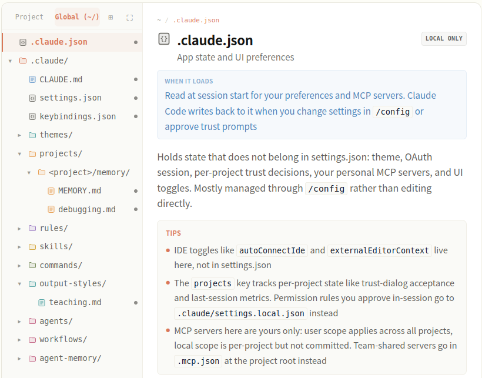

# 目录  
1.Claude Code核心概念  
2.使用Claude Code  
3.参考  

## 1.Claude Code核心概念   
**目录:**  
1.1 Claude Code如何工作  
1.2 扩展Claude Code(了解)  
1.3 .claude目录  

### 1.1 Claude Code如何工作   
**目录:**  
1.1.1 代理循环  
1.1.2 使用会话  
1.1.3 使用检查点和权限保持安全  
1.1.4 有效使用Claude code  

#### 1.1.1 代理循环
1.代理循环  
Claude完成任务时会经历三个阶段<font color="#00FF00">收集上下文、采取行动、验证结果</font>这些阶段相互融合,Claude始终使用<font color="#FF00FF">工具</font>来完成各种任务  
  
说白了Claude就是会往复以上三个阶段;如果要解决用户代码库的问题可能只需要收集上下文这一步,代码错误修复则可能会多次循环执行这三个步骤,重构则可能涉及广泛的验证步骤  
代码循环由两个组件驱动:<font color="#FFC800">模型</font>进行推理和<font color="#FFC800">工具</font>采取行动  
而Claude Code就是各种工具的代理框架,其利用各种工具,将语言模型转变为能够进行编码的代理  

2.模型  
模型就是负责推理的大模型,ClaudeCode支持多种模型,可以用`/model`来切换模型  

3.工具  
Claude Code本质就是各种工具的代理框架,没有工具,Claude只能用文本回应;有了工具,Claude可以采取行动:读取您的代码、编辑文件、运行命令、搜索网络并与外部服务交互,每个工具使用都会返回信息,反馈到循环中,告知Claude的下一个决定  
内置工具通常分为五个类别:  
| 类别     | Claude 可以做什么                                                |
|:---------|:-----------------------------------------------------------------|
| 文件操作 | 读取文件、编辑代码、创建新文件、重命名和重新组织                 |
| 搜索     | 按模式查找文件、使用正则表达式搜索内容、探索代码库               |
| 执行     | 运行shell命令、启动服务器、运行测试、使用git                     |
| 网络     | 搜索网络、获取文档、查找错误消息                                 |
| 代码智能 | 编辑后查看类型错误和警告、跳转到定义、查找引用(需要代码智能插件) |

4.扩展基本功能  
内置工具是基础;您可以使用[skills](https://code.claude.com/docs/zh-CN/skills)扩展Claude知道的内容、使用[MCP](https://code.claude.com/docs/zh-CN/mcp)连接到外部服务、使用[hooks](https://code.claude.com/docs/zh-CN/hooks)自动化工作流,以及将任务卸载给[subagents
](https://code.claude.com/docs/zh-CN/sub-agents)  

#### 1.1.2 使用会话  
1.跨分支工作  
每个Claude Code对话都是一个与您当前目录相关的会话,`/resume`选择器默认显示来自当前worktree的会话  
<font color="#FF00FF">您可以通过使用git worktrees运行并行Claude会话,这为各个分支创建单独的目录</font>  

2.恢复或分叉会话  
使用`claude --continue`或`claude --resume`恢复会话会在相同的会话ID下重新打开它,并将新消息附加到现有对话
使用`--fork-session`或`/branch`分叉会将历史复制到新的会话ID中,<font color="#00FF00">保持原始会话不变</font>  
  

3.上下文窗口(context window)  
Claude的上下文窗口保存您的对话历史、文件内容、命令输出、[CLAUDE.md](https://code.claude.com/docs/zh-CN/memory)、[自动内存](https://code.claude.com/docs/zh-CN/memory#auto-memory)、加载的skills和系统说明,当您工作时,上下文填满时,Claude会自动压缩,但对话早期的说明可能会丢失,<font color="#00FF00">将持久规则放在CLAUDE.md中</font>,并运行`/context`以查看什么在占用空间  
关于上下文窗口详情见[上下文窗口](https://code.claude.com/docs/zh-CN/context-window)  

3.1 当上下文填满时  
Claude Code会在上下文快满时自动压缩上下文,要控制在压缩期间保留的内容,可以通过在<font color="#00FF00">CLAUDE.md中添加"Compact Instructions"部分</font>或运行`/compact`命令,例如`/compact focus on the API changes`  
还有一个问题是,如果因为单个文件或工具输出太大等原因,导致Claude Code每次压缩完上下文之后又立即触发压缩,则Claude Code会在几次尝试后停止自动压缩并报错,具体参考[自动压缩停止并出现抖动错误](https://code.claude.com/docs/zh-CN/troubleshooting#auto-compaction-stops-with-a-thrashing-error)  

3.2 使用skills和subagents管理上下文  
除了压缩,您可以使用其他功能来控制什么加载到上下文中;
* Skills默认按需加载并且是<font color="#00FF00">渐进式披露</font>,但这会消耗一定的上下文用于存储每个Skills的描述,如果需要完全手动控制skills,则可以设置`disable-model-invocation: true`将skills的描述独立于上下文之外  
* Subagents拥有自已独立的上下文,独立于主会话,当它完成任务后直接返回结果,所以subagents更有助于长会话

#### 1.1.3 使用检查点和权限保持安全  
1.介绍  
Claude有两个安全机制:checkpoints让您撤销文件更改,权限控制Claude可以在不询问的情况下做什么  
*提示:检查点(checkpoint)实际上这个概念在数据库中也有出现过,检查点简单理解为存档点,它完整保留了系统在某刻的状态*  

2.使用checkpoints撤销更改  
<font color="#FF00FF">每个文件编辑都是可逆的</font>在Claude编辑任何文件之前,它会对当前内容进行快照,如果出现问题,按两次Esc以回退到之前的状态,或要求Claude撤销;<font color="#00FF00">Checkpoints是会话本地的,独立于git</font>  

2.Claude的模式  
按`Shift+Tab`循环通过权限模式  
* Default:Claude在文件编辑和执行shell命令之前询问
* Auto-accept edits:Claude编辑文件并运行常见的文件系统命令(如mkdir和mv)不会iu询问,但运行其它命令时依旧会询问
* Plan Mode:Claude探索并提出计划而不编辑您的源文件;权限提示仍然适用,如默认模式
* Auto mode:Claude使用后台安全检查评估所有操作(试验功能)

可以配置`.claude/settings.json`允许特定命令,以便Claude不会每次都询问,详情参考[配置权限](https://code.claude.com/docs/zh-CN/permissions)  

#### 1.1.4 有效使用Claude code  
1.中断  
* 直接在控制台按`Esc`立即停止Claude,不是ctrl+c
* 在Claude运行的时候也是可以发送对话的,Claude会在当前操作完成后立即读取它

### 1.2 扩展Claude Code(了解)  
**目录:**  
1.2.1 概述  
1.2.2 何时使用扩展  
1.2.3 扩展的上下文成本  

#### 1.2.1 概述 
1.概述  
Claude Code的扩展分为  
* [CLAUDE.md](https://code.claude.com/docs/zh-CN/memory):添加Claude每个会话都能看到的持久上下文
* [Skills](https://code.claude.com/docs/zh-CN/skills):添加可重用的知识和可调用的工作流
* [MCP](https://code.claude.com/docs/zh-CN/mcp):将Claude连接到外部服务和工具
* [Sub Agents](https://code.claude.com/docs/zh-CN/sub-agents):在隔离的上下文中运行自己的循环，返回摘要
* [Agent teams](https://code.claude.com/docs/zh-CN/agent-teams):协调多个独立会话，具有共享任务和点对点消息传递
* [Hooks](https://code.claude.com/docs/zh-CN/hooks-guide):在生命周期事件上触发，可以运行脚本、HTTP 请求、提示或 subagent
* [代码智能](https://code.claude.com/docs/zh-CN/tools-reference#lsp-tool-behavior):将Claude连接到语言服务器，用于符号级导航和实时类型错误
* [Plugins](https://code.claude.com/docs/zh-CN/plugins)和[marketplaces](https://code.claude.com/docs/zh-CN/plugin-marketplaces):打包和分发这些功能

#### 1.2.2 何时使用扩展  
1.何时使用扩展  
| 功能                        | 作用                                       | 何时使用                                          |
|:----------------------------|:-------------------------------------------|:--------------------------------------------------|
| CLAUDE\.md                  | 每次对话加载的持久上下文                   | 项目约定、"始终执行 X" 规则                       |
| Skill                       | Claude可以使用的说明、知识和工作流         | 可重用内容、参考文档、可重复的任务                |
| Subagent                    | 返回摘要结果的隔离执行上下文               | 上下文隔离、并行任务、专门的工作者                |
| Agent teams                 | 协调多个独立的 Claude Code 会话            | 并行研究、新功能开发、使用竞争假设进行调试        |
| Code intelligence(代码智能) | 语言服务器导航和诊断                       | 类型化语言、大型代码库(其中 grep 速度慢或不精确)  |
| MCP                         | 连接到外部服务                             | 外部数据或操作                                    |
| Hook                        | 由事件触发的脚本、HTTP请求、提示或subagent | 必须在每个匹配事件上运行的自动化                  |
| Artifact                    | 将会话输出发布为私有、交互式网页           | 您想以视觉方式查看或共享的输出,而不是作为终端文本 |

Plugins是打包层,<font color="#00FF00">Plugin将skills、hooks、subagents和MCP servers捆绑到单个可安装单元中</font>.Plugin skills按命名空间区分(如`/my-plugin:review`),因此多个plugins可以共存,当您想在多个项目中重用相同的设置或通过marketplace分发给他人时,使用plugins  

2.扩展使用技巧  
* Claude两次出错约定或命令->将其添加到CLAUDE\.md
* 一直在输入相同的提示词来开启一个任务->将其保存为用户可调用的skill
* 多次将相同的提示词或操作步骤提交到会话->将其保存为用户可调用的skill
* 多次从浏览器、数据库等地方复制Claude看不到的数据->MCP
* Claude读取许多文件以查找符号的定义或使用位置->Code Intelligence(代码智能)
* 有一个辅助任务使用哪些不会再次使用的上下文->subagent
* 希望每次都发生某事而无需询问->hook
* 另外一个项目需要使用相同的设置->将其打包为plugin


3.分层  
扩展可以在多个级别定义:用户范围、每个项目、通过plugins或通过托管策略;当相同的功能存在于多个级别时,以下是它们的分层方式:  
* CLAUDE\.md文件是累加的
  所有级别的内容同时发送给claude的上下文,当前工作目录和上级目录的文件在启动时加载
  子目录在您在其中工作时加载
  当说明冲突时,Claude自动协调它们,更具体的说明通常优先
* Skills和subagents按名称覆盖
  当相同的名称存在于多个级别时,有如下优先级
  对于skills而言,托管>用户>项目
  对于subagents而言,托管>CLI标志>项目>用户>plugin
* MCP按名称覆盖
  本地>项目>用户
* Hooks合并
  所有注册的hooks为其匹配的事件触发,无论来源如何

#### 1.2.3 扩展的上下文成本  
1.成本表格  
| 功能              | 何时加载          | 加载内容                           | 上下文成本                   |
|-------------------|-------------------|------------------------------------|------------------------------|
| CLAUDE\.md         | 会话开始          | 完整内容                           | 每个请求                     |
| Skills            | 会话开始+使用时 | 启动时的描述,使用时的完整内容     | 低(每个请求的描述)         |
| MCP         | 会话开始          | 工具名称;完整架构                 | 按需-低,直到使用工具         |
| Code intelligence | 文件编辑后和按需  | 编辑后的诊断;符号查找时的位置信息 | 低;减少其他地方的文件读取   |
| Subagents         | 生成时            | 具有指定skills的新鲜上下文       | 与主会话隔离                 |
| Hooks             | 触发时            | 无(外部运行)                     | 零,除非hook返回额外上下文 |

2.加载时机图  
 
* CLAUDE\.md
  加载时机-会话开始时
  加载内容-所有CLAUDE\.md文件的完整内容(托管、用户和项目级别)
  加载继承-Claude从当前工作目录读取CLAUDE\.md文件直到根目录,并在访问这些文件时发现子目录中的嵌套文件
* Skills
  加载时机-取决于skill的配置,默认情况下,SKills描述在会话开始时加载,完整内容在使用时加载,如果设置`disable-model-invocation: true`则除非手动调用否则不会加载
  加载内容-对于模型可调用的skills,Claude将在每个请求中加载<font color="#00FF00">名称和描述</font>
  Claude如何选择skills:Claude将您的任务与skill描述相匹配,以决定哪些相关,如果描述模糊或重叠,Claude可能会不正确加载skills,要明确Claude使用特定的skill,使用`/<name>`调用它
  在subagents中:在subagents中<font color="#FF00FF">不是按需加载</font>,而是在subagent的skills字段中列出的skills在启动时<font color="#00FF00">完全预加载到其上下文中</font>

### 1.3 .claude目录  
**目录:**  
1.3.1 概述  
1.3.2 项目级目录树  
1.3.3 用户级目录树  

#### 1.3.1 概述  
1.claude目录  
claude主要探索两个目录,即`项目下的.claude目录`和`~/.claude目录`,用于读取指令、设置、skills、subagents、记忆,可以将项目下的.claude文件夹提交到git从而与团队合作开发,而`~/.claude`中的文件是个人配置,适用于您的所有项目  

#### 1.3.2 项目级目录树  
**目录:**  
1.3.2.1 目录树一览  
1.3.2.2 CLAUDE\.md  
1.3.2.3 .mcp.json  
1.3.2.4 .worktreeinclude  
1.3.2.5 .claude/目录  
1.3.2.6 .claude/settings.json  
1.3.2.7 .claude/settings.local.json  
1.3.2.8 .claude/rules/目录  
1.3.2.9 .claude/skills/目录  
1.3.2.10 .claude/output-styles/目录  
1.3.2.11 .claude/agents/目录  
1.3.2.12 .claude/workflows/目录  
1.3.2.13 .claude/agent-memory/目录  

##### 1.3.2.1 目录树一览  
1.项目级  
  

##### 1.3.2.2 CLAUDE\.md  
1.如何使用  
在项目根目录下创建的文件(也可以放到.Claude/CLAUDE\.md下,不一定要在项目根路径下),<font color="#00FF00">Claude会在每一个对话前使用该文件,所以将项目的约定、常用命令、架构等项目级别的长期记忆放到该文件中</font>,以便Claude能够按照此架构进行操作  

2.技巧
* 设置文件长度在200行以内
* Claude文件会加载到每个对话中,如果文件的某些内容仅对特定任务生效,则最好将其抽象为skills或路径级的规范中,以便按需加载;该文件内容应存放最具有通用性的内容
* 列出最常用的命令,这样Claude就会自动使用这些命令而不需要每次都手动输入
* 运行`/memory`命令从会话中打开和编辑Claude\.md
* 也可以将文件放到.Claude/CLAUDE\.md下使用效果一样

3.示例  
```markdown
# Project conventions

## Commands
- Build: `npm run build`
- Test: `npm test`
- Lint: `npm run lint`

## Stack
- TypeScript with strict mode
- React 19, functional components only

## Rules
- Named exports, never default exports
- Tests live next to source: `foo.ts` -> `foo.test.ts`
- All API routes return `{ data, error }` shape
```

##### 1.3.2.3 .mcp.json  
1.如何使用  
在项目根目录下创建的文件,配置模型的MCP服务器,使得Claude能够访问外部工具:数据库、API、浏览器等,<font color="#00FF00">该文件保存整个团队使用的项目级的MCP服务器</font>  

2.技巧  
* 可以使用`${环境变量}`的方式隐藏敏感信息
* 在项目根目录下创建的文件,而不是.claude文件夹内
* 对于仅用户级的服务使用,请将MCP服务放入`~/.claude.json`而不是项目级别的`.mcp.json`文件

3.示例  
```json
{
  "mcpServers": {
    "github": {
      "command": "npx",
      "args": ["-y", "@modelcontextprotocol/server-github"],
      "env": {
        // 敏感信息直接引用环境变量
        "GITHUB_TOKEN": "${GITHUB_TOKEN}"
      }
    }
  }
}
```

##### 1.3.2.4 .worktreeinclude  
1.如何使用  
在项目根路径下创建该文件,当Claude使用`--worktree`命令、`EnterWorktree`工具、子Agent的`isolation: worktree`时,创建git工作树的时候Claude会读取该文件  
在该文件中,需要列出从主项目中复制到每个新工作树的gitignored文件,工作树是新签出的,因此默认情况下会丢失.env等未跟踪的文件,这里的匹配方式使用.gitignore语法,只有与模式匹配并且被gitignored的文件才会被复制,因此跟踪的文件永远不会重复  
*注意:.gitignore是排除文件,但.worktreeinclude是包含文件*  
当项目越来越大的时候可能包含成千上万的文件,假设要使用工作数功能,这个文件可以不将当前的整个项目文件复制下来,而是<font color="#00FF00">让特定的工作文件夹只专注于某些配置文件或特定模块</font>  

2.技巧  
* 在项目根目录下创建的文件,而不是.claude文件夹内
* 仅对Git生效
* 也适用于桌面应用程序的并行会话

3.示例  
此示例将.env文件和secrets.json文件复制到Claude创建的每个工作树中,注释以#开头,空行将被忽略,匹配规则与.gitignore相同(只不过这个是匹配哪些文件包含)  
```markdown
# Local environment
.env
.env.local

# API credentials
config/secrets.json
```

##### 1.3.2.5 .claude/目录  
1.介绍  
在项目的根路径下创建该目录,该文件夹下的所有内容都是特定于项目级别的,使用git的情况下可以提交这些文件以便团队共享此文件  

##### 1.3.2.6 .claude/settings.json 
1.介绍  
该文件会覆盖全局的`~/.claude/settings.json`文件,该文件的设置直接作用于Claude,与指导性文件claude\.md不同的是,该文件的设置Claude会强制执行,具体包含权限控制Claude可以使用那些命令和工具、在对话中的特定阶段使用哪些hook(回调)  

2.命令主键  
* permissions:在Claude使用特定工具或命令之前允许、拒绝或提示
* hooks:在工具调用之前或文件编辑之后等事件上运行自定义脚本
* statusLine:自定义Claude工作时底部显示的行
* model:为本项目选择一个默认模型
* env:每个会话中设置的环境变量
* outputStyle:从`output-styles`中选择自定义的系统提示样式

3.技巧
* 控制台命令的权限匹配支持通配符,例如`Bash(npm test *)`,该命令匹配任何以`npm test`开头的命令

4.示例  
下面的示例允许运行`npm test`和`npm run`命令而不提示,阻止`rm -rf`,并在Claude编辑或写入文件后对文件运行jq命令  
```json
{
  "permissions": {
    "allow": [
      "Bash(npm test *)",
      "Bash(npm run *)"
    ],
    "deny": [
      "Bash(rm -rf *)"
    ]
  },
  "hooks": {
    "PostToolUse": [{
      "matcher": "Edit|Write",
      "hooks": [{
        "type": "command",
        "command": "jq -r '.tool_input.file_path' | xargs npx prettier --write"
      }]
    }]
  }
}
```

##### 1.3.2.7 .claude/settings.local.json  
1.如何使用  
比settings.json优先级更高的文件,这个文件很容易理解,.claude/settings.json是项目公共的设置文件,当个人需要一些和团队设置不同的配置时使用该文件,该文件不需要提交到git  

2.使用技巧  
* Claude Code在第一次写入时将此文件添加到`~/.config/git/ignore`中,如果你使用自定义`core.excludesFile`,也请在其中添加模式;若要和团队成员使用该文件规则,则请将该文件添加到`.gitignore`内容中  

##### 1.3.2.8 .claude/rules/目录  
1.介绍  
该文件夹下存放Claude需要遵守的规则,这些规则分为两类,一种是无路径规则(对所有文件生效),一种是有路径规则(对特定文件生效)  
这些规则也是需要分类的,当写前端时只加载前端规则,写后端时只加载后端规则(需要你手动分类),意思就是按文件路径划分,比方通过paths属性限制后端的文件是哪些,然后Claude会先读取paths属性且当有文件匹配时才将规则加载到上下文,<font color="#00FF00">这个路径是根据项目自已设计的</font>  
如果某个规则没有指定任何文件路径,那么它的前置元数据(frontmatter)会在"会话开始时"立刻全局加载,就像CLAUDE\.md文件一样,如果指定了具体的文件路径,只有当Claude真正去读取或修改匹配文件时才会读取该规则  

2.技巧  
* 当Claude超过200行的时候,开始拆分规则
* 使用`path`属性,并在前置元数据(frontmatter)中配合通配符(globs),来把具体的开发规则限制在特定的目录或特定的文件类型中

3.`.claude/rules/testing.md`示例  
当Claude读取到和下方`paths`属性指定的文件路径通配符匹配时读取,下方的这个示例仅当Claude处理测试文件时才加载,`paths`属性中的元数据通配符定义哪些文件会触发该规则,此处匹配以`.test.ts`或`.test.tsx.`结尾的文件,对于其他的文件该规则不会加载到上下文中  
```markdown
---
paths:
  - "**/*.test.ts"
  - "**/*.test.tsx"
---

# Testing Rules

- Use descriptive test names: "should [expected] when [condition]"
- Mock external dependencies, not internal modules
- Clean up side effects in afterEach
```

4.`.claude/rules/api-design.md`示例  
下面的这个示例是适用于后端的规则(其实就是"src/api/*\*\/\*.ts"这个路径下的文件要使用的规则)  
```markdown
---
paths:
  - "src/api/**/*.ts"
---

# API Design Rules

- All endpoints must validate input with Zod schemas
- Return shape: { data: T } | { error: string }
- Rate limit all public endpoints
```

##### 1.3.2.9 .claude/skills/目录  
1.如何使用  
直接通过`/[skill-name]`来使用/加载skill,或者当Claude匹配任务与skills的时候会加载skills  
每个技能都是一个文件夹,其中包含SKILL\.MD和其所需要的任何支持文件,可以使用元数据来控制权限,当设置`disable-model-invocation: true`时仅有用户可以使用skills,当设置`user-invocable: false`时仅有模型可以使用  
*提示:文件夹的名称就是skills技能的名称*  

2.技巧  
* 技能接受参数
  例如`/deploy staging`会将"staging"作为\$ARGUMENTS传递,使用\$0、\$1等进行位置访问,也就是说在技能文档中可以使用\$0的方式作为参数的占位符,等调用的时候再具体指定具体参数
* `description`属性决定Claude何时自动调用该skills
* 将参考文档与SKILL\.md放在一起,Claude知道技能目录路径,并且当你提到它们时可以自动阅读这些参考文档

3.`.claude/skills/security-review/`示例  

4.`.claude/skills/security-review/SKILL.md`  
执行`/security-review <target>`命令来使用该技能,该技能是用户类型的,Claude无法自动调用该技能  
```markdown
---
description: Reviews code changes for security vulnerabilities, authentication gaps, and injection risks
// 该元数据指定当前的skills不允许模型调用
disable-model-invocation: true
argument-hint: <branch-or-path>
---

## Diff to review

// !`...` 命令会运行shell命令并将其输出注入到模型提示词中
// $ARGUMENTS会替换为调用技能后面提供的参数
!`git diff $ARGUMENTS`

Audit the changes above for:

1. Injection vulnerabilities (SQL, XSS, command)
2. Authentication and authorization gaps
3. Hardcoded secrets or credentials

// Claude可以察觉技能目录路径,因此提及checklist.md这样的参考文档时可以让Claude读取它
Use checklist.md in this skill directory for the full review checklist.

Report findings with severity ratings and remediation steps.
```

5.`.claude/skills/security-review/checklist.md`  
Claude在运行技能时按需阅读该文件,技能可以捆绑任何支持文件:参考文档、模板、脚本;技能目录路径位于SKILL.md前面,因此Claude可以按名称读取捆绑文件  
```markdown
# Security Review Checklist

## Input Validation
- [ ] All user input sanitized before DB queries
- [ ] File upload MIME types validated
- [ ] Path traversal prevented on file operations

## Authentication
- [ ] JWT tokens expire after 24 hours
- [ ] API keys stored in environment variables
- [ ] Passwords hashed with bcrypt or argon2
```

##### 1.3.2.10 .claude/output-styles/目录  
1.介绍  
这个是Claude的对话输出风格,输出风格一般是个人的即存放于`~/.claude/output-styles/`目录下,如果要和团队共享相同的输出风格则可以设置此文件夹,具体存放的内容见`~/.claude/output-styles/`  

##### 1.3.2.11 .claude/agents/目录  
1.如何使用  
该文件可以让专用子代理具有自己的上下文窗口,每个Markdown文件都定义一个子代理,具有自己的系统提示、工具访问权限以及可选的自己的模型,子代理在新的上下文窗口中运行,保持主对话简洁,对于并行工作或独立任务很有用  

2.小技巧  
* 每个代理都会获得一个新的上下文窗口,与当前主会话分开
* 使用元数据来限制每个代理的工具访问权限
* 输入`@`并从自动完成列表中选择一个直接代理

3.`.claude/agents/code-reviewer.md`示例  
Claude为了完成审查任务会使用该文件,或者用户使用`@`从自动完成列表中提及该文件  
这是一个被限制为只能使用"只读工具"的subagent示例,`description`元数据告知Claude何时自动委托给它,`tools`元数据限制它的读取、文本检索、文件通配符匹配,这样它就只能审查代码而绝无法进行修改,文件的主体内容则会转化为该子智能体的系统提示词  
```markdown
---
name: code-reviewer
description: Reviews code for correctness, security, and maintainability
tools: Read, Grep, Glob
---

You are a senior code reviewer. Review for:

1. Correctness: logic errors, edge cases, null handling
2. Security: injection, auth bypass, data exposure
3. Maintainability: naming, complexity, duplication

Every finding must include a concrete fix.
```

##### 1.3.2.12 .claude/workflows/目录  
1.何时使用  
编排许多子代理的动态工作流脚本,启动时加载,每个文件名都对应一条命令(类似skills)  
每个.js文件都是一个动态工作流,即运行时所执行的一段脚本,用于生成并协调众多的子智能体,这些工作流是由Claude自动编写并从`/workflows`目录保存到此处的,而不是由人工从零开始撰写,<font color="#00FF00">即该目录下的文件Claude自已编写</font>  

2.小技巧  
* 项目工作流程优先于`~/.claude/workflows/`中同名的个人工作流程
* 使用`s`快捷键或命令,将/workflows中的某次运行记录保存下来,即可创建出一个这样的工作流

##### 1.3.2.13 .claude/agent-memory/目录  
1.何时使用  
这个目录存放子agent的记忆,和主对话的记忆区分下来,MEMORY\.md的前200行(上限为 25KB)在运行时加载到子代理系统提示词中  
子Agent通过`memory: project`元数据得到一个专用的记忆路径,和`~/.claude/projects/`中的主会话自动记忆不同,每个子代理读取和写入自己的MEMORY\.md  

2.技巧  
* 并不是每个子智能体都会产生记忆文件,只有当你在这个子智能体的元数据中设置了`memory:`字段,系统才会为它开辟专门的记忆存储空间
* 该目录存放的是项目级别的子智能体记忆,旨在与你的团队共享,如果不想将记忆纳入Git,请使用`memory: local`,这会将其写入`.claude/agent-memory-local/`目录,若需要跨项目共享记忆,请使用`memory: user`,这会将其写入`~/.claude/agent-memory/`

3.`.claude/agent-memory/\<agent-name\>/MEMORY\.md`示例  
该文件由子Agent自动写入并维护,子Agent启动时会自动加载到子Agent的系统提示词中  
```markdown
# code-reviewer memory

## Patterns seen
- Project uses custom Result<T, E> type, not exceptions
- Auth middleware expects Bearer token in Authorization header
- Tests use factory functions in test/factories/

## Recurring issues
- Missing null checks on API responses (src/api/*)
- Unhandled promise rejections in background jobs
```

#### 1.3.3 用户级目录树  
**目录:**  
1.3.3.1 用户级目录树一览  
1.3.3.2 .claude.json  

##### 1.3.3.1 用户级目录树一览  
1.用户级  
  

##### 1.3.3.2 .claude.json  


## 2.使用Claude Code 
**目录:**  
2.1 快速开始  
2.2 模式  

### 2.1 快速开始 
1.进入项目  
首先必须选择让claude code进入哪个项目,控制台输入`cd`命令并切换到目标项目地址即可  

2.在Claude Code中使用Git  
可以通过与Claude Code的对话,直接使用git  
```markdown
我更改了哪些文件？
用描述性消息提交我的更改
创建一个名为feature/quickstart的新分支
```
### 2.2 模式 
1.切换模式
在claude code控制台按下shift+tab可以切换claude code的模式,总共如下几种  
* 默认:普通的聊天模式
* accept edits on:自动同意模式

## 3.参考  
**目录:**  
3.1 Sehll命令  
3.2 会话命令  
3.3 工具  

### 3.1 Sehll命令 
1.常用Shell命令  
*提示:shell命令是在控制台中输入的命令,和会话命令区分下来*  
| 命令              | 功能                       | 示例                              |
|:------------------|:---------------------------|:----------------------------------|
| claude            | 启动交互模式               | claude                            |
| claude "task"     | 运行一次性任务             | claude "fix the build error"      |
| claude -p "query" | 运行一次性查询，然后退出   | claude -p "explain this function" |
| claude -c         | 在当前目录中继续最近的对话 | claude -c                         |
| claude -r         | 恢复之前的对话             | claude -r                         |

2.完整命令  
参考[CLI参考](https://code.claude.com/docs/zh-CN/cli-reference)  

### 3.2 会话命令  
1.常用会话命令  
| 命令            | 功能             | 示例   |
|:----------------|:-----------------|:-------|
| /clear          | 清除对话历史     | /clear |
| /help           | 显示可用命令     | /help  |
| /exit 或 Ctrl+D | 退出 Claude Code | /exit  |

2.完整命令  
[会话命令](https://code.claude.com/docs/zh-CN/commands)  

### 3.3 工具
1.基本介绍  

2.完整工具介绍  
[官网工具参考](https://code.claude.com/docs/zh-CN/tools-reference)  


