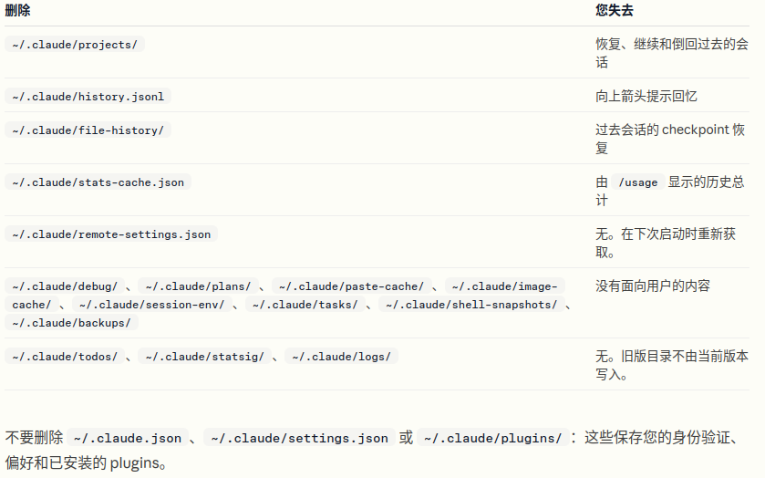
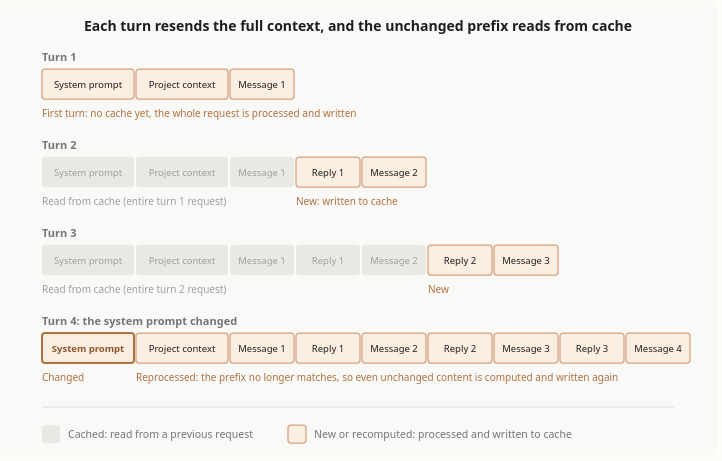
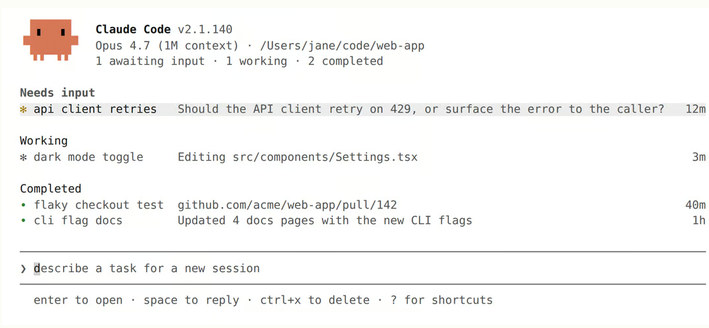

# 目录  
1.Claude Code核心概念  
2.使用Claude Code  
3.代理和并行  
3.参考  

## 1.Claude Code核心概念   
**目录:**  
1.1 Claude Code如何工作  
1.2 扩展Claude Code(了解)  
1.3 .claude目录  
1.4 探索上下文窗口  
1.5 提示词缓存  

### 1.1 Claude Code如何工作   
**目录:**  
1.1.1 代理循环  
1.1.2 使用会话  
1.1.3 使用检查点和权限保持安全  
1.1.4 有效使用Claude code  

#### 1.1.1 代理循环
1.代理循环  
Claude完成任务时会经历三个阶段<font color="#00FF00">收集上下文、采取行动、验证结果</font>这些阶段相互融合,Claude始终使用<font color="#FF00FF">工具</font>来完成各种任务  
  
说白了Claude就是会往复以上三个阶段;如果要解决用户代码库的问题可能只需要收集上下文这一步,代码错误修复则可能会多次循环执行这三个步骤,重构则可能涉及广泛的验证步骤  
代码循环由两个组件驱动:<font color="#FFC800">模型</font>进行推理和<font color="#FFC800">工具</font>采取行动  
而Claude Code就是各种工具的代理框架,其利用各种工具,将语言模型转变为能够进行编码的代理  

2.模型  
模型就是负责推理的大模型,ClaudeCode支持多种模型,可以用`/model`来切换模型  

3.工具  
Claude Code本质就是各种工具的代理框架,没有工具,Claude只能用文本回应;有了工具,Claude可以采取行动:读取您的代码、编辑文件、运行命令、搜索网络并与外部服务交互,每个工具使用都会返回信息,反馈到循环中,告知Claude的下一个决定  
内置工具通常分为五个类别:  
| 类别     | Claude 可以做什么                                                |
|:---------|:-----------------------------------------------------------------|
| 文件操作 | 读取文件、编辑代码、创建新文件、重命名和重新组织                 |
| 搜索     | 按模式查找文件、使用正则表达式搜索内容、探索代码库               |
| 执行     | 运行shell命令、启动服务器、运行测试、使用git                     |
| 网络     | 搜索网络、获取文档、查找错误消息                                 |
| 代码智能 | 编辑后查看类型错误和警告、跳转到定义、查找引用(需要代码智能插件) |

4.扩展基本功能  
内置工具是基础;您可以使用[skills](https://code.claude.com/docs/zh-CN/skills)扩展Claude知道的内容、使用[MCP](https://code.claude.com/docs/zh-CN/mcp)连接到外部服务、使用[hooks](https://code.claude.com/docs/zh-CN/hooks)自动化工作流,以及将任务卸载给[subagents
](https://code.claude.com/docs/zh-CN/sub-agents)  

#### 1.1.2 使用会话  
1.跨分支工作  
每个Claude Code对话都是一个与您当前目录相关的会话,`/resume`选择器默认显示来自当前worktree的会话  
<font color="#FF00FF">您可以通过使用git worktrees运行并行Claude会话,这为各个分支创建单独的目录</font>  

2.恢复或分叉会话  
使用`claude --continue`或`claude --resume`恢复会话会在相同的会话ID下重新打开它,并将新消息附加到现有对话
使用`--fork-session`或`/branch`分叉会将历史复制到新的会话ID中,<font color="#00FF00">保持原始会话不变</font>  
  

3.上下文窗口(context window)  
Claude的上下文窗口保存您的对话历史、文件内容、命令输出、[CLAUDE.md](https://code.claude.com/docs/zh-CN/memory)、[自动内存](https://code.claude.com/docs/zh-CN/memory#auto-memory)、加载的skills和系统说明,当您工作时,上下文填满时,Claude会自动压缩,但对话早期的说明可能会丢失,<font color="#00FF00">将持久规则放在CLAUDE.md中</font>,并运行`/context`以查看什么在占用空间  
关于上下文窗口详情见[上下文窗口](https://code.claude.com/docs/zh-CN/context-window)  

3.1 当上下文填满时  
Claude Code会在上下文快满时自动压缩上下文,要控制在压缩期间保留的内容,可以通过在<font color="#00FF00">CLAUDE.md中添加"Compact Instructions"部分</font>或运行`/compact`命令,例如`/compact focus on the API changes`  
还有一个问题是,如果因为单个文件或工具输出太大等原因,导致Claude Code每次压缩完上下文之后又立即触发压缩,则Claude Code会在几次尝试后停止自动压缩并报错,具体参考[自动压缩停止并出现抖动错误](https://code.claude.com/docs/zh-CN/troubleshooting#auto-compaction-stops-with-a-thrashing-error)  

3.2 使用skills和subagents管理上下文  
除了压缩,您可以使用其他功能来控制什么加载到上下文中;
* Skills默认按需加载并且是<font color="#00FF00">渐进式披露</font>,但这会消耗一定的上下文用于存储每个Skills的描述,如果需要完全手动控制skills,则可以设置`disable-model-invocation: true`将skills的描述独立于上下文之外  
* Subagents拥有自已独立的上下文,独立于主会话,当它完成任务后直接返回结果,所以subagents更有助于长会话

#### 1.1.3 使用检查点和权限保持安全  
1.介绍  
Claude有两个安全机制:checkpoints让您撤销文件更改,权限控制Claude可以在不询问的情况下做什么  
*提示:检查点(checkpoint)实际上这个概念在数据库中也有出现过,检查点简单理解为存档点,它完整保留了系统在某刻的状态*  

2.使用checkpoints撤销更改  
<font color="#FF00FF">每个文件编辑都是可逆的</font>在Claude编辑任何文件之前,它会对当前内容进行快照,如果出现问题,按两次Esc以回退到之前的状态,或要求Claude撤销;<font color="#00FF00">Checkpoints是会话本地的,独立于git</font>  

2.Claude的模式  
按`Shift+Tab`循环通过权限模式  
* Default:Claude在文件编辑和执行shell命令之前询问
* Auto-accept edits:Claude编辑文件并运行常见的文件系统命令(如mkdir和mv)不会iu询问,但运行其它命令时依旧会询问
* Plan Mode:Claude探索并提出计划而不编辑您的源文件;权限提示仍然适用,如默认模式
* Auto mode:Claude使用后台安全检查评估所有操作(试验功能)

可以配置`.claude/settings.json`允许特定命令,以便Claude不会每次都询问,详情参考[配置权限](https://code.claude.com/docs/zh-CN/permissions)  

#### 1.1.4 有效使用Claude code  
1.中断  
* 直接在控制台按`Esc`立即停止Claude,不是ctrl+c
* 在Claude运行的时候也是可以发送对话的,Claude会在当前操作完成后立即读取它

### 1.2 扩展Claude Code(了解)  
**目录:**  
1.2.1 概述  
1.2.2 何时使用扩展  
1.2.3 扩展的上下文成本  

#### 1.2.1 概述 
1.概述  
Claude Code的扩展分为  
* [CLAUDE.md](https://code.claude.com/docs/zh-CN/memory):添加Claude每个会话都能看到的持久上下文
* [Skills](https://code.claude.com/docs/zh-CN/skills):添加可重用的知识和可调用的工作流
* [MCP](https://code.claude.com/docs/zh-CN/mcp):将Claude连接到外部服务和工具
* [Sub Agents](https://code.claude.com/docs/zh-CN/sub-agents):在隔离的上下文中运行自己的循环，返回摘要
* [Agent teams](https://code.claude.com/docs/zh-CN/agent-teams):协调多个独立会话，具有共享任务和点对点消息传递
* [Hooks](https://code.claude.com/docs/zh-CN/hooks-guide):在生命周期事件上触发，可以运行脚本、HTTP 请求、提示或 subagent
* [代码智能](https://code.claude.com/docs/zh-CN/tools-reference#lsp-tool-behavior):将Claude连接到语言服务器，用于符号级导航和实时类型错误
* [Plugins](https://code.claude.com/docs/zh-CN/plugins)和[marketplaces](https://code.claude.com/docs/zh-CN/plugin-marketplaces):打包和分发这些功能

#### 1.2.2 何时使用扩展  
1.何时使用扩展  
| 功能                        | 作用                                       | 何时使用                                          |
|:----------------------------|:-------------------------------------------|:--------------------------------------------------|
| CLAUDE\.md                  | 每次对话加载的持久上下文                   | 项目约定、"始终执行 X" 规则                       |
| Skill                       | Claude可以使用的说明、知识和工作流         | 可重用内容、参考文档、可重复的任务                |
| Subagent                    | 返回摘要结果的隔离执行上下文               | 上下文隔离、并行任务、专门的工作者                |
| Agent teams                 | 协调多个独立的 Claude Code 会话            | 并行研究、新功能开发、使用竞争假设进行调试        |
| Code intelligence(代码智能) | 语言服务器导航和诊断                       | 类型化语言、大型代码库(其中 grep 速度慢或不精确)  |
| MCP                         | 连接到外部服务                             | 外部数据或操作                                    |
| Hook                        | 由事件触发的脚本、HTTP请求、提示或subagent | 必须在每个匹配事件上运行的自动化                  |
| Artifact                    | 将会话输出发布为私有、交互式网页           | 您想以视觉方式查看或共享的输出,而不是作为终端文本 |

Plugins是打包层,<font color="#00FF00">Plugin将skills、hooks、subagents和MCP servers捆绑到单个可安装单元中</font>.Plugin skills按命名空间区分(如`/my-plugin:review`),因此多个plugins可以共存,当您想在多个项目中重用相同的设置或通过marketplace分发给他人时,使用plugins  

2.扩展使用技巧  
* Claude两次出错约定或命令->将其添加到CLAUDE\.md
* 一直在输入相同的提示词来开启一个任务->将其保存为用户可调用的skill
* 多次将相同的提示词或操作步骤提交到会话->将其保存为用户可调用的skill
* 多次从浏览器、数据库等地方复制Claude看不到的数据->MCP
* Claude读取许多文件以查找符号的定义或使用位置->Code Intelligence(代码智能)
* 有一个辅助任务使用哪些不会再次使用的上下文->subagent
* 希望每次都发生某事而无需询问->hook
* 另外一个项目需要使用相同的设置->将其打包为plugin


3.分层  
扩展可以在多个级别定义:用户范围、每个项目、通过plugins或通过托管策略;当相同的功能存在于多个级别时,以下是它们的分层方式:  
* CLAUDE\.md文件是累加的
  所有级别的内容同时发送给claude的上下文,当前工作目录和上级目录的文件在启动时加载
  子目录在您在其中工作时加载
  当说明冲突时,Claude自动协调它们,更具体的说明通常优先
* Skills和subagents按名称覆盖
  当相同的名称存在于多个级别时,有如下优先级
  对于skills而言,托管>用户>项目
  对于subagents而言,托管>CLI标志>项目>用户>plugin
* MCP按名称覆盖
  本地>项目>用户
* Hooks合并
  所有注册的hooks为其匹配的事件触发,无论来源如何

#### 1.2.3 扩展的上下文成本  
1.成本表格  
| 功能              | 何时加载         | 加载内容                          | 上下文成本                |
|-------------------|------------------|-----------------------------------|---------------------------|
| CLAUDE\.md        | 会话开始         | 完整内容                          | 每个请求                  |
| Skills            | 会话开始+使用时  | 启动时的描述,使用时的完整内容     | 低(每个请求的描述)        |
| MCP               | 会话开始         | 工具名称;完整架构                 | 按需-低,直到使用工具      |
| Code intelligence | 文件编辑后和按需 | 编辑后的诊断;符号查找时的位置信息 | 低;减少其他地方的文件读取 |
| Subagents         | 生成时           | 具有指定skills的新鲜上下文        | 与主会话隔离              |
| Hooks             | 触发时           | 无(外部运行)                      | 零,除非hook返回额外上下文 |

2.加载时机图  
 
* CLAUDE\.md
  加载时机-会话开始时
  加载内容-所有CLAUDE\.md文件的完整内容(托管、用户和项目级别)
  加载继承-Claude从当前工作目录读取CLAUDE\.md文件直到根目录,并在访问这些文件时发现子目录中的嵌套文件
* Skills
  加载时机-取决于skill的配置,默认情况下,SKills描述在会话开始时加载,完整内容在使用时加载,如果设置`disable-model-invocation: true`则除非手动调用否则不会加载
  加载内容-对于模型可调用的skills,Claude将在每个请求中加载<font color="#00FF00">名称和描述</font>
  Claude如何选择skills:Claude将您的任务与skill描述相匹配,以决定哪些相关,如果描述模糊或重叠,Claude可能会不正确加载skills,要明确Claude使用特定的skill,使用`/<name>`调用它
  在subagents中:在subagents中<font color="#FF00FF">不是按需加载</font>,而是在subagent的skills字段中列出的skills在启动时<font color="#00FF00">完全预加载到其上下文中</font>

### 1.3 .claude目录  
**目录:**  
1.3.1 概述  
1.3.2 项目级目录树  
1.3.3 用户级目录树  
1.3.4 其它文件  
1.3.5 清除本地数据  

#### 1.3.1 概述  
1.claude目录  
claude主要探索两个目录,即`项目下的.claude目录`和`~/.claude目录`,用于读取指令、设置、skills、subagents、记忆,可以将项目下的.claude文件夹提交到git从而与团队合作开发,而`~/.claude`中的文件是个人配置,适用于您的所有项目  

#### 1.3.2 项目级目录树  
**目录:**  
1.3.2.1 目录树一览  
1.3.2.2 CLAUDE\.md  
1.3.2.3 .mcp.json  
1.3.2.4 .worktreeinclude  
1.3.2.5 .claude/目录  
1.3.2.6 .claude/settings.json  
1.3.2.7 .claude/settings.local.json  
1.3.2.8 .claude/rules/目录  
1.3.2.9 .claude/skills/目录  
1.3.2.10 .claude/output-styles/目录  
1.3.2.11 .claude/agents/目录  
1.3.2.12 .claude/workflows/目录  
1.3.2.13 .claude/agent-memory/目录  

##### 1.3.2.1 目录树一览  
1.项目级  
  

##### 1.3.2.2 CLAUDE\.md  
1.如何使用  
在项目根目录下创建的文件(也可以放到.Claude/CLAUDE\.md下,不一定要在项目根路径下),<font color="#00FF00">Claude会在每一个对话前使用该文件,所以将项目的约定、常用命令、架构等项目级别的长期记忆放到该文件中</font>,以便Claude能够按照此架构进行操作  

2.技巧
* 设置文件长度在200行以内
* Claude文件会加载到每个对话中,如果文件的某些内容仅对特定任务生效,则最好将其抽象为skills或路径级的规范中,以便按需加载;该文件内容应存放最具有通用性的内容
* 列出最常用的命令,这样Claude就会自动使用这些命令而不需要每次都手动输入
* 运行`/memory`命令从会话中打开和编辑Claude\.md
* 也可以将文件放到.Claude/CLAUDE\.md下使用效果一样

3.示例  
```markdown
# Project conventions

## Commands
- Build: `npm run build`
- Test: `npm test`
- Lint: `npm run lint`

## Stack
- TypeScript with strict mode
- React 19, functional components only

## Rules
- Named exports, never default exports
- Tests live next to source: `foo.ts` -> `foo.test.ts`
- All API routes return `{ data, error }` shape
```

4.CLAUDE\.local\.md  
该文件是用户私人的Claude\.md文件,不与团队共享使用时将该文件添加到gitignore文件中  

##### 1.3.2.3 .mcp.json  
1.如何使用  
在项目根目录下创建的文件,配置模型的MCP服务器,使得Claude能够访问外部工具:数据库、API、浏览器等,<font color="#00FF00">该文件保存整个团队使用的项目级的MCP服务器</font>  

2.技巧  
* 可以使用`${环境变量}`的方式隐藏敏感信息
* 在项目根目录下创建的文件,而不是.claude文件夹内
* 对于仅用户级的服务使用,请将MCP服务放入`~/.claude.json`而不是项目级别的`.mcp.json`文件

3.示例  
```json
{
  "mcpServers": {
    "github": {
      "command": "npx",
      "args": ["-y", "@modelcontextprotocol/server-github"],
      "env": {
        // 敏感信息直接引用环境变量
        "GITHUB_TOKEN": "${GITHUB_TOKEN}"
      }
    }
  }
}
```

##### 1.3.2.4 .worktreeinclude  
1.如何使用  
在项目根路径下创建该文件,当Claude使用`--worktree`命令、`EnterWorktree`工具、子Agent的`isolation: worktree`时,创建git工作树的时候Claude会读取该文件  
在该文件中,需要列出从主项目中复制到每个新工作树的gitignored文件,工作树是新签出的,因此默认情况下会丢失.env等未跟踪的文件,这里的匹配方式使用.gitignore语法,只有与模式匹配并且被gitignored的文件才会被复制,因此跟踪的文件永远不会重复  
*注意:.gitignore是排除文件,但.worktreeinclude是包含文件*  
当项目越来越大的时候可能包含成千上万的文件,假设要使用工作数功能,这个文件可以不将当前的整个项目文件复制下来,而是<font color="#00FF00">让特定的工作文件夹只专注于某些配置文件或特定模块</font>  

2.技巧  
* 在项目根目录下创建的文件,而不是.claude文件夹内
* 仅对Git生效
* 也适用于桌面应用程序的并行会话

3.示例  
此示例将.env文件和secrets.json文件复制到Claude创建的每个工作树中,注释以#开头,空行将被忽略,匹配规则与.gitignore相同(只不过这个是匹配哪些文件包含)  
```markdown
# Local environment
.env
.env.local

# API credentials
config/secrets.json
```

##### 1.3.2.5 .claude/目录  
1.介绍  
在项目的根路径下创建该目录,该文件夹下的所有内容都是特定于项目级别的,使用git的情况下可以提交这些文件以便团队共享此文件  

##### 1.3.2.6 .claude/settings.json 
1.介绍  
该文件会覆盖全局的`~/.claude/settings.json`文件,该文件的设置直接作用于Claude,与指导性文件claude\.md不同的是,该文件的设置Claude会强制执行,具体包含权限控制Claude可以使用那些命令和工具、在对话中的特定阶段使用哪些hook(回调)  

2.命令主键  
* permissions:在Claude使用特定工具或命令之前允许、拒绝或提示
* hooks:在工具调用之前或文件编辑之后等事件上运行自定义脚本
* statusLine:自定义Claude工作时底部显示的行
* model:为本项目选择一个默认模型
* env:每个会话中设置的环境变量
* outputStyle:从`output-styles`中选择自定义的系统提示样式

3.技巧
* 控制台命令的权限匹配支持通配符,例如`Bash(npm test *)`,该命令匹配任何以`npm test`开头的命令

4.示例  
下面的示例允许运行`npm test`和`npm run`命令而不提示,阻止`rm -rf`,并在Claude编辑或写入文件后对文件运行jq命令  
```json
{
  "permissions": {
    "allow": [
      "Bash(npm test *)",
      "Bash(npm run *)"
    ],
    "deny": [
      "Bash(rm -rf *)"
    ]
  },
  "hooks": {
    "PostToolUse": [{
      "matcher": "Edit|Write",
      "hooks": [{
        "type": "command",
        "command": "jq -r '.tool_input.file_path' | xargs npx prettier --write"
      }]
    }]
  }
}
```

##### 1.3.2.7 .claude/settings.local.json  
1.如何使用  
比settings.json优先级更高的文件,这个文件很容易理解,.claude/settings.json是项目公共的设置文件,当个人需要一些和团队设置不同的配置时使用该文件,该文件不需要提交到git  

2.使用技巧  
* Claude Code在第一次写入时将此文件添加到`~/.config/git/ignore`中,如果你使用自定义`core.excludesFile`,也请在其中添加模式;若要和团队成员使用该文件规则,则请将该文件添加到`.gitignore`内容中  

##### 1.3.2.8 .claude/rules/目录  
1.介绍  
该文件夹下存放Claude需要遵守的规则,这些规则分为两类,一种是无路径规则(对所有文件生效),一种是有路径规则(对特定文件生效)  
这些规则也是需要分类的,当写前端时只加载前端规则,写后端时只加载后端规则(需要你手动分类),意思就是按文件路径划分,比方通过paths属性限制后端的文件是哪些,然后Claude会先读取paths属性且当有文件匹配时才将规则加载到上下文,<font color="#00FF00">这个路径是根据项目自已设计的</font>  
如果某个规则没有指定任何文件路径,那么它的前置元数据(frontmatter)会在"会话开始时"立刻全局加载,就像CLAUDE\.md文件一样,如果指定了具体的文件路径,只有当Claude真正去读取或修改匹配文件时才会读取该规则  
*提示:这里可以参考[[ClaudeCode#2127-使用clauderules组织规则]]*  

2.技巧  
* 当Claude超过200行的时候,开始拆分规则
* 使用`path`属性,并在前置元数据(frontmatter)中配合通配符(globs),来把具体的开发规则限制在特定的目录或特定的文件类型中

3.`.claude/rules/testing.md`示例  
当Claude读取到和下方`paths`属性指定的文件路径通配符匹配时读取,下方的这个示例仅当Claude处理测试文件时才加载,`paths`属性中的元数据通配符定义哪些文件会触发该规则,此处匹配以`.test.ts`或`.test.tsx.`结尾的文件,对于其他的文件该规则不会加载到上下文中  
```markdown
---
paths:
  - "**/*.test.ts"
  - "**/*.test.tsx"
---

# Testing Rules

- Use descriptive test names: "should [expected] when [condition]"
- Mock external dependencies, not internal modules
- Clean up side effects in afterEach
```

4.`.claude/rules/api-design.md`示例  
下面的这个示例是适用于后端的规则(其实就是"src/api/*\*\/\*.ts"这个路径下的文件要使用的规则)  
```markdown
---
paths:
  - "src/api/**/*.ts"
---

# API Design Rules

- All endpoints must validate input with Zod schemas
- Return shape: { data: T } | { error: string }
- Rate limit all public endpoints
```

##### 1.3.2.9 .claude/skills/目录  
1.如何使用  
直接通过`/[skill-name]`来使用/加载skill,或者当Claude匹配任务与skills的时候会加载skills  
每个技能都是一个文件夹,其中包含SKILL\.MD和其所需要的任何支持文件,可以使用元数据来控制权限,当设置`disable-model-invocation: true`时仅有用户可以使用skills,当设置`user-invocable: false`时仅有模型可以使用  
*提示:文件夹的名称就是skills技能的名称*  

2.技巧  
* 技能接受参数
  例如`/deploy staging`会将"staging"作为\$ARGUMENTS传递,使用\$0、\$1等进行位置访问,也就是说在技能文档中可以使用\$0的方式作为参数的占位符,等调用的时候再具体指定具体参数
* `description`属性决定Claude何时自动调用该skills
* 将参考文档与SKILL\.md放在一起,Claude知道技能目录路径,并且当你提到它们时可以自动阅读这些参考文档

3.`.claude/skills/security-review/`示例  

4.`.claude/skills/security-review/SKILL.md`  
执行`/security-review <target>`命令来使用该技能,该技能是用户类型的,Claude无法自动调用该技能  
```markdown
---
description: Reviews code changes for security vulnerabilities, authentication gaps, and injection risks
// 该元数据指定当前的skills不允许模型调用
disable-model-invocation: true
argument-hint: <branch-or-path>
---

## Diff to review

// !`...` 命令会运行shell命令并将其输出注入到模型提示词中
// $ARGUMENTS会替换为调用技能后面提供的参数
!`git diff $ARGUMENTS`

Audit the changes above for:

1. Injection vulnerabilities (SQL, XSS, command)
2. Authentication and authorization gaps
3. Hardcoded secrets or credentials

// Claude可以察觉技能目录路径,因此提及checklist.md这样的参考文档时可以让Claude读取它
Use checklist.md in this skill directory for the full review checklist.

Report findings with severity ratings and remediation steps.
```

5.`.claude/skills/security-review/checklist.md`  
Claude在运行技能时按需阅读该文件,技能可以捆绑任何支持文件:参考文档、模板、脚本;技能目录路径位于SKILL.md前面,因此Claude可以按名称读取捆绑文件  
```markdown
# Security Review Checklist

## Input Validation
- [ ] All user input sanitized before DB queries
- [ ] File upload MIME types validated
- [ ] Path traversal prevented on file operations

## Authentication
- [ ] JWT tokens expire after 24 hours
- [ ] API keys stored in environment variables
- [ ] Passwords hashed with bcrypt or argon2
```

##### 1.3.2.10 .claude/output-styles/目录  
1.介绍  
这个是Claude的对话输出风格,输出风格一般是个人的即存放于`~/.claude/output-styles/`目录下,如果要和团队共享相同的输出风格则可以设置此文件夹,具体存放的内容见`~/.claude/output-styles/`  

##### 1.3.2.11 .claude/agents/目录  
1.如何使用  
该文件可以让专用子代理具有自己的上下文窗口,每个Markdown文件都定义一个子代理,具有自己的系统提示、工具访问权限以及可选的自己的模型,子代理在新的上下文窗口中运行,保持主对话简洁,对于并行工作或独立任务很有用  
*提示:该功能要和1.3.2.13 .claude/agent-memory/目录功能联动使用*  

2.小技巧  
* 每个代理都会获得一个新的上下文窗口,与当前主会话分开
* 使用元数据来限制每个代理的工具访问权限
* 输入`@`并从自动完成列表中选择一个直接代理

3.`.claude/agents/code-reviewer.md`示例  
Claude为了完成审查任务会使用该文件,或者用户使用`@`从自动完成列表中提及该文件  
这是一个被限制为只能使用"只读工具"的subagent示例,`description`元数据告知Claude何时自动委托给它,`tools`元数据限制它的读取、文本检索、文件通配符匹配,这样它就只能审查代码而绝无法进行修改,文件的主体内容则会转化为该子智能体的系统提示词  
```markdown
---
name: code-reviewer
description: Reviews code for correctness, security, and maintainability
tools: Read, Grep, Glob
---

You are a senior code reviewer. Review for:

1. Correctness: logic errors, edge cases, null handling
2. Security: injection, auth bypass, data exposure
3. Maintainability: naming, complexity, duplication

Every finding must include a concrete fix.
```

##### 1.3.2.12 .claude/workflows/目录  
1.何时使用  
编排许多子代理的动态工作流脚本,启动时加载,每个文件名都对应一条命令(类似skills)  
每个.js文件都是一个动态工作流,即运行时所执行的一段脚本,用于生成并协调众多的子智能体,这些工作流是由Claude自动编写并从`/workflows`目录保存到此处的,而不是由人工从零开始撰写,<font color="#00FF00">即该目录下的文件Claude自已编写</font>  

2.小技巧  
* 项目工作流程优先于`~/.claude/workflows/`中同名的个人工作流程
* 使用`s`快捷键或命令,将/workflows中的某次运行记录保存下来,即可创建出一个这样的工作流

##### 1.3.2.13 .claude/agent-memory/目录  
1.何时使用  
这个目录存放子agent的记忆,和主对话的记忆区分下来,MEMORY\.md的前200行(上限为 25KB)在运行时加载到子代理系统提示词中  
子Agent通过`memory: project`元数据得到一个专用的记忆路径,和`~/.claude/projects/`中的主会话自动记忆不同,每个子代理读取和写入自己的MEMORY\.md  
*提示:这里的所有元数据是写在之前.claude/agents/目录下的具体markdown文件的,该文件夹的功能是与.claude/agents/联动的功能*  

2.技巧  
* 并不是每个子智能体都会产生记忆文件,只有当你在这个子智能体的元数据中设置了`memory:`字段,系统才会为它开辟专门的记忆存储空间
* 该目录存放的是项目级别的子智能体记忆,旨在与你的团队共享,如果不想将记忆纳入Git,请使用`memory: local`,这会将其写入`.claude/agent-memory-local/`目录,若需要跨项目共享记忆,请使用`memory: user`,这会将其写入`~/.claude/agent-memory/`

3.`.claude/agent-memory/\<agent-name\>/MEMORY\.md`示例  
<font color="#00FF00">该文件由子Agent自动写入并维护</font>,子Agent启动时会自动加载到子Agent的系统提示词中  

```markdown
# code-reviewer memory

## Patterns seen
- Project uses custom Result<T, E> type, not exceptions
- Auth middleware expects Bearer token in Authorization header
- Tests use factory functions in test/factories/

## Recurring issues
- Missing null checks on API responses (src/api/*)
- Unhandled promise rejections in background jobs
```

#### 1.3.3 用户级目录树  
**目录:**  
1.3.3.1 用户级目录树一览  
1.3.3.2 ~/.claude.json  
1.3.3.3 ~/.claude/CLAUDE\.md  
1.3.3.4 ~/.claude/settings.json  
1.3.3.5 ~/.claude/keybindings.json  
1.3.3.6 ~/.claude/themes/目录  
1.3.3.7 ~/.claude/projects/目录  
1.3.3.8 ~/.claude/rules/目录  
1.3.3.9 ~/.claude/skills/目录  
1.3.3.10 ~/.claude/output-styles/目录  
1.3.3.11 ~/.claude/agents/目录  
1.3.3.12 ~/.claude/workflows/目录  
1.3.3.13 ~/.claude/agent-memory/目录  

##### 1.3.3.1 用户级目录树一览  
1.用户级  
  

##### 1.3.3.2 .claude.json  
1.如何使用  
该文件会在Claude会话开始时加载,用于读取用户的偏好和MCP服务器,当使用`/config`命令更改设置或信任提示词时,Claude会自动写回该文件  
该文件主要通过/config命令来编辑而不是直接修改,用于保存不属于settings.json(1.3.3.3)的配置,如主题、OAuth会话、每个项目的信任决策、个人的MCP服务器和UI风格  

2.小技巧  
* IDE的切换例如`autoConnectIde`和`externalEditorContext`应该在本文件设置,而不是在`settings.json`文件  
* 关键字`projects`主要跟踪每个项目的状态,例如信任对话接受度和上次会话指标,在会话级别中批准的权限规则详情见`.claude/settings.local.json`
* 此处的MCP服务器是用户级的,用户级适用于所有项目,用户级别的MCP配置不会提交到git,所以团队共享的MCP应在`.mcp.json`中设置

##### 1.3.3.3 ~/.claude/CLAUDE\.md
1.何时使用  
全局的配置文件,会和项目级的配置文件一起加载,当指令冲突的时候项目级的优先级大于用户级
*提示:详情参考1.3.2.2 CLAUDE\.md*  

##### 1.3.3.4 ~/.claude/settings.json  
1.何时使用  
该文件是所有项目的默认设置,项目级的优先级大于用户级,该文件应该放所有项目的公共设置,详情参考`.claude/settings.json`  

##### 1.3.3.5 ~/.claude/keybindings.json  
1.何时使用  
该文件用于自定义CLI键盘快捷键,在会话启动时读取并在编辑文件时热重载,运行`keybindings`命令来编辑快捷键的绑定或者直接修改该文件,其中Ctrl+C、Ctrl+D、Ctrl+M、Caps Lock为保留快捷键,不可修改  

2.示例  
此示例绑定`Ctrl+E`以打开外部编辑器,并通过将Ctrl+U设置为null来取消绑定快捷键  
```json
{
  "$schema": "https://www.schemastore.org/claude-code-keybindings.json",
  "$docs": "https://code.claude.com/docs/en/keybindings",
  "bindings": [
    {
      "context": "Chat",
      "bindings": {
        "ctrl+e": "chat:externalEditor",
        "ctrl+u": null
      }
    }
  ]
}
```

##### 1.3.3.6 ~/.claude/themes/目录  
1.何时使用  
自定义主题颜色,在会话启动时读取并在文件更改时热重载,执行`/theme`命令来列出所有主题  
每个`.json`文件定义一个自定义颜色主题,使用`base`主键来基于内置主题做自定义的覆盖设置,通过`/theme`命令开启交互式的主题创建或手动编写JSON,选择自定义主题会将`custom:<slug>`设置为您的主题首选项  
```json
{
  "name": "Dracula",
  "base": "dark",
  "overrides": {
    "claude": "#bd93f9",
    "error": "#ff5555",
    "success": "#50fa7b"
  }
}
```

##### 1.3.3.7 ~/.claude/projects/目录  
1.何时使用  
该文件用于Claude自已设置对每个项目的<font color="#FF00FF">自动记忆</font>(详情见2.1.1 CLAUDE\.md与自动记忆),MEMORY\.md在会话开始时加载,主题文件按需阅读;自动记忆功能让Claude可以在多个会话中积累知识,而无需您编写任何内容(Claude自动维护该文件);Claude在工作时保存笔记,构建命令、调试见解、架构笔记,每个项目都有自己的内存目录  
[[ClaudeCode#213-自动记忆]]  


2.小技巧  
* 默认开启,通过`/memory`命令或在设置文件中使用autoMemoryEnabled来进行切换
* MEMORY\.md是每个会话加载的索引,读取前200行或25KB
* debugging\.md等主题文件是按需读取的,而不是在启动时读取
* 这是一个朴素的文件,可以在任何时候删除它们

3.`~/.claude/projects/<project>/memory/MEMORY.md`示例  
<font color="#00FF00">Claude自动维护该文件</font>,会话开始时加载的前200行,它充当Claude在每次会话开始时读取的索引,指向主题文件以获取详细信息,您可以编辑或删除它,但Claude会不断更新它  

```markdown
# Memory Index

## Project
- [build-and-test.md](build-and-test.md): npm run build (~45s), Vitest, dev server on 3001
- [architecture.md](architecture.md): API client singleton, refresh-token auth

## Reference
- [debugging.md](debugging.md): auth token rotation and DB connection troubleshooting
```

4.`~/.claude/projects/<project>/memory/debugging.md`示例  
当MEMORY\.md文件变长时,Claude会自动生成这类文件,例如debugging\.md、architecture\.md、build-commands\.md,当相关任务出现时Claude会读取该配置文件,这些文件不需要自已编写  
```markdown
---
name: Debugging patterns
description: Auth token rotation and database connection troubleshooting for this project
type: reference
---

## Auth Token Issues
- Refresh token rotation: old token invalidated immediately
- If 401 after refresh: check clock skew between client and server

## Database Connection Drops
- Connection pool: max 10 in dev, 50 in prod
- Always check `docker compose ps` first
```

##### 1.3.3.8 ~/.claude/rules/目录  
1.何时使用  
适用于每个项目的用户级规则,和`1.3.2.8 .claude/rules/目录`的效果完全一致,但适用于任何项目  

##### 1.3.3.9 ~/.claude/skills/目录  
1.何时使用  
适用于每个项目的skills,和`1.3.2.9 .claude/skills/目录`的效果完全一致  

##### 1.3.3.10 ~/.claude/output-styles/目录  
1.何时使用  
调整Claude工作方式的自定义系统提示词部分,每个Markdown文件都定义了一种输出样式,附加到系统提示词后的部分,默认情况下还会删除内置的软件工程任务指令,使用它可以使Claude Code适应编码以外的用途,可以添加教学或审查模式  
使用`/config`或通过`outputStyle`主键在设置文件中,选择内置或自定义样式,这里的样式在每个项目中都可用;具有相同名称的项目级样式优先  

2.小技巧  
* Claude代码中包含内置的解释和学习样式
* 在元数据中设置`keep-coding-instructions: true`以将默认任务说明与添加内容一起保留
* 该文件的更改会在下一次对话生效

3.`~/.claude/output-styles/teaching.md`示例  
添加解释并为您留下小改动的示例,当设置中的`outputStyle`设置为`teaching`时激活,该输出风格将说明附加到系统提示词中,Claude在每个任务后添加"为什么采用这种方法"的注释,并为10行以下的更改留下TODO标记,而不是自己编写它们,通过将`outputStyle`设置为文件名(例如teaching)来选择该风格,或者如果该文件的元数据中中设置了`name`字段,则可用该字段来选择当前风格  
```markdown
---
description: Explains reasoning and asks you to implement small pieces
keep-coding-instructions: true
---

After completing each task, add a brief "Why this approach" note
explaining the key design decision.

When a change is under 10 lines, ask the user to implement it
themselves by leaving a TODO(human) marker instead of writing it.
```

##### 1.3.3.11 ~/.claude/agents/目录  
1.何时使用  
适用于每个项目的个性化子代理,在任何项目中由Claude自已调用或由用户手动`@`来引用,详情参考*1.3.2.11 .claude/agents/目录*  

##### 1.3.3.12 ~/.claude/workflows/目录  
1.何时使用  
适用于每个项目的个性化工作流,详情参考*1.3.2.12 .claude/workflows/目录* 

##### 1.3.3.13 ~/.claude/agent-memory/目录  
1.何时使用  
通过`memory: user`为子代理提供持久化记忆,子代理启动时加载到子代理系统提示词中,具有记忆功能的子代理,<font color="#00FF00">用户在其元数据中存储在所有项目中持续存在的公共知识</font>,对于项目级的子代理记忆参考*1.3.2.13 .claude/agent-memory/目录*  

#### 1.3.4 其它文件  
1.managed-settings\.json  
系统级别的文件,因操作系统而异,企业强制执行的设置,您无法覆盖  

2.CLAUDE\.local\.md  
存放于项目根目录,用户对此项目的私人偏好,与CLAUDE.md一起加载,手动创建它并将其添加到.gitignore  

3.已安装的plugins  
存放于`~/.claude/plugins`,克隆的市场、已安装的plugin版本和每个plugin的数据,`由claude plugin`命令管理,孤立版本在plugin更新或卸载后7天被删除  

#### 1.3.5 清除本地数据  
1.介绍  
运行`claude project purge`命令以删除Claude Code为一个<font color="#00FF00">项目</font>保存的状态,该命令打印完整的删除计划,并在删除任何内容之前要求确认,删除内容如下  
* `projects/` 下的记录和自动内存
* 每个会话的`tasks/`、`debug/`和`file-history/`条目
* `history.jsonl`中的匹配提示行
* `~/.claude.json`中的项目条目

传递`--all`而不是路径以一次清除所有项目的状态,这会直接删除`history.jsonl`而不是过滤它,传递`-i`以逐项逐步执行删除计划  

2.预览计划而不删除任何内容  
`claude project purge ~/work/my-repo --dry-run`  

3.通过单个确认提示删除  
`claude project purge ~/work/my-repo`  
此时通过交互式的方式来删除本地数据

4.跳过确认提示  
`claude project purge ~/work/my-repo --yes`  

5.删除后的影响  
  

### 1.4 探索上下文窗口  
1.动画  
这里有一个Claude官方做的一个上下文窗口演变的动画,[动画官网](https://code.claude.com/docs/zh-CN/context-window)  
这节主要是讲Claude它自已的内部实现,从使用的角度来讲这节的意义不大,感兴趣可以点击上述网站去流览  

### 1.5 提示词缓存  
**目录:**  
1.5.1 缓存的组织方式  
1.5.2 缓存失效的操作  
1.5.3 保持缓存的操作  
1.5.4 缓存生命周期  
1.5.5 其它内容  

#### 1.5.1 缓存的组织方式  
1.缓存的组织方式  
  
简单来说就是只有每次对话的前置上下文完全不更改才会缓存命中,一旦更改例如途中的第4次缓存就会失效,<font color="#00FF00">所以不要乱改上下文</font>  
所以Claude会帮你组织上下文,系统提示>项目上下文>对话
> 系统提示-包含核心指令、工具定义、输出样式-只在加载的工具定义集合更改,或Claude Code升级时更改
> 项目上下文-包含CLAUD\E.md、自动记忆、无范围Rule(参考1.3)-在会话开始或在`/clear`或`/compact`之后更改
> 对话-用户的输入、Claude的响应、工具结果-在每个回合更改

对对话层级的更改会保留系统提示和项目上下文缓存,对系统提示的更改会使所有内容失效

2.两种使得缓存失效的场景  
*提示:详情见1.5.2 缓存失效的操作*  
* 模型:每个模型都有自己的缓存,切换模型会重新计算整个请求,即使内容相同
* 工作等级(Effort level):同一模型的每个工作量级别都有自己的缓存,在会话中期更改它会重新计算整个请求,Claude Code会要求您在应用更改之前确认

3.技巧  
在会话顶部选择您的模型和工作量级别,然后在任务之间的自然中断处保存`/compact`,<font color="#FF00FF">您在任务中期进行的更改越少,缓存命中率就越高</font>  

#### 1.5.2 缓存失效的操作  
1.切换模型  
每个模型都有自己的缓存,使用`/model`切换意味着下一个请求读取整个对话历史记录而不会缓存命中,即使内容相同  

2.更改工作量级别  
缓存由工作量级别以及模型进行控制,所以使用`/effort`切换意味着下一个请求读取整个对话历史记录而没有缓存命中,一旦对话已开始,Claude Code会在应用会使缓存失效的工作量更改之前显示确认对话框  

3.启用快速模式  
启用<font color="#00FF00">快速模式</font>会添加一个请求头,该请求头是缓存的一部分,所以下一个请求读取整个对话历史记录而没有缓存命中;这些未缓存的输入Token按<font color="#00FF00">快速模式费率</font>计费,这就是为什么在会话开始时启用它的成本低于在长会话深处启用它的成本

4.连接或断开MCP服务器  
工具定义位于<font color="#00FF00">系统提示层</font>(1.5.1 缓存的组织方式)中,所以当请求之间的工具定义集合更改时,缓存会失效,切换advisor工具是一个例外,其定义位于缓存断点之后,所以启用或禁用`/advisor`会保持缓存的前缀完整,MCP服务的更改是否会使缓存失效分两种情况  
* 延迟加载:在支持的模型上是默认设置,服务器连接、断开连接或更改其工具列表仅附加新内容,不会扰乱已缓存的任何内容
* 加载到前缀中的工具:对它们的任何更改都会使缓存失效

<font color="#00FF00">单纯编辑MCP配置本身不会改变缓存,失效的最常见原因是服务器在会话中期连接或断开连接</font>  

5.启用或禁用插件  
插件捆绑了多个组件类型,更改的成本取决于插件提供的组件,Skills、commands、agents、hooks、LSP服务器、monitors和themes永远不会使缓存失效,它们添加到请求中的任何内容都附加在现有对话之后  
对于MCP服务器插件,启用或禁用遵循与4.连接或断开MCP服务器相同的规则,当服务器的工具被延迟加载时缓存保存,当它们加载到前缀中时下一个请求重新读取整个对话  

6.拒绝整个工具  
内置工具定义加载到系统提示层中,所以在会话中期添加或移除这些规则之一会使缓存失效,无论您通过`/permissions`添加它还是通过直接编辑设置文件,更改都会在下一个回合生效  

7.压缩对话  
压缩用摘要替换您的消息历史记录,这会使对话层失效,Claude Code重用系统提示层并从磁盘重新加载项目上下文,只有在CLAUDE\.md和内存自会话开始以来未更改时才缓存命中  
<font color="#00FF00">生成摘要这一次对话也是会缓存命中的</font>,相当于让AI把之前的上下文总结一遍  

*技巧:最好在工作中的自然中断处运行`/compact`命令,而不是等任务中期自动触发的自动压缩功能,另外可以使用`/rewind`来回溯到对话的某个节点,这样也会使缓存命中,而不是像compact压缩整个对话*  

8.升级Claude Code  
Claude Code升级后恢复会话会重新处理整个对话历史记录而没有缓存命中  

#### 1.5.3 保持缓存的操作  
1.项目中的代码文件  
项目中的代码文件仅在Claude读取到它们时才会加载到上下文,如果文件更改Claude不会回溯上下文进行更改  

2.在会话中期编辑CLAUDE\.md  
项目根目录和用户级CLAUDE\.md文件在会话开始时读取一次并保存在内存中,在会话中期编辑它们不会使缓存失效,同样编辑也不会生效,Claude继续使用在会话开始时加载的版本,新内容在下一个`/clear`、`/compact`或重启时生效  

3.更改输出样式  
输出样式(1.3.2.10 .claude/output-styles/目录)是系统提示词的一部分,Claude Code在会话开始时读取一次,通过`/config`或`outputStyle`设置在会话中期更改它不会使缓存失效,同样更改也不会生效,Claude继续使用在会话开始时加载的样式,新样式在下一个`/clear`或重启时加载  

4.更改权限模式  
在权限模式之间切换,例如从默认到接受编辑,不会改变系统提示或工具定义,所以模式更改是缓存安全的  

5.调用技能和命令  
技能和命令在调用点将其指令注入为用户消息,对话中较早的任何内容都不会改变  

6.运行/recap  
`/recap`生成一个摘要以在您的终端中显示,与`/compact`不同,它将摘要附加为命令输出到终端而不是替换您的消息历史记录,所以缓存的前缀保持完整  

7.回溯会话  
`/rewind`将您的对话截断回较早的回合,剩余的历史记录是缓存在该点构建时的相同内容,系统提示和项目上下文层未更改,<font color="#00FF00">所以下一个请求命中较早的缓存条目</font>  

#### 1.5.4 缓存生命周期
1.缓存生命周期  
生存时间(TTL)控制缓存存活的间隙有多长,API提供两种-五分钟TTL和一小时TTL,它通过更长的中断保持缓存有效,但以更高的速率计费缓存写入  
缓存的前缀在不活动期间后过期,每个命中缓存的请求都会<font color="#00FF00">重置计时器</font>所以只要持续工作缓存就保持有效,在足够长的间隙之后,下一个请求重新计算完整输入并重新建立缓存  

2.在Claude订阅上  
在Claude订阅的额度内,Claude Code自动请求一小时TTL,使用包含在用户额度中,而不是按令牌计费,所以更长的TTL不会额外花费您任何费用,只会影响缓存保持的时间  
如果您已超过计划的使用额度,Claude Code正在使用额外额度,您需要为该使用付费,所以Claude Code自动将TTL降低到五分钟  

3.在API密钥或第三方提供商上  
在其它的三方模型供应商上,按令牌费率付费,所以TTL默认保持在更便宜的五分钟,要选择加入一小时TTL,设置`ENABLE_PROMPT_CACHING_1H=1`  

4.覆盖TTL  
设置`FORCE_PROMPT_CACHING_5M=1`以强制五分钟TTL,设置`ENABLE_PROMPT_CACHING_1H=1`以强制1小时TTL  

#### 1.5.5 其它内容  
1.缓存范围  
在Claude Code中,缓存范围限定在<font color="#00FF00">一台机器的目录</font>,系统提示词嵌入工作目录、平台、shell、OS版本和自动内存路径,所以两个不同目录中的会话构建不同的前缀且不共享彼此的缓存,这包括同一项目的worktrees,因为每个worktree都有自己的工作目录  
在同一目录中并行运行的会话构建匹配的前缀并读取彼此的缓存,顺序会话仅当启动时的git状态快照匹配时才共享前缀,因为系统提示也捕获分支和最近的提交  

2.检查缓存性能  
缓存性能显示为API在每个响应上报告的两个令牌计数,实时观看它们的最直接方式是读取`current_usage`对象的状态行脚本  
|            字段             |                         含义                          |
|:---------------------------:|:-----------------------------------------------------:|
| cache_creation_input_tokens |      在此回合写入缓存的Token,按缓存写入速率计费       |
|   cache_read_input_tokens   | 在此回合从缓存提供的Token,按标准输入速率的大约10%计费 |

3.子代理和缓存  
子代理启动自己的对话,具有自己的系统提示和工具集,与父代理的分开;它构建自己的缓存,在第一次调用时没有缓存命中,并在自己的回合中预热,子代理使用五分钟TTL(即使在订阅额度中)因为自动一小时TTL适用于主对话  
父代理的缓存不受影响,子代理的调用和结果附加到父代理的对话,保留父代的前缀完整  

4.禁用缓存  
禁用缓存在使用特定模型或提供商调试缓存行为时偶尔很有用  
* `DISABLE_PROMPT_CACHING` 对所有模型禁用


## 2.使用Claude Code 
**目录:**  
2.1 存储指令和记忆  
2.2 权限管理  
2.3 管理会话  
2.4 常见工作流程  
2.5 最佳实践  

### 2.1 存储指令和记忆  
**目录:**  
2.1.1 CLAUDE\.md与自动记忆概述  
2.1.2 CLAUDE\.md文件  
2.1.3 自动记忆  
2.1.4 记忆问题的故障排除  

#### 2.1.1 CLAUDE\.md与自动记忆概述  
1.Claude如何记住你的项目  
每个Claude Code会话都从一个全新的上下文窗口开始,两种机制可以跨会话传递知识  
* CLAUDE\.md文件:用户编写的指令,为Claude提供持久上下文
* 自动记忆:Claude根据用户的更正和偏好自己编写的笔记(可以参考1.3.3.7 ~/.claude/projects/目录)

2.CLAUDE\.md与自动记忆  
|          | CLAUDE\.md 文件            | 自动记忆                              |
|:---------|:---------------------------|:--------------------------------------|
| 谁编写   | 你                         | <font color="#00FF00">Claude</font>   |
| 包含内容 | 指令和规则                 | 学习和模式                            |
| 范围     | 项目、用户或组织           | 每个工作树,跨worktrees共享            |
| 加载到   | 每个会话                   | 每个会话(前200行或25KB)               |
| 用于     | 编码标准、工作流、项目架构 | 构建命令、调试见解、Claude 发现的偏好 |

#### 2.1.2 CLAUDE\.md文件  
**目录:**  
2.1.2.1 选择CLAUDE\.md文件的位置  
2.1.2.2 初始化CLAUDE\.md  
2.1.2.3 编写有效的指令  
2.1.2.4 导入其它文件  
2.1.2.5 AGENTS\.md  
2.1.2.6 CLAUDE\.md文件如何加载  
2.1.2.7 使用.claude/rules/组织规则  
2.1.2.8 为大型团队管理CLAUDE\.md  

##### 2.1.2.1 选择CLAUDE\.md文件的位置  
1.Claude存在的位置  
一共四个位置(在1.3 .claude目录已经介绍过部分)  
* /etc/claude-code/CLAUDE\.md 由IT/DevOps管理的组织范围指令,组织中的所有对象共享(就这个是多出来的)
* ~/.claude/CLAUDE\.md 用户级
* ./.claude/CLAUDE.md 项目级
* ./CLAUDE.local.md 项目私有级

2.加载顺序
[[ClaudeCode#2126-claudemd文件如何加载]]  

##### 2.1.2.2 初始化CLAUDE\.md  
1.init指令  
运行`/init`自动生成初始CLAUDE\.md,Claude自动分析代码库并创建一个包含构建命令、测试指令和它发现的项目约定的文件,如果CLAUDE\.md已存在,`/init`会建议改进而不是覆盖该文件  

2.交互式初始化  
设置`CLAUDE_CODE_NEW_INIT=1`以启用交互式多阶段流程,`/init`询问要设置哪些组件,CLAUDE.md文件、skills和hooks,然后它使用subagent探索你的代码库,通过后续问题填补空白,并在写入任何文件之前呈现可审查的方案  

##### 2.1.2.3 编写有效的指令  
1.大小  
每个CLAUDE\.md文件目标在200行以下,较长的文件消耗更多上下文并降低遵守度,如果文件变得很大,则使用Rule(参考1.3.2.8 .claude/rules/目录)以便指令仅在Claude处理匹配文件时加载  

2.结构  
使用markdown标题和项目符号来分组相关指令  

3.具体性  
编写具体到足以验证的指令,说白了就是要具体不要含糊其辞,例如  
* "使用2空格缩进"而不是"正确格式化代码"
* "在提交前运行npm test"而不是"测试代码更改"
  
4.一致性  
如果两条规则相互矛盾,Claude可能会任意选择一条,定期审查CLAUDE\.md文件、子目录中的嵌套CLAUDE\.md文件和.claude/rules/以删除过时或冲突的指令,在monorepos中,使用claudeMdExcludes跳过与你的工作无关的其他团队的CLAUDE\.md文件  


##### 2.1.2.4 导入其它文件  
1.`@`  
CLAUDE\.md文件可以使用`@path/to/import`语法导入其他文件,导入的文件与引用它们的CLAUDE\.md一起在启动时展开并加载到上下文中,允许相对路径和绝对路径,导入的文件可以递归导入其他文件,最大深度为四层  
导入时会跳过markdown的代码块和代码标签语法,即\`@README\`保持字面意思,@README就是导入文件  

2.示例  
```markdown
有关项目概述,请参阅@README,有关此项目的可用npm命令,请参阅@package.json  

# 其他指令
- git工作流@docs/git-instructions.md
```

3.工作树  
因为每个git worktrees都是独立的文件夹,所以如果使用CLAUDE\.local\.md它只能存在于你创建的worktree中,所以要在worktrees中共享个人指令,改为从用户级导入文件`@~/.claude/my-project-instructions.md`  

4.rule 
有关组织指令的更结构化方法,参考[[ClaudeCode#1328-clauderules目录]]  

##### 2.1.2.5 AGENTS\.md  
1.介绍  
其实AGENTS\.md是在Claude\.md之上衍生过来的更通用性的项目规范文档,因为Claude\.md只适用于Claude,所以行业推出了更标准化的规范,而不是绑定某一家Agent  

2.Claude使用AGENTS\.md  
因为Claude Code读取CLAUDE\.md,而不是AGENTS\.md,所以只要创建一个CLAUDE\.md然后哦在其中使用`@`来引用AGENTS\.md就可以了  

##### 2.1.2.6 CLAUDE\.md文件如何加载  
1.加载顺序  
工作目录及其上层目录层次结构中的CLAUDE\.md和CLAUDE\.local\.md文件在启动时完整加载,子目录中的文件在Claude读取这些目录中的文件时<font color="#00FF00">按需加载</font>  
<font color="#00FF00">所有发现的文件被连接到上下文中,而不是相互覆盖</font>,并且加载的顺序是从文件根路径向下排序到当前工作目录,对于例子`foo/bar/`而言,`foo/CLAUDE\.md`在上下文中出现在`foo/bar/CLAUDE.md`**之前**,CLAUDE\.md出现在CLAUDE\.local\.md之前  
此外Claude还在当前工作目录下的子目录中发现CLAUDE\.md和CLAUDE\.local\.md文件,只不过这些是懒加载文件  

2.排除其它团队的文件  
如果你在一个大型单仓库项目中工作,其他团队的CLAUDE\.md文件被加载,可以使用`claudeMdExcludes`跳过它们,详情参考[https://code.claude.com/docs/zh-CN/large-codebases](large-codebases)  

3.注释  
使用HTML的块级注释语法`<!-- maintainer notes -->`在Claude\.md文件中编写注释,这些注释会在加载到上下文之前被剥离,代码库内的注释将被保留  

4.从其它目录加载  
`claude --add-dir ../shared-config`  
使用`--add-dir`标志使Claude可以访问主工作目录外的其他目录,执行该命令会从其它目录加载`CLAUDE.md`、`.claude/CLAUDE.md`、`.claude/rules/*.md`和`CLAUDE.local.md`  

##### 2.1.2.7 使用.claude/rules/组织规则  
1.介绍  
对于较大的项目,使用`.claude/rules/`目录将指令组织到多个文件中,这使指令保持模块化并更容易让团队维护,因此它们仅在Claude处理匹配文件时加载到上下文中,减少"噪音"并节省上下文空间  
*提示:这里可以参考[[ClaudeCode#1328-clauderules目录]]*  

2.设置规则  
在项目的`.claude/rules/`目录中放置`markdown`文件,每个文件应涵盖一个<font color="#00FF00">主题</font>,具有描述性文件名,如testing\.md或api-design\.md所有markdown文件都被递归发现,因此你可以将规则进一步组织到子目录中,如`frontend/`专用于前端或`backend/`专用于后端  
```markdown
your-project/
├── .claude/
│   ├── CLAUDE.md           # 主项目指令
│   └── rules/
│       ├── code-style.md   # 代码样式指南
│       ├── testing.md      # 测试约定
│       └── security.md     # 安全要求
```
如果文件的元数据不包含`paths`属性,则其会和Claude\.md一同加载优先级相同  

3.特定规则的路径  
规则可以使用带有`paths`字段的YAML元数据将范围限定到特定文件,这些条件规则仅在Claude处理与指定模式匹配的文件时适用,`paths`属性支持通配符  
```markdown
---
paths:
  - "src/api/**/*.ts" 
---

# API 开发规则

- 所有 API 端点必须包括输入验证
- 使用标准错误响应格式
- 包括 OpenAPI 文档注释
```
*提示:没有`paths`字段的规则无条件加载并适用于所有文件,路径范围规则在Claude读取与模式匹配的文件时触发,而不是在每次工具使用时*  

| 模式匹配             | 描述                           |
|:---------------------|:-------------------------------|
| **/*.ts              | 任何目录中的所有TypeScript文件 |
| src/**/*             | src/目录下的所有文件           |
| *.md                 | 项目根目录中的Markdown文件     |
| src/components/*.tsx | 特定目录中的React组件          |

> 此外可以指定多个模式并使用大括号扩展在一个模式中匹配多个扩展名
  例如"src/**/*.{ts,tsx}"就代表同时匹配ts和tsx结尾的文件

4.使用符号链接跨项目共享规则  
`.claude/rules/`目录支持符号链接,因此你可以维护一组共享规则并将它们链接到多个项目中,符号链接被解析并正常加载,循环符号链接被检测并优雅处理  
```shell
# 将共享的规则连接到当前项目下
ln -s ~/shared-claude-rules .claude/rules/shared
# 同样将公司的安全规则共享到当前项目下
ln -s ~/company-standards/security.md .claude/rules/security.md
```

5.用户级规则  
`~/.claude/rules/`中的个人规则适用于当前用户的每个项目  
```markdown
~/.claude/rules/
├── preferences.md    # 你的个人编码偏好
└── workflows.md      # 你的首选工作流
```
> 用户级规则在项目规则之前加载,但项目规则有更高的优先级

##### 2.1.2.8 为大型团队管理CLAUDE\.md  
1.介绍  
对于在团队中部署Claude Code的组织,你可以集中指令并控制加载哪些CLAUDE\.md文件  

2.部署组织范围的CLAUDE\.md  
组织可以部署一个集中管理的CLAUDE\.md,<font color="#00FF00">适用于当前操作系统上的所有用户</font>,此文件不能被个人设置排除  
文件存放的位置Linux下`/etc/claude-code/CLAUDE.md`  

3.<font color="#FF00FF">托管文件</font>(managed-settings.json)  
你不需要在项目的根目录下单独创建一个物理文件CLAUDE\.md,而是可以直接把它的内容作为一段配置,写在系统的统一管理配置文件managed-settings.json(托管文件)的`claudeMd`属性里,例如  
```json
{
  "managedBy": "Platform Team",
  "claudeMd": "# Project Rules\n- Use TypeScript for all new files.\n- Run tests using `npm test`.\n- Keep components functional.",
  "otherSettings": "..."
}
```
*提示:该文件存在于/etc/claude-code/managed-settings.json*  

4.范围  
机器上的每个Claude Code会话,在每个项目中,对于项目特定的指导,改为提交项目 CLAUDE\.md  

5.优先级
与托管CLAUDE\.md文件(managed-settings.json)相同,在用户和项目的CLAUDE\.md之前加载  

6.托管CLAUDE\.md和托管设置  
其实他们是同一个文件,都存放在managed-settings.json中,托管CLAUDE\.md指的是`claudeMd`属性的内容,他们的区别如下:  
| 关注点                       | 配置在                                       |
|:-----------------------------|:---------------------------------------------|
| 阻止特定工具、命令或文件路径 | 托管设置:permissions.deny                    |
| 强制沙箱隔离                 | 托管设置:sandbox.enabled                     |
| 环境变量和 API 提供商路由    | 托管设置:env                                 |
| 身份验证方法和组织锁定       | 托管设置:forceLoginMethod、forceLoginOrgUUID |
| 代码样式和质量指南           | 托管 CLAUDE\.md                              |
| 数据处理和合规提醒           | 托管 CLAUDE\.md                              |
| Claude 的行为指令            | 托管 CLAUDE\.md                              |

<font color="#FF00FF">总结:设置规则由客户端强制执行,无论Claude决定做什么,CLAUDE\.md指令塑造Claude的行为,但不是强硬执行</font>  

7.排除特定的CLAUDE\.md文件  
在大型单体仓库中,上级CLAUDE\.md文件可能包含与你的工作无关的指令,`claudeMdExcludes`设置让你按路径或通配符模式跳过特定文件  
```json
{
  "claudeMdExcludes": [
    "**/monorepo/CLAUDE.md",
    "/home/user/monorepo/other-team/.claude/rules/**"
  ]
}
```
此示例排除顶级`CLAUDE.md`和来自父文件夹的规则目录,将其添加到`.claude/settings.local.json`以使排除规则仅在本地生效,但是托管策略CLAUDE\.md文件不能被排除  
[[ClaudeCode#1326-claudesettingsjson]]  


#### 2.1.3 自动记忆  
1.启用或禁用自动记忆  
自动记忆让Claude跨会话积累知识,无需用户编写任何内容,Claude会自动决定将哪些信息记录下来  
自动记忆默认开启,使用`/memory`命令进行切换,或者在项目设置中设置以下内容(放到setting.json中)  
```json
{
  "autoMemoryEnabled": false
}
```
也可以通过环境变量`CLAUDE_CODE_DISABLE_AUTO_MEMORY=1`来禁用自动记忆  

2.存储位置  
每个项目在`~/.claude/projects/<project>/memory/`获得自己的记忆目录,`<project>`路径来源于git仓库,因此同一仓库中的所有`worktrees`和子目录共享同一个自动记忆目录  
在settings.json中设置`autoMemoryDirectory`,可以自定义自动记忆的存储位置,该属性从任何设置范围读取用户、项目、本地、策略或--settings  
```json
{
  "autoMemoryDirectory": "~/my-custom-memory-dir"
}
```
该值必须是绝对路径或以~/开头,当在项目的.claude/settings.json或.claude/settings.local.json中设置时,该值仅在你接受该文件夹的工作区信任对话后才被采用  
文件的目录结构大致如下,由一个`MEMORY.md`入口文件和可选的<font color="#00FF00">主题文件</font>构成  
```markdown
~/.claude/projects/<project>/memory/
├── MEMORY.md          # 简洁索引，加载到每个会话
├── debugging.md       # 关于调试模式的详细笔记
├── api-conventions.md # API 设计决策
└── ...                # Claude 创建的任何其他主题文件
```
MEMORY\.md充当记忆目录的索引,Claude在和用户的会话中读取并写入此目录中的文件,使用MEMORY\.md跟踪存储的内容  

3.工作原理  
MEMORY\.md的前200行或前25KB在每次对话开始时加载,超过该阈值的内容在会话开始时不加载,Claude通过将详细笔记移到单独的<font color="#00FF00">主题文件</font>中来保持MEMORY\.md简洁  
<font color="#00FF00">此限制仅适用于MEMORY\.md,CLAUDE.md文件无论长度如何都完整加载(只是推荐该文件的长度在200行以下)</font>  
主题文件如debugging\.md或patterns\.md在启动时不加载,Claude在需要信息时使用其标准文件工具按需读取它们  
Claude在与用户的会话过程中读取和写入记忆文件,当看到Claude Code界面的"Writing memory"或"Recalled memory"时,表明Claude正在主动更新或读取`~/.claude/projects/<project>/memory/`  

4.审计和编辑记忆  
自动记忆文件是纯markdown,你可以随时编辑或删除,运行`/memory`从会话中浏览和打开记忆文件  

5.`/memory`  
`/memory`命令列出在你当前会话中加载的所有CLAUDE\.md、CLAUDE\.local\.md和规则文件(Rule),让你切换自动记忆开或关,并提供打开自动记忆文件夹的链接,当你要求Claude记住某些内容时,如"总是使用pnpm,而不是npm"或"记住API测试需要本地Redis实例",Claude将其保存到自动记忆,要改为添加指令到CLAUDE\.md,直接要求Claude,如"将其添加到CLAUDE\.md",或通过/memory自己编辑文件  

#### 2.1.4 记忆问题的故障排除  
1.Claude不遵循CLAUDE\.md  
CLAUDE\.md内容作为用户消息在系统提示之后传递,而不是系统提示本身的一部分([[ClaudeCode#151-缓存的组织方式]]),Claude读取它并尝试遵循它,但没有严格遵守的保证,特别是对于模糊或冲突的指令  

* 运行`/memory`验证你的CLAUDE\.md和CLAUDE\.local\.md文件被加载,如果文件未列出,Claude看不到它
* 查找跨CLAUDE\.md文件的冲突指令,如果两个文件为相同行为提供不同的指导,Claude 可能会任意选择一个
* 如果指令是必须在特定点运行的内容,例如在每次提交之前或每次文件编辑之后,请将其写成hook代替,Hooks在固定的生命周期事件处作为shell命令执行,并且无论Claude决定做什么都适用
* 对于你想要在系统提示级别的指令,使用`--append-system-prompt`

2.想看自动记忆保存了什么  
运行`/memory`并选择自动记忆文件夹来浏览Claude保存的内容,一切都是纯markdown,用户可以自行读取、编辑或删除  

### 2.2 权限管理  
**目录:**  
2.2.1 可用模式  
2.2.2 acceptEdits模式  
2.2.3 plan模式  
2.2.4 auto模式  
2.2.5 dontAsk模式  
2.2.6 bypassPermissions模式  
2.2.7 受保护的路径  

#### 2.2.1 可用模式  
1.介绍  
控制Claude在编辑文件或运行命令前是否需要征求您的同意,在CLI中使用`Shift+Tab`循环切换模式,权限模式控制暂停发生的频率  

2.可用模式  
下表显示了在每种模式下Claude无需权限提示即可执行的操作  
| 模式              | 无需询问即可运行                                         | 最适合               |
|:------------------|:---------------------------------------------------------|:---------------------|
| default           | 仅读取                                                   | 入门、敏感工作       |
| acceptEdits       | 读取、文件编辑和常见文件系统命令(mkdir、touch、mv、cp等) | 迭代审查的代码       |
| plan              | 仅读取                                                   | 在更改前探索代码库   |
| auto              | 所有操作,带有后台安全检查                                | 长任务、减少提示疲劳 |
| dontAsk           | 仅预先批准的工具                                         | 锁定的CI和脚本       |
| bypassPermissions | 所有操作                                                 | 仅限隔离容器和虚拟机 |

在除`bypassPermissions`之外的每种模式中,对受保护路径的写入永远不会自动批准,可以在顶部分层权限规则以预先批准或阻止特定工具,拒绝规则和显式询问规则适用于每种模式,包括`bypassPermissions`  

3.切换权限模式  
3.1 CLI对话期间  
在CLI的对话期间使用`Shift+Tab`切换模式的时候,并非每个模式都在默认循环中  
* auto:当您的账户满足auto模式要求时出现
* bypassPermissions:使用`--permission-mode bypassPermissions`、`--dangerously-skip-permissions`或`--allow-dangerously-skip-permissions`启动后出现
* dontAsk:永远不会在循环中出现,使用`--permission-mode dontAsk`设置它  

3.2 启动时  
在启动时使用命令参数指定权限模式,例如`claude --permission-mode plan`  

3.3 配置文件
在setting.json文件中设置`defaultMode`属性(默认模式),例如  
```json
{
  "permissions": {
    "defaultMode": "acceptEdits"
  }
}
```

#### 2.2.2 acceptEdits模式  
acceptEdits模式让Claude在你的工作目录中创建和编辑文件,无需提示,此时状态栏显示`accept edits on`,除了文件编辑外,acceptEdits模式还自动批准常见的文件系统 Bash命令,例如mkdir、touch、rm、rmdir、mv、cp,与文件编辑一样自动批准仅适用于工作目录或`additionalDirectories`内的路径,超出该范围的路径、对受保护路径的写入以及所有其他Bash命令仍然会提示  


#### 2.2.3 plan模式  
1.介绍  
Claude读取文件、运行shell命令进行探索并编写计划,但不编辑您的源代码,使用`Shift+Tab`或在单个提示前加上`/plan`来进入plan模式  

2.审查并批准计划  
当计划准备好时,Claude会呈现它并询问如何继续,在该提示中可以完成如下操作  
* 批准并在auto模式中启动
* 批准并接受编辑
* 批准并手动审查每个编辑
* 继续规划并提供反馈
* 用`Ultraplan`进行基于浏览器的审查

批准计划会退出plan模式,并将会话切换到每个批准选项指定的权限模式,此时Claude开始执行任务,按`Ctrl+G`在默认文本编辑器中打开建议的计划并在Claude继续之前直接编辑它,当启用`showClearContextOnPlanAccept`时,每个批准选项也会提供在首先清除规划上下文的选项  

#### 2.2.4 auto模式  
1.介绍  
自动模式让Claude无需例行权限提示即可执行,一个<font color="#00FF00">独立的</font><font color="#FF00FF">分类器模型</font>在操作运行前审查它们,阻止任何超出您请求范围、针对无法识别的基础设施或看起来由Claude读取的恶意内容驱动的操作,显式的询问规则仍然会强制显示并提示  
自动模式还会促使Claude继续工作而不停下来提出澄清问题,只有当用户的提示或技能明确依赖它时,Claude才会询问,<font color="#00FF00">自动模式减少权限提示,但不保证安全</font>  

2.分类器模型阻止的内容  
[参考官网](https://code.claude.com/docs/zh-CN/permission-modes#what-the-classifier-blocks-by-default)  

3.自动模式的回退  
每个被拒绝的操作显示通知并出现在`/permissions`下的"最近拒绝"(Recently denied)选项卡中,按`r`使用手动批准重试它  
如果分类器连续3次或总共20次阻止操作,自动模式暂停,Claude Code恢复提示,批准提示将恢复为自动模式,这些阈值不可配置

#### 2.2.5 dontAsk模式  
1.介绍  
`dontAsk`模式会自动拒绝所有原本会提示的工具调用,该模式下只有与用户的`permissions.allow`规则和只读Bash命令匹配的操作才能执行,显式的ask规则会被拒绝而不是提示  

2.启动dontAsk  
`claude --permission-mode dontAsk` 使用该命令启动Claude  

#### 2.2.6 bypassPermissions模式  
1.介绍  
`bypassPermissions`模式禁用权限提示和安全检查,显式的<font color="#FF00FF">询问规则</font>(也是一种规则)仍会在此模式下强制提示  

2.启用bypassPermissions  
在启动Claude的时候必须执行`claude --permission-mode bypassPermissions`该命令才能够启用bypassPermissions模式,注意该命令不能以root身份来运行  

3.setting\.json  
由于该文件会被代码仓库共享,所以该文件是不生效的  

#### 2.2.7 受保护的路径  
[受保护的路径](https://code.claude.com/docs/zh-CN/permission-modes#protected-paths)  

### 2.3 管理会话  
**目录:**  
2.3.1 恢复会话  
2.3.2 命名会话  
2.3.3 会话选择器  
2.3.4 分支会话  
2.3.5 管理会话内的上下文  
2.3.6 导出和定位会话数据  

#### 2.3.1 恢复会话
1.会话与项目  
会话是与项目目录关联的已保存对话(所以会话的路径应该是项目的根路径,与项目对齐),Claude Code将会话本地存储,因此用户可以从中断处恢复、分支(分叉)  

2.恢复会话  
因为会话是持久化的,所以当退出Claude或使用`/clear`重置上下文后依旧可以返回到一个会话  
| 命令                      | 功能                                        |
|:--------------------------|:--------------------------------------------|
| claude --continue         | 恢复当前目录中最近的会话                    |
| claude --resume           | 打开<font color="#FF00FF">会话选择器</font> |
| claude --resume <name>    | 直接恢复命名的会话                          |
| claude --from-pr <number> | 恢复链接到该拉取请求的会话                  |
| /resume                   | 从活跃会话内切换到不同的对话                |

*提示:从会话启动所在的目录运行上述命令,查找的范围限于当前项目目录及其git worktrees,因此在其他地方创建的会话会报告No conversation found with session ID: <session-id>*  

3.会话选择器查看的位置  
会话按项目目录存储,默认情况下会话选择器显示来自当前worktree的交互式会话,以及在其他地方启动但使用`/add-dir`添加了当前目录的会话,使用`Ctrl+W`扩展到存储库的所有worktree,或使用`Ctrl+A`扩展到此计算机上的每个项目  

4.按名称恢复  
按名称恢复的方式会比较精准[[ClaudeCode#232-命名会话]]  
| 命令                   | 精确匹配 | 模糊名称                                       |
|:-----------------------|:---------|:-----------------------------------------------|
| claude --resume <name> | 直接恢复 | 打开会话选择器,名称预填充为搜索词              |
| /resume <name>         | 直接恢复 | 报告错误;运行不带参数的`/resume`打开会话选择器 |

#### 2.3.2 命名会话  
1.介绍  
为会话提供描述性名称,<font color="#00FF00">以便在会话选择器中可以找到它们,并可以按名称恢复</font>  

2.设置方式  
| 时间         | 如何设置名称                                                   |
|:-------------|:---------------------------------------------------------------|
| 启动时       | claude -n auth-refactor                                        |
| 在会话期间   | /rename auth-refactor,名称也会出现在提示栏上                   |
| 从会话选择器 | 突出显示会话并按Ctrl+R                                         |
| 在计划接受时 | 在Plan Mode中接受计划会从计划内容命名会话,除非您已经设置了一个 |

会话命名后,使用`claude --resume <name>`或`/resume <name>`返回到它  

#### 2.3.3 会话选择器  
1.介绍  
在会话内运行`/resume`,或不带参数运行`claude --resume`,以打开交互式会话选择器,有如下快捷键,使用`/branch`、`/rewind`或`--fork-session`创建的分叉会话会分组在其根会话下,按→展开一个会话组[[ClaudeCode#234-分支会话]]  
| 快捷键                       | 操作                                                           |
|:-----------------------------|:---------------------------------------------------------------|
| ↑/↓                          | 在会话之间导航                                                 |
| →/←                          | 展开或折叠分组的会话                                           |
| Enter                        | 恢复突出显示的会话                                             |
| Space                        | 预览会话内容,在不将其捕获为粘贴的终端上也可以使用 Ctrl+V       |
| Ctrl+R                       | 重命名突出显示的会话                                           |
| /或除Space外的任何可打印字符 | 进入搜索模式并过滤会话                                         |
| Ctrl+A                       | 显示此计算机上所有项目的会话,再次按下以返回到当前存储库        |
| Ctrl+W                       | 显示当前存储库所有worktrees的会话,再次按下以返回到当前worktree |
| Ctrl+B                       | 过滤到当前git分支的会话,再次按下以显示所有分支                 |
| Esc                          | 退出会话选择器或搜索模式                                       |

#### 2.3.4 分支会话  
1.介绍  
分支创建当前对话的副本并切换到该会话,它保持原始对话完整

2.会话内分支会话  
在会话内,运行带有可选名称的`/branch`,如果不指定名称则Claude会自动命名该会话名称为第一次对话后的内容 
```shell
# 会话分叉且新会话命名为try-streaming-approach
/branch try-streaming-approach
```  

3.命令行分支会话  
在命令行中使用`--continue`或`--resume`与`--fork-session`结合  
```shell
claude --continue --fork-session
```

#### 2.3.5 管理会话内的上下文  
1.介绍  
下面的这些命令用于管理上下文窗口的内容而不离开会话  
* `/clear` 以空上下文重新开始,之前的对话已保存并可恢复
* `/compact [instructions]` 用摘要替换历史记录,instructions指明本次压缩要专注于哪些内容
* `/context` 显示当前消耗的上下文


#### 2.3.6 导出和定位会话数据  
1.`export`  
运行`/export`打开一个菜单,让用户将当前对话复制到剪贴板或将其保存为纯文本文件,消息和工具输出呈现为可读文本,传递文件名以跳过菜单并直接写入该文件  

2.文本记录存储位置  
默认情况下,文本记录存储为JSONL,位置为`~/.claude/projects/<project>/<session-id>.jsonl`,其中`<project>`是您的工作目录路径,非字母数字字符被替换为`-`  

### 2.4 常见工作流程  
**目录:**  
2.4.1 引用文件和目录  
2.4.2 询问Claude的功能  
2.4.3 Claude从管道到读取输入脚本  


#### 2.4.1 引用文件和目录 
1.介绍  
使用`@`快速包含文件或目录  
* 引用单个文件 `Explain the logic in @src/utils/auth.js`
* 引用目录 `What's the structure of @src/components?`
* 引用MCP资源 `Show me the data from @github:repos/owner/repo/issues`

2.技巧  
* 文件路径可以是相对的或绝对的
* 目录引用显示文件列表,而不是内容
* 可以在单个消息中引用多个文件,例如@file1.js and @file2.js

#### 2.4.2 询问Claude的功能  
1.介绍  
可以直接通过Claude会话来询问其自身的相关功能,Claude基于文档提供对这些问题的答案,可以允许`/powerup` 以获得带有动画演示的交互式教程  
Claude始终可以访问最新的Claude Code文档


#### 2.4.3 Claude从管道到读取输入脚本  
1.管道  
管道是unix系统的功能,所以可以通过管道的方式将读取到的内容直接传递给Claude,例如  
```shell
git log --oneline -20 | claude -p "summarize these recent commits"
```

### 2.5 最佳实践  
**目录:**  
2.5.1 

## 3.代理和并行  
**目录:**  
3.1 创建自定义subagents  
3.2 AgentView  
3.3 运行代理团队  
3.4 动态工作流  
3.5 worktree  

### 3.1 创建自定义subagents  
**目录:**  
3.1.1 内置subagent  
3.1.2 创建自定义subagent  
3.1.3 配置subagent  
3.1.4 使用subagent  
3.1.5 分支会话  

#### 3.1.1 内置subagent  
1.一览  
内置subagent分为有Explore、Plan、General-purpose、Other  
若要禁止Explore、Plan则设置环境变量`CLAUDE_CODE_DISABLE_EXPLORE_PLAN_AGENTS=1`

2.Explore  
当Claude需要搜索或理解代码库而不进行更改时,它会委托给Explore,这样可以将探索结果保持在主对话上下文之外  
调用Explore时,Claude指定一个彻底程度级别,quick用于有针对性的查找,medium用于平衡的探索,very thorough用于全面分析  

3.Plan  
当处于plan模式并且Claude需要理解代码库时,它会将研究委托给Plan subagent,以便探索输出保持在单独的上下文窗口中,而主对话保持只读  

4.General-purpose  
当任务需要探索和修改、复杂推理来解释结果或多个依赖步骤时,Claude会委托给 general-purpose  

#### 3.1.2 创建自定义subagent  
1.介绍  
Subagents是带有YAML元数据的Markdown文件,要创建自定义subagent请要求Claude参与编写,或者自己编写文件  

2.示例  
2.1 要求Claude创建subagent  
在Claude Code中,描述您想要的subagent及其保存位置,Claude使用name、description、tools列表、model和系统提示来编写文件  
```markdown
Create a personal code-improver subagent in ~/.claude/agents/ that scans
files and suggests improvements for readability, performance, and best
practices. It should explain each issue, show the current code, and
provide an improved version. Make it read-only and have it use Sonnet.
```

2.2 审查文件  
打开`~/.claude/agents/code-improver.md`并确认元数据与您的要求相符,结果如下所示,因为该文件位于`~/.claude/agents/`,所以subagent在本电脑上的每个项目中都可用,要将其范围限制在一个项目中,请将其移动到该项目的`.claude/agents/`目录中  
```markdown
---
name: code-improver
description: Scans files and suggests improvements for readability, performance, and best practices. Use after writing or modifying code.
tools: Read, Grep, Glob
model: sonnet
---

You are a code improvement specialist. For each issue you find, explain
the problem, show the current code, and provide an improved version.
```

2.3 使用新的subagent  
```shell
# 对话框输入
Use the code-improver agent to suggest improvements in this project
```
如果没有找到这个agent则重启Claude即可  

#### 3.1.3 配置subagent  
**目录:**  
3.1.3.1 选择subagent范围  
3.1.3.2 编写subagent文件  
3.1.3.3 控制subagent的能力  


##### 3.1.3.1 选择subagent范围  
1.优先级  
| Location                   | Scope              | Priority | 如何创建                   |
|:---------------------------|:-------------------|:---------|:---------------------------|
| 托管设置(由组织管理员部署) | 组织范围           | 1(最高)  | 通过managed settings部署   |
| --agents CLI标志           | 当前会话           | 2        | 启动Claude Code 时传递JSON |
| .claude/agents/            | 当前项目           | 3        | 询问Claude,或手动创建文件  |
| ~/.claude/agents/          | 所有您的项目       | 4        | 询问Claude,或手动创建文件  |
| Plugin的agents/目录        | 启用 plugin 的位置 | 5(最低)  | 与plugins一起安装          |

*提示:当这些目录下存在相同name属性的subagent时会按照优先级只加载一个subagent,在嵌套项目目录中,最接近工作目录的定义获胜*  

2.托管subagents  
优先级最高,由组织管理员部署,在setting.json文件内的`.claude/agents/`中放置markdown文件  

3.CLI会话级subagent  
在启动Claude Code时作为JSON传递,它们仅存在于该会话中,不会保存到磁盘,使其对快速测试或自动化脚本很有用,您可以在单个`--agents`调用中定义多个subagents  
```shell
claude --agents '{
  "code-reviewer": {
    "description": "Expert code reviewer. Use proactively after code changes.",
    "prompt": "You are a senior code reviewer. Focus on code quality, security, and best practices.",
    "tools": ["Read", "Grep", "Glob", "Bash"],
    "model": "sonnet"
  },
  "debugger": {
    "description": "Debugging specialist for errors and test failures.",
    "prompt": "You are an expert debugger. Analyze errors, identify root causes, and provide fixes."
  }
}'
```

4.项目级subagents  
存放于`.claude/agents/`,项目subagents通过从当前工作目录向上遍历来发现,<font color="#00FF00">因此会扫描工作目录和代码仓库根目录之间的每个.claude/agents/</font>  
使用`--add-dir`添加的目录也会被扫描

5.用户级subagents  
存放于`~/.claude/agents/`,允许将subagent的定义放入子文件夹中,如`agents/review/`、`agents/research/`也可以被扫描到,因为subagent的区分仅仅通过`name`属性来区分  

6.Plugin-subagents  
来自您已安装的plugins,它们与您的自定义subagents一起加载  

##### 3.1.3.2 编写subagent文件  
1.介绍  
Subagent文件使用YAML元数据格式进行配置,但文件本身是markdown文件,文件内容由两部分组成,元数据部分定义了subagent的配置,正文部分成为指导subagent行为的系统提示词,Subagents仅接收此处系统提示词,而不是完整的Claude Code系统提示,<font color="#00FF00">一个subagent在主对话的当前工作目录中启动</font>

2.支持的元数据属性  
| Field           | 必需 | Description                                                                                                                                                                   |
|:----------------|:-----|:------------------------------------------------------------------------------------------------------------------------------------------------------------------------------|
| name            | 是   | 使用小写字母和连字符的唯一标识符.Hooks将此值作为agent_type接收.文件名不必匹配                                                                                                 |
| description     | 是   | Claude何时应该委托给此subagent                                                                                                                                                |
| tools           | 否   | Tools subagent可以使用.如果省略,继承所有工具.要将Skills预加载到上下文中,请使用skills字段而不是在此处列出Skill                                                                 |
| disallowedTools | 否   | 要拒绝的工具,从继承或指定的列表中删除                                                                                                                                         |
| model           | 否   | Model使用:sonnet、opus、haiku、fable、完整模型ID(例如,claude-opus-4-8)或inherit.默认为inherit                                                                                 |
| permissionMode  | 否   | Permission mode:default、acceptEdits、auto、dontAsk、bypassPermissions、plan或manual作为default的别名.manual别名需要Claude Code v2.1.200或更高版本.对于plugin subagents被忽略 |
| maxTurns        | 否   | subagent停止前的最大代理轮数                                                                                                                                                  |
| skills          | 否   | Skills在启动时加载到subagent的上下文中.注入完整的技能内容,而不仅仅是描述.Subagents仍然可以通过Skill工具调用未列出的项目、用户和plugin技能                                     |
| mcpServers      | 否   | MCP servers对此subagent可用.每个条目要么是引用已配置服务器的服务器名称(例如,"slack"),要么是内联定义,其中服务器名称为键,完整的MCP server config为值.对于plugin subagents被忽略 |
| hooks           | 否   | Lifecycle hooks限定于此subagent.对于plugin subagents被忽略                                                                                                                    |
| memory          | 否   | Persistent memory scope:user、project或local.启用跨会话学习                                                                                                                   |
| background      | 否   | 设置为true以始终将此subagent作为background task运行,即使Claude需要其结果.未设置时,Claude选择,从v2.1.198开始,它默认在后台运行subagents                                         |
| effort          | 否   | 此subagent活跃时的努力级别.覆盖会话努力级别.默认:从会话继承.选项:low、medium、high、xhigh、max;可用级别取决于模型                                                             |
| isolation       | 否   | 设置为worktree以在临时git worktree中运行subagent,为其提供存储库的隔离副本,默认从您的default branch分支,而不是父会话的HEAD.如果subagent不进行任何更改,worktree会自动清理       |
| color           | 否   | Subagent在任务列表和转录中的显示颜色.接受red、blue、green、yellow、purple、orange、pink或cyan                                                                                 |
| initialPrompt   | 否   | 当此代理作为主会话代理运行时(通过--agent或agent设置),自动提交为第一个用户轮次.Commands和skills被处理.前置于任何用户提供的提示                                                 |

##### 3.1.3.3 控制subagent的能力  
**目录:**  
3.1.3.3.1 可用工具  
3.1.3.3.2 限制可以生成哪些subagents  
3.1.3.3.3 将MCP服务器限定于subagent  
3.1.3.3.4 权限模式  
3.1.3.3.5 加载技能到subagent  
3.1.3.3.6 启用持久记忆  
3.1.3.3.7 使用hook的条件规则  
3.1.3.3.8 禁用特定subagents  
3.1.3.3.9 为了subagents定义hooks  


###### 3.1.3.3.1 可用工具  
1.介绍  
Subagents默认继承主对话中可用的内部工具和MCP工具,要限制工具使用`tools`字段(允许列表)或`disallowedTools`字段(不允许列表)
如果两者都设置,disallowedTools首先应用,然后tools针对剩余的列表进行解析,同时列在两者中的工具被删除  


2.tool的示例  
下面这个例子使用`tools`来专门允许Read、Grep、Glob和Bash,Subagent无法编辑文件、写入文件或使用任何MCP工具  
```markdown
---
name: safe-researcher
description: Research agent with restricted capabilities
tools: Read, Grep, Glob, Bash
---
```

3.disallowedTools示例  
下面这个例子使用`disallowedTools`来继承主对话的每个工具,除了Write和Edit,subagent保留Bash、MCP工具和其他所有内容  
```markdown
---
name: no-writes
description: Inherits every tool except file writes
disallowedTools: Write, Edit
---
```

4.关于MCP  
两个字段都可以设置MCP,可以使用`mcp__[server]`或`mcp__[]__*`的方式授予或删除来自命名服务器的每个工具,在`disallowedTools`中`mcp__*`代表删除来自任何服务器的每个MCP工具  
下面这个例子删除来自`github`MCP服务器的每个工具,同时保留来自其他服务器的工具和每个内置工具  
```markdown
---
name: local-only
description: Inherits every tool except those from the github MCP server
disallowedTools: mcp__github
---
```

###### 3.1.3.3.2 限制可以生成哪些subagents  
1.介绍  
执行`claude --agent [agent]`命令来使用一个agent,它可以使用Agent工具生成 subagents,要限制它可以生成的subagent类型,在`tools`字段中使用Agent(agent_type)语法,如果一个agent没有使用agent工具(也就是不存在Agent字段),则该agent无法生成任何subagent  

2.限制示例  
```markdown
---
name: coordinator
description: Coordinates work across specialized agents
tools: Agent(worker, researcher), Read, Bash
---
```

这个列表只允许worker和researcher的subagents可以被生成,如果代理尝试生成任何其他类型,请求失败

3.允许生成任何agent  
```markdown
tools: Agent, Read, Bash
```

###### 3.1.3.3.3 将MCP服务器限定于subagent  
1.介绍  
使用`mcpServers`字段为subagent提供对主对话中不可用的MCP服务器的访问(默认继承主对话),此处定义的内联服务器在subagent启动时连接,在完成时断开连接  

2.示例  
列表中的每个条目要么是内联服务器定义,要么是引用会话中已配置的MCP服务器的字符串
```markdown
---
name: browser-tester
description: Tests features in a real browser using Playwright
mcpServers:
  # Inline definition: scoped to this subagent only
  # 内联定义,作用于仅限当前subagent
  - playwright:
      type: stdio
      command: npx
      args: ["-y", "@playwright/mcp@latest"]
  # Reference by name: reuses an already-configured server
  - github
---

Use the Playwright tools to navigate, screenshot, and interact with pages.
```

###### 3.1.3.3.4 权限模式  
1.介绍  
和[[ClaudeCode#22-权限管理]]一样,subagent也可以有自已的权限,默认情况下Subagents从主对话继承权限上下文并可以覆盖设置

###### 3.1.3.3.5 加载技能到subagent  
1.介绍  
使用skills字段在启动时将技能内容注入到subagent的上下文中,这样就无需在执行期间发现和加载技能  

2.示例  
```markdown
---
name: api-developer
description: Implement API endpoints following team conventions
skills:
  - api-conventions
  - error-handling-patterns
---

Implement API endpoints. Follow the conventions and patterns from the preloaded skills.
```
每个列出的技能的<font color="#FF00FF">完整内容</font>被注入到subagent的上下文中,此字段控制哪些技能被预加载,而不是subagent可以访问哪些技能,没有该字段subagent仍然可以在执行期间通过Skill工具发现和调用项目、用户和plugin技能,要防止subagent完全调用技能,请从tools列表中省略Skill或将其添加到disallowedTools  

###### 3.1.3.3.6 启用持久记忆  
1.介绍  
`memory`字段为subagent提供一个在对话中幸存的持久目录,Subagent使用此目录随时间积累知识,例如代码库模式、调试见解和架构决策  
根据记忆应该应用的广泛程度选择范围  
| Scope   | Location                                      | 使用时机                                         |
|:--------|:----------------------------------------------|:-------------------------------------------------|
| user    | `~/.claude/agent-memory/<name-of-agent>/`     | subagent应该在所有项目中记住学习                 |
| project | `.claude/agent-memory/<name-of-agent>/`       | subagent的知识是特定于项目的并可通过版本控制共享 |
| local   | `.claude/agent-memory-local/<name-of-agent>/` | subagent的知识是特定于项目的但不应检入版本控制   |

2.示例  
```markdown
---
name: code-reviewer
description: Reviews code for quality and best practices
memory: user
---

You are a code reviewer. As you review code, update your agent memory with
patterns, conventions, and recurring issues you discover.
```

###### 3.1.3.3.7 使用hook的条件规则  
1.介绍  
为了更动态地控制工具使用,使用`PreToolUse`hooks在执行前验证操作  

2.示例  
此示例创建一个仅允许只读数据库查询的subagent,`PreToolUse`hook在每个Bash命令执行前运行command中指定的脚本  
```markdown
---
name: db-reader
description: Execute read-only database queries
tools: Bash
hooks:
  PreToolUse:
    - matcher: "Bash"
      hooks:
        - type: command
          command: "./scripts/validate-readonly-query.sh"
---
```

###### 3.1.3.3.8 禁用特定subagents  
1.介绍  
通过将subagents添加到settings.json中的deny数组来防止Claude使用特定subagents  
```json
{
  "permissions": {
    "deny": ["Agent(Explore)", "Agent(my-custom-agent)"]
  }
}
```

2.命令行参数  
也可以使用`--disallowedTools`参数,例如`claude --disallowedTools "Agent(Explore)"`  

###### 3.1.3.3.9 为了subagents定义hooks  
1.介绍
Subagents可以定义在subagent的生命周期中运行的hooks,有两种方式来配置hooks  
* 在subagent的元数据中,定义仅在该subagent活跃时运行的hooks
* 在settings.json中,定义在subagents启动或停止时在主会话中运行的hooks

2.subagent的元数据中  
直接在subagent的markdown文件中定义hooks,这些hooks仅在该特定subagent活跃时运行,并在完成时清理  

2.1 常见的subagent事件  
| Event       | Matcher input | 何时触发                                     |
|:------------|:--------------|:---------------------------------------------|
| PreToolUse  | Tool name     | 在subagent使用工具之前                       |
| PostToolUse | Tool name     | 在subagent使用工具之后                       |
| Stop        | (none)        | 当subagent完成时(在运行时转换为SubagentStop) |

2.2 示例  
此示例使用`PreToolUse`hook验证Bash命令,并在文件编辑后使用`PostToolUse`运行linter脚本  
```markdown
---
name: code-reviewer
description: Review code changes with automatic linting
hooks:
  PreToolUse:
    - matcher: "Bash"
      hooks:
        - type: command
          command: "./scripts/validate-command.sh $TOOL_INPUT"
  PostToolUse:
    - matcher: "Edit|Write"
      hooks:
        - type: command
          command: "./scripts/run-linter.sh"
---
```

3.用于subagent事件的项目级hooks  
在settings.json中配置hooks,以响应主会话中的subagent生命周期事件
| Event         | 何时触发             |
|:--------------|:---------------------|
| SubagentStart | 当subagent开始执行时 |
| SubagentStop  | 当subagent完成时     |

3.1 示例  
下面这个例子仅在db-agent这个subagent启动时运行设置脚本,并在任何subagent停止时运行清理脚本  
```json
{
  "hooks": {
    "SubagentStart": [
      {
        "matcher": "db-agent",
        "hooks": [
          { "type": "command", "command": "./scripts/setup-db-connection.sh" }
        ]
      }
    ],
    "SubagentStop": [
      {
        "hooks": [
          { "type": "command", "command": "./scripts/cleanup-db-connection.sh" }
        ]
      }
    ]
  }
}
```

#### 3.1.4 使用subagent  
**目录:**  
3.1.4.1 自动委托  
3.1.4.2 显式调用subagents  
3.1.4.3 在前台或后台运行subagents  
3.1.4.4 常见模式  
3.1.4.5 在subagents和主对话之间选择  
3.1.4.6 生成嵌套subagents  
3.1.4.7 管理subagent的上下文  

##### 3.1.4.1 自动委托  
Claude根据用户请求中的任务描述、subagent配置中的description字段和当前上下文自动委托任务  

##### 3.1.4.2 显式调用subagents  
1.介绍  
当自动委托不生效的时候,可以手动请求agent,三种模式从一次性建议升级到会话范围  
* 自然语言:在提示中命名subagent,Claude决定是否委托
* @-mention:保证subagent为一个任务运行
* 会话范围:整个会话使用该subagent的系统提示、工具限制和模型,通过`--agent`标志或`agent`设置

2.自然语言  
```markdown
Use the test-runner subagent to fix failing tests
Have the code-reviewer subagent look at my recent changes
```
对于自然语言,不需要特殊的语法,对于有名称的subagent,claude通常会委托  

3.@-mention  
输入`@`并从类型中选择subagent,就像`@`引用文件一样,这样可以确保特定subagent运行,而不是交由claude分析  
```markdown
@"code-reviewer (agent)" look at the auth changes
```

4.插件  
由正在使用的plugin提供的Subagents在类型前缀中显示为其作用域名称,例如`my-plugin:code-reviewer`或`my-plugin:review:security`  

5.将整个会话作为subagent运行  
执行命令`claude --agent code-reviewer`,此时该Subagent的系统提示完全替换默认Claude Code系统提示  
要使其成为项目中每个会话的默认值,在`.claude/settings.json`中设置agent  
```json
{
  "agent": "code-reviewer"
}
```

##### 3.1.4.3 在前台或后台运行subagents  
1.介绍  
Subagents可以在前台或后台运行,subagents默认在后台运行,Claude在需要结果才能继续时会在前台运行subagent,用户可以手动要求Claude在后台或前台运行任务,也可以按下`Ctrl+B`将运行中的任务放在后台,执行`/tasks`命令列出所有的后台subagent,要禁用所有的后台任务功能,将`CLAUDE_CODE_DISABLE_BACKGROUND_TASKS`环境变量设置为1  
* 前台subagents阻塞主对话直到完成,权限提示会在出现时告知用户
* 后台subagents:在用户继续工作时并发运行

##### 3.1.4.4 常见模式  
1.隔离高内容操作  
subagents最有效的用途之一是隔离产生大量输出的操作,运行测试、获取文档或处理日志文件可能会消耗大量上下文,通过将这些委托给subagent,详细输出保留在subagent的上下文中,而只有相关摘要返回到您的主对话  
```markdown
Use a subagent to run the test suite and report only the failing tests with their error messages
```

2.运行并行研究  
对于独立的调查,生成多个subagents以同时工作  
```markdown
Research the authentication, database, and API modules in parallel using separate subagents
```

3.链接subagents  
对于多步骤工作流,要求Claude按顺序使用subagents,每个subagent完成其任务并将结果返回给Claude,然后将相关上下文传递给下一个subagent  
```markdown
Use the code-reviewer subagent to find performance issues, then use the optimizer subagent to fix them
```


##### 3.1.4.5 在subagents和主对话之间选择  
1.什么时候使用主对话  
* 任务需要频繁的来回或迭代细化
* 多个阶段共享重要上下文,例如规划、实现和测试
* 您正在进行快速、有针对性的更改
* 延迟很重要,Subagents从头开始,可能需要时间来收集上下文

2.什么时候使用subagents  
* 任务产生您不需要在主上下文中的详细输出
* 您想强制执行特定的工具限制或权限
* 工作是自包含的,可以返回摘要


##### 3.1.4.6 生成嵌套subagents  
1.介绍  
subagent可以生成自己的subagents,当委托的任务本身分裂成并行子任务时使用这个,例如审查者subagent为每个发现分派一个验证者,所以中间输出永远不会到达您的主对话,只有顶级subagent的摘要返回给您  

##### 3.1.4.7 管理subagent的上下文  
1.启动时加载的内容  
每个subagent都以全新的隔离上下文窗口开始,它看不到用户的对话历史、用户已经调用的技能或Claude已经读取的文件,Claude编写一条委托消息来总结任务,subagent从那里开始工作,对于fork而言,它继承父对话而不是从头开始  

* 系统提示:代理自己的提示加上Claude Code附加的环境详情,而不是完整的Claude Code系统提示
* 任务消息:Claude在移交工作时编写的委托提示
* CLAUDE.md和记忆:包括`~/.claude/CLAUDE.md`、项目规则、`CLAUDE.local.md`、setting.json
* Git状态:在父会话开始时拍摄的快照
* 预加载的技能:代理的skills字段中命名的任何技能的<font color="#FF00FF">完整内容</font>

2.恢复subagents  
每个subagent调用都会创建一个具有全新的上下文的新实例,要继续现有subagent的工作而不是重新开始,要求Claude恢复它,恢复的subagents保留其完整的对话历史,恢复方式如下  
```markdown
Use the code-reviewer subagent to review the authentication module
[Agent completes]

Continue that code review and now analyze the authorization logic
[Claude resumes the subagent with full context from previous conversation]
```

3.自动压缩  
Subagents支持使用与主对话相同的逻辑进行自动压缩

#### 3.1.5 分支会话  
1.分支当前会话  
这里可以参考[[ClaudeCode#234-分支会话]]  
使用`/fork`后跟指令自己启动分叉,无论是否设置了变量,Claude Code从指令的前几个单词命名分叉,以下示例分叉对话以在用户继续主会话中的实现时草拟测试用例  
```markdown
/fork draft unit tests for the parser changes so far
```

2.观察和引导运行中的分叉  
运行中的分叉出现在提示输入下方的面板中,主会话有一行,每个分叉有一行,使用这些键与面板交互  
* 上和下 在行之间移动
* 确认 打开所选分叉的转录并向其发送后续消息
* x 关闭完成的分叉或停止运行中的分叉
* esc 将焦点返回到提示输入

3.分叉与有名称subagents的区别  
分叉继承主会话在生成时拥有的一切,有命名subagent从自己的定义开始  
|                | 分叉命名             | subagent                       |
|:---------------|:---------------------|:-------------------------------|
| 上下文         | 完整的对话历史       | 新鲜上下文,带有您传递的提示    |
| 系统提示和工具 | 与主会话相同         | 来自subagent的definition file  |
| 模型           | 与主会话相同         | 来自subagent的model字段        |
| 权限提示       | 在您的终端中出现提示 | 在后台运行时在您的主会话中出现 |
| Prompt cache   | 与主会话共享         | 单独的缓存                     |


4.限制  
设置`CLAUDE_CODE_FORK_SUBAGENT=1`在交互式会话、non-interactive模式和Agent SDK中启用分叉模式,将其设置为0会在所有地方禁用分叉模式  


### 3.2 AgentView  
**目录:**  
3.2.1 快速开始  
3.2.2 使用AgentView监控会话  
3.2.3 调度新代理  
3.2.4 权限模式、模型和工作量  

#### 3.2.1 快速开始  
1.概述  
Agent view通过执行`claude agents`打开,是所有后台会话的一个显示界面,什么正在运行、什么需要你的输入、什么已完成、调度新会话,一目了然地查看它们的状态而不是滚动浏览记录,只在需要时才介入,每个后台会话都是一个完整的Claude Code对话,在没有终端连接的情况下继续运行,所以你可以随时打开它、回复并离开  
  

2.1 打开AgentView  
执行命令`claude agents`会打开AgentView,可以随时按`ESC`返回shell,返回后会话不会中断而是继续运行,下次打开AgentView时会重新出现  

2.2 调度一个会话  
<font color="#00FF00">输入描述任务的提示并按Enter</font>,此时一个新的后台会话就会被拉起并可在AgentView页面看到这个会话的状态,新会话的权限继承在该路径下运行Claude所获得的权限  
在该界面输入的每个提示词都会开启新的会话,而不是将提示词附加到原有的agent下,所以可以使用这种方式并行运行多个会话  

2.3 检查并回复  
使用键盘的上下键并按下`space`打开检查面板,该面板会显示会话最近的输出或它正在等待的问题,而不是完整的记录,输入回复并按下`enter`发送,无需离开AgentView视图页  

2.4 附加和分离  
当你想在完整的会话内容下附加时,在一行上按下`enter`或者`→`,此时该会话接管终端形成完整的交互式Claude Code会话,在完整界面的输入框中按下`←`(需保证输入框内容为空)可以返回到AgentView视图页  

2.5 将现有会话引入  
在另一个终端中打开一个常规claude会话并发送一条消息,默认该会话不会出现在AgentView视图页,要将已打开的会话移入AgentView在其中运行`/bg`或在内容为空的输入框中按下`←`,此时会将该会话以后台方式运行并将其移入到AgentView视图  

3.小技巧  
完全可以使用`claude agents`来替代单纯的`claude`,这样从AgentView调度每个任务  
在常规claude会话内,提示页脚的`←`提示正在等待用户操作的后台agent数量,例如`← 2 agents`,当没有agent需要输入时返回`← for agents`  
后台会话不需要任何打开的终端来继续工作,有一个单独的监督进程运行它们,所以用户可以关闭agent view、关闭shell或启动一个新的交互式会话,而agent的调度工作继续进行  

#### 3.2.2 使用AgentView监控会话  
**目录:**  
3.2.2.1 概述  
3.2.2.2 读取会话状态  
3.2.2.3 行摘要  
3.2.2.4 拉取请求状态  
3.2.2.5 检查并回复  
3.2.2.6 附加到会话  
3.2.2.7 组织列表  
3.2.2.8 过滤会话  
3.2.2.9 快捷键  


##### 3.2.2.1 概述  
默认情况下,列表显示用户启动的每个后台会话,<font color="#00FF00">跨越所有项目</font>,在一个代码仓库中工作的会话和在不同worktree中工作的另一个会话都会出现在这里,无论你从哪个目录打开agent view,要将列表限制到一个项目则传递`--cwd`参数  
`claude agents --cwd ~/projects/my-app`  
用户在其他终端中打开的交互式会话不会出现在当前agent view,除非使用`/bg`命令,详情见[[ClaudeCode#321-快速开始]] > 2.5将现有会话引入  

##### 3.2.2.2 读取会话状态  
1.上下文
以下面这张图片示例,每行以一个图标开头其颜色和动画显示会话状态    
  

2.图标名称含义  
| 状态                  | 图标显示为 | 含义                                           |
|:----------------------|:-----------|:-----------------------------------------------|
| 工作中(working)       | 动画       | Claude正在积极运行工具或生成响应               |
| 需要输入(needs input) | 黄色       | Claude等待你的特定问题或权限决定               |
| 空闲(Idle)            | 暗淡       | 会话没有任何事情要做，准备好接收你的下一个提示 |
| 已完成(completed)     | 绿色       | 任务成功完成                                   |
| 失败(Failed)          | 红色       | 任务以错误结束                                 |
| 已停止(Stopped)       | 灰色       | 会话被Ctrl+X或claude stop停止                  |

3.图标形状含义  
| 形状     | 含义                                                         |
|:---------|:-------------------------------------------------------------|
| ✻或动画✽ | 会话进程处于活跃状态并立即回复                               |
| ∙        | 进程已退出;你仍然可以窥视、回复或附加,Claude从中断处重新启动 |
| ✢        | 一个/loop会话在迭代之间休眠,该行显示其运行计数和倒计时       |

##### 3.2.2.3 行摘要  
每行中的摘要由模型自动生成,所以该行可以告诉用户会话正在做什么、需要什么或生成了什么,而无需打开会话,摘要最多每15秒从会话自己的最近输出刷新一次  


##### 3.2.2.4 拉取请求状态  
1.概述  
当会话打开拉取请求时,行的右边缘会出现`#1234`标签,当用户向会话发送后续内容时标签保持,所以拉取请求在行恢复到实时进度时保持可见  

2.着色  
拉取请求编号根据其状态着色  
| 颜色 | 拉取请求状态               |
|:-----|:---------------------------|
| 黄色 | 等待检查或审查，或检查失败 |
| 绿色 | 检查通过且没有审查阻止     |
| 紫色 | 已合并                     |
| 灰色 | 草稿或已关闭               |


##### 3.2.2.5 检查并回复  
1.检查
在选定的行上按`Space`打开检查面板,它打开时显示行截断的句子,该句子是什么取决于会话的状态  
* 等待用户回复的会话:它提出的确切问题,在回复输入上方
* 已完成的会话:其结果
* 工作中的会话:其完整状态句子

当前会话的所有拉取请求都会显示在下面,对于等待用户回复的会话,下面的一行显示`waiting 3m`表明已经等待了多长时间,而行右侧边缘的时间是从会话启动时开始计算  

2.回复  
* 在检查面板中输入回复并按`Enter`将其发送到该会话  
* 当会话提出多选问题时,窥视面板显示选项,用户可以按数字键选择一个回复  
* 对于其他被阻止的会话,按Tab用智能回复快速填充输入,当然用户可以在发送前编辑  
* 用`!`前缀回复以发送Bash命令

对于无法传递的回复,因为后台服务无法访问或发送失败,回复会被保存并在其进程再次启动时作为其下一个提示词发送到会话  


##### 3.2.2.6 附加到会话  
1.附加
在选定的行上按`Enter`或`→`进行附加,Agent view将被完整的交互式会话替换,当用户附加时,Claude会输出一个用户离开时发生的事情的简短回顾  
附加的会话始终以全屏模式呈现,使用上下键或鼠标滚轮滚动,按下`Ctrl+O`进入记录模式  

2.离开  
在空的输入框中按`←`或执行`/exit`命令返回AgentView视图  
如果按下`Ctrl+C`则会执行标准的中断行为,它会取消运行中的响应或`!`shell命令,注意不是退出当前的Claude,按两下`Ctrl+C`会返回AgentView视图  
所以`←`、`Ctrl+Z`、`/exit`和双`Ctrl+C`或双`Ctrl+D`都保持后台会话运行,要在内部结束会话则运行`/stop`  

3.前台运行的会话转后台  
在前台运行的会话中,在终端中启动的而不是从agent view附加的,在空的输入框上按`←`会后台它并打开agent view,同时该行被选中所以用户可以在不离开终端的情况下切换会话  
如果在按`←`时工具正在运行,Claude Code会等待大约十秒钟让它完成,然后转为后台继续运行,<font color="#00FF00">若再按一次←以立即后台而不是等待</font>,当进行中的工作无法转移到后台会话时,会出现`Background this session?`  

##### 3.2.2.7 组织列表  
1.概述  
Agent view按<font color="#FF00FF">状态</font>分组会话,按下`Ctrl+S`改为按目录分组

2.在一个组内  
* 按`Ctrl+T`将会话固定到顶部并在空闲时保持其进程运行
* 按`Shift+↑`或`Shift+↓`重新排序会话
* 按`Ctrl+R`重命名会话
* 在组标题上按`Enter`折叠它

3.删除会话  
要从列表中删除会话,按`Ctrl+X`停止它,在两秒内再按`Ctrl+X`删除它,在组标题上按`Ctrl+X`在确认后删除该组中的每个会话,删除会从agent view中删除会话,会话可以通过`claude --resume`访问

##### 3.2.2.8 过滤会话  
1.概述  
直接在AgentView中输入而不是回车提交的话是过滤会话,并不会创建后台会话  
| 过滤                | 显示                                                             |
|:--------------------|:-----------------------------------------------------------------|
| a:\<name\>          | 运行命名代理的会话                                               |
| s:\<state\>         | 给定状态的会话,例如s:working,也接受s:blocked用于等待你的所有内容 |
| #\<number\>或PR URL | 处理该拉取请求的会话                                             |
| 任何其他URL         | 其第一个提示包含该URL的会话                                      |

##### 3.2.2.9 快捷键  
| 快捷键              | 操作                                               |
|:--------------------|:---------------------------------------------------|
| `↑ / ↓`             | 在行之间移动                                       |
| `Enter`             | 附加到选定的会话,或如果输入中有文本则调度          |
| `Space`             | 打开或关闭选定会话的窥视面板                       |
| `Shift+Enter`       | 调度并立即附加                                     |
| `→`                 | 附加到选定的会话                                   |
| `Alt+1..Alt+9`      | 附加到当前目录中的第1–9个会话                      |
| `Tab`               | 在空输入上浏览所有subagents,否则应用突出显示的建议 |
| `Ctrl+S`            | 在状态和目录之间切换分组                           |
| `Ctrl+T`            | 固定或取消固定选定的会话                           |
| `Ctrl+R`            | 重命名选定的会话                                   |
| `Ctrl+G`            | 在你的\$VISUAL或\$EDITOR中打开调度提示             |
| `Ctrl+X`            | 停止会话;在两秒内再按一次删除它                    |
| `Shift+↑ / Shift+↓` | 重新排序选定的会话                                 |
| `Esc`               | 关闭窥视面板、清除输入或退出                       |
| `Ctrl+C`            | 清除输入;按两次退出                                |
| `?`                 | 显示所有快捷键                                     |

#### 3.2.3 调度新代理  
**目录:**  
3.2.3.1 从AgentView调度  
3.2.3.2 从shell调度  
3.2.3.3 文件编辑如何隔离  
3.2.3.4 设置模型  
3.2.3.5 从shell管理会话  

##### 3.2.3.1 AgentView  
1.专门运行在AgentView中的命令  
* `/exit`和`/quit`关闭AgentView
* `/logout`将你登出
* `/model`设置调度模型

2.调度到特定目录  
* 在某个具体的目录下运行`claude agents`
* 在父目录中打开`claude agents`并在提示中用`@[repo]`提及一个子存储库
* 从shell中,用cd进入目录并运行`claude --bg "[prompt]"`  

##### 3.2.3.2 从shell调度  
1.--bg  
传递`--bg`或`--background`启动Claude直接进入后台的会话,  
`claude --bg "investigate the flaky SettingsChangeDetector test"`  

2.subagent  
要运行特定的subagent作为会话的主代理,结合`--bg`和`--agent`  
`claude --agent code-reviewer --bg "address review comments on PR 1234"`  

3.手动命名会话  
传递`--name`以在agent view中手动设置会话名称而不是自动生成的名称  
`claude --bg --name "flaky-test-fix" "investigate the flaky SettingsChangeDetector test"`

4.运行shell命令
要运行shell命令作为后台作业而不是Claude会话,在agent view调度输入的第一个字符处输入`!`,在`!`之后输入的所有内容都是命令  
还可以通过`claude --bg --exec 'pytest -x'`的方式来运行shell命令  
<font color="#00FF00">shell作业运行命令代替Claude,所以不调用任何模型,输出也不发送到任何会话</font>  

##### 3.2.3.3 文件编辑如何隔离  
1.概述  
每个后台会话,无论是从agent view、`/bg`还是`claude --bg`启动,都在当前工作目录中启动,在编辑文件前,Claude将会话移动到`.claude/worktrees/`下的隔离git worktree中,所以并行会话可以读取相同的分支但每个都写入自己的  

##### 3.2.3.4 设置模型  
1.概述  
AgentView标题中显示的模型名称是调度默认值,用户从输入框中启动的新会话使用此模型,模型来自用户的setting.json的model属性设置  
在打开agent view时传递`--model`参数可以设置整个agent view会话默认调度的模型  
要从agent view内部更改调度默认值,在调度输入中输入`/model`后跟模型名称并按 `Enter`,此后调度的会话将使用该模型,但仅仅适用于本次agent view而不会写入用户的设置文件,输入`/model default`将恢复回默认的模型值  

2.不同会话使用不同模型  
* 从shell启动时,用`claude --bg`传递`--model`参数
* 在AgentView中每次创建新会话之前都先使用`/model`指定本次创建的会话的模型


##### 3.2.3.5 从shell管理会话  
| 命令                         | 目的                                                                               |
|:-----------------------------|:-----------------------------------------------------------------------------------|
| `claude agents`              | 打开agent view                                                                     |
| `claude agents --cwd <path>` | 打开agent view,范围限定为在\<path\>下启动的会话                                    |
| `claude agents --json`       | 将活跃会话打印为JSON数组并退出                                                     |
| `claude attach <id>`         | 在此终端附加到会话                                                                 |
| `claude logs <id>`           | 打印会话的最近输出                                                                 |
| `claude stop <id>`           | 停止会话.也接受claude kill                                                         |
| `claude respawn <id>`        | 重新启动会话,运行中或已停止,保持其对话完整,例如用于获取更新的Claude Code二进制文件 |
| `claude respawn --all`       | 重新启动每个运行中的会话,例如一次性将所有会话移至更新的Claude Code二进制文件       |
| `claude rm <id>`             | 从列表中删除会话                                                                   |
| `claude daemon status`       | 打印supervisor的状态,版本,socket目录和worker数量                                   |
| `claude daemon stop --any`   | 停止supervisor进程及其托管的后台会话                                               |

### 3.3 运行代理团队(todo)  

### 3.4 动态工作流(todo)  
**目录:**  
3.4.1 如何使用工作流  

#### 3.4.1 如何使用工作流  
1.概述  
动态工作流是一个JavaScript脚本,可大规模编排子代理,Claude为用户描述的任务编写脚本,运行时在后台执行它,同时您的会话保持响应  

2.使用方法  
子代理、skills、agent teams和工作流都可以运行多步骤任务,区别在于谁掌握计划  
|                      | 子代理             | Skills             | Agent teams              | 工作流                   |
|:---------------------|:-------------------|:-------------------|:-------------------------|:-------------------------|
| 它是什么             | Claude生成的工作者 | Claude遵循的指令   | 监督对等会话的主导代理   | 运行时执行的脚本         |
| 谁决定接下来运行什么 | Claude,逐轮        | Claude,遵循提示    | 主导代理,逐轮            | 脚本                     |
| 中间结果在哪里       | Claude的上下文窗口 | Claude的上下文窗口 | 共享任务列表             | 脚本变量                 |
| 什么是可重复的       | 工作者定义         | 指令               | 团队定义                 | 编排本身                 |
| 规模                 | 每轮几个委派任务   | 与子代理相同       | 少数几个长期运行的对等体 | 每次运行数十到数百个代理 |
| 中断重启             | 轮次重启           | 轮次重启           | 队友继续运行             | 在同一会话中可恢复       |


### 3.5 worktree  
**目录:**  
3.5.1 在worktree中启动Claude  


#### 3.5.1 在worktree中启动Claude  
1.概述  
在单独的git worktrees中隔离并行Claude Code会话,<font color="#00FF00">以便更改不会相互冲突</font>  
git worktree是一个<font color="#00FF00">单独的工作目录</font>,具有自己的文件和分支,但与主分支共享相同的存储库历史和远程,在自己的worktree中运行每个Claude Code会话意味着<font color="#00FF00">一个会话中的编辑永远不会触及另一个会话中的文件</font>  
就好比两个开发者它们都有一个本地的dev分支,它们在自已的dev分支开发时并不会干扰对方的开发内容,<font color="#FF00FF">而worktree就是用于本地模拟多个人同时对一个分支进行开发的操作</font>,和传统的agent开发不同,worktree是有可能产生冲突的,而单Claude会话永远不会产生冲突  

2.使用方式  

2.1 `--worktree`  
传递`--worktree`或`-w`来创建隔离的worktree并在其中启动Claude,默认情况下worktree在您的代码仓库根目录下的`.claude/worktrees/<value>/`下创建,在名为`worktree-<value>`的新分支上  
```shell
claude --worktree feature-auth
```
2.2 启动第二个隔离会话  
在另外一个终端中使用不同的名称再次运行该命令以<font color="#FF00FF">启动第二个隔离会话</font>  
```shell
claude --worktree bugfix-123
```

2.3 省略名称  
如果启动时不指定名称,则Claude会生成一个名称  


## 3.参考  
**目录:**  
3.1 Sehll命令  
3.2 会话命令  
3.3 工具  

### 3.1 Sehll命令 
1.常用Shell命令  
*提示:shell命令是在控制台中输入的命令,和会话命令区分下来*  
| 命令              | 功能                       | 示例                              |
|:------------------|:---------------------------|:----------------------------------|
| claude            | 启动交互模式               | claude                            |
| claude "task"     | 运行一次性任务             | claude "fix the build error"      |
| claude -p "query" | 运行一次性查询，然后退出   | claude -p "explain this function" |
| claude -c         | 在当前目录中继续最近的对话 | claude -c                         |
| claude -r         | 恢复之前的对话             | claude -r                         |

2.完整命令  
参考[CLI参考](https://code.claude.com/docs/zh-CN/cli-reference)  

### 3.2 会话命令  
1.常用会话命令  
| 命令            | 功能             | 示例   |
|:----------------|:-----------------|:-------|
| /clear          | 清除对话历史     | /clear |
| /help           | 显示可用命令     | /help  |
| /exit 或 Ctrl+D | 退出 Claude Code | /exit  |

2.完整命令  
[会话命令](https://code.claude.com/docs/zh-CN/commands)  

### 3.3 工具
1.基本介绍  

2.完整工具介绍  
[官网工具参考](https://code.claude.com/docs/zh-CN/tools-reference)  


