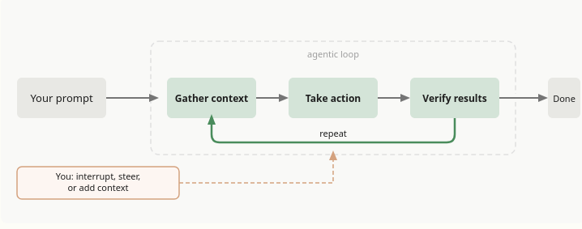
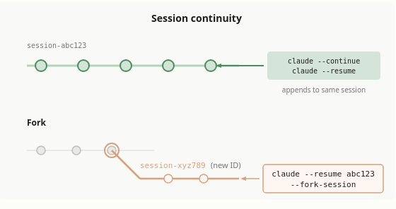
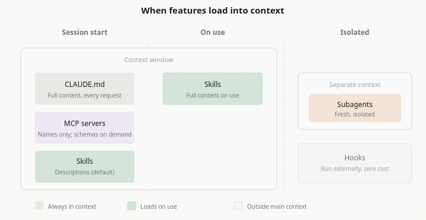

# 目录  
1.Claude Code核心概念  
2.使用Claude Code  
3.参考  

## 1.Claude Code核心概念   
**目录:**  
1.1 Claude Code如何工作  
1.2 扩展Claude Code(了解)  
1.3 .claude目录  

### 1.1 Claude Code如何工作   
**目录:**  
1.1.1 代理循环  
1.1.2 使用会话  
1.1.3 使用检查点和权限保持安全  
1.1.4 有效使用Claude code  

#### 1.1.1 代理循环
1.代理循环  
Claude完成任务时会经历三个阶段<font color="#00FF00">收集上下文、采取行动、验证结果</font>这些阶段相互融合,Claude始终使用<font color="#FF00FF">工具</font>来完成各种任务  
  
说白了Claude就是会往复以上三个阶段;如果要解决用户代码库的问题可能只需要收集上下文这一步,代码错误修复则可能会多次循环执行这三个步骤,重构则可能涉及广泛的验证步骤  
代码循环由两个组件驱动:<font color="#FFC800">模型</font>进行推理和<font color="#FFC800">工具</font>采取行动  
而Claude Code就是各种工具的代理框架,其利用各种工具,将语言模型转变为能够进行编码的代理  

2.模型  
模型就是负责推理的大模型,ClaudeCode支持多种模型,可以用`/model`来切换模型  

3.工具  
Claude Code本质就是各种工具的代理框架,没有工具,Claude只能用文本回应;有了工具,Claude可以采取行动:读取您的代码、编辑文件、运行命令、搜索网络并与外部服务交互,每个工具使用都会返回信息,反馈到循环中,告知Claude的下一个决定  
内置工具通常分为五个类别:  
| 类别     | Claude 可以做什么                                                |
|:---------|:-----------------------------------------------------------------|
| 文件操作 | 读取文件、编辑代码、创建新文件、重命名和重新组织                 |
| 搜索     | 按模式查找文件、使用正则表达式搜索内容、探索代码库               |
| 执行     | 运行shell命令、启动服务器、运行测试、使用git                     |
| 网络     | 搜索网络、获取文档、查找错误消息                                 |
| 代码智能 | 编辑后查看类型错误和警告、跳转到定义、查找引用(需要代码智能插件) |

4.扩展基本功能  
内置工具是基础;您可以使用[skills](https://code.claude.com/docs/zh-CN/skills)扩展Claude知道的内容、使用[MCP](https://code.claude.com/docs/zh-CN/mcp)连接到外部服务、使用[hooks](https://code.claude.com/docs/zh-CN/hooks)自动化工作流,以及将任务卸载给[subagents
](https://code.claude.com/docs/zh-CN/sub-agents)  

#### 1.1.2 使用会话  
1.跨分支工作  
每个Claude Code对话都是一个与您当前目录相关的会话,`/resume`选择器默认显示来自当前worktree的会话  
<font color="#FF00FF">您可以通过使用git worktrees运行并行Claude会话,这为各个分支创建单独的目录</font>  

2.恢复或分叉会话  
使用`claude --continue`或`claude --resume`恢复会话会在相同的会话ID下重新打开它,并将新消息附加到现有对话
使用`--fork-session`或`/branch`分叉会将历史复制到新的会话ID中,<font color="#00FF00">保持原始会话不变</font>  
  

3.上下文窗口(context window)  
Claude的上下文窗口保存您的对话历史、文件内容、命令输出、[CLAUDE.md](https://code.claude.com/docs/zh-CN/memory)、[自动内存](https://code.claude.com/docs/zh-CN/memory#auto-memory)、加载的skills和系统说明,当您工作时,上下文填满时,Claude会自动压缩,但对话早期的说明可能会丢失,<font color="#00FF00">将持久规则放在CLAUDE.md中</font>,并运行`/context`以查看什么在占用空间  
关于上下文窗口详情见[上下文窗口](https://code.claude.com/docs/zh-CN/context-window)  

3.1 当上下文填满时  
Claude Code会在上下文快满时自动压缩上下文,要控制在压缩期间保留的内容,可以通过在<font color="#00FF00">CLAUDE.md中添加"Compact Instructions"部分</font>或运行`/compact`命令,例如`/compact focus on the API changes`  
还有一个问题是,如果因为单个文件或工具输出太大等原因,导致Claude Code每次压缩完上下文之后又立即触发压缩,则Claude Code会在几次尝试后停止自动压缩并报错,具体参考[自动压缩停止并出现抖动错误](https://code.claude.com/docs/zh-CN/troubleshooting#auto-compaction-stops-with-a-thrashing-error)  

3.2 使用skills和subagents管理上下文  
除了压缩,您可以使用其他功能来控制什么加载到上下文中;
* Skills默认按需加载并且是<font color="#00FF00">渐进式披露</font>,但这会消耗一定的上下文用于存储每个Skills的描述,如果需要完全手动控制skills,则可以设置`disable-model-invocation: true`将skills的描述独立于上下文之外  
* Subagents拥有自已独立的上下文,独立于主会话,当它完成任务后直接返回结果,所以subagents更有助于长会话

#### 1.1.3 使用检查点和权限保持安全  
1.介绍  
Claude有两个安全机制:checkpoints让您撤销文件更改,权限控制Claude可以在不询问的情况下做什么  
*提示:检查点(checkpoint)实际上这个概念在数据库中也有出现过,检查点简单理解为存档点,它完整保留了系统在某刻的状态*  

2.使用checkpoints撤销更改  
<font color="#FF00FF">每个文件编辑都是可逆的</font>在Claude编辑任何文件之前,它会对当前内容进行快照,如果出现问题,按两次Esc以回退到之前的状态,或要求Claude撤销;<font color="#00FF00">Checkpoints是会话本地的,独立于git</font>  

2.Claude的模式  
按`Shift+Tab`循环通过权限模式  
* Default:Claude在文件编辑和执行shell命令之前询问
* Auto-accept edits:Claude编辑文件并运行常见的文件系统命令(如mkdir和mv)不会iu询问,但运行其它命令时依旧会询问
* Plan Mode:Claude探索并提出计划而不编辑您的源文件;权限提示仍然适用,如默认模式
* Auto mode:Claude使用后台安全检查评估所有操作(试验功能)

可以配置`.claude/settings.json`允许特定命令,以便Claude不会每次都询问,详情参考[配置权限](https://code.claude.com/docs/zh-CN/permissions)  

#### 1.1.4 有效使用Claude code  
1.中断  
* 直接在控制台按`Esc`立即停止Claude,不是ctrl+c
* 在Claude运行的时候也是可以发送对话的,Claude会在当前操作完成后立即读取它

### 1.2 扩展Claude Code(了解)  
**目录:**  
1.2.1 概述  
1.2.2 何时使用扩展  
1.2.3 扩展的上下文成本  

#### 1.2.1 概述 
1.概述  
Claude Code的扩展分为  
* [CLAUDE.md](https://code.claude.com/docs/zh-CN/memory):添加Claude每个会话都能看到的持久上下文
* [Skills](https://code.claude.com/docs/zh-CN/skills):添加可重用的知识和可调用的工作流
* [MCP](https://code.claude.com/docs/zh-CN/mcp):将Claude连接到外部服务和工具
* [Sub Agents](https://code.claude.com/docs/zh-CN/sub-agents):在隔离的上下文中运行自己的循环，返回摘要
* [Agent teams](https://code.claude.com/docs/zh-CN/agent-teams):协调多个独立会话，具有共享任务和点对点消息传递
* [Hooks](https://code.claude.com/docs/zh-CN/hooks-guide):在生命周期事件上触发，可以运行脚本、HTTP 请求、提示或 subagent
* [代码智能](https://code.claude.com/docs/zh-CN/tools-reference#lsp-tool-behavior):将Claude连接到语言服务器，用于符号级导航和实时类型错误
* [Plugins](https://code.claude.com/docs/zh-CN/plugins)和[marketplaces](https://code.claude.com/docs/zh-CN/plugin-marketplaces):打包和分发这些功能

#### 1.2.2 何时使用扩展  
1.何时使用扩展  
| 功能                        | 作用                                       | 何时使用                                          |
|:----------------------------|:-------------------------------------------|:--------------------------------------------------|
| CLAUDE\.md                  | 每次对话加载的持久上下文                   | 项目约定、"始终执行 X" 规则                       |
| Skill                       | Claude可以使用的说明、知识和工作流         | 可重用内容、参考文档、可重复的任务                |
| Subagent                    | 返回摘要结果的隔离执行上下文               | 上下文隔离、并行任务、专门的工作者                |
| Agent teams                 | 协调多个独立的 Claude Code 会话            | 并行研究、新功能开发、使用竞争假设进行调试        |
| Code intelligence(代码智能) | 语言服务器导航和诊断                       | 类型化语言、大型代码库(其中 grep 速度慢或不精确)  |
| MCP                         | 连接到外部服务                             | 外部数据或操作                                    |
| Hook                        | 由事件触发的脚本、HTTP请求、提示或subagent | 必须在每个匹配事件上运行的自动化                  |
| Artifact                    | 将会话输出发布为私有、交互式网页           | 您想以视觉方式查看或共享的输出,而不是作为终端文本 |

Plugins是打包层,<font color="#00FF00">Plugin将skills、hooks、subagents和MCP servers捆绑到单个可安装单元中</font>.Plugin skills按命名空间区分(如`/my-plugin:review`),因此多个plugins可以共存,当您想在多个项目中重用相同的设置或通过marketplace分发给他人时,使用plugins  

2.扩展使用技巧  
* Claude两次出错约定或命令->将其添加到CLAUDE\.md
* 一直在输入相同的提示词来开启一个任务->将其保存为用户可调用的skill
* 多次将相同的提示词或操作步骤提交到会话->将其保存为用户可调用的skill
* 多次从浏览器、数据库等地方复制Claude看不到的数据->MCP
* Claude读取许多文件以查找符号的定义或使用位置->Code Intelligence(代码智能)
* 有一个辅助任务使用哪些不会再次使用的上下文->subagent
* 希望每次都发生某事而无需询问->hook
* 另外一个项目需要使用相同的设置->将其打包为plugin


3.分层  
扩展可以在多个级别定义:用户范围、每个项目、通过plugins或通过托管策略;当相同的功能存在于多个级别时,以下是它们的分层方式:  
* CLAUDE\.md文件是累加的
  所有级别的内容同时发送给claude的上下文,当前工作目录和上级目录的文件在启动时加载
  子目录在您在其中工作时加载
  当说明冲突时,Claude自动协调它们,更具体的说明通常优先
* Skills和subagents按名称覆盖
  当相同的名称存在于多个级别时,有如下优先级
  对于skills而言,托管>用户>项目
  对于subagents而言,托管>CLI标志>项目>用户>plugin
* MCP按名称覆盖
  本地>项目>用户
* Hooks合并
  所有注册的hooks为其匹配的事件触发,无论来源如何

#### 1.2.3 扩展的上下文成本  
1.成本表格  
| 功能              | 何时加载          | 加载内容                           | 上下文成本                   |
|-------------------|-------------------|------------------------------------|------------------------------|
| CLAUDE\.md         | 会话开始          | 完整内容                           | 每个请求                     |
| Skills            | 会话开始+使用时 | 启动时的描述,使用时的完整内容     | 低(每个请求的描述)         |
| MCP         | 会话开始          | 工具名称;完整架构                 | 按需低,直到使用工具         |
| Code intelligence | 文件编辑后和按需  | 编辑后的诊断;符号查找时的位置信息 | 低;减少其他地方的文件读取   |
| Subagents         | 生成时            | 具有指定skills的新鲜上下文       | 与主会话隔离                 |
| Hooks             | 触发时            | 无(外部运行)                     | 零,除非hook返回额外上下文 |

2.加载时机图  
 
* CLAUDE\.md
  加载时机-会话开始时
  加载内容-所有CLAUDE\.md文件的完整内容(托管、用户和项目级别)
  加载继承-Claude从当前工作目录读取CLAUDE\.md文件直到根目录,并在访问这些文件时发现子目录中的嵌套文件
* Skills
  加载时机-取决于skill的配置,默认情况下,SKills描述在会话开始时加载,完整内容在使用时加载,如果设置`disable-model-invocation: true`则除非手动调用否则不会加载
  加载内容-对于模型可调用的skills,Claude将在每个请求中加载<font color="#00FF00">名称和描述</font>
  Claude如何选择skills:Claude将您的任务与skill描述相匹配,以决定哪些相关,如果描述模糊或重叠,Claude可能会不正确加载skills,要明确Claude使用特定的skill,使用`/<name>`调用它
  在subagents中:在subagents中<font color="#FF00FF">不是按需加载</font>,而是在subagent的skills字段中列出的skills在启动时<font color="#00FF00">完全预加载到其上下文中</font>

### 1.3 .claude目录  
**目录:**  
1.3.1 

## 2.使用Claude Code 
**目录:**  
2.1 快速开始  
2.2 模式  

### 2.1 快速开始 
1.进入项目  
首先必须选择让claude code进入哪个项目,控制台输入`cd`命令并切换到目标项目地址即可  

2.在Claude Code中使用Git  
可以通过与Claude Code的对话,直接使用git  
```markdown
我更改了哪些文件？
用描述性消息提交我的更改
创建一个名为feature/quickstart的新分支
```
### 2.2 模式 
1.切换模式
在claude code控制台按下shift+tab可以切换claude code的模式,总共如下几种  
* 默认:普通的聊天模式
* accept edits on:自动同意模式

## 3.参考  
**目录:**  
3.1 Sehll命令  
3.2 会话命令  
3.3 工具  

### 3.1 Sehll命令 
1.常用Shell命令  
*提示:shell命令是在控制台中输入的命令,和会话命令区分下来*  
| 命令              | 功能                       | 示例                              |
|:------------------|:---------------------------|:----------------------------------|
| claude            | 启动交互模式               | claude                            |
| claude "task"     | 运行一次性任务             | claude "fix the build error"      |
| claude -p "query" | 运行一次性查询，然后退出   | claude -p "explain this function" |
| claude -c         | 在当前目录中继续最近的对话 | claude -c                         |
| claude -r         | 恢复之前的对话             | claude -r                         |

2.完整命令  
参考[CLI参考](https://code.claude.com/docs/zh-CN/cli-reference)  

### 3.2 会话命令  
1.常用会话命令  
| 命令            | 功能             | 示例   |
|:----------------|:-----------------|:-------|
| /clear          | 清除对话历史     | /clear |
| /help           | 显示可用命令     | /help  |
| /exit 或 Ctrl+D | 退出 Claude Code | /exit  |

2.完整命令  
[会话命令](https://code.claude.com/docs/zh-CN/commands)  

### 3.3 工具
1.基本介绍  

2.完整工具介绍  
[官网工具参考](https://code.claude.com/docs/zh-CN/tools-reference)  


