# 目录 
1.编程工具  
2.Vibe Coding实战  


## 1.编程工具  
**目录:**  
1.1 AI模型选择指南  
1.2 AI代码编辑器  
1.3 命令行编辑工具  
1.4 AI IDE插件  
1.5 其它AI工具  
1.6 AgentSkills  
1.7 跨编辑器通用工具  
1.8 Git WorkTree  


### 1.1 AI模型选择指南
1.分清AI编程工具和AI模型  
AI编程工具:Cursor、Claude Code可以理解为传统的IDE,用来生产代码  
AI模型:Claude、ChatGPT可以理解为传统的程序员,负责思考  
<font color="#00FF00">所以同样是用‍Cursor,选择不同的模型Claude或Chat⁡GPT,最终呈现的效果自然会不一样</font>  

2.主流AI模型  
* 国际顶尖模型:Claude、ChatGPT、Gemini这三大巨头
* 国产优秀模型:DeepSeek、智谱GLM、通义千问、Kimi等性价比之选
* 还有开源模型:Llama、Qwen等,需要一定技术能力自己部署

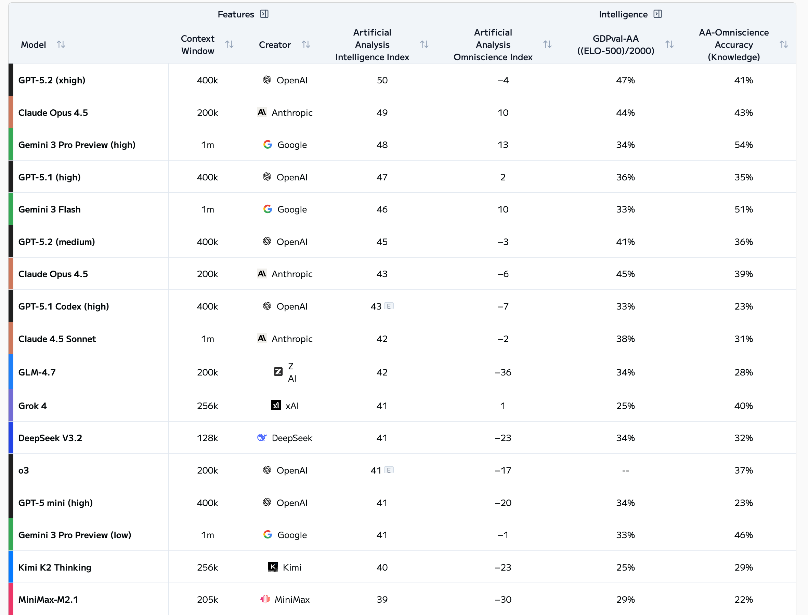  
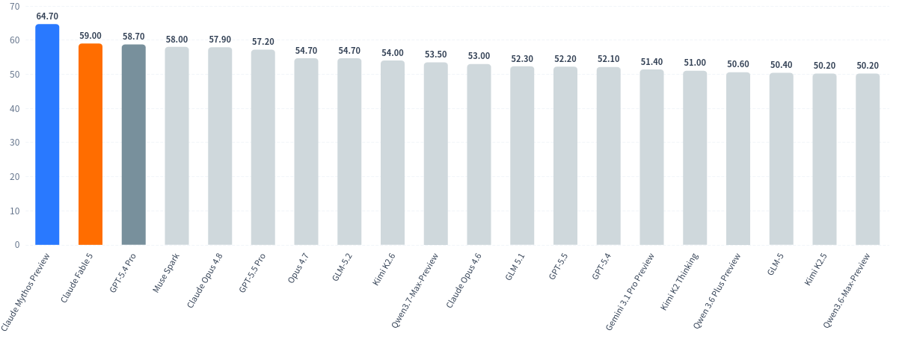  

2.1 Claude最强编码能力  
发布路线:Claude 4.5(2025)->Claude Opus 4.6(2026.2)->Claude Opus 4.8(2026.5)->claude fable 5(2026.6)  

Claude4‍系列主要有两个版本线:Opus是顶配版本,编程能力最强,但速⁡度相对较慢,价格也更高;Sonn​et是平衡版本,在性能和速度之间取得了很好的平衡,性价比最高.  

Claud‍e主要有3种使用方式:  
* 官方订阅:Claude Pro每月20美元,Max 5x每月100美元,Max 20x每月200美元
* Cursor:订阅Cursor Pro每月20美元,包含了Claude的使用额度
  Curso⁡r的优势是每个月不同的模型有不同的额度,不过超出额度之外是需要额外付费的
* API调用(按量付费):按Token计费,用多少付多少,比较灵活

2.2 ChatGPT  
发布路线:GPT-5.3-Codex(2026.2)->GPT-5.5(2026.4)

ChatGPT主要有3种使用方式: 
* ChatGPT Plus:每月20美元
* ChatGPT Pro:每月100美元(5 倍用量)或每月200美元(20 倍用量)
* API 调用:按Token计费(GPT-5.5为$5/M输入、$30/M输出)

2.3 Gemini  
Gemini最厉害的地方是它的<font color="#00FF00">超长上下文窗口</font>,Gemini 3 Pro支持1M Token(约100万字)的输入上下文,所以如果你需‍要处理大型项目、需要分析大量代码、做UI⁡/前端开发、或者预算​有限但需要强大能力,Gemini会是很好的选择  

Gemini主要有3种使用方式: 
* Gemini 3 Pro:每月19.99美元
* API调用:价格比Claude和GPT便宜很多
* 免费版本:Gemini 3 Flash有一定的免费额度,每天也有几次思考模型的试用

2.4 DeepSeek  
DeepSeek-V4是开源模型,完全免费使用(API按量计费价格极低),编程能力在国产模型中数一数二;V4系列支持100万token超长上下文,包括更强的DeepSeek-V4-Pro(1.6T参数,49B 激活)和更快更便宜的DeepSeek-V4-Flash(284B参数,13B激活),特别适合Agent编程和大型代码库分析  

2.5 Qwen3(千问)
阿里通义千问Qwen3.7-Max是2026年5月发布的旗舰模型,专为智能体时代设计,在编程、推理、长程自主执行等能力上表现出色,支持Claude Code、OpenClaw等主流框架;通过阿里云百炼平台可以API调用(输入12元/百万Tokens,输出36元/百万Tokens)或Token Plan订阅使用  

2.6 <font color="#FFC800">GLM(智谱)</font>
智谱GLM-5(及最新的GLM-5.2)是清华团队出品的旗舰模型,2026年2月发布,全球开源模型综合排名第一;GLM-5在Coding和Agent能力方面表现非常突出,支持200K Token的长上下文,具备强大的工具调用和长程任务规划能力;实测下来,体感已经接近Claude Opus级别,但作为开源模型,成本要低得多,我自己也在持续用GLM开发,在生成完整项目方面的速度和效果都很不错  

2.7 Kimi
月之暗面Kimi在很早之前就支持超长上下文能力(200万字),在国产模型中独树一帜;特别适合处理大型项目的代码,可以一次性处理500个文件  

3.怎么选  
* 学习阶段:如果你还在‍学习,主力用DeepSeek-V4或通义千问(Qwen3.7-Max通过Token ⁡Plan 订阅很划算),辅助用Gemini ​3 Flash的免费额度;这个阶段重点是熟悉AI编程的感觉,这些模型完全够用
* 做前端/U‍I项目:Gemini 3 Pro在前端UI设计方面表现特别出色,⁡实测它能生成质感很好的界面、3D 模​型构建能力也很强;如果你主要做前端,Gemini是很好的选择
* 做全栈项目:优‍先选择编程能力强的Claude Sonnet,能力全面前后端都能⁡应对;配合 Cursor使用,开发体​验很好;如果需要快速生成完整项目,智谱GLM-5的速度和效果也不错
* 大量测试和调用:De‍epSeek-V4的API价格极低,而且通义千问(Qwen3.7-Max)也有 Token⁡ Plan订阅方案,适合需要大量调用的场景,测​试时可以放心使用

### 1.2 AI代码编辑器  
**目录:**  
1.2.1 Cursor  
1.2.2 Trae  
1.2.3 CodeX  
1.2.4 其它主流AI代码编辑器  

#### 1.2.1 Cursor  
1.两种界面  
Cursor提供了两套操作界面  
Agent Window:跟你平时用‍的AI聊天工具长得差不多,左边管⁡理对话和项目,中间​跟AI聊天,适合新手上手  
Ed‍itor Window:就是类似vscode这种代码编辑器  

2.选择AI模型  
Cursor的P‍ro用户可以自由选择AI模型,Cursor支持Claude、GPT⁡、Gemini、Grok等国外主流大​模型,你可以在对话面板的模型选择器里一键切换,还能调节模型的推理等级  
如果不知道选什么模型,直接auto就好  
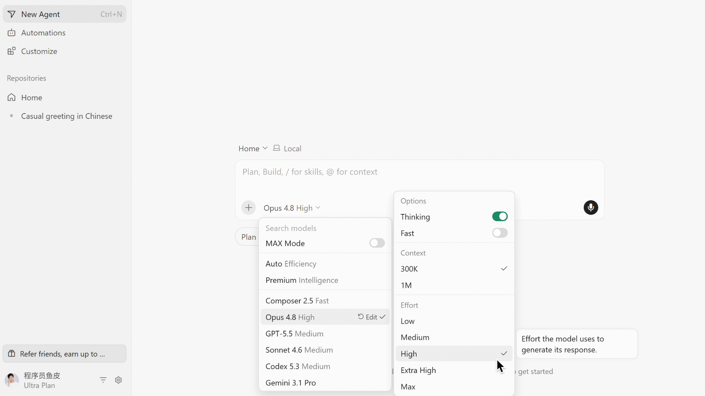  

3.在Cursor中使用MCP  
参考帖子:https://ai.codefather.cn/library/2010974694076256258  

4.模式  
4.1 ASK模式  
Ask模‍式是纯问答,执行速度快但是不能修改文件⁡,适合你想了解某个知​识点、或者让AI解释一段代码的时候用  

4.2 Plan模式  
这个模式不生成代码,AI会先帮你想清楚怎么做,生成一份⁡实施计划,确认没问题后再动手​写代码  
AI会分析需求‍,有任何不确定的地方会弹窗找你确认;然后输出一份详细的实施计划,⁡包括技术选型、文件结构、任务列表​,你不需要看懂计划里提到的每个技术名词,大致扫一遍觉得合理就行  

5.使用技巧  
5.1 用`@`引用精准提供上下文  
在对话框里输入`@`,可以让AI精准地参考你指定的内容;比如`@文件名`引用项目中的某个文件,`@Docs`引用已索引的官方文档,`@Terminals`引用当前终端的报错信息  

5.2 Checkpoints快照回滚  
多轮修改的‍过程中,难免会遇到AI越改越乱、⁡或者一个Bug​始终解决不了的情况  
这时候用Curs‍or的快照回滚功能就好了,Agent每次修改都会自动保存一个快照⁡,你只要把鼠标悬停在对话记录中之前​某条消息上,点击回滚图标,就能一键恢复到那个时间点的代码状态  
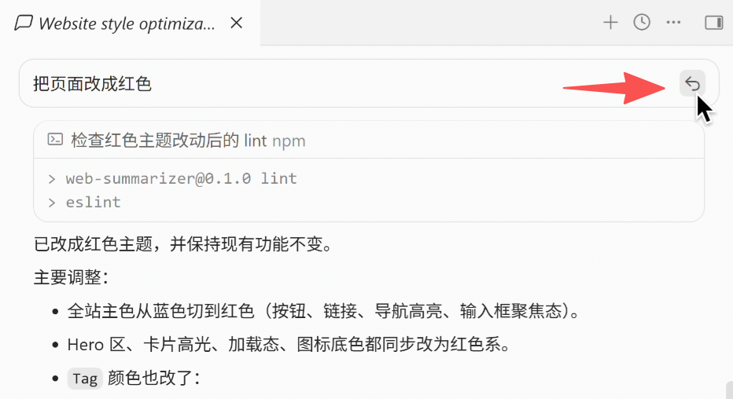  

5.3 Rules约束AI的行为  
可以在项目根目录下创建一个AGENTS.md文档,在该文档里写入你希望AI遵守的规则,例如  
```markdown
## 编码规范

- 所有代码注释使用中文
- 使用TypeScript而非JavaScript
- 变量命名使用驼峰式(camelCase)
```

5.4 Clo‍ud Agent云端智能体  
Cursor还有‍一种Cloud Agent,跑在云端服务器上,关掉电脑它也能继续工⁡作,适合大规模代码重构这种耗时任务​;你甚至可以在手机上打开网页,随时随地让AI干活和查看进度  

5.5 Automat‍ions自动化  
可以设置定时触发或者事件触发的自动化任务,比如让AI⁡每天早上9点自动整理项目进度并​生成报告,或者当GitHub仓库有人提交代码时自动做代码审查  

5.6 Market‍place插件市场
Cursor有自己的官方插件市场,里面有各种插件一键安装就能用  
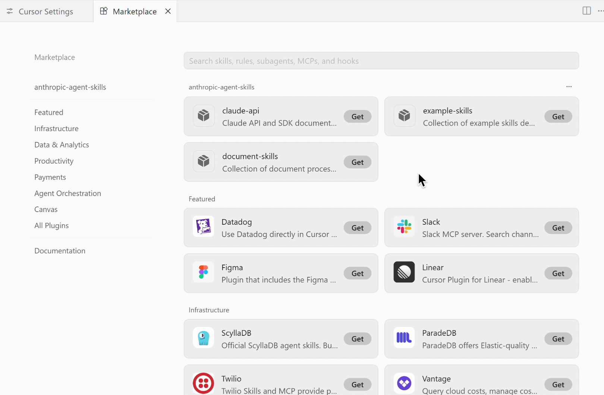  

5.7 代码索引  
Cu‍rsor会自动分析整个代码库建立语义索引,你在对话中就能快速检索到项目⁡里任何角落的代码,这个能力很适合用来​学习开源项目,用Cursor打开项目后让AI帮你分析整体架构  
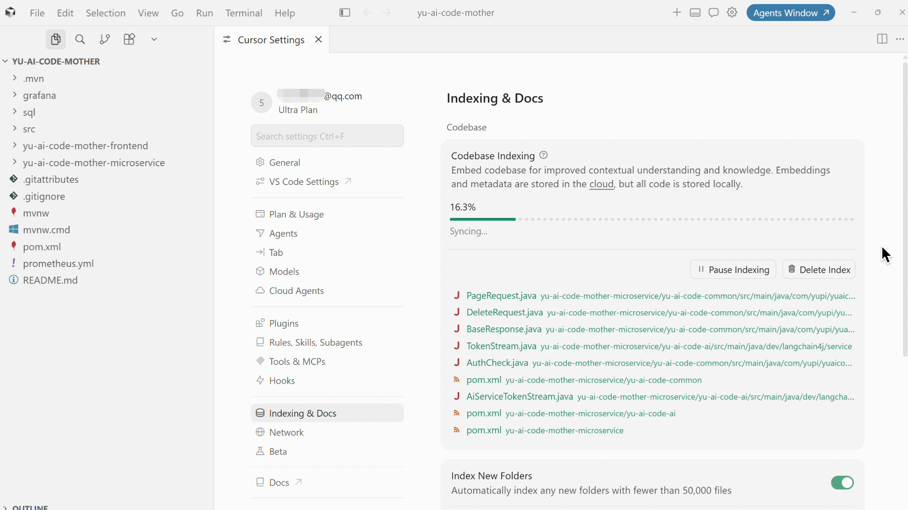  

6.在Cursor中安装skills  
参考帖子:https://ai.codefather.cn/library/2062514935291760642  

#### 1.2.2 Trae  
1.介绍  
TRAE有两种开发模式IDE和SOLO  
IDE模式就类似Cursor,保留传统开发流程,人类主导  
SOLO模式让AI主导,自动推进开发任务  
Trae的核心实际上就是SOLO模式,<font color="#00FF00">是让AI主导任务并自动执行开发</font>,你只需要有一个想法,然后配合AI就能让想法真正落地  
打个比方,用Curs‍or就像你是项目经理,AI是程序员,你需要不断地给AI分配任务、检查成果、提出修改⁡意见,而用TRAE SOLO,AI就是​项目经理+程序员,你只需要告诉它目标,它会自己规划、自己开发、自己测试  
<font color="#00FF00">TRAE国内版只支持国产模型,要使用最好下载国际版TRAE,但是支持的模型也不是很全面,GPT-5.4、Gemini-3.1-Pro-Preview,可以使用Claude的API进行接入</font>  
国内版本Trae的优势在于,<font color="#00FF00">AI编程功能完全免费无限制(不需要会员),但是需要排队</font>,每个月的会员能给一定次数的免排队和更多的云端任务  


2.TRAE SOLO的核心功能  
2.1 自动生成文档  

2.2 服务集成能力  

2.3 多任务并行  
TRAE ‍SOLO支持多任务并行执行,可以同⁡时开发前端和后端,​大大提高效率  

2.4 代码变更工具  
TRAE提供了DiffView代码变更工⁡具,可以清晰地看到​每次修改了哪些代码,方便审查和回退  

2.5 Plan模式  
除了直接执行‍,TRAE还支持Plan模式,AI会⁡先生成详细的执行计划,​你确认后再执行;这样可以更好地控制开发过程,这个跟cursor的plan模式一样  


#### 1.2.3 CodeX  
1.介绍  
详情参考:https://ai.codefather.cn/library/2058749249474023425  
CodeX一定要体验使用一下!  


#### 1.2.4 其它主流AI代码编辑器
* [Windsurf](https://devin.ai/desktop):最大的优势是完全免费,也有付费版本价格和cursor一致,如果要用付费版本肯定是不如cursor的  
* [Antigravity](https://antigravity.google/):是Google推出的智能体开发平台
  价格方面跟‍Cursor相当,但是Antig‍ravity自从发布之后,更新节奏不如⁡Cursor和​Codex那么频繁,最近存在感有点低了
* [Kiro](https://kiro.dev/):是Amazon推出的AI IDE,强调"规范驱动开发",先写需求规范,再让AI实现
  价格方面跟‍Cursor相当,Kiro的默⁡认模型在国内是可以​直接使用的,有一定的免费额度
* [Trae](https://www.trae.cn/):字节推出
* [Zed](https://zed.dev/):用Rust编写的高性能代码编辑器
  Zed的‍Pro版定价$10/月,差不多是⁡Cursor的一半​价格,学生还可以免费用一年
* [Qoder](https://qoder.com.cn/):阿里推出的工具
  底层使用阿里自研Qwen-Coder模型,
* [CodeBuddy](https://www.codebuddy.cn/home/):腾讯CodeBuddy在产品形态上比较全面,有独立IDE、VS Code/JetBrains插件、还有命令行版本,CodeBuddy最大的亮点是跟微信生态的深度集成,支持微信小程序开发和企业微信Bot集成,搞微信相关开发用它比较合适
* OpenCode:这个有CLI、桌面版、vscode插件,不过桌面版使用体验较为一般


### 1.3 命令行编辑工具  
**目录:**  
1.3.1 命令行编辑工具和AI代码编辑器的区别
1.3.2 Claude Code安装教程  
1.3.3 CC Switch  
1.3.4 其它主流CLI  
1.3.5 CodeX CLI  
1.3.6 React Ink  
1.3.7 飞书CLI  
1.3.8 OpenCode  

#### 1.3.1 命令行编辑工具和AI代码编辑器的区别  
这两个工具从来就不是相互竞争,而是相互配合,有些场景下CLI更好用而有些场景下cursor更好用,CLI一般更加灵活  
CLI就是命令行界面,与之对应的是GUI图形化界面,如果让AI直接操纵GUI则效率、准确度等都十分低下,所以CLI就是AI发挥最大威力的工具,比如[OpenCLI](https://github.com/jackwener/opencli)这个项目的理念就很好,他能将市面上的各大应用转为CLI,想象一下如果要让AI将目前热点榜单前10的回答全部记录下来,这件事情在GUI平台上做的话会十分麻烦,但是有CLI的话就很方便直接通过API请求,然后直接对结果进行操作,<font color="#00FF00">所以CLI是专门为AI编写的操作平台</font>,而GUI是专门为人类编写的操作平台  
AI代码编辑‍器是有图形界面的软件,你可以看到文件列表、代码高亮、按钮⁡等等;而命令行工具完全​在终端里运行,只有文字输入和输出,几乎没有任何图形界面  

*提示:本节可以补充看1.3.7 飞书CLI,对现代的业务模式有更好的理解*  

#### 1.3.2 Claude Code安装教程  
1.官网  
[详情可以参考官方文档](https://code.claude.com/docs/zh-CN/quickstart#native-install-recommended)  

2.安装  
一定要先确保电脑上有nvm和相应的node  
Linux环境下执行这条命令~~npm install -g @anthropic-ai/claude-code~~  
安装完毕之后,执行`claude`命令运行claude code  
*提示:如果使用npm管理node的版本,假设在V20.1这个node环境下安装了claudecode,则当你使用nvm use V22.1切换到其他版本时,claude这个命令就找不到了,<font color="#00FF00">也就是说在哪个node版本安装的软件,使用的时候还必须切换到该版本</font>,所以他实际上是做了一个隔离*  
*提示:新版本已经不推荐使用npm方式安装了,这里应该直接去官网查看安装方式*  

3.替换模型  
要想使用Claude就必须登陆,登陆的话有三种方式,第一种是网页端登陆并购买Claude的会员,第二种是输入Claude家的API的token,第三种就是不使用Claude的模型,而是使用第三方的模型,但是第三方的模型只支持零星的几个(不支持国产模型),为此接下来需要将使用国产模型  
假如这里要使用deepseek模型,可以参考这个[deepseek对接各大agent的文档](https://github.com/deepseek-ai/awesome-deepseek-agent/blob/main/README.zh-CN.md),下面以接入claude为例进行演示  
编辑`~/.claude/settings.json`配置文件  
```json
{
  "theme": "dark",
  "env": {
    "ANTHROPIC_BASE_URL": "https://api.deepseek.com/anthropic",
    "ANTHROPIC_AUTH_TOKEN": "这里填入api的key",
    "ANTHROPIC_MODEL": "deepseek-v4-pro[1m]",
    "ANTHROPIC_DEFAULT_OPUS_MODEL": "deepseek-v4-pro[1m]",
    "ANTHROPIC_DEFAULT_SONNET_MODEL": "deepseek-v4-pro[1m]",
    "ANTHROPIC_DEFAULT_HAIKU_MODEL": "deepseek-v4-flash[1m]",
    "CLAUDE_CODE_DISABLE_NONESSENTIAL_TRAFFIC": "1",
    "CLAUDE_CODE_EFFORT_LEVEL": "max"
  }
}
```

4.运行claude  
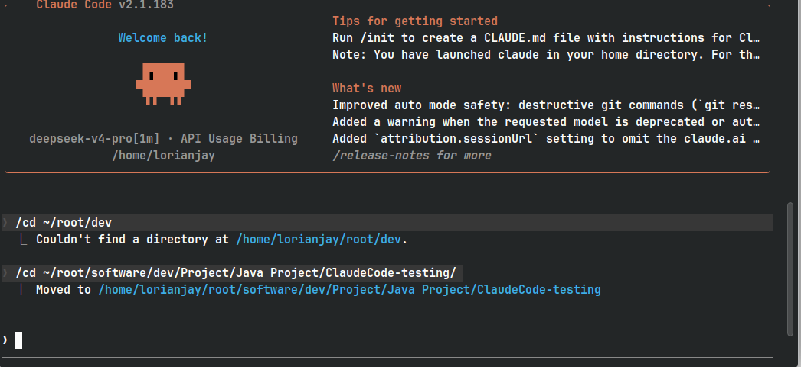  

5.提示词如下:
> 直接在当前文件夹下创建一个JavaGUI项目要求使用标准maven,当前路径就是根路径,不需要再创建子文件夹,要求是界面小清新现代化,左侧有一个切换卡片栏,当鼠标移动到左边的时候他会自动展开,在这个切换栏可以有page1 page2 page3,点击对应的page按钮即可切换到对应的页面,当鼠标移出这个侧边栏的范围之外时这个侧边栏会自动收回  

确认之后claude会在命令行显示生成的执行计划,内容很长最后会询问你是否同意使用该计划,还是说你有一些修改的地方,这里直接yes  
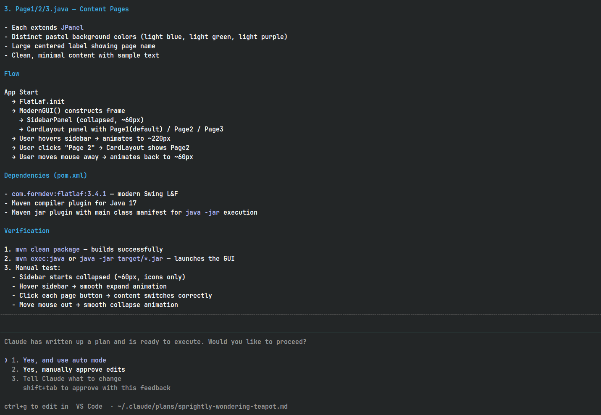  

6.消费金额  
本次项目生成花费10分钟,花费如下,有点贵我感觉是他生成的内容太详细了,很多东西都没有必要,而且生成的时间也太长了  
  

7.卸载  
因为是使用npm安装的,所以卸载的时候就按照npm来卸载,执行命令~~sudo npm uninstall -g @anthropic-ai/claude-code~~  
如果是原生安装则执行以下命令  
```shell
rm -f ~/.local/bin/claude
rm -rf ~/.local/share/claude
```

8.Claude Code常用命令  
可以参考[鱼皮的文章](https://ai.codefather.cn/library/2062514931529469953)  
还可以看[官方文档](https://code.claude.com/docs/zh-CN/commands)

9.模型定价  


#### 1.3.3 CC Switch  
1.介绍  
这个项目是一个图像化的[开源项目](https://github.com/farion1231/cc-switch),用于可视化管理Claude Code的模型配置,也可以在这里看到刚才生成的项目所花费的token数量  
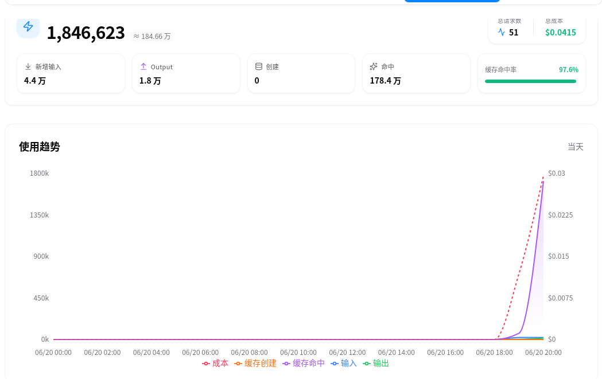  

2.主页  
下图是主界面的样式,实际上主界面由三个主要的部分组成,首先是上方的各种AI编程工具(注意编程工具需要和AI模型区分),选择了某一个具体的编程工具之后,下面会显示该模型可以使用哪些供应商,也就是说选择不同的AI编程工具下方的可选模型是不同的,比如这里就有常见的几种AI编程工具,当你在下方选择某一个具体的供应商此时会直接切换到该模型进行使用,十分方便  
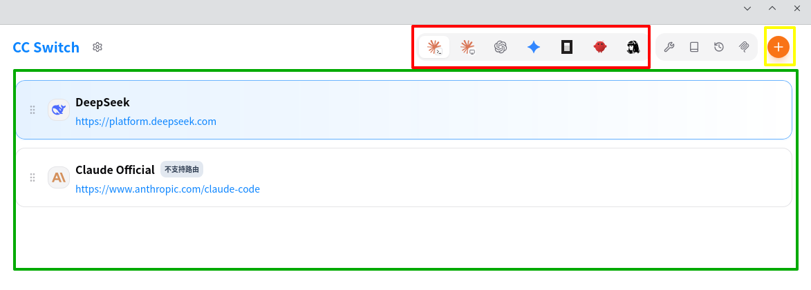  

3.添加新供应商
比如现在要为claude code添加deepseek的供应商,此时在主界面右上角点击黄色的+,选择预设供应商中的deepseek  
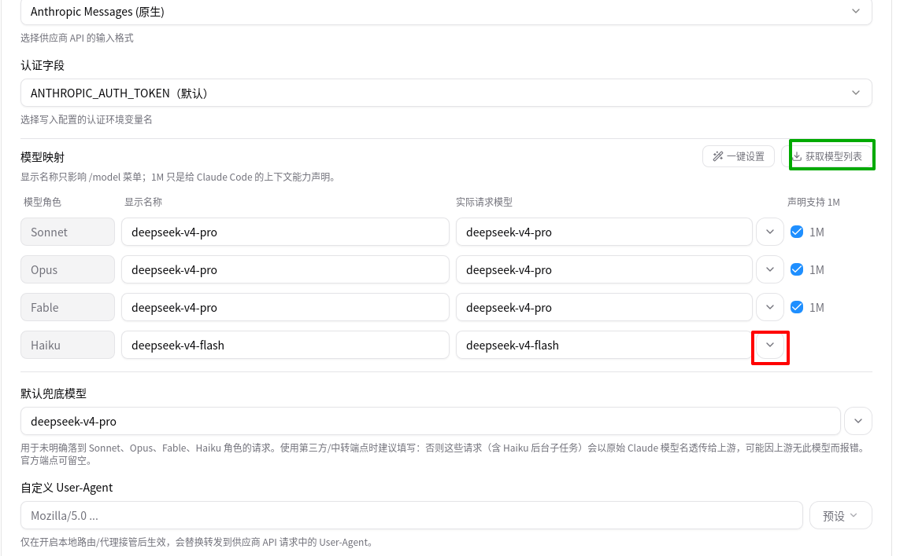  
点击绿色的框框可以获取当前供应商支持的模型,然后再点击红色框框可以选择具体的某一个模型  

4.安装不同的CLI  
另外CC Switch非常方便的一点,点击设置->关于,可以在这里一键安装主流的CLI以及各种agent助手  
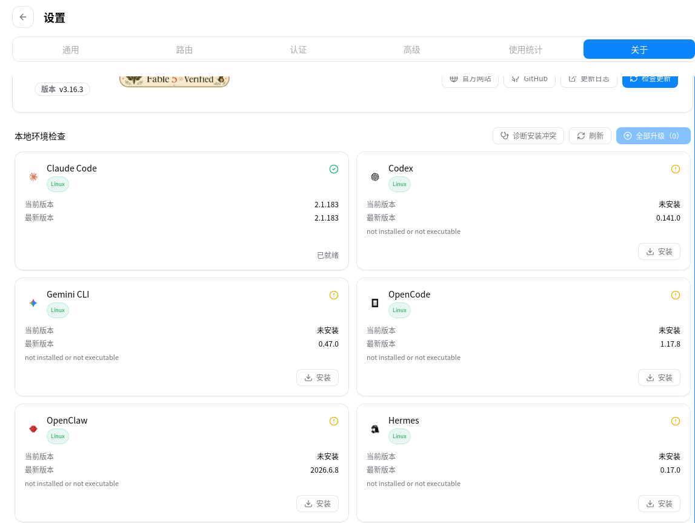  

5.本地路由(对接OpenAI)  
使用CC Switch的时候会发现Claude对接deepseek十分方便,但是对接OpenAI家的工具就显示需要路由,这是因为DeepSeek提供了兼容Anthropic协议的接口,而Claude Code本身就是按这个协议来通信的,CC Switch直接把配置写进settings.json就能用了  
但是到了OpenAI这边情况就不一样了,Codex用的是OpenAI的Responses API,而DeepSeek这些国内模型走的是Chat Completions API,所以Cod‍ex接国内模型,关键在于中间得有个<font color="#00FF00">翻译</font>⁡,把Codex发出​的请求转换成DeepSeek能听懂的格式  
所以CC Switch的<font color="#FF00FF">本⁡地路由</font>功能,会在你电脑上​起一个轻量级的代理服务,请求的流转过程是这样的:Codex>CC Switch>DeepSeek>CC Switch>Codex  
所以使用CC Switch为OpenAI新建模型供应商的时候要记得勾选`需要本地路由映射`(默认都是配置好的)  
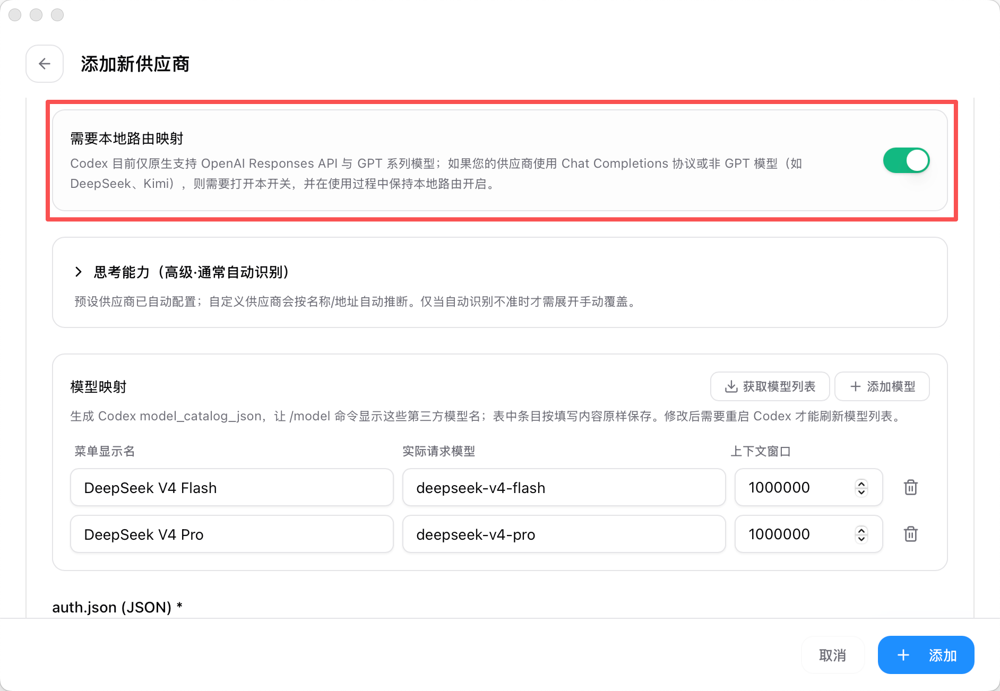  
此时还需要开启<font color="#FF00FF">本地路由</font>,进入CC Switch的设置->路由->路由总开关->codex  
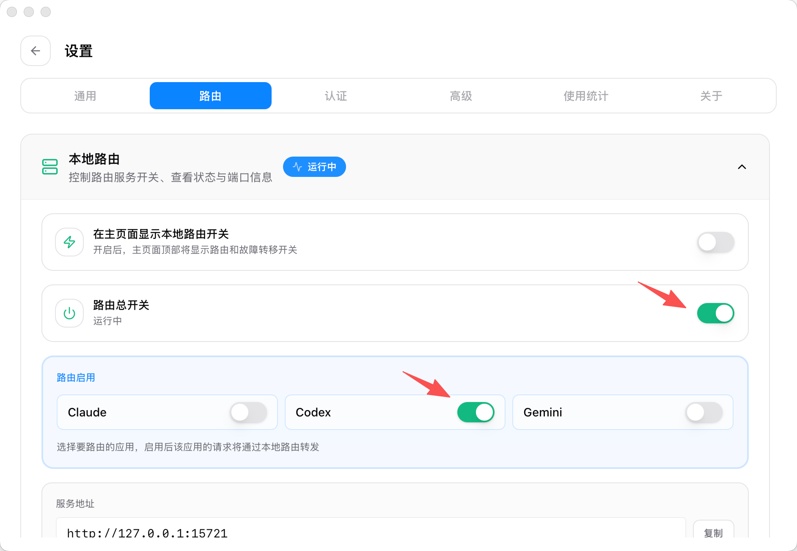  
此时进入codexcli与之对话,可以发现正常回显内容,如果没有开启本地路由则会报错404  
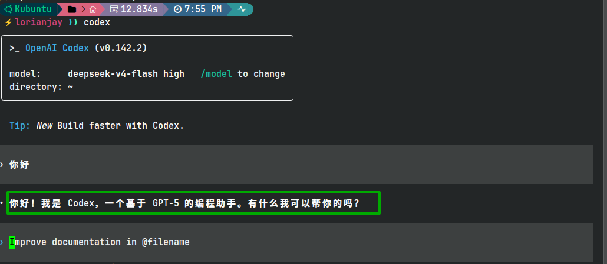
<font color="#00FF00">此时若使用codex就不需要再重新配置了,它和CLI版本共用`~/.codex`下的配置</font>  


#### 1.3.4 其它主流CLI  
1.Gemini CLI  

2.Warp  

3.GitHub Copilot CLI  

4.OpenCode  

#### 1.3.5 CodeX CLI
1.介绍  
openAI家的AI编程工具其实是分为Codex和CodexCLI两个的,不过目前codex(AI编程工具)只支持Windows和Macos,所以目前可以先使用CodeXCLI  

2.安装  
直接通过CC Switch来安装也是十分方便的  
执行命令`npm install -g @openai/codex`

3.更新  
更新的命令和安装的命令一样`npm install -g @openai/codex`  

4.卸载  
因为是使用npm安装的,所以卸载的时候就按照npm来卸载,执行命令`sudo npm uninstall -g @openai/codex`  

#### 1.3.6 React Ink  
1.介绍
[React Ink](https://github.com/vadimdemedes/ink)是一个开源的项目,该项目将传统的React代码渲染为浏览器页面的逻辑改变为,使用同样的React组件最终渲染成终​端界面CLI,所以这个项目本身和AI没有太大关系,而是用于开发CLI的一款组件  


#### 1.3.7 飞书CLI  
1.基本介绍  
[飞书CLI](https://github.com/larksuite/cli)这个项目实际上是*1.3.1 命令行编辑工具和AI代码编辑器的区别->OpenCLI*的一个商业落地项目,飞书CLI允许你一行命令直接直接操作飞书的消息、日历、文档等功能<font color="#00FF00">也就是说各家应用目前的趋势是产品CLI化,关键是产品CLI化之后可以很方便地被各种AI Agent工具接入</font>,所以有一句话叫以前产品之间的互通​靠API,现在AI时代<font color="#FF00FF">产品和AI之间的互通靠CLI</font>  

2.CLI和MCP的区别  
貌似看起来只要各家开放自已的MCP,AI Agent一样可以接入各家的产品,但为什么还需要CLI化呢?
MCP协议要求把‍所有工具的名称和参数格式全部注入到AI的上下文里,工具一多 Toke⁡n 消耗就很夸张;有机构做过基准测试​同样的任务,MCP的Token消耗可能是CLI的几十倍!  
而且MCP的运行过程对人类来说就像个黑盒,出了问题很难排查;C⁡LI就不一样了,如果出错​了,直接把命令复制到终端里跑一遍,报错信息一目了然  

#### 1.3.8 OpenCode  
1.介绍  
https://ai.codefather.cn/library/2010974686341959682  


### 1.4 AI IDE插件  
**目录:**  
1.4.1 Cline
1.4.2 Claude Code VS Code  
1.4.3 GitHub Copilot  
1.4.4 JetBrains相关  
1.4.5 Continue  

#### 1.4.1 Cline
[Cline](https://github.com/cline/cline)是一个开源的AI编程插件,优势在于支持各种IDE以及各种大模型,功能上最接近Cursor,该插件广受好评  
直接去各大IDE里面安装这个插件,然后按步骤使用即可  

2.Claude Code VS Code  
这是Claude Code官方推出的VS Code的插件  

#### 1.4.3 GitHub Copilot  
1.介绍    
GitHub官方推出的插件,已经十分成熟,该插件需要付费,学生和开源贡献者可以免费使用  
GitHub Copilot现在已经是vscode默认安装的插件了,该插件和Vscode集成度是最好的  

2.对话  
直接在vscode搜索框的右上角点击打开聊天就可以对话了  
对话框区域有一个智能体选择器,可以在3种内置模式之间切换:  
* Agent全自主模式:AI自己分析、写代码、跑命令,一条龙完成任务(用的最多)
* Plan规划模式:AI先出方案再动手,适合复杂任务
* Ask纯问答模式:只回答问题,不改代码,适合探索和学习

3.申请学生认证  
https://education.github.com/pack  


#### 1.4.4 JetBrains
1.插件介绍    
* JetBrains AI Assistant是JetBrains官方推出的AI编程助手,专门为JetBrains IDE优化,不过这个插件貌似不是免费的  
* Junie是JetBrains官方推出的CLI编程助手,可以直接在控制台打开该助手
  该插件只支持只支持JetBrains系IDE,而且需要改账号地区才能用,其实不是很热门
* Cline
* 通义灵码

2.通过ACP协议接入AI  
ACP就是‍一套标准规范,让各种AI编程Agent能够统一接入不同的IDE,不管是Cla⁡ude Code还是Gemini CLI​,只要支持ACP协议,就能在JetBrains IDE里一键安装使用  
下载JetBrains AI Assistant之后,点击IDE右侧的AI对话按钮,展开对话框之后会有一个添加ACP Agent的按钮,在展开的界面就可以看到各种Agent,Claude Agent、Gemini⁡ CLI、Codex、Cursor、GitH​ub Copilot、Cline  

#### 1.4.5 Continue    
[Continue](https://github.com/continuedev/continue)是开源的AI编程插件,功能和Cline类似但更轻量;支持多种AI模型,有代码补全、对话、代码编辑等功能,界面比较简洁,上手容易;完全免费,支持VS Code和JetBrains  


### 1.5 其它AI工具  
**目录:**  
1.5.1 OpenClaw  
1.5.2 Superpowers  
1.5.3 Dify  
1.5.4 Hermes Agent  

#### 1.5.1 OpenClaw  
1.基本介绍  
一个AI助手  

2.安装教程  
参考[官网](https://openclaw.ai/),执行命令`curl -fsSL https://openclaw.ai/install.sh | bash`  
安装成功后,控制台显示以下内容  
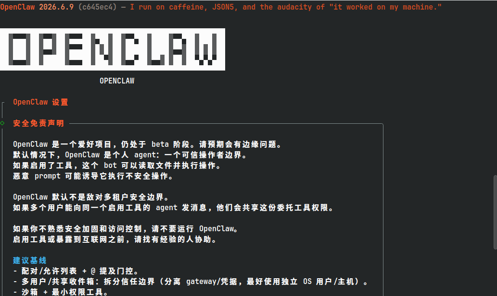  

3.配置OpenClaw  
3.1 设置模式选择QuickStart  

3.2 选择模型,选择合适的模型,国产大模型在更多里面  

3.3 然后基本上就是看提示安装  

4.pinchbench
[pinchbench](https://pinchbench.com/)这个网站用于测试各家大模型在OpenClaw场景下的实际表现  

5.openclaw相关命令  
* `openclaw gateway run`启动openclaw的网关  
* `openclaw gateway stop`关闭openclaw的网关
* `openclaw gateway status`查看网关状态
* `openclaw dashboard` 启动openclaw
* `systemctl --user stop openclaw-gateway.service`正确关闭openclaw的方式
* `openclaw uninstall`卸载openclaw

6.卸载openclaw  
可以使用下面这些命令,最好还是用docker装这玩意吧,太恶心了  
```shell
openclaw gateway stop
openclaw gateway uninstall
rm -rf "${OPENCLAW_STATE_DIR:-$HOME/.openclaw}"
npm rm -g openclaw || pnpm remove -g openclaw
```

#### 1.5.2 Superpowers  
参考:https://ai.codefather.cn/library/2013071650580447233  

#### 1.5.3 Dify  
1.基本介绍  
[Dify](https://github.com/langgenius/dify/)是一个专门用来开发AI应用的零代码平台,Dify专注于AI应用比如:智能客服机器人、知识库问答系统、AI 写作助手
、文档分析工具、AI工作流自动化  
Dify提供‍了可视化的配置界面,你可以通过拖拽的方式搭建AI工作⁡流,配置大模型、设置提示词、​添加知识库等,不需要写代码就能做出功能强大的AI应用  
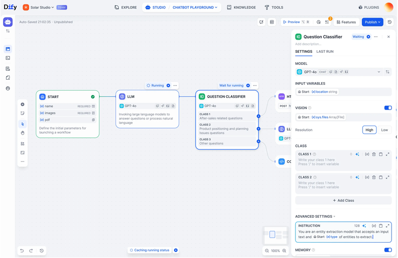  

2.教程  
参考:https://ai.codefather.cn/library/2010974684882341890  


#### 1.5.4 Hermes Agent
1.介绍  
Hermes Age‍nt也是现在最流行的Agent产品之一,跟OpenClaw属于同一类⁡产品,但是它跟OpenClaw最大的区​别在于它有<font color="#00FF00">自进化能力</font>,每次解决问题后会自动生成可复用的技能,越用越聪明  
这个东西只能说能用,真要做正儿八经的项目,稳定性远不如专业AI编程工具,要做完整项目的⁡话,大概率还是得用Cursor或者Clau​de Code来接管  


### 1.6 AgentSkills  
1.基本介绍  
Agent Skills是Anthropic新推出的AI技能系统,简单来说就是提前写好一些prompt提示词并将其封装打包为一组markdkwon文档,然后你要使用某个功能的时候就直接用该技能(markdown)传递给AI  
目前Skills已经成为通用标准,也就是说不仅仅是Claude,其他的软件例如Cursor等主流编程软件都会陆续开始支持  
<font color="#00FF00">Skills的特点是AI可以自动识别该用什么技能,不需要你显式调用</font>  

2.安装教程  
2.1 安装AgentSkills  
打开Claude Code输入以下命令`/plugin marketplace add anthropics/skills`  
输入`/plugin`,通过Tab键切换到Marketplaces界面,批量安装官方提供的Skills  
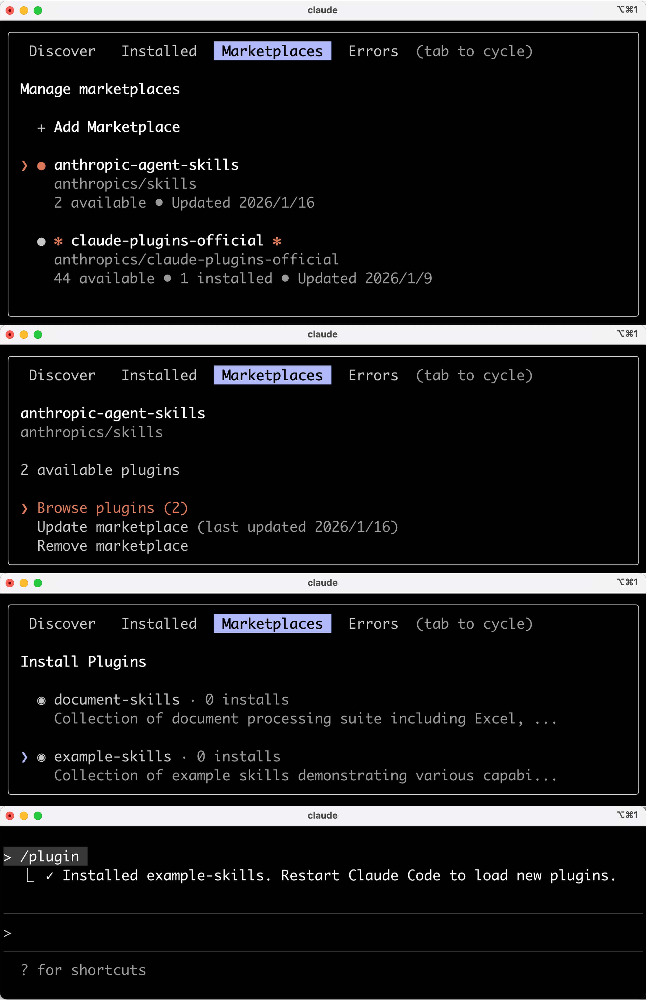  
安装完毕之后输入`/skills`就可以看到已经完成安装的技能了  
可以在本地‍找到Skills的安装位置,你会发现⁡SKills的本​质就是一组封装好的提示词文档+脚本文件等
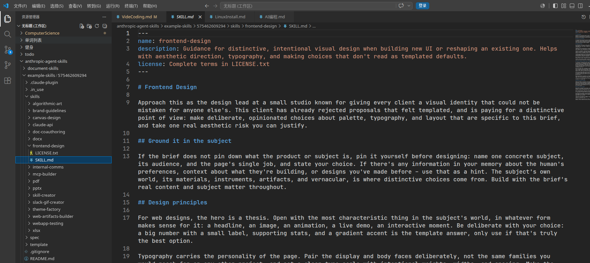  
*提示:这里的路径在/~/.claude/plugins/cache/anthropic-agent-skills*

2.2 使用Skills  
安装完‍SKills后,你只需要和之前一样跟⁡AI对话,程序会​自动根据你的任务选择使用什么 Skills,如下图所示  
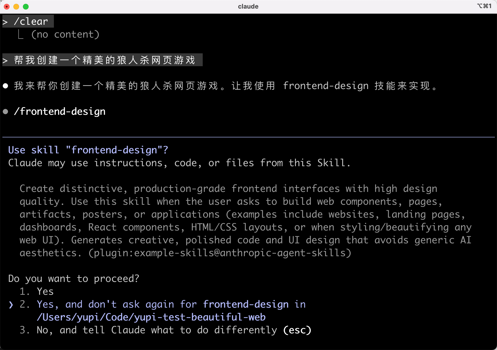  

2.3 Skills技能仓库  
* [Anthropic官方技能仓库](https://github.com/anthropics/skills/tree/main)
* [鱼皮](https://ai.codefather.cn/skills)
* [Claude Skills Hub社区技能市场](https://www.claudeskill.site/en)
* [SkillsMP](https://skillsmp.com/zh):这个仓库会自动抓取GitHub上所有Skills项目,并且按照分类、更新时间、Star 数量整理
* [MCPmarket](https://mcpmarket.com/zh/daily/skills):每日skills排行榜
* [awesome-claude-skills](https://github.com/ComposioHQ/awesome-claude-skills):Skills精选列表,收录了各种类型的Skills,分类清晰是目前最全的Skills合集之一
* [openai/skills](https://github.com/openai/skills):OpenAI官方的Codex Skills目录;可以通过Codex内置的`$skill-installer`命令一键安装,让Codex在特定任务上表现更专业
* [obsidian-skills](https://github.com/kepano/obsidian-skills):Obsidian出品的Skills集合

3.Skills安装管理工具  
skills CLI:Vercel官方出品的命令行工具,一行命令就能安装任何Skills,简单好用  
[参考官网教程](https://www.npmjs.com/package/skills)  

3.1 安装Vercel的官方skills
使用`npx skills add vercel-labs/agent-skills`命令来安装Vercel的官方skills

3.2 快速查找skills  
执行`npx skills find`命令来搜索你需要的技能,下图是anthropics官方的用来帮助你创建skill的skill  
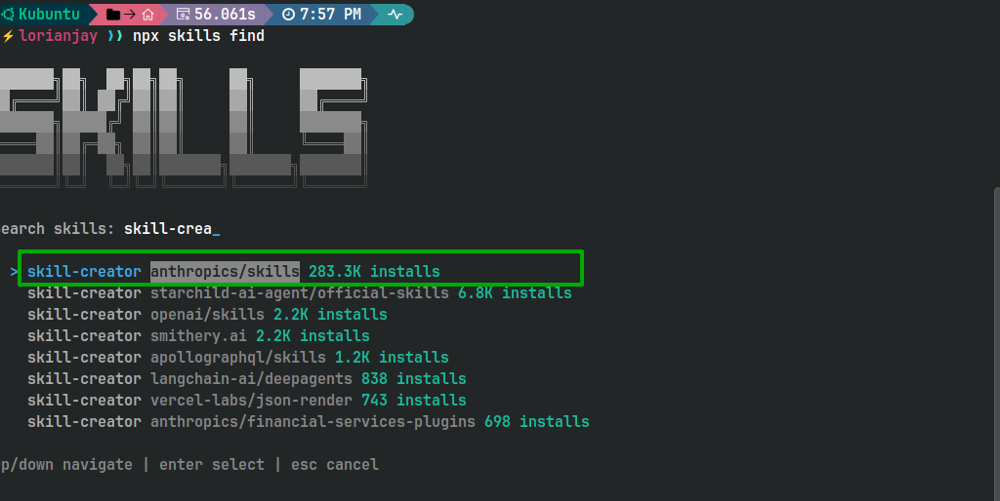  

3.3 安装查询到的skill  
在3.2查询到对应的skill的全地址为`anthropics/skills`复制该地址并执行命令`npx skills add anthropics/skills`在命令的最后填入对应的地址,然后执行  

4.Skills排行榜  
[Vercel官方出品的Skills排行榜](https://www.skills.sh/)  

5.项目开发skills  
* [superpowers](https://github.com/obra/superpowers):一套完整的AI编程技能框架和软件开发方法论;它包含十几个可组合的编程技能,比如头脑风暴、编写计划、执行计划、TDD 测试驱动开发、系统性调试、代码审查等
* [planning-with-files](https://github.com/OthmanAdi/planning-with-files)
* [ui-ux-pro-max](https://github.com/nextlevelbuilder/ui-ux-pro-max-skill):专业前端设计Skill,让AI Agent具备专业设计师的能力
* vercel-react-best-practices:Vercel出品的React最佳实践,让AI按照React官方推荐的模式来写代码,包括组件设计、状态管理、性能优化等规范,避免写出反模式的代码\
  执行`npx skills add vercel-labs/agent-skills`命令来安装该skill
* [vue-skills](https://github.com/vuejs-ai/skills):让AI按照Vue生态的最佳实践来写代码
* [supabase-postgres-best-practices](https://github.com/supabase/agent-skills):Supabase出品的PostgreSQL数据库最佳实践,教AI Agent怎么写出高质量的数据库代码,包括查询优化、索引设计等
* [browser-use](https://github.com/browser-use/browser-use):让AI Agent能访问和操作网站的工具(不仅是Skill,也可以独立使用),功能强大可以用来做自动化测试、数据抓取、网页操作等
* [agent-browser](https://github.com/vercel-labs/agent-browser):Vercel出品的浏览器自动化Skill,让AI Agent能操作浏览器;比如可以自动填表单、点击按钮、截图、抓取动态渲染的内容等,非常适合做端到端测试、自动化爬虫、网页监控等场景

6.SKILL.MD分析  
这里以frontend-design为例,分析SKILL.MD的文件结构,SKILL.MD由元数据和指令内容两个部分构成  

6.1 元数据  
元数据以YAML格式写在文件开头  
```yaml
---
name: frontend-design
description: 生成具有专业设计感的前端代码，避免千篇一律的 AI 审美
---
# name是技能的名字
# description:是技能的描述,告诉AI什么时候应该使用这个技能;描述写得越清晰,AI就越容易在合适的时机调用它
```

6.2 指令内容  
它是一套经过精心设计的提示词,指导AI具体怎么做,以frontend-design技能为例,它的指令内容包括  
* 设计思考:在写代码前,先分析产品目的、用户群体、技术约束,然后选择一个大胆的美学方向(极简、复古未来、工业风、有机自然、奢华精致等)
* 前端美学指南:包括字体选择(避免 Arial、Inter 等烂大街字体,选择有个性的组合)、配色主题(主色调配鲜明点缀色)、动效设计、空间构成、背景和视觉细节
* 避坑指南:明确禁止紫色渐变、系统字体、千篇一律的布局等AI审美陷阱


### 1.7 跨编辑器通用工具  
**目录:**  
1.7.1 Spec-kit规范驱动开发  
1.7.2 OpenSpec轻量规范框架  
1.7.3 AIChat命令行增强工具  

#### 1.7.1 Spec-kit规范驱动开发
1.介绍  
规范驱动开发的思路:先把需求写成规范文档,并且把规范文档当作代码的唯一真相来源;你可以把规范文档理解为法律条文,它包含了详细的需求描述、系统设计和接口定义;AI必须严格遵守这些条文来生成代码,确保产出完全符合预期  

2.实战  
参考https://ai.codefather.cn/library/2013071149038157826  

3.流程总结  
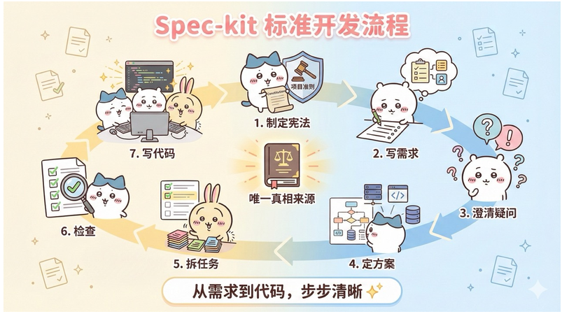  

#### 1.7.2 OpenSpec轻量规范框架  
1.介绍  
OpenSpec是一个轻量的规范驱动开发框架,比Spec-kit更简单易用,它的核心理念是把规范文档作为代码库的一部分,每次改功能都先写变更提案 => 确认后再实现 => 实现完再把变更归档到规范文档中,让文档和代码始终保持同步  
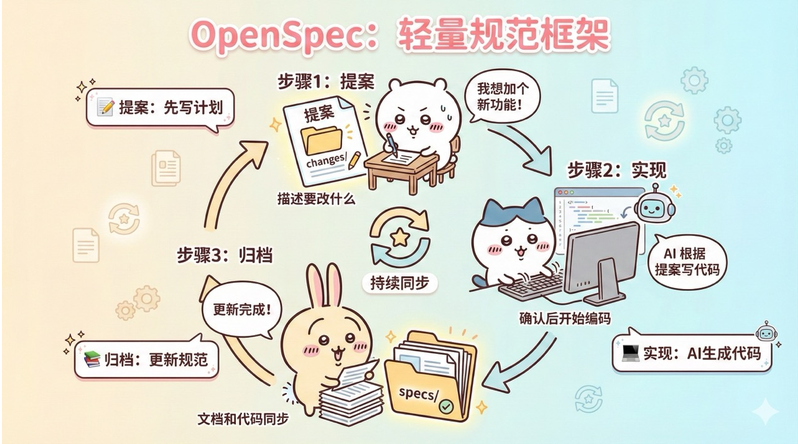  

2.实战  
参考https://ai.codefather.cn/library/2013071149038157826  

#### 1.7.3 AIChat命令行增强工具  
1.介绍  
这个工具有一个Shell助手,他能够把你的自然语言自动转换成准确可执行的命令  
除了Shell助手,AIChat还有一些进阶功能;比如支持RAG检索增强生成⁡,可以让AI基于你的本地文档回​答问题;支持创建AI代理,把指令、工具和文档组合成自动化工作流  

### 1.8 Git WorkTree  
1.介绍  
并行Agent的底‍层其实依赖Git WorkTree(工作树)技术,WorkTree可以让一个仓库同时⁡拥有多个独立的工作目录,每个目录对应不同的分​支,让多个AI各自在独立的文件夹里干活,互不干扰,开发完再用Git合并代码  


## 2.Vibe Coding实战  
**目录:**  
2.1 Claude Code实战  
2.4 Vibe Coding幻觉和死循环处理  
2.5 Vibe Coding效率提升技巧  


### 2.4 Vibe Coding幻觉和死循环处理
1.介绍  
AI幻觉‍指的是AI生成的内容看起来很有道⁡理,但实际上是错误​的、不存在的,或者不符合事实的,比如:编造不存在的API或函数、给出看似合理但实际无法运行的代码、坚持使用已经被证明错误的方案、混淆不同技术栈的用法  

AI死循环指的‍是AI反复尝试同一个错误的方案,⁡无法自己跳出来,比如:
第一次:AI给你一段代码,但有bug
第二次:你告诉它有问题,它改了一下,但还是同样的问题
第三次:你再次指出问题,它又改了一下,但还是在同一个地方打转  

2.切断上下文  
当AI陷入死循环或产生严重幻觉时,最有效的⁡方法就是切断上下文,重​新开始;切断上下文‍相当于给AI一个重启的机会,让它⁡从干净的状态开始  

### 2.5 Vibe Coding效率提升技巧  
1.避免让AI生成多余内容  
比如之前用Claude code写一个简单的Java程序,写了一大堆文档、测试、甚至直接编译了最终的结果,实际上这些都是不需要的,所以必须在提示词‍中明确告诉AI:<font color="#00FF00">只给我核心代码，不⁡要写注释、文档、测​试，不要做总结</font>,这样也能帮助节省token(money)  

2.SubAgents-子Agent并行加速  
现在主流的AI编‍程工具(Claude Code、Cursor、Codex)都支持SubAgen⁡ts子代理能力了,可以让AI把一个​大任务拆成多个独立的小任务,同时派出多个分身并行处理,大幅缩短完成时间  
Claude Co‍de可以自动识别哪些子任务是独立的,然后分派子Agent并行⁡处理,每个子Agent有自己独立​的上下文空间,完成后只把结果摘要返回给主会话,保持主对话的整洁,你不需要手‍动配置,只要在提示词中暗示任务可以并⁡行,Claude​就会自动派出子Agent  
```markdown
修复src/目录下所有文件的lint错误,这些文件相互独立,可以并行处理
```
也可以通过`/batch`命令主动触发大规模并行,比如:  
```markdown
/batch 把所有 API 调用从 v1 迁移到 v2 格式
```
Claud‍e会自动拆分成5~30个独⁡立任务,每个在自己​的工作树中运行并提交PR  


