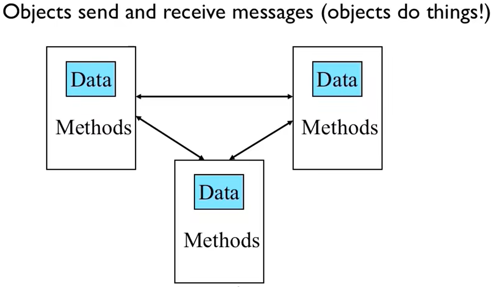
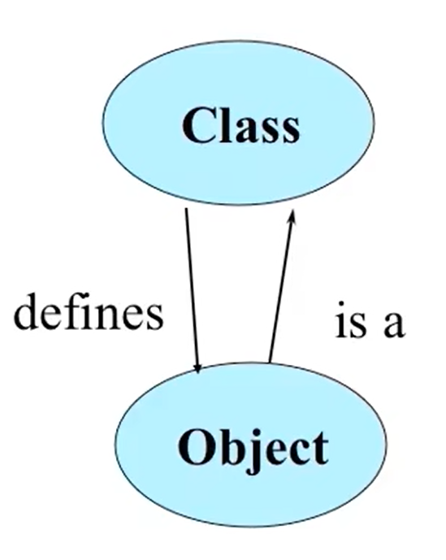
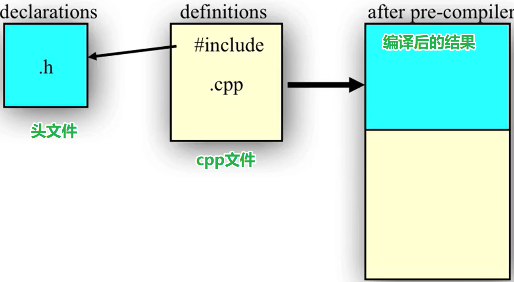
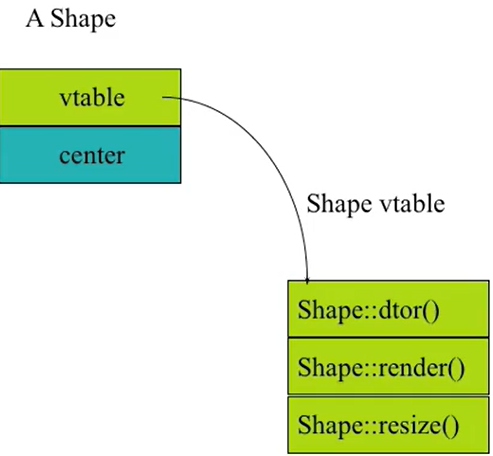

# C++语言  
**目录:**  
1.面向对象
2.类、对象  
3.函数  
4.成员  
5.继承、多态、重载  
6.运算符重载  

## 1.面向对象  
**目录:**  
1.1 C++概述  
1.2 面向对象  
1.3 对象之间的交互  

### 1.1 C++概述  

1.第一个C++程序  
```c++
#include <iostream>
using namespace std;

int main() {
  /*
  在C++中 << 依旧表示左移
  所以这段代码的意思是把"Hello, World!" << 18 << "Today!" 这个东西输出到cout中
  而 << endl的意思是把endl输出到前面字符串的末尾
  */
  cout << "Hello, World!! I'am" << 18 << "Today!" << endl;
  return 0;
}
```

2.标准输入与输出  
C语言中`cout`就是标准输出,`cin`就是标准输入,而且输入的时候直接使用`>>`即可,不需要再像C一样使用`&`  
```c++
#include <iostream>
using namespace std;
int main() {
    int number;
    cout << "Enter a number:";
    cin >> number;
    cout << "The number is:" << number << endl;
    return 0;
}
```

### 1.2 面向对象  
1.什么是对象  
<font color="#00FF00">对象=属性+服务</font>  
进一步,属性就是配置或状态;服务就是函数  
面向对象的准则是:聚焦于事物而不是操作  

2.C++与C的区别  
C++的类就类似于C中的结构体,但是C的结构体中只有数据,而C++除了有数据之外还拥有操作(服务)  

3.OOP的三大原则  
<font color="#FF00FF">封装、继承、多态</font>  

### 1.3 对象之间的交互  
1.对象之间交互的概念图  
  

2.对象发送消息  
* 消息
  * 被发送者组织
  * 被接受者解释
  * 被方法实现
* 消息
  * 可能导致接受者改变状态
  * 可能返回结果

3.对象和类  
* 对象
  * 代表事物、事件、观念
  * 在运行时响应消息
* 类
  * 定义了实体的属性
  * 行为类似类型

  

4.OOP的准则  
* 一切都是东西
* 是互相之间以发送消息的方式告诉别人要做什么的一堆对象就是程序
* 每一个对象有它自已的内存,在这段内存中又是由其它对象所组成(对象里面依旧是对象)
* 每一个对象有一个类型(反着说,对象是类的实例化)
* 一个特定类型的所有对象可以接收相同的消息

5.接口  
* 一个对象有一个接口
* 接口是接收消息的一种方式
* 它在该对象所属的类中定义

接口的函数,起到如下作用:
* 通讯
* 保护
* <font color="#00FF00">隐藏实现</font>


## 2.类、对象  
**目录:**  
2.1 自动售票机例子  
2.2 头文件  
2.3 动态创建和删除对象  
2.4 命名空间  
2.5 string  
2.6 const  
2.7 引用  
2.8 拷贝构造  

### 2.1 自动售票机例子  
1.创建类  
在CLion中创建一个C++类之后会产生如下两个文件  
  
<font color="#00FF00">每一个类都应该有这样的两个文件,一个是.h头文件,一个是.cpp文件</font>  

文件内容如下:
```c++
// TicketMechine.h
#ifndef CPLUSLEAR_TICKETMACHINE_H
#define CPLUSLEAR_TICKETMACHINE_H


class TicketMachine {

};


#endif //CPLUSLEAR_TICKETMACHINE_H
// TicketMechine.cpp
#include "TicketMachine.h"
```

2.编写相关代码  
*TicketMechine.h内容如下:*  
```c++
/*
#ifndef的优先级很高,如果在这个if判断之前已经定义过CPLUSLEAR_TICKETMACHINE_H
则直到#endif之间的所有代码都不会生成
所以当出现#ifndef的时候,第一步应该是先找到#endif
然后在这中间出现的任何语句都不要管,只看if指定的条件是否能满足
那这个有什么作用呢?详情见10.2.2 类的定义->6.防止重复include
*/
#ifndef CPLUSLEAR_TICKETMACHINE_H
#define CPLUSLEAR_TICKETMACHINE_H

class TicketMachine {
public:
    // 构造函数
    TicketMachine();

    // 析构函数
    virtual ~TicketMachine();

    void showPrompt();

    void insertMoney(int money);

    void showBalance();

    void printTicket();

    void showTotal();

private:
    const int PRICE;
    int balance;
    int total;
};

#endif //CPLUSLEAR_TICKETMACHINE_H
```

*TicketMechine.cpp内容如下:*  
```c++
#include "TicketMachine.h"

#include <iostream>

using namespace std;
// 构造函数
TicketMachine::TicketMachine() : PRICE(0) {

}

TicketMachine::~TicketMachine() {

}

void TicketMachine::showPrompt() {
    cout << "something";
}


void TicketMachine::insertMoney(int money) {
    balance += money;
}

void TicketMachine::showBalance() {
    cout << balance;
}
```

*main.cpp内容如下:*  
```c++
#include <iostream>
#include "TicketMachine.h"

using namespace std;

int main() {
  /*
  C++需要在main函数中执行相关内容
  注意:这里并没有做任何其余操作,是直接声明了一个TicketMachine
  */ 
  TicketMachine ticketMachine;
  ticketMachine.insertMoney(100);
  ticketMachine.showBalance();
  return 0;
}
```

3.解析符  
上述代码中,每一个TicketMachine后面都紧接着两个`::`;<font color="#00FF00">这两个冒号就称为域的解析符</font>  
把上述代码稍微改一下  
```c++
int val = 100;

void TicketMachine::showPrompt() {
    int val = 200;
    cout << "全局变量:" << ::val;
    cout << "局部变量:" val;
    // 调用全局函数
    ::printf();
}
```
`::`前面不加任何内容代表使用全局变量,否则默认使用局部变量;<font color="#00FF00">这就类似Java中的this关键字</font>  


### 2.2 类的定义  
1.两个文件  
在C++中定义一个类会生成两个文件,一个是.h文件一个是.cpp文件  
<font color="#FF00FF">类的声明和函数原型全部存放于.h头文件中;这些声明与原型的所有body(定义)放到cpp中</font>  
*简单总结就是:*  
.h->声明  
.cpp->定义  

2.include问题  
所有用到这个类的地方以及定义(实现)该类所有声明内容的地方(.cpp文件)都需要include该头文件  
在10.2.1的例子当中,main.cpp和TicketMachine.cpp都有`include "TicketMachine.h"` 引入了该头文件  
当一个头文件使用了别的类时,又需要在该头文件中`include`别的头文件(头文件include头文件)  

3.include的本质  
include的本质是文本的插入,假如现在有两个文件  
```c++
// a.h
void f();
int global;

// a.cpp
#include "a.h"
int main() {
  return 0;
}
```
include的本质是它会把对应的头文件完整插入到使用`include`的文件头部(即插入到这里的a.cpp文件)  
  
所以在编译之后,C++本质上会将a.h和a.cpp形成一个文件然后再进行整体编译  

现在要再编写一个文件b.cpp:
```c++
#include "a.h"
// 定义(定义≠声明)了f函数的body
void f() {

}
```
*现在问题来了,假设现在编译的时候,将a.cpp和b.cpp编译到同一个文件中,此时就会报错,报错为重复定义了变量`_globel`*  

**解释:**  
原因是,a.h中的f()函数确实是一个声明,但global变量是一个变量(它是定义),所以a.cpp和b.cpp都将`int global`插入到自已的头部,并且希望编译到一个文件中时,就会产生重复定义变量的错误  

4.全局变量的定义  
为了解决上述3.的问题,可以使用`extern`关键字修饰global  
**解释:**  
<font color="#00FF00">C++中extern关键字的使用和C语言一致,可以参考4.5.5 extern变量;用extern修饰的变量,其本质是告知编译器一定有这个变量在某个地方(可能是在别的文件中(即跨文件使用)、也可能是在当前文件但在这条语句之后(即变量的定义在当前文件的靠后部分)),所以extern是声明存在一个变量,具体在哪不知道</font>  
同时b.cpp需要定义这个global,即有相应的<font color="#FF00FF">声明</font>就需要相应的<font color="#FF00FF">定义</font>(不管是函数还是变量)  

```c++
// a.h global 此时是一个声明
void f();
extern int global;
// b.cpp
#include "a.h"
// 定义该变量
int global;
void f() {
  global++;
}
```
此时再次编译a.cpp和b.cpp,现在`int global;`只在b.cpp中定义了一次,虽然`extern int global;`会被定义两次,但这种语句执行两次是没有什么问题的,即可以重复定义  

5.声明文件.h注意事项  
* 一个.cpp文件是一个编译的单元(以.cpp为单元进行编译)
* 在.h文件中只允许定义如下内容(不允许在头文件中放定义)
  * 被`extern`关键字修饰的变量
  * 函数的原型
  * 类的声明

6.防止重复include
在上述10.2.1 自动售票机例子 ->2.编写相关代码中,当时说到过有`#ifdefn`的判断条件`CPLUSLEAR_TICKETMACHINE_H`,那它有什么作用?  
一句话总结:<font color="#FF00FF">防止循环include重复定义(类似Java的循环依赖)</font>  

```c++
// main.cpp
#include "a.h"
#include "b.h"
int main() {
  return 0;
}

// a.h-只有声明
void f();
extern int global;
class A {};

// b.h
/*
b.h中引用了a.h,因为b.h可能有一个extern的A的变量,这很正常
*/
#include "a.h"
extern A a;
```
- - -
此时编译main.cpp发现报错,他说class A被重复定义了,好现在一步步分析  
之前说过include的本质是将头文件的内容添加到cpp的最开头,所以按照这里的顺序,main.cpp在编译期间处理include之后的内容应当如下  
```c++
// #include "a.h"
void f();
extern int global;
class A {};
// #include "b.h"
/*
在C++中函数声明f和全局变量global重复定义是没有问题的
但是类不可以重复定义,所以这里的类A被定义了两次
*/
void f();
extern int global;
class A {};
extern A a;

int main() {
  return 0;
}
```
- - -
于是乎为了解决上述的<font color="#00FF00">循环include问题</font>,此时来使用`CPLUSLEAR_TICKETMACHINE_H`  
```c++
// main.cpp
#include "a.h"
#include "b.h"
int main() {
  return 0;
}

// a.h-只有声明
#ifndef CPLUSLEAR_TICKETMACHINE_H
#define CPLUSLEAR_TICKETMACHINE_H

void f();
extern int global;
class A {};
#endif
// b.h
/*
b.h中引用了a.h,因为b.h可能有一个extern的A的变量,这很正常
*/
#include "a.h"
extern A a;
```
此时再次编译不会报错,为什么呢?因为在main中第一次include a.h的时候因为还没有定义`CPLUSLEAR_TICKETMACHINE_H`所以a.h中的所有内容会被加入到main.cpp的头部,并且还定义了`CPLUSLEAR_TICKETMACHINE_H`宏;<font color="#00FF00">然后在include b.h的过程中include a.h,此时由于已经定义过了宏变量,所以在b.h中include的a.h的#ifndef条件判断失败,于是乎b.h的#include "a.h"这句并不会真正产生任何代码</font>  

### 2.3 动态创建和删除对象  
1.使用格式  
C++中使用`new`和`delete`关键字来动态创建和回收对象,类似C中的`malloc`和`free`  
`new`关键字返回的是指向创建的新空间的内存地址的指针(地址)  
* new 
  * new int
  * new Statsh
  * new int[10]
  * new Statsh[10]
* delete
  * delete p -> new的时候不带[]时使用
  * delete []p -> new的时候带[]时使用

2.动态数组示例  
```c++
int main() {
    // new返回的是一个指针
    int *arr = new int[10];
    // 释放数组
    delete []arr;
    return 0;
}
```
如果delete不加[]回收一个数组的时候,它依旧会回收该数组的空间,但<font color="#00FF00">只有第一个元素的析构函数会被调用</font>,带着[]的时候会把数组所有对象的析构函数都调用一遍  

3.new的过程  
```c++
int *p = new int;
int *a = new int[10];
Student *q = new Student();
Student *r = new Student()[10];
```
使用new关键字时会在堆空间中寻找一个大小为4字节的空间,然后会有一张表记录程序申请了这块内存,这项记录会记录两条内容,一条是这块内容的地址,一条是这块内存的大小  
对于int[10]数组该表会记录,这块数组申请的内存大小为40字节,以及这块数组的地址  

4.delete的过程  
```c++
/*
当`delete p`的时候会在这张表里面寻找p所对应的那一项
然后回收对应的内存并将表中对应的记录删除  
*/
delete p;
// 这句会报错,因为先进行了a++,然后删除a的时候会找不到对应的地址
a++;delete []a;
// 在删除q之前会先调用q的析构函数
delete q;
/*
如果执行下面的方法,则会调用r的第一个元素的析构函数
然后把数组r的10个空间全部收回(空间会全部收回)
*/
delete r;
/*
如果执行下面的方法,则会调用r所有元素的析构函数
然后把数组r的10个空间全部收回
*/
delete []r;
// 通过sizeof(r) / sizeof(*r)来确定数组有多少个元素
```

5.注意事项  
* 不要用delete去释放不是被new创建的空间
* 不要用delete去两次释放同一个空间
* 如果使用了new[]就要用delete[]
* 如果没有使用new[]就不要使用delete[]
* delete一个null指针的行为是安全的

### 2.4 命名空间  
1.什么是命名空间  
在10.1.1 C++概述的例子中,在代码的最开头使用了`using namespace std;`这条语句,如果删除这条语句会发现,代码中的cout和endl产生了报错  
C++这么设计的目的是为了做函数区分,假设程序员自已编写了一个count函数,而C++标准库也有一个count函数,当调用count函数时到底要调用哪个函数?此时编译器就无从下手  
<font color="#00FF00">所以命名空间的本质是给名字进行分组</font>  

2.std是什么  
所以现在的解决方案是在`cout`和`endl`的前面加上`std::count`这种才是标准的写法,在C++中调用函数,应该按照`命名空间::函数名`来调用  
<font color="#FF00FF">所以std本质上是C++标准库的命名空间</font>  

3.using namespace std的意义  
```c++
using namespace std;

cout << "Hello";
string s;
```
使用了`using namespace std`语句,表示接下来所写的代码默认都在std里面寻找  
所以`using namespace std`并不推荐使用,它会污染命名空间,容易撞名  

### 2.5 string  
1.什么是std::string  
`std::string`就类似Java中的字符串,它是一个对象  
相比于字符串数组,string的优势如下  
* 自动计算字符串长度
* 不需要关心'\0'
* 不需要关心内存释放

2.std::string的初始化操作  
```c++
// 空字符串
string s1;            
// 初始化 
string s2 = "hello";   
// 另一种写法(相当于调用构造函数)
string s3("world");    
```

3.std::string的一些操作  
```c++
#include <string>
using namespace std;
// 字符串拼接
string s = "hello";
s = s + " world";
// 字符串长度
s.length();
// 访问单个字符
s[0]
// 判断是否为空
if (s.empty()) {
    cout << "empty";
}
```

4.C++中的字符串  
```c++
int main() {
  // 如果在C++中你依旧这么执行,则它会告诉你
  // ISO C++ forbids converting a string constant to 'char*'
  // ISO C++ 禁止将字符串常量转换为“char*”
  char *s = "hello world";
  // 这一步会报错
  s[0] = 'a';
  // 不会报错,因为这里会把Hello world拷贝到堆空间
  char arr[] = "hello world";
  arr[0] = 'b';
  return 0;
}
```
这里解释起来也比较麻烦,详情可见P19(温凯C++)  
所以这两个字符串的定义方式并不一样  

### 2.6 const  
1.const的几种用法  
* `const int a = 10;` 该常量在作用域范围内不能修改
* `const int bufsize = 1024;` 该常量必须在编译时刻知道具体的值
* `extern const int bufsize;`
  加上extern该变量只是声明该变量,在某个地方存在一个bufsize,只是说在当前文件这个bufsize它是一个常量(在当前文件不允许修改),至于这个变量是否真的是const是不一定的,只是编译器保证了它在当前作用域是不可修改的
* 下面这段代码会报错,因为之前在C就说过,数组的大小不能是变量(常量变量也是不可以的)
  ```c++
  int x ;
  cin >> x;
  const int size = x;
  int arr[size];// error
  ```
2.const与指针  
const与指针又分为两种情况
* 指针本身是const
  ```c++
  char * const q = "abc";
  q[0] = 'c';   // 正确
  q++;          // 错误
  ```
* 指针指向的变量是const  
  ```c++
  const char *p = "ABCD";
  p[0] = 'a';   // 错误
  ```

3.const与对象  
```c++
Person p1("JACK",20);
const Person* p = &p1;
Person const* p = &p1;
Person *const p = &p1;
const Person *const p = &p1;
// 如果在对象的前面加上const,表明这个对象内的值是不允许被修改的
// 这个在第6点还会讲
const Person p("Jack",20);
```
区分方法,如果`const`在`*`的前面则对象是const;如果`const`在`*`的后面则指针是const;前对象后指针(先说const,const在*的前/后)  
一二两个是对象是const,第三个指针是const,第四个指针和对象均是const  

4.const与函数入参/返回值  
```c++
// 入参
void f1(const int i){

}
// 返回值,当return加上const,则调用该函数的返回值不能修改值
class Dog {
public:
   const int* add(int x, int y);
};
// dog.cpp
const int *Dog::add(int x, int y) {
    int val = x + y;
    const int *result = &val;
    return result;
}
// main.cpp
int main() {
    Dog dog;
    /*
    当调用dog.add函数时,调用者必须用const int *val
    这个类型来接收,否则就会保证,这样就可以保证val指向的值不会被改变
    */
    const int *val = dog.add(1, 2);
    return 0;
}
```

5.const与函数与对象  
```c++
// 传入的Person对象不允许被修改
void f1(const Person *p){

}
```

6.成员函数和const  
`const Person p("Jack",20);`这段代码表明对象p是不可以被修改的  
所以此时就产生问题了,因为main.cpp使用include导入了类的声明,然后在main.cpp中使用`const Person p("Jack",20);`来创建了一个不可更改的对象,到这一步都没有问题;但是当调用p的某些函数时,某些函数是有可能修改p对象的  

所以此时在成员函数的声明处和成员函数的定义处加上了const,则<font color="#00FF00">表明该函数不会修改任何成员变量</font>,此时被const修饰的对象就可以执行这些被const修饰的函数  
```c++
// dog.h
class Dog {
public:
    inline void print();

    int add(int x, int y) const;
private:
    int val;
};
// dog.cpp
Dog::add(int x,int y) const {
  val++;    // 报错
}
/*
实际上上述函数的本意是this是const的
上述函数编译后等价于下面的内容,成员变量的访问是依靠this关键字
所以当函数后面加上const,本质上是this是const
*/
Dog::add(int x,int y) const {
  this -> val++;    
}
```
C++实现上述功能的本质为:<font color="#00FF00">限定this是const</font>  
- - -
*所以一段有意思的代码就来了*  
```c++
// dog.h
class Dog {
public:
    void print();

    void print() const;
};
// dog.cpp
void Dog::print() {
    cout << "normal print()" << endl;
}

void Dog::print() const {
    cout << "const print()" << endl;
}
/*
main.cpp
输出结果
normal print()
const print()
*/
int main() {
    Dog dog;
    dog.print();
    const Dog dog2;
    dog2.print();
    return 0;
}
```
首先这段代码能通过编译就很神奇,因为print貌似构成了重载?  
这一个结论是,对于同一个函数名,被const修饰的变量会调用被const修饰的函数,没有被const修饰的变量会调用未被const修饰的函数  
实际上这里确实构成了重载,dog.cpp被编译后的效果类似于  
函数的入参变量确实是不同的  
```c++
void Dog::print(A *this) {
    cout << "normal print()" << endl;
}

void Dog::print(const A *this) const {
    cout << "const print()" << endl;
}
```

### 2.7 引用  
1.解释  
C++中可以通过三种方式访问某个对象,分别是:变量本身、指针、引用
  

2.定义格式  
```c++
char c;
char *p = &c;
// 这个就是引用的定义方式
char &r = c;
```
`char &[引用变量] = [被引用变量]`  

3.引用的初始化和赋值  
局部变量引用必须初始化`char &[引用变量] = [被引用变量]`;因为引用的赋值和初始化的效果是不同的,<font color="#00FF00">所谓引用就可以视作变量的别名</font>,所以这里的r就视作c的别名;如果参数或成员变量是引用则可以不用初始化(参数的话是参数本身做初始化,成员变量是在初始化列表做初始化即创建对象时初始化)  
```c++
int x = 47;
int &y = x;
cout << "Y=" << y;      // 输出y=47
/*
这一步是引用赋值,它和引用初始化不同
当初始化完成后,所有使用y赋值的地方,本质上是对其引用变量进行赋值
所以这里实际上是对x进行赋值
*/
y = 18;
cout << "X=" << x;      // 输出x=47
```

4.const  
```c++
int x = 3;
int &y = x;
const int &z = x;

int read(const int *p) {
// 指针变量p指向的值在本函数内是不可更改的
}
// 上述函数等价于下面的这种写法
int read(const int &p) {

}
```
这里const的意思是,不能通过z对x进行修改,这就限制了变量的作用,x和y都是可读写的,而z是只读的,它的效果类似`const int *z = &x;`不可以通过指针z修改它指向的变量  
所以C++引入引用变量的本意就是不希望程序出现太多的`*`号  

5.引用和函数  
```c++
void f(int &x) {

}
int main() {
  int i = 3;
  /*
  这一步会编译报错
  因为必须有一个变量传入到该函数中,i*3是一个结果不能传入
  */
  f(i * 3);
}
int main() {
  int i = 3;
  i *= 3;
  // 这样编译就是正确的
  f(i);
}
```
- - -
```c++
// 下面两种写法是等价的
int *f(int *x) {
  (*x)++;
  return x;
}
int &g(int &x) {
  x++;
  return x;
}
// 编译报错,就好比在一个函数内返回局部变量的指针,也会报错
int &h(){
  int q;
  return q;
}
// 成功编译
int x;
int &k(){
  return x;
}
// 编译无法通过(不构成重载)
int g(int x) {}
int main() {
  int a = 10;
  f(&a);      // ugly
  g(a);       // clean
  k() = 16;   // 相当于x发生了改变,变为16
  int &k = k(); // 初始化操作,让k等价于x
  int v = k();  // 赋值操作,本质上是将x的值赋值给v
}
```
*警戒:*  
所以上述的这个示例就告诉我们,在C++中以后`g(a)`函数并不意味着a永远不会被改变,它是有可能会被g函数给改变的,所以此时必须看原函数的定义  
<font color="#00FF00">引用本质上是一种指针,是一种const指针</font>  

6.引用和对象  
```c++
class X {
public:
  int &m_y;
  X(int &a);
}

X::X(int &a) : m_y(a){}
```
之前说过,在类中的所有变量即使你不在初始化列表中给出对应的初始值,程序在创建对象的时候也会先初始化这些变量,此时若该变量是引用变量,根据引用变量的初始化要求他需要另一个变量与之绑定,所以<font color="#00FF00">如果类中有引用变量则必须在构造函数的参数中声明该变量并交给初始化列表</font>;而不能够放入到构造函数体内部再初始化,因为构造体函数内部的就不是初始化而是赋值操作  


### 2.8 拷贝构造  
1.演示示例  
```c++
// dog.h
static int count;

class Dog {
public:
    Dog();

    ~Dog();

    void print(const std::string &msg);
};
// dog.cpp
Dog::Dog() {
    count++;
    print("Dog()");
}

void Dog::print(const std::string &msg) {
    if (msg.size() != 0) cout << msg << ":";
    cout << "count = " << count << endl;
}

Dog::~Dog() {
    count--;
    print("~Dog()");
}
// main.cpp
Dog f(Dog dog) {
    cout << "begin of f" << endl;
    dog.print("x argument inside f()");
    cout << "end of f" << endl;
    return dog;
}

int main() {
    Dog d;
    d.print("after construction of h");
    Dog d2 = f(d);
    d.print("after call to f()");
    return 0;
}
/*
打印结果如下
Dog():count = 1
after construction of h:count = 1
begin of f
// 可以发现在f()函数内并没有调用构造函数
x argument inside f():count = 1
end of f
// 这里确实调用了一次析构函数,说明在函数f中一定构造了一个dog
// 因为如果没有构造就不可能调用其析构函数
// 疑问在于,这里的构造过程并没有通过Dog的构造函数来实现
~Dog():count = 0
after call to f():count = 0
// 这里最后又调用了两次析构函数,这个很容易理解,一个是d一个是d2
// 所以实际上d2的构造也绕过了Dog的构造函数
~Dog():count = -1
~Dog():count = -2
*/
```

2.拷贝构造  
所谓拷贝构造它就是一个构造函数,只不过该构造函数的形参接受当前类的对象,这个构造函数就可以在做用另外一个对象来初始化当前对象的时候被调用  
所以如果没有给出拷贝构造函数,C++会自动给一个拷贝构造函数,所以这解释了上述1.的现象  
编译器默认给出的拷贝构造函数会给出将每一个成员变量进行拷贝(即成员变量对成员变量的拷贝),如果成员变量是其他的对象,则会让那个对象的拷贝构造来构造该对象(类似Java中的克隆),所以这是一种<font color="#00FF00">递归拷贝</font>,这是一种成员级别上的拷贝,不是比特级别上的拷贝,即这种是<font color="#FF00FF">浅克隆</font>  
所谓浅克隆,就是一个类如果组合了其他的类,则将一个对象拷贝为一个新对象的时候,该对象内部组合的哪些对象是新对象还是和当前克隆的对象一致的对象,如果是新对象就是深克隆,如果是老对象(即克隆前后的两个对象内部组合的对象完全一致)则是浅克隆  
```c++
// dog.h
class Dog {
public:
    Dog();
    /*
    这个就是拷贝构造,并且这里的变量只能被const修饰
    如果不被const修饰则会编译报错
    因为当调用该拷贝构造时又会发生拷贝构造,于是乎就无限递归下去了
    */
    Dog(const Dog &d);
    ~Dog();
    void print(const std::string &msg);
};
// dog.cpp
Dog::Dog() {
    count++;
    print("Dog()");
}

Dog::Dog(const Dog &d) {
    count++;
    print("Dog(Dog)");
}

void Dog::print(const std::string &msg) {
    if (msg.size() != 0) cout << msg << ":";
    cout << "count = " << count << endl;
}

Dog::~Dog() {
    count--;
    print("~Dog()");
}
// main.cpp
Dog f(Dog dog) {
    cout << "begin of f" << endl;
    dog.print("x argument inside f()");
    cout << "end of f" << endl;
    return dog;
}

int main() {
    Dog d;
    d.print("after construction of h");
    Dog d2 = f(d);
    d.print("after call to f()");
    return 0;
}
/*
输出结果如下
Dog():count = 1
after construction of h:count = 1
Dog(Dog):count = 2
begin of f
x argument inside f():count = 2
end of f
Dog(Dog):count = 3
~Dog():count = 2
after call to f():count = 2
~Dog():count = 1
~Dog():count = 0
*/
```

3.浅克隆  
```c++
// person.h
class Person {
public:
    Person(const char *s);
    ~Person();
    void print();
    char *name;
};
// person.cpp
Person::Person(const char *s) {
    name = new char[std::strlen(s) + 1];
    std::strcpy(name, s);
}

Person::~Person() {
    delete[]name;
}
/*
main.cpp
运行结果打印的两个地址值是相同的,这就是因为Person没有定义拷贝构造
使用的是C++默认的拷贝构造函数,所以默认的拷贝构造是成员的拷贝
它会将p1的name指针直接赋值给p2,所以这两个地址相同
并且p1和p2都会调用对应的析构函数,此时就会产生问题了
因为p1析构的时候delete了name地址的内容,由于p2指向的地址和p1相同
所以p2又会delete相同地址的内容
*/
int main() {
    Person p1("Jack");
    Person p2(p1);
    printf("p1.name=%p\n", p1.name);
    printf("p2.name=%p\n", p2.name);
    return 0;
}
```

4.深克隆  
*直接编写一个`Person(const Person &person);`函数即可,在该函数内创建新的name字符串*  
另外如果这里的name定义为`string`类型那就不需要考虑太多,因为string自已有它自已的拷贝构造,而它自已的拷贝构造是深克隆,它自已能够处理地很好,<font color="#00FF00">所以在C++中字符串不要再使用char *s了,而应该直接使用string</font>  

5.什么时候调用拷贝构造  
* 当一个函数的入参是一个对象本身(而不是指针、引用)时会发生拷贝构造
* 当一个局部变量是一个对象,并且作为函数的返回值返回时会发生拷贝构造
  ```c++
  Person get(){
    Person person;
    return person;
  }
  int main(){
    Person p = get();
  }
  ```
  大部分编译器会将get返回的person对象直接拷贝给p对象,也就是说上面的代码会发生两次拷贝构造(而不是三次)  


## 10.3 函数  
**目录:**  
3.1 成员函数  
3.2 构造函数  
3.3 析构函数  
3.4 内联函数  
3.5 友元函数  
3.6 虚函数  

### 3.1 成员函数  
### 3.2 构造函数  
1.为什么要有构造函数  
这是一种安全机制,保证在构建对象之前必须先调用构造函数(强制调用构造函数来初始化对象)  

2.代码示例  
```c++
// .h
class TicketMachine {
public:
    // 构造函数
    TicketMachine(int total);
    // 析构函数
    virtual ~TicketMachine();
private:
    int PRICE;
    int balance;
    int total;
}
// .cpp
TicketMachine::TicketMachine(int total) {
    this->total = total;
    cout << "total initial:" << total << endl;
}
// main.cpp
// C++调用构造函数如下,此时输出total initial:10
int main() {
    TicketMachine ticketMachine(10);
    return 0;
}
```
3.auto construct(自动构造器)  
假设现在删除.h文件中TicketMachine类的构造器,然后创建TicketMachine类会发生什么  
```c++
// .h
class TicketMachine {
public:
    // 删除构造函数

    // 析构函数
    virtual ~TicketMachine();
}
// .cpp文件删除对应的构造函数定义

// main.cpp
#include <iostream>
#include "TicketMachine.h"

using namespace std;

int main() {
    TicketMachine ticketMachine;
    return 0;
}
```
结果是程序可以正常执行,这是因为当程序员不写构造函数时,C++会自动为类创建一个不带参数的默认的构造函数,该构造函数里不执行任何语句  


4.default construct(默认构造器)  
与auto construct对应的就是default construct,任何构造函数只要不带参数,则该构造函数就是`default construct`  

5.对象数组  
C++定义对象数组的格式如`Class name[num] = {Class(),Class}`
```c++
// 在C语言当中这样定义是没有任何问题的,剩下的两个未定义元素的值为0
int arr[5] = {1,2,3};
// 在C++中对象数组可以这么定义
TicketMachine arr[2] = {TicketMachine(),TicketMachine()};
// 当构造函数存在default construct函数时还可以写成如下形式  
TicketMachine arr[2] = {};
// 也可以只声明,然后再挨个赋值
TicketMachine *arr = new TicketMachine()[10];
```
<font color="#00FF00">C语言在初始化对象数组的时候会默认自动调用类的default construct来创建对象</font>  

- - -
现在稍微修改一下TicketMachine类的定义  
```c++
// .h
class TicketMachine {
public:
    // 构造函数
    TicketMachine(int total);
    // 析构函数
    virtual ~TicketMachine();
}
// .cpp
TicketMachine::TicketMachine(int total) {
    this->total = total;
    cout << "total initial:" << total << endl;
}
// main.cpp
#include <iostream>
#include "TicketMachine.h"

using namespace std;

int main() {
    /*
    此时编译不通过,因为此时已经没有default construct了
    数组的第二个元素无法进行初始化操作
    */
    TicketMachine arr[2] = {TicketMachine(10)};
    return 0;
}
```

6.初始化列表  
*提示:* 之前在10.2.1 自动售票机例子涉及过一点  

**初始化列表的定义格式**:  
`Class::Class() : field0(args), field1(100) {}`  
在构造函数的后面用一个冒号`:`分割,冒号后面的内容表示初始化列表,多个初始化之间用逗号隔开,用`参数名(初始化值)`来指定某一个成员变量初始化时的具体值,<font color="#00FF00">初始化列表只能用于非静态的成员变量,而不能用于静态成员变量</font>  

**例子:**  
```c++
//.h
class TicketMachine {
public:
    // 构造函数
    TicketMachine();
private:
    // 这里有一个常量PRICE,必须在构造函数中指定初始值否则会编译报错
    const int PRICE;
    int balance;
    int total;
};
// .cpp
TicketMachine::TicketMachine() : balance(10), PRICE(100) {
}
```

**初始化列表和在构造函数中初始化的区别:**  
初始化列表的执行早于构造函数,所以建议如下:
* <font color="#00FF00">类中的所有的成员变量都用初始化列表做初始化,而不用构造函数做初始化</font>  
* <font color="#00FF00">父类的初始化列表也必须在子类的初始化列表中初始化</font>
  详情见:10.5.3 子类和父类的关系  

*看一个例子*  
```c++
// dog.h
class Dog {
private:
    char *name;
public:
    Dog(char *name);
};
// dog.cpp
#include "Dog.h"
Dog::Dog(char *name) {}
// TicketMachine.h
#include "Dog.h"
class TicketMachine {
public:
private:
    const int PRICE;
    int balance;
    int total;
    Dog dog;
};
// TicketMachine.cpp
/*
此时编译报错,如果放到构造函数里面初始化,它的本质并不是初始化而是赋值操作
所以成员变量dog必须在构造函数调用之前就先初始化
而Dog的初始化默认是调用default construct
而Dog并没有default construct,只有一个带参构造所以这里报错
*/
TicketMachine::TicketMachine() : balance(0), PRICE(100) {
    dog = *new Dog("123");
}
// 改为下面的代码则成功
TicketMachine::TicketMachine() : balance(0), PRICE(100), dog("金毛") {
}
```

7.C++应该被编写的构造函数  
* default构造函数
* virtual构造函数
* 拷贝构造函数
  如果不希望当前对象被拷贝,就声明一个私有的`private`拷贝构造函数


### 3.3 析构函数  
1.作用  
和构造函数正好相反,构造函数是当对象被创建时调用,而析构函数是当对象被销毁时调用  

2.定义  
在构造函数前面加一个波浪号`~`其就变成了析构函数  

3.示例  
```c++
// .h沿用10.3.2 构造函数
// .cpp
TicketMachine::~TicketMachine() {
    cout << "destroy object" << endl;
}
// main.cpp
#include <iostream>
#include "TicketMachine.h"

using namespace std;
/*
这里在构造函数的外边加上了两个大括号
这意味着,大括号内的内容是一个作用域,ticketMachine对象/变量只在当前作用域有效
当出了该作用域该对象就不再有效会被回收
所以下面这段代码执行的结果为:
total initial:10
destroy object
program ending
*/
int main() {
    {
        TicketMachine ticketMachine(10);
    }
    cout << "program ending" << endl;
    return 0;
}
```

### 3.4 内联函数  
1.函数调用过程  
```c++
int add (int x,int y){
  return x + y;
}
int caller(){
  int temp1 = 125;
  int temp2 = 80;
  int sum = add(temp1,temp2);
  return sum;
}
```
上面这段代码的执行过程,是408计算机组成原理比较经典的一段,详情见王道->计组->P192;在这段函数的执行过程中会涉及很多堆栈指针的pop、push操作,以及变量的复制、PC值的复制,这里不在赘述,这里想要说明的是,为了调用一个函数往往要做很多的操作  

2.内联函数  
在函数的前面加上inline关键字使其变成内联函数  
`inline int add(int x,int y);`  
所以内联函数解决了上述复杂的调用操作,<font color="#00FF00">内联函数的本质是将自已嵌入到调用者的代码中</font>(caller)  

3.本质是替换  
```c++
inline int add (int x,int y){
  return x + y;
}
int caller(){
  int temp1 = 125;
  int temp2 = 80;
  int sum = add(temp1,temp2);
  return sum;
}
// 当改成inline函数后,caller函数实际上相当于
int caller(){
  int temp1 = 125;
  int temp2 = 80;
  int sum = temp1 + temp2;
  return sum;
}
```

4.C++中的示例  
<font color="#00FF00">内联函数只在.h中声明,且不要在.cpp文件中定义</font>  

```c++
// dog.h
class Dog{
public:
    inline void print();
};
/*
dog.cpp
1.首先编译器编译到dog.cpp文件的时候,看到有一个inline函数
而内联函数应该插入到调用它的地方,所以最后编译结束后dog.cpp什么都没有
应该内联函数不需要存在
*/
#include "Dog.h"
#include <iostream>

using namespace std;

inline void Dog::print() {
    cout << "Dog::print" << endl;
}
/*
main.cpp
2.main.cpp-include了Dog.h
所以它会把下面这段内容插入到头部,但是这段代码并没有定义具体的body内容
所以对main.cpp不起作用?当时视频是这么说的
所以最后找不到对应的函数
class Dog{
public:
    inline void print();
};
*/
#include "entity/Dog.h"
int main() {
    Dog dog;
    // 这里会报错找不到dog.print()函数,一步步分析
    dog.print();
    return 0;
}
```
<font color="#00FF00">所以解决方案就是删除dog.cpp中的内容,在dog.h中定义body</font>  

```c++
// dog.h
#include <iostream>

class Dog {
public:
    inline void print() {
        std::cout << "Dog::print" << std::endl;
    }
};

// main.cpp
#include "entity/Dog.h"

using namespace std;

int main() {
    Dog dog;
    // 成功输出Dog::print
    dog.print();
    return 0;
}
```

5.inline函数的特点  
* 内联函数会将函数的body插入到调用者内部,这会导致程序的代码会变长,所以它会牺牲代码的空间,但会降低调用函数时的额外开销,所以<font color="#FF00FF">这是一种典型的空间换时间</font>  
* inline函数不能递归调用自身(否则代码就是无限膨胀)
* 当inline的内容太过巨大时,编译器有可能会拒绝inline函数
* 当函数的内容太小时,编译器可能自动将其编译为inline函数
* 推荐将频繁调用的函数写成inline函数
* 在.h文件中,如果在class声明的时候同时定义了函数的实现,<font color="#00FF00">则该函数默认就是inline函数</font>
  ```c++
  class Dog {
  public:
    inline void print() {
        std::cout << "Dog::print" << std::endl;
    }
    /*
    别的例子中已经使用过了,不一定非要在.cpp中实现
    这里的add函数就是inline函数
    */
    void add(int x,int y){}
  };
  ```

6.一种更加清爽干净的写法  
```c++
// dog.h
class Dog {
public:
    inline void print();
    
    int add(int x, int y);

};
/*
声明和定义区分,这种写法比较干净清爽
*/
inline void Dog::print() {
    std::cout << "Dog::print" << std::endl;
}

inline int Dog::add(int x, int y) {
    return x + y;
}
```
### 3.5 友元函数  
1.friend关键字  
`friend`关键字的功能是,在一个类中使用friend关键字来修饰函数声明,表明其它的函数是当前类的friend,此时其它的函数就可以访问该类中的私有成员变量,<font color="#00FF00">即使用friend关键字表明谁可以访问我的私有变量</font>;注意A使用friend允许B来访问A,不代表B的私有可以被A访问,它是一种单向的关系  

```c++
#include <iostream>
#include "TicketMachine.h"

using namespace std;

// 前向声明,存在一个类X,因为类Y要用到X
class X;

class Y {
public:
    // 如果没有前向声明,则这里会报错找不到X
    void f(X *);
};

class X {
private:
    int i;
public:
    // 全局函数friend
    friend void g(X *, int);

    // 其它类的某个函数friend
    friend void Y::f(X *);

    // 某个类的friend
    // 这个类的所有成员函数都可以访问X的私有变量
    friend class Z;
};

void g(X *x, int num) {
    cout << "g->x=" << x->i << endl;
}

void Y::f(X *x) {
    cout << "Y::f" << x->i << endl;
}

int main() {
    return 0;
}
```


### 3.6 虚函数  
1.介绍  
在10.5.3 子类和父类的关系->5.子类重载父类方法中提到过,<font color="#00FF00">当子类重写了父类的同名函数后,会将父类的所有同名函数全部隐藏</font>  
为了解决这一问题,需要在函数的定义前面加上关键字`virtual`表明这是一个虚函数

2.向上转型的例子  
对应10.5.5 向上造型的知识  
```c++
// dog.h
class Dog {
public:
    void print();
};

class GoldDog : public Dog {
public:
    void print();
};
// dog.cpp-子类重写父类方法
void Dog::print() {
    cout << "Dog::print" << endl;
}

void GoldDog::print() {
    cout << "GoldDog::print" << endl;
}
// main.cpp
int main() {
    Dog *dog = new Dog();
    GoldDog *goldDog = new GoldDog();
    dog = goldDog;
    dog->print();
    return 0;
}
```
上面这段代码的输出结果,如果是在Java中则会输出`GoldDog::print`因为真正被实例化的对象是GoldDog,而在C++中这里会输出`Dog::print`也即声明的是哪种类型就应该调用哪种类型对应的方法  

3.运行时在调用  
```c++
// dog.h
class Dog {
public:
    virtual void print();
};

class GoldDog : public Dog {
public:
    /*
    当父类已经声明为virtual时,子类可以不加virtual
    但最好养成习惯
    */
    virtual void print();
};
// dog.cpp-函数定义时就不需要再写virtual关键字了
void Dog::print() {
    cout << "Dog::print" << endl;
}

void GoldDog::print() {
    cout << "GoldDog::print" << endl;
}
// main.cpp
int main() {
    Dog *dog = new Dog();
    GoldDog *goldDog = new GoldDog();
    dog = goldDog;
    dog->print();
    return 0;
}
```
上面这段代码的输出结果为`GoldDog::print`,这表明`dog->print()`语句的调用并不是根据其声明的类型所决定的,而是在运行时根据实际的对象去调用其对应的函数  

6.对象切片
```c++
// main.cpp
int main() {
    Dog dog;
    GoldDog goldDog;
    dog = goldDog;
    dog.print();
    return 0;
}
```
如果是上面这段代码,则最终输出的结果为`Dog::print`怎么又变回去了呢?结论如下  
<font color="#FF00FF">C++的运行时多态只对"基类指针/基类引用"生效</font>  
而上面的代码被称为<font color="#00FF00">对象切片</font>,这段代码做的事情仅仅是把`goldDog`中属于`Dog`的那一部分拷贝给`dog`,本质上是结构体的拷贝(10.2.8 拷贝构造);但是结构体的拷贝不涉及vptr的拷贝(10.5.6 多态->3.虚函数是如何实现的)  

7.注意事项  
<font color="#00FF00">如果一个类中存在虚函数,则该类的析构函数一定要定义为虚函数</font>  

8.子类调用父类函数  
如果想在子类中调用父类的函数,可以执行`父类:函数名`
```c++
void GoldDog::print() {
    // 子类调用父类函数
    Dog::print();
    cout << "GoldDog::print" << endl;
}
```


## 4.成员  
**目录:**  
4.1 成员变量概述  
4.2 对象是如何实现的  
4.3 this关键字  
4.4 访问限制  
4.5 static关键字  

### 4.1 成员变量概述  
1.成员变量  
依旧使用10.2.1 自动售票机例子的相关代码  
```c++
/*
在insertMoney函数中
这里的j就是局部变量
这里的balance就是成员变量
*/
void TicketMachine::insertMoney(int money) {
    int j = 10;
    balance += money;
}
```

2.成员变量的定义  
```c++
class TicketMachine {
public:
    // 成员函数
    void insertMoney(int money);
private:
    // 定义成员变量
    const int PRICE;
    int balance;
    int total;
};
```

3.成员变量的使用  
```c++
int main() {
    TicketMachine ticketMachine;
    ticketMachine.insertMoney(100);
    ticketMachine.showBalance();
    return 0;
}
```
.h头文件只是声明了TicketMachine这个类里面有一个成员变量,不可以直接使用该成员变量,具体的使用必须是在每一个对象当中才可以使用(这里的ticketMachine对象)  

### 4.2 对象是如何实现的  
1.解释  
C++的代码本质上是可以等价为C语言的代码  

2.C++是怎么区分不同的对象的?  
```c++
/*
.cpp
这里发现类A并没有在.h文件中定义,而是直接定义在了.cpp文件中
这其实是可以的,因为.h最后也是要通过include添加到.cpp文件中的
*/
#include <stdio.h>

class A {
public:
    int i;
    // 函数声明
    void f();
};

struct B {
    int i;
};

// 函数定义
void A::f() {
    i = 10;
    printf("A::f()--&i=%p\n", &i);
}

void f(struct B *p) {
    p->i = 20;
}

int main() {
    A a;
    B b;
    /*
    最终输出的结果为-三者结果相同
    &a=00000046cd7ffd1c
    &a.i=00000046cd7ffd1c
    A::f()--&i=00000046cd7ffd1c
    */
    printf("&a=%p\n", &a);
    printf("&a.i=%p\n", &(a.i));
    a.f();
    f(&b);
    return 0;
}
```
*对于结构体B而言*  
当调用不同对象(类为A的对象)的函数f时,不同对象的成员变量i的值将发生改变,积极本质就是有一个全局函数`f(struct B *p)`当传入不同结构体对象时,最终实现将不同结构体的i发生改变  

*对于对象a而言*  
在C++中对象只含有它的成员变量(例如这里的i),别的没有任何内容  

### 4.3 this关键字  
1.解释  
this是一个指针,它指向当前使用this关键字的这个对象本身  

2.修改a.f函数  
```c++
/*
最终打印的结果
&a=000000ed4dfffb1c
&a.i=000000ed4dfffb1c
A::f()--&i=000000ed4dfffb1c
this=000000ed4dfffb1c
*/
void A::f() {
    i = 20;
    printf("A::f()--&i=%p\n", &i);
    printf("this=%p\n", this);
    // 这两个打印结果均为20
    printf("%d", (*this).i);
    printf("%d", this->i);
}
```

3.成员变量与this  
所有的成员变量默认在前面会加上this关键字  
所以上述`i = 20;`在编译后会变成`this -> i = 20;`

### 4.4 访问限制  
1.访问属性  
所有的成员都可以是下列三种访问属性之一  
* public
* private
* protected

2.关于private  
```c++
// .h
class TicketMachine {
public:
    /*
    这里声明了copyBalance函数,它接受一个TicketMachine
    请问在该函数的定义(实现)处,能不能访问TicketMachine
    的私有变量balance?
    */
    void copyBalance(TicketMachine ticketMachine);

private:
    int PRICE;
    int balance;
    int total;
};
// .cpp
// 结果是可以访问的
void TicketMachine::copyBalance(TicketMachine ticketMachine) {
    cout << "ticketMachine.balance = " << ticketMachine.balance << endl;
}
```
以上结果和Java一模一样,很容易忽略!!!!  
<font color="#00FF00">同一个类的对象直接是可以访问私有成员变量的,private是针对类之间而言的,而不是针对对象而言的</font>  

3.C++中的struct和class  
**结论:** C++中的struct和class基本没有区别,唯一的区别为:当struct和class定义的成员变量没有加访问属性时,<font color="#00FF00">struct中的成员变量默认是public,而class默认是private</font>  
```c++
// 默认是public
struct Dog {
    int i;
public:
    Dog();
}
// 默认是private
class Dog {
    int i;
public:
    Dog();
}
```

### 4.5 static关键字  
1.static在C中的两种作用  
* 如果一个全局变量是static的,则该变量只在当前文件中有效
* 如果一个局部变量是static的,则该变量是持久存储的

2.static在C++中的两种作用
* static成员变量
  在所有对象之间共享
* static成员函数
  在所有对象之间共享(函数本身就是对象间共享的),并且静态函数只能访问静态变量和静态函数

3.static修饰的对象  
被static修饰的局部变量的构造发生在第一次调用该函数时,析构发生在程序结束时  
全局变量的构造发生在程序启动时,main函数执行之前  
那么在C++中,当有多个文件,每个文件都有各自的全局变量(对象变量)时它们之间的构造的顺序是不确定的(除非各个变量有变量的依赖,此时才会有一定的初始化顺序)  

4.静态成员变量  
静态成员变量在这个类的所有对象内都存在,都可以直接使用该变量,该静态成员变量在所有对象中的值是保持一致的  
并且在<font color="#00FF00">C++中声明静态成员变量的时候必须在某个.cpp文件中定义该静态成员变量</font>  
```c++
// person.h
class Person {
public:
    Person();

    void print();

    void set(int ii);

private:
    // 这里的变量仅仅是声明
    static int i;
};
/*
person.cpp
必须在这个地方定义该静态成员变量,否则会编译报错
并且C++规定如果要初始化则只能在变量的定义部分进行初始化操作
*/
int Person::i;
// 所以下面的构造函数会编译错误
Person::Person():i(10) {
}
// 正确的构造函数
Person::Person() {
    // 赋值操作
    i = 0;
}

Person::Person() {
    i = 0;
}

void Person::print() {
    cout << i << endl;
}

void Person::set(int ii) {
    i = ii;
}
// main.cpp-输出结果为10
int main() {
    Person p1, p2;
    p1.set(10);
    p2.print();
    /*
    也可以用类名::静态变量名来访问某个变量
    但是这里要想访问变量i,还需要把i的访问权限设置为public
    */
    Person::i;
    return 0;
}
```
<font color="#00FF00">初始化列表只能用于非静态的成员变量,而不能用于静态成员变量</font>  

5.赋值操作和初始化操作补充  
<font color="#FF00FF">在C++中赋值操作和初始化操作完全是天差地别的两个东西</font>;所谓初始化操作就是在声明(即前面带类型时/或说变量的定义)变量时的赋值是初始化操作;而赋值操作是左侧为变量(即前面不带类型时)的赋值操作  

```c++
// 初始化(左侧带类型)
int i = 10;
// 赋值(左侧不带类型)
i = 20;
// 这步操作在C++中是要严格区分的
```

6.静态的成员函数  
```c++
Person p;
p.say();
Person::say();
```


## 5.继承、多态、重载  
**目录:**  
5.1 组合  
5.2 继承  
5.3 子类和父类的关系  
5.4 重载  
5.5 向上造型  
5.6 运算符重载  
5.7 抽象类  


### 5.1 组合  
1.什么是组合  
用已有的对象组合出新的对象,即一个类的成员变量可以是另外一个类的对象  

2.两种模型(和Java不同)  
* 原始对象本身包含了另一个对象(它的成员变量是一个对象)
* 原始对象的成员变量是指向另一个对象的指针

3.原始对象本身包含了另一个对象的例子  
```c++
class Person{};
class Currency{};
class SavingAccount {
public:
  SavingAccount(const char *name,const char *address,int cents);
  ~SavingAccount();
  void print();
private:
  // 此时这两个对象作为SavingAccount的一部分
  Person m_saver;
  Currency m_balance;
}
// SavingAccount的构造函数应该如下所示
// 在它的初始化列表中初始化Person和Currency
SavingAccount::SavingAccount(const char *name,const char *address,int cents):m_saver(name,address),m_balance(0,cents);
void SavingAccount::print(){
  m_saver.print();
  m_balance.print();
}
```

### 5.2 继承  
1.继承语法  
`class [ChildClass] : public [BaseClass] {};` 其中BaseClass是基类,ChildClass是子类  

2.演示示例  
```c++
#include <iostream>

using namespace std;

class Dog {
public:
    Dog() : i(0) {
        cout << "Dog::Dog()" << endl;
    }

    ~Dog() {
        cout << "Dog::~Dog()" << endl;
    }

    void print() {
        cout << "Dog::Dog()" << i << endl;
    }

    void set(int ii) { i = ii; }

private:
    int i;
};

class GoldDog : public Dog {

};
/*
输出结果
Dog::Dog()
Dog::Dog()10
Dog::~Dog()
*/
int main() {
    GoldDog dog;
    dog.set(10);
    dog.print();
    return 0;
}
```

3.新增一些内容  
```c++
class GoldDog : public Dog {
public:
    void f() {
        set(20);
        // 下面这句会编译报错,因为i是私有变量
        i = 30;
        print();
    }
};

// 除非修改访问权限  
class Dog {
public:
    void set(int ii) { i = ii; }

protected:
    int i;
};
```

4.多继承  
```c++
class A {
public:
    A() { cout << "A\n"; }
};

class B {
public:
    B() { cout << "B\n"; }
};

class C : public A, public B {
public:
    C() { cout << "C\n"; }
};

```
多继承的构造顺序,<font color="#FF00FF">只和"继承列表的书写顺序"有关，和构造函数初始化列表的顺序无关</font>  
上面这段代码的输出结果是A -> B -> C 因为继承列表的书写顺序是先A再B的  


### 5.3 子类和父类的关系
1.父类构造函数  
子类初始化的时候会自动调用父类的无参构造器,如果父类没有无参构造器则此时编译会不通过,除非在子类初始化的时候通过初始化列表初始化父类的有参构造器  

2.格式  
C++通过`子类():父类(参数列表,参数列表){}`来让子类在初始化调用父类构造器时指定对应的初始化参数;这点和Java很不一样,Java是在子类的构造器中调用父类的构造器,但在C++中没有在子类调用父类构造器这一说法,<font color="#00FF00">因为C++的构造器不允许被调用</font>  

3.修改10.5.2中的代码如下  
```c++
// 修改Dog类的构造器为有参构造器
class Dog {
public:
    Dog(int i) {
        this->i = i;
        cout << "Dog::Dog()" << endl;
    }

    ~Dog() {
        cout << "Dog::~Dog()" << endl;
    }

    void print() {
        cout << "Dog::Dog()" << i << endl;
    }

    void set(int ii) { i = ii; }

private:
    int i;
};
// 修改对应子类的代码,如果不修改则会编译报错  
class GoldDog : public Dog {
public:
    GoldDog() : Dog(10) {}
};

```

4.析构函数的调用顺序  
按照这里的例子,现在的构造器以及析构函数的执行顺序如下(对称)  
Dog构造->GoldDog构造->GoldDog析构->Dog析构  

5.子类重载父类方法  
```c++
class Dog {
public:
    void print() {
        cout << "Dog::Dog():print()" << endl;
    }

    void print(int ii) {
        cout << "Dog::Dog():print()" << ii << endl;
        print();
    }

private:
    int i;
};

class GoldDog : public Dog {
public:
    GoldDog() : Dog(10) {}

    void print() {
        cout << "GoldDog::GoldDog():print()" << endl;
    }
};

int main() {
    GoldDog dog;
    // 这一步编译报错
    dog.print(100);
    return 0;
}
```
<font color="#00FF00">这点和Java完全不一样</font>  
在Java中GoldDog调用print(int)会调用其父类的函数Dog::print(int),然后由于子类重写了父类的print方法,所以最终打印的结果为  
Dog::Dog():print()100
GoldDog::GoldDog():print()  
而在C++中,<font color="#FF00FF">当子类重写了父类的同名函数后,会将父类的所有同名函数全部隐藏,这点和Java完全不一样,也即这里只能调用`dog.print()`</font>  


### 5.4 重载  
1.什么是重载  
和Java类似,相同函数名,不同的参数类型、个数、顺序可以构成函数的重载;不同的返回值类型不能构成重载  

2.默认参数  
```c++
// .h
class Dog {
public:
    void print() {
        cout << "Dog::Dog():print()" << endl;
    }

    void print(int size, int ii = 100) {
        cout << "Dog::Dog():print()" << ii << endl;
        print();
    }
    /*
    下面这种写法是错误的
    默认值参数必须位于函数参数的右边
    即
    */
    void print(int size, int ii = 100,int age) {
        cout << "Dog::Dog():print()" << ii << endl;
        print();
    }

}
/*
此时print(int size, int ii = 100)就有如下两种调用方式
print(10);调用时的第二个参数就是100(未指定)
*/
print(10);
print(10,20);
```
`void print(int size, int ii = 100)`通过这种形式,在定义变量后直接=赋值给定该函数参数的默认值  
<font color="#00FF00">一个参数若是默认值参数,则该参数之后的所有参数都必须是默认值参数</font>  
一般来说默认值应该写到.h文件中,写到.cpp中也可以,但关键在于,如果已经在.h文件的函数声明中写了默认值,就不可以重复在函数定义的参数上写默认值  
*不推荐使用默认值*  

### 5.5 向上造型  
1.介绍  
如果B是D的父类,则这三种赋值都是正确的:把对象D赋值给B类、把对象D的指针(地址)赋值给B类的指针变量、把对象D的引用赋值给B类的引用变量  
即如果D是B的子类,则D就可以当做B类的对象来使用  
这件事情就称为向上转型  


### 5.6 多态 
1.注意事项  
<font color="#FF00FF">C++的运行时多态只对"基类指针/基类引用"生效</font>  
*详情:见10.3.6 虚函数*  

2.静态绑定和动态绑定  
* 静态绑定:在编译时就确定好要调用哪个函数
* 动态绑定:在运算时才确定要调用哪个函数

究其本质是取决于函数是否是virtual,跟类本身关系不大  

```c++
// dog.h
class Dog {
public:
    virtual void print();
    void test();
};

class GoldDog : public Dog {
public:
    virtual void print();
    void test();
};

// dog.cpp 具体实现省略
/*
main.cpp
所以静态绑定还是动态绑定,取决于这个函数是不是virtual的
*/
void print(Dog *dog) {
    // 这里就是动态绑定,但是
    dog->print();
    // 这里是静态绑定
    dog->test();
}
int main() {
    Dog *dog = new Dog();
    GoldDog *goldDog = new GoldDog();
    dog = goldDog;
    print(dog);
    return 0;
}
```

3.虚函数是如何实现的  
```c++
// dog.h  
class Dog {
public:
    Dog() : i(10) {};

    virtual void print();

private:
    int i;
};
// main.cpp
int main() {
    Dog dog;
    // 这句话输出8
    cout << sizeof(dog) << endl;
    int *p = (int *) &dog;
    p++;
    // 这句话输出10
    cout << *p << endl;
    return 0;
}
```
理论上来讲dog的大小应该是4,因为类就是结构体,而结构体内部只存放了一个int变量,并且第二个输出语句的结果为10,这表明当前结构体有两个指针,第一个指针不知道是什么,而第二个指针才指向变量i  
实际上这第一个指针是一个指向当前类对应`vtable`表的指针,该指针被称为`vptr`
  
<font color="#00FF00">vtable存放的是所有指向virtual函数的指针(地址),这个vtable是与类一一对应的</font>  

4.多态与函数  
```c++
class Expr {
public:
  virtual Expr* newExpr();
  virtual Expr& clone();
  virtual Expr self();
}

class BinaryExpr : public Expr{
public:
  virtual BinaryExpr* newExpr();
  virtual BinaryExpr& clone();
  // 下面这个会报错
  virtual BinaryExpr self();
}
```
## 6.运算符重载  
**目录:**  
6.1 运算符重载概述  
6.2 原型  
6.3 赋值  
6.4 类型转换  


### 6.1 运算符重载概述  
1.什么是运算符重载  
运算符在2.6运算符,所谓运算符重载,就是程序员可以写函数去改变这些运算符的功能,当这些运算符要对程序员定义的类的对象做运算时,此时不会使用默认的运算规则,而是使用自已写的函数的功能  

2.哪些运算符可以重载
```c++
+   -   *   /   %  
^   &   |   ~   !  
=   <   >   +=  -=  
*=  /=  %=  ^=  
&=  |=  <<  >>  
<<= >>= ==  !=  
<=  >=  &&  ||  
++  --  ,  
->* ->  []  ()  
new  delete  
new[]  delete[]
```

3.哪些运算符不能重载  
```c++
.    
.*  
::  
?:  
sizeof  
typeid  
alignof
```

4.运算符的注意事项  
* 运算符重载必须在类中或枚举类型中
* 运算符重载时,不能改变运算符本身所需要的参数格式(即双目运算符不能变单目)
* 运算符重载时,优先级不能改变

6.定义格式  
* 对于运算符重载函数,需要在前面加上关键字`operator`;那么这个函数就类似`operator *()`  
* 两个string是可以用加号`+`直接相加的,string内部的实现如下
  `const string string::operator +(const string &that)`
  也就是说,两个string相加时会调用该函数,该函数的返回值返回一个string,并且该函数只有一个参数而不是两个,这是因为有一个参数隐含位this所指向的string
* `const string operator+(const string &r,const string &l)`
  也可以定义为全局函数

7.Integer的例子  
```c++
class Integer {
public:
  Integer(int n = 0):i(n){}
  const Integer operator+(const Integer &n){
    return Integer(i + n.i);
  }
  // 运算符重载函数的重载
  const Integer operator+(const Float &n){
    return Integer(i + n.i);
  }
  // 单目运算符
  const Integer operator-(){
    return Integer(-i);
  }
private:
  int i;
}
```
为什么重载运算符的返回值在这里要定义为const?  
如果不定义为const,则`a + b = 6`这句话就是正确的,所以为了避免这种情况,需要将返回值定义为const,从而不让`a + b = 6`通过编译  

使用方法  
```c++
int main() {
  Integer x(1), y(5),z;
  /*
  此时x+y的操作相当于
  x.operator+(y);
  所以需要通过左边的这个运算符来定义调用那个类对应的重载运算符函数
  实际上这里还可以定义一个Float y(1.5f)
  然后让x + y,此时就构成了运算符重载函数的重载
  */
  x + y;
  // 下面的三个表达式,最后一个会编译报错
  z = x + y;
  z = x + 3;
  z = 3 + y;
  return 0;
}
```

8.全局运算符使用的例子  
```c++
class Integer {
public:
    Integer(int n = 0) : i(n) {}

public:
    int i;
};

const Integer operator+(const Integer &rhs, const Integer &lhs) {
    return Integer(rhs.i + lhs.i);
}

int main() {
    Integer x(1), y(5), z;
    /*
    此时x+y的操作相当于
    operator+(x,y);
    下面四个语句全部编译通过
    */
    x + y;
    z = x + y;
    z = x + 3;
    z = 3 + 4;
    return 0;
}
```

9.运算符重载是选择成员函数还是全局函数  
* 单目运算符应该是成员运算符
* `=、()、[]、->、->*`必须是成员运算符
* 所有其它的二元运算符应成为非成员运算符(全局函数)


### 6.2 原型  
1.概述  
* 运算符重载的入参一定是引用
* 如果该函数会修改算子,则函数入参就不能是const
  例如-=、++、+=这些是会修改算子的
* 对于返回值,主要关注当前运算符是对自已做了修改还是返回一个新的对象
  另外还要关注,制造出的新对象是否可以做`左值`所谓左值就是能不能放在赋值符号=的左侧
  之前讲到的例子Integer它返回的结果不能做左值,即不能出现a+b = 6的情况,所以它的返回值应该是const

2.常见运算符的原型
* +-\*/%^&|~
  `const T operatorX(const T& l,const T& r) const`
* !&&||<<====>> 关系运算符
  `bool operatorX(const T& l,const T& r) const`
* []
  `T& T::operator[](int index)`

3.++和--
```c++
// ++a
const Integer & operator++();
// a++ 后面的int调用的时候会传0,这么做就是区分一下函数
const Integer operator++(int);
// --a
const Integer & operator--();
// a--
const Integer operator--(int);
```

4.[]  
在C++中Vector容器的使用本质上就是运算符重载  
```c++
Vector v(100);
v[10] = 45;
```

### 6.3 赋值  
1.C++的赋值  
之前已经提到过,CPP中拷贝构造实际上是通过默认的运算符重载实现的  
```c++
Person p1;
// 这里会发生拷贝构造
Person p2 = p1;
```
其代码类似于  
```c++
T& T::operator=(const T& rhs) {
  if (this != &rhs) {
    // 做成员拷贝
  }
  return *this;
}
```

### 6.4 类型转换  
1.先看一个示例  
```c++
class One{
public:
  One(){}
}

class Two {
public:
  Two(const One&){}
}

void f(Two){}
int main(){
  One one;
  f(one);
}
```
上面这段函数不会报错,但很反直觉,因为f函数需要一个Two类型,而传入的对象却是一个one类型,这是因为编译器自动将one类型转换为了Two类型,即自动调用了Two类的构造函数传入one  

2.explicit关键字  
如果不希望编译器做上述的类型转换,则可以在构造函数前面加上`explicit`关键字  
```c++
class One{
public:
  One(){}
}

class Two {
public:
  // 加上explicit关键字
  explicit Two(const One&){}
}

void f(Two){}
int main(){
  One one;
  // 此时编译报错
  f(one);
  // 下面不会报错
  f(Two(one))
}
```


### 5.7 抽象类  
1.什么是抽象类  
只规定你必须会做什么,但不规定你具体怎么做的类  

2.抽象类的定义  
```c++
class Animal {
public:
    virtual void speak() = 0;
};
```
只要抽象类中至少有一个纯虚函数,它就是一个抽象类;后面`= 0`的意思是,当前类不提供实现,子类必须重写  

3.注意事项  
* `Animal a;`此时这样创建是错误的,因为<font color="#00FF00">抽象类不能创建对象</font>
* 抽象类可以有成员变量和普通函数
* 子类必须实现所有纯虚函数

4.抽象类的使用  
```c++
int main() {
    Animal* a = new Dog(3);
    a->speak();   // 调用 Dog::speak
    a->sleep();   // 调用 Animal::sleep
    delete a;
}
```