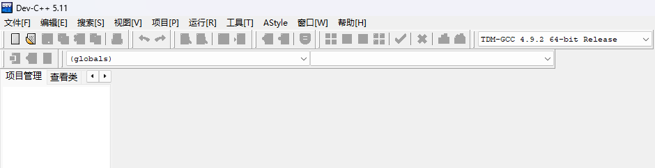
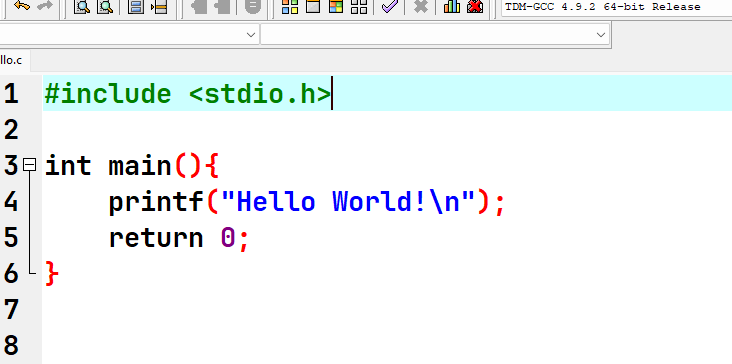
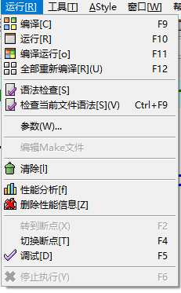
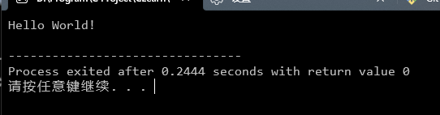
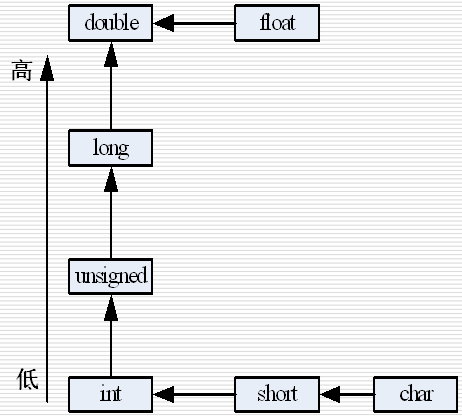
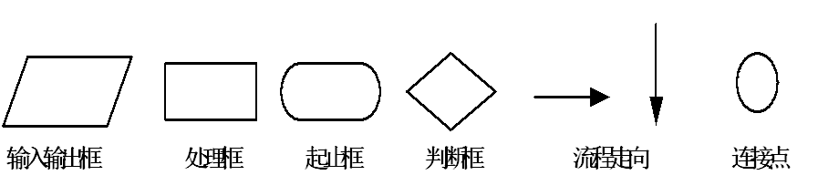
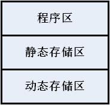
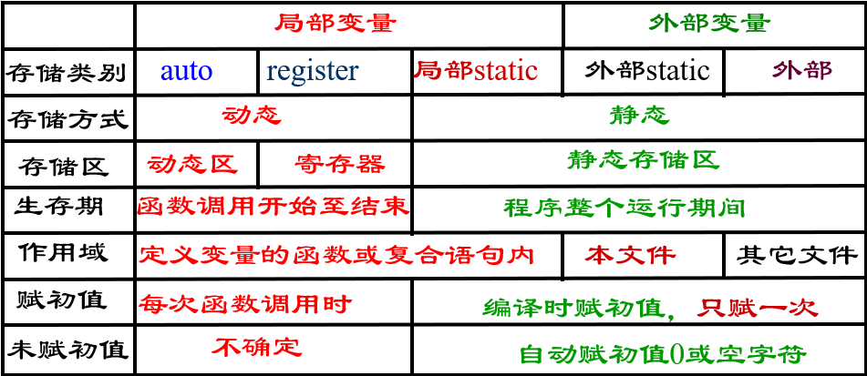
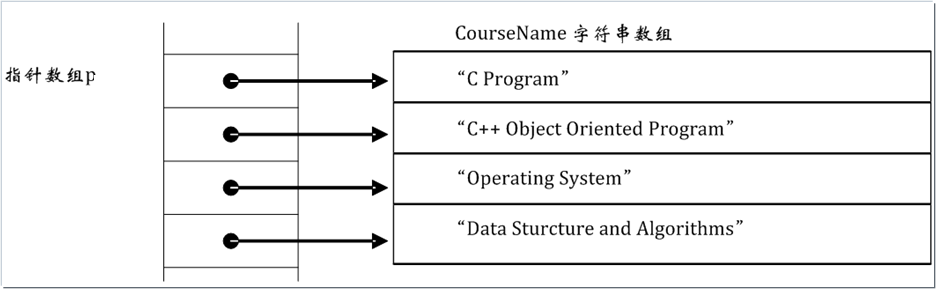
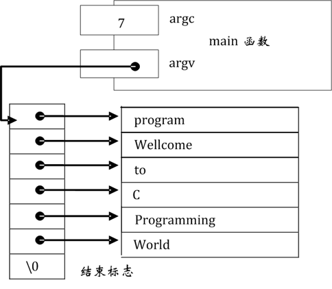

# C语言  
1.概述  
2.数据类型、运算符、表达式  
3.算法与控制语句  
4.函数  
5.数组  
6.指针  
7.预编译命令  
8.结构体与共用体  
9.文件  


## 1.概述  
**目录:**  
1.1 发展历史  
1.2 C语言程序结构  
1.3 C语言的特点
1.4 C语言程序开发方法
1.5 C语言程序上机调试  


### 1.1 发展历史  
1.C语言发展  
1972年C语言诞生->1973改写Unix->1978《The C Programming Language》  
实际上是在1973年3月的Unix操作系统上先诞生了C语言编译器(注意这个时候的Unix和C语言编译器还不是C语言写的,可能是别的什么语言甚至是汇编写的),然后在1973年的11月,Unix才由C语言完全重新改写  

2.C语言的主要标准  
C89、C95、C99  

### 1.2 C语言程序结构  
```c
/* This is first C program */        // 注释
# include <stdio.h>                  // 预处理(文件包含)
int main() {                         // 函数
   printf("Hello , World! "); 	      
   return 0;				                  // 返回语句
}
```

<font color="#00FF00">结论:</font>  
* C语言是由函数组成的,可以由一个或多个函数组成
* 注释语句,可以使程序阅读更清楚;它既可以单独占一行,又可以在一行的后面;但不能嵌套
  所谓嵌套就是如下,像这种是报错的
  ```c
  /*
  111
    /*
    222
    */
  */
  ```
* 每个C语言程序有且<font color="#00FF00">只有一个main()函数</font>,它的位置可以任意,但C语言语句的执行<font color="#00FF00">总是从main()函数开始,到main()函数结束</font>;<font color="#FF00FF">一个C源程序不是必须包含一个main函数</font>
* <font color="#FF00FF">预处理不是C语言的语句,它后面不能加";"表示结束</font>
* C语言的输入输出是由函数来完成的
* 用";"表示语句结束
  分号是C语句的一部分,<font color="#00FF00">不是语句之间的分隔符</font>
* 在C程序中,注释说明只能位于一条语句的后面(<font color="#FF0000">错误</font>)
* <font color="#00FF00">C语言程序仅由函数组成(一个或多个函数)</font>
* C语言中用户不可以重新定义标准库函数

### 1.3 C语言的特点  
* C语言是比较<font color="#00FF00">低级</font>的语言,在高级语言中较低级的语言
* 语言简洁、紧凑、灵活
  * C语言共有<font color="#00FF00">32个关键字</font>
  * <font color="#00FF00">9种控制语句</font>
  * 程序书写自由 
* 运算符丰富:34种运算符
* 语法限制不太严格,程序自由度大
* 结构化设计语言 
* <font color="#00FF00">C语言是程序员的语言</font>  


### 1.4 C语言程序开发方法
**目录:**  
1.4.1 程序
1.4.2 程序设计和程序设计语言
1.4.3 程序开发方法

#### 1.4.1 程序
1.程序
一系列遵循一定规则组织起来完成指定任务的代码或指令序列  

2.程序主要描述两个部分
描述问题所涉及的每个对象及他们之间的关系  
描述处理这些对象的规则  

#### 1.4.2 程序设计和程序设计语言  
1.程序设计  
根据所完成的任务,设计解决问题的步骤和数据对象之间的关系,然后编写相应的程序代码,并测试该代码的正确性,直到能够得到正确的运行结果为止  

2.程序设计应遵循一定的方法和原则,而不是个人随意编写 

3.良好的程序设计风格 

4.程序设计语言  
按照一定的规范来描述问题的解决方案和步骤  
* 具有一定的基本规则
* 固定的语法格式
* 特定的语义和使用环境
* 比通常的语言要求更严格,不能出现二义性

#### 1.4.3 程序开发方法
1.阶段  
* 明确问题的需求
* 分析问题
* 设计
* 实现
* 测试
* 维护

### 1.5 C语言程序上机调试
**目录:**  
1.5.1 编程环境  
1.5.2 编写第一个程序  

#### 1.5.1 编程环境  
1.编辑器、编译器、IDE  
编辑器:编写代码的软件  
编译器:把源代码编译为目标可执行代码的软件  
IDE:集成开发环境软件,包括代码编辑器、编译器、调试器、图形化用户工具界面  


#### 1.5.2 编写第一个程序  
1.界面图  
  

2.编写代码  
  

3.编译及相关功能  
在顶部导航栏运行里有如下按键,十分清晰  
  
这里可以按F9进行快速编译,编译完成后在编译日志中生成相关的编译日志信息,以及在对应的目标目录下生成一个可执行文件.exe  
编译完成后再次点击运行(或按下F10),运行结果如下  

  


## 2.数据类型、运算符、表达式  
**目录:**  
2.1 C语言的数据类型  
2.2 常量与变量  
2.3 整型数据  
2.4 浮点型数据  
2.5 字符型数据  
2.6 运算符和表达式  
2.7 表达式求值  


### 2.1 C语言的数据类型  
1.分类  
* 基本类型
  * 整型:短整型(short)、整型(int)、长整型(long)
  * 浮点型(<font color="#00FF00">实型</font>):单精度型(float)、双精度型(double)
  * 字符类型(char)
  * 枚举(enum)
* 构造类型:数组、结构体、共用体
* 指针类型

2.记住C语言只有上述类型,其它任何类型的表述都是不正确的,例如"逻辑类型";这是个陷阱  

3.如果题目出现"数值型"指代的就是整型+浮点型  


### 2.2 常量与变量
**目录:**  
2.2.1 标识符命名
2.2.2 常量
2.2.3 变量

#### 2.2.1 标识符命名
1.标识符
字符序列的总称;在C语言里用标示符来表示<font color="#00FF00">常量、变量、函数和数据类型的名字</font>  

2.标识符分类  
* 关键字:C语言预先规定的标识符,有固定的含义不能另作他用
* 预定义标识符:预先定义并具有特定含义的标识符
  * `__func__`:当前所在的函数名
  * `__LINE__`:当前代码所在的行号
  * `__FILE__`:当前源文件的名称
* 用户标识符

3.命名规则  
* 字母(区分大小写)、数字和下划线组成
* 第一个字符不能是数字字符
* 不能是标准字符(关键字)

| 关键字     | 说明                          |
|:-----------|:------------------------------|
| int        | 整型                          |
| char       | 字符型                        |
| float      | 单精度浮点型                  |
| double     | 双精度浮点型                  |
| short      | 短整型                        |
| long       | 长整型                        |
| signed     | 有符号数修饰符                |
| unsigned   | 无符号数修饰符                |
| struct     | 结构体                        |
| union      | 共用体 (联合体)               |
| enum       | 枚举类型                      |
| void       | 无类型 (空类型)               |
| _Bool      | **[C99]** 布尔类型            |
| 控制流     | 12个                          |
| if         | 条件判断                      |
| else       | 条件分支                      |
| switch     | 多分支选择                    |
| case       | 分支标记                      |
| default    | 默认分支                      |
| for        | 循环语句                      |
| while      | 循环语句                      |
| do         | 循环语句 (至少执行一次)       |
| break      | 跳出循环或开关                |
| continue   | 继续下一次循环                |
| goto       | 无条件跳转                    |
| return     | 函数返回                      |
| 存储类型   | 10个                          |
| auto       | 自动变量 (默认)               |
| static     | 静态变量                      |
| extern     | 外部变量声明                  |
| register   | 寄存器变量                    |
| const      | 只读变量修饰符                |
| volatile   | 易变变量修饰符 (防编译器优化) |
| inline     | **[C99]** 内联函数修饰符      |
| restrict   | **[C99]** 指针独立性限制      |
| _Complex   | **[C99]** 复数类型            |
| _Imaginary | **[C99]** 虚数类型            |
| 其它       | 2个                           |
| sizeof     | 计算数据类型或变量所占字节数  |
| typedef    | 为已有类型定义别名            |


#### 2.2.2 常量
1.常量介绍  
在程序运行过程中其值不发生改变的量  
常量分为:直接常量和符号常量  

2.直接常量  
直接常量也称字面量,也就是是直接写死在代码中的常量,可以是整型常量、实型常量、字符常量和字符串常量  
```c
printf("%d\n",100);         // 整型常量
printf("%f\n",3.14);        // 实型常量
printf("%c\n",'A');         // 字符常量
printf("Hello World!\n");   // 字符串常量
```

3.符号常量  
用一个标识符来表示的常量  
语法格式:`#define 符号常量 常量值`  
代码演示:  
```c
#define PRICE 30      // 默认int型
#define PId 3.14      // 默认double型
#include <stdio.h>
int main()
{
     int num,total;
     num=10;
     total=num*PRICE;       // 直接使用符号常量
     printf("total=%d",total);
     return 0;
}
```
*为什么PRICE默认是int型而PId默认是doble型?可见7.1.3*

4.使用符号常量的优点 
* 可以使程序更清晰易读 
* 程序修改更加容易 

5.通常<font color="#00FF00">用大写字母表示符号常量,小写字母表示变量</font>,以便区别;<font color="#FF00FF">常量默认是有符号int型</font>


#### 2.2.3 变量
1.变量  
在程序运行过程中其值可以发生改变的量,其由三部分组成:变量名、变量类型、变量的值  

2.定义形式  
`类型名 变量名1,变量名2,......,变量名n`  

3.未定义  
`int k, j, s = 1;` 对于这段代码唯一能知道的只有s的值为1,而k和j是未定义变量;<font color="#00FF00">在C语言中未定义变量的值是不确定的不能假设为0或1</font>


### 2.3 整型数据  
1.整型常量
整数(分十进制常量、八进制常量、十六进制常量)  
十进制:以非0数字开头  
八进制:以0数字开头,例如`int num = 012;`  
十六进制:以0x或0X开头,例如`int num = 0x12;`

2.整型变量的分类  
短整型(short)、整型(int)、长整型(long);默认都是有符号数,通过<font color="#FF00FF">可选</font>前缀unsigned/signed,来定义该变量是有符号数还是无符号数  
C语言中unsigned = unsigned int

3.变量占用空间  
通过`sizeof(数据类型说明)`来获取某一数据类型占内存的<font color="#00FF00">字节</font>数  
一般来说;short(2字节)、int(2-4字节)、long(4字节)  
具体取决于操作系统的实现  

4.常见的整型定义方式
```c
long num1 = 100l;
long long num2 = 100LL;
float num3 = 3.14f;
// 无符号数的定义
unsigned int num4 = 100u;

short int = short
long int = long;
long long int = long long;

long double;
// 不存在long float

```

### 2.4 浮点型数据  
1.浮点型常量  
也称<font color="#FF00FF">实型常量</font>或实数,它<font color="#00FF00">只有十进制形式</font>,<font color="#00FF00">全部都是有符号数</font>  

2.注意事项  
* 浮点型常量的默认类型是double
* 在常量后面加f或F指定为float型
* 指数必须为整数、e/E的前后必须有数字
  指数是值代表10的多少次方,1.2345e2=123.45
  e5和1.2e都是非法形式
  .2e0是合法形式
* 浮点型数据的有效数字位有限制
* 有效位以外的数字将被舍去


```c
#include <stdio.h>
#define PId 3.14          // 浮点型符号常量(浮点型常量)默认为double
#define PIf 3.14f         // 在常量后面加f或F指定为float型
int main(){
	printf("%d\n",sizeof(PId));     // 输出为8
	printf("%d\n",sizeof(PIf));     // 输出为4
	return 0; 
}
```

3.浮点型变量的分类
* 单精度(float)-4字节
* 双精度(double)-8字节
* 长双精度(long double)-16字节  


4.浮点型变量定义方法  
`类型说明符 变量名列表`  
举例:  
```c
float a,b,c;
double a,b,c;
long double a,b,c;
```

### 2.5 字符型数据  
1.字符常量  
用单引号括起来的单个普通字符或转义字符
* 单引号中的字符不能是单引号`'`和反斜杠(`\`)  
* 字符是按其所对应的ASCII码值来存储的,一个字符占一个字节(即char)

ASCII包含128个字符,这些字符使用7位二进制编码表示,范围为 0 到 127  

字符常量的定义方式:  
* 单个字符常量
  用单引号直接把一个字符包裹起来(包含转义字符)
  ```c
  'A'   // 大写字母 A
  '\n'  // 换行符
  char ch = '';   // 这种定义方式是错误的
  ```
* 数值定义,即把char就视作一个整型变量
  ```c
  char a = 65;
  printf("%c",a);   // 输出 A
  ```
* 八进制和十六进制转义  
  ```c
  char a = '\101';      // 这种以\开头的默认是8进制
  char b = '\x41';      // 这种以\x开头的默认是16进制
  // 最后a和b的输出均为A
  ```
  <font color="#FF00FF">这里有大坑:char变量后面以\开头的;最多只有三位且取值为0~7</font>  
  0和0x 与\\和\\x


2.字符串常量  
一对双引号`""`括起来的一串字符
* 保存每个字符的ASCII值
* 系统自动在字符串的末尾加一个串结束标志<font color="#FF00FF">\0</font>
  所以任何由`""`括起来的字符串,默认是对应字符加一个`\0`结尾,系统在编译时自动加
  注意`'\0'`是一个字符而并不是两个,<font color="#00FF00">它是ASCII值为0的字符(8进制定义)</font>

3.转义字符  
| 转移字符 |       功能       | ASCII值 |
|:--------:|:----------------:|:-------:|
|    \n    |       换行       |   10    |
|    \r    |       回车       |   13    |
|    \t    |      制表符      |    9    |
|    \0    | ASCII值为0的字符 |    0    |
|   \\\    |      字符\\      |   92    |
|   \\'    |      字符'       |   39    |
|   \\"    |      字符"       |   34    |
|          |      字符A       |   65    |
|          |      字符a       |   97    |

*字符串定义方式*: 
* `char a[20]="ABCD\0EFG\0"`这种也是可以的,注意如果输出则只会打印ABCD这四个字符,因为\0表示结束,如果你要字符串把\0作为字符输出应该写\\\0用转义符,这也是转义符存在的意义  
* `char a[] = "abc\61d\\\0A8";` 这个字符串的长度是6;`\61`是一个整体算一个字符,而不是\6算成一个字符(因为C语言的匹配规则是<font color="#00FF00">贪婪匹配</font>),然后到\0是字符串的结尾,所以它的长度是6,A8并不统计在内
* `char a[] = "\"\\\n\'\065\08AB"`这个的长度是5,注意看\08中的8不可能作为一个8进制的表示,所以它一定是一个单独的字符,而在处理到\0的时候strlen就结束了,所以长度为5

4.char的小程序  
```c
#include <stdio.h>
int main() {
  char c1='a',c2='b';
  c1=c1-('a'-'A');
  c2=c2-('a'-'A');
  printf("%c %c\n",c1,c2);      // 输出结果A B
  return 0;
} 
```
上述代表想表达的是:char本身也是一个数值型的变量  

### 2.6 运算符和表达式  
**目录:**  
2.6.1 一表大览  
2.6.1 算术运算符
2.6.2 自增和自减运算符
2.6.3 关系和逻辑运算符
2.6.4 位运算符
2.6.5 条件运算符
2.6.6 逗号运算符

#### 2.6.1 一表大览  

<table border="1" cellspacing="0" cellpadding="6">
  <thead>
    <tr>
      <th>优先级</th>
      <th>运算符</th>
      <th>含义</th>
      <th>结合方向</th>
      <th>说明</th>
    </tr>
  </thead>
  <tbody>
    <tr>
      <td rowspan="4" align="center">1</td>
      <td>[]</td>
      <td>数组下标</td>
      <td rowspan="4" align="center">从左到右</td>
      <td></td>
    </tr>
    <tr><td>()</td><td>圆括号</td><td></td></tr>
    <tr><td>.</td><td>成员选择(对象)</td><td></td></tr>
    <tr><td>-&gt;</td><td>成员选择(指针)</td><td></td></tr>
    <tr>
      <td rowspan="9" align="center">2</td>
      <td>(类型)</td>
      <td>强制类型转换</td>
      <td rowspan="9" align="center">自右向左</td>
      <td></td>
    </tr>
    <tr><td>-</td><td>负号运算符</td><td align="center">单目运算符</td></tr>
    <tr><td>++</td><td>自增运算符</td><td align="center">单目运算符</td></tr>
    <tr><td>--</td><td>自减运算符</td><td align="center">单目运算符</td></tr>
    <tr><td>*</td><td>取值运算符</td><td align="center">单目运算符</td></tr>
    <tr><td>&amp;</td><td>取地址运算符</td><td align="center">单目运算符</td></tr>
    <tr><td>!</td><td>逻辑非运算符</td><td align="center">单目运算符</td></tr>
    <tr><td>~</td><td>按位取反</td><td align="center">单目运算符</td></tr>
    <tr><td>sizeof()</td><td>长度运算符</td><td></td></tr>
    <tr>
      <td rowspan="3" align="center">3</td>
      <td>/</td>
      <td>除</td>
      <td rowspan="3" align="center">从左到右</td>
      <td rowspan="3" align="center">双目运算符</td>
    </tr>
    <tr><td>*</td><td>乘</td></tr>
    <tr><td>%</td><td>取余</td></tr>
    <tr>
      <td rowspan="2" align="center">4</td>
      <td>+</td>
      <td>加</td>
      <td rowspan="2" align="center">从左到右</td>
      <td rowspan="2" align="center">双目运算符</td>
    </tr>
    <tr><td>-</td><td>减</td></tr>
    <tr>
      <td rowspan="2" align="center">5</td>
      <td>&lt;&lt;</td>
      <td>左移</td>
      <td rowspan="2" align="center">从左到右</td>
      <td rowspan="2" align="center">双目运算符</td>
    </tr>
    <tr><td>&gt;&gt;</td><td>右移</td></tr>
    <tr>
      <td rowspan="4" align="center">6</td>
      <td>&gt;</td>
      <td>大于</td>
      <td rowspan="4" align="center">从左到右</td>
      <td rowspan="4" align="center">双目运算符</td>
    </tr>
    <tr><td>&gt;=</td><td>大于等于</td></tr>
    <tr><td>&lt;</td><td>小于</td></tr>
    <tr><td>&lt;=</td><td>小于等于</td></tr>
    <tr>
      <td rowspan="2" align="center">7</td>
      <td>==</td>
      <td>等于</td>
      <td rowspan="2" align="center">从左到右</td>
      <td rowspan="2" align="center">双目运算符</td>
    </tr>
    <tr><td>!=</td><td>不等于</td></tr>
    <tr>
      <td align="center">8</td>
      <td>&amp;</td>
      <td>按位与</td>
      <td align="center">从左到右</td>
      <td align="center">双目运算符</td>
    </tr>
    <tr>
      <td align="center">9</td>
      <td>^</td>
      <td>按位异或</td>
      <td align="center">从左到右</td>
      <td align="center">双目运算符</td>
    </tr>
    <tr>
      <td align="center">10</td>
      <td>|</td>
      <td>按位或</td>
      <td align="center">从左到右</td>
      <td align="center">双目运算符</td>
    </tr>
    <tr>
      <td align="center">11</td>
      <td>&amp;&amp;</td>
      <td>逻辑与</td>
      <td align="center">从左到右</td>
      <td align="center">双目运算符(逻辑运算符)</td>
    </tr>
    <tr>
      <td align="center">12</td>
      <td>||</td>
      <td>逻辑或</td>
      <td align="center">从左到右</td>
      <td align="center">双目运算符(逻辑运算符)</td>
    </tr>
    <tr>
      <td align="center">13</td>
      <td>?:</td>
      <td>条件运算符</td>
      <td align="center">自右向左</td>
      <td align="center"><font color="#00FF00">三目运算符</font></td>
    </tr>
    <tr>
      <td rowspan="11" align="center">14</td>
      <td>=</td>
      <td>赋值运算符</td>
      <td rowspan="11" align="center">自右向左</td>
      <td></td>
    </tr>
    <tr><td>/=</td><td>除等</td><td></td></tr>
    <tr><td>*=</td><td>乘等</td><td></td></tr>
    <tr><td>%=</td><td>取余等</td><td></td></tr>
    <tr><td>+=</td><td>加等</td><td></td></tr>
    <tr><td>-=</td><td>减等</td><td></td></tr>
    <tr><td>&lt;&lt;=</td><td>左移等</td><td></td></tr>
    <tr><td>&gt;&gt;=</td><td>右移等</td><td></td></tr>
    <tr><td>&amp;=</td><td>与等</td><td></td></tr>
    <tr><td>^=</td><td>异或等</td><td></td></tr>
    <tr><td>|=</td><td>或等</td><td></td></tr>
    <tr>
      <td align="center">15</td>
      <td>,</td>
      <td>逗号运算符</td>
      <td align="center">从左到右</td>
      <td>多个表达式之间用逗号隔开,例如:表达式1,表达式2...</td>
    </tr>
  </tbody>
</table>

<font color="#00FF00">注意:</font>  
* C语言表达式运算,只看两点;一看优先级;二相同优先级看结合方向
* 所谓结合方向就是遇到相同优先级时,表达式应遵循的计算顺序,例如`a + b - c + d`加和减的优先级都是4,故此时要按4对应的从左到右的结合顺序计算,先算a + b 然后再 - c 以此类推
* 结合方向大部分都是自左向右,只有三个是自右向左  
* 所有双目运算符中只有赋值运算符的结合方向是从右往左,另外两个从右往左也很好记,一个是单目运算符一个是三目运算符

1.C语言结合性和优先级  
`a + b + c * d`是先计算a+b然后再计算c\*d的,并不是先算c\*d的
先看优先级\*最高,所以c和d绑定在一起,再看结合性,剩下的两个+优先级一样,根据"左结合性",左边的a + b先被划分为一组,最终逻辑类似于`(a + b) + (c * d)`  


#### 2.6.1 算术运算符
1.取模运算的四种情况  

| 表达式  | 结果 |          备注          |
|:-------:|:----:|:----------------------:|
|  7 % 3  |  1   |         最简单         |
| -7 % 3  |  -1  | 结果符号位和被除数相同 |
| 7 % -3  |  1   | 结果符号位和被除数相同 |
| -7 % -3 |  -1  | 结果符号位和被除数相同 |

总结:<font color="#00FF00">结果符号位和被除数相同</font>  

2.<font color="#FF00FF">取模运算的运算数必须是整型</font>  

#### 2.6.2 自增和自减运算符
1.自增和自减的坑  
`++a`和`a++`前自增和后自增;前自增的优先级较高在前面已经说过了;但是在C语言中后自增是有坑的,在一个<font color="#00FF00">表达式中a++读取到的值一定是a的旧值</font>,至于a何时自增它需要发生在表达式结束前的某个时刻,也即`;`整个表达式之前发生自增  
例如`int x = a++ + a;`假设a的初值为5,这段代码就是典型的<font color="#00FF00">未定义行为</font>,但起码能够保证的一点是在读取a++的时候,它的值一定是5;对于这类代码<font color="#00FF00">编译器想怎么算都行</font>  

2.看一道坑题  
```c
int main(){
  int x=10,y=9 ;
  int a,b,c ;
  a = (x--==y++) ? x-- : y++ ;
  b = x++ ;
  c = y ;
  return 0;
}
```
然后求上述a、b、c的值;答案是a=10、b=9、c=11
这里又涉及到未定义行为了,但是你就记住,条件运算符(三目运算符)要保证`表达式1`位置处完整执行完毕,之后才会执行表达式2和表达式3,所以在执行表达式3的时候y的值就已经是10了,故a=10  
关于b,注意x的值这个时候是9,但它是后自增,x的自增跟b是没关系的,<font color="#00FF00">即先计算后自增</font>;先计算赋值语句  

3.注意事项  
++,--运算只能用于变量,不能用于常量和表达式  

4.题目  
```c
int a = 2,b=3,c=4;
a *= 16 + (b++) - (++c);
/*
这里a的结果为28
这里最大的问题还是b++的问题,即使这里把b加了括号,但b真正自增只会发生在语句执行结束之前
所以这里参与运算的还是b的旧值3
*/
```

5.题目  
```c
int b = 3;
b++=5;
```
上述语句是不合法的,表面上看是先读取到b的旧值为3,然后让b为5再让b自增  
但实际上,执行b++的时候会生成一个临时变量,也就是读取b的旧值时会在内存中生成一个临时变量  
而临时变量是没办法左值的,所以自增的操作本质上是  
```c
int b = 3; b++;
// 等价于
int _b = b;
_b +=1;
b = _b;
```

6.赋值运算符  
```c
int a = 1,b=0;
b = (a += 1);
// 输出结果为2
printf("%d",b);
```
在复制运算符中没有自增运算符那样先读取再自增的操作,所以这里不存在说a先读到结果为1然后赋值给b的值就是1,赋值运算符就直接算最终的结果  


#### 2.6.3 关系和逻辑运算符
1.注意事项
C语言中,<font color="#00FF00">0为假,非0为真</font>  

2.关系和逻辑运算符  
关系运算符:> >= < <= == !=
逻辑运算符:&& \|\| <font color="#00FF00">!</font>  

3.返回值问题  
关系和逻辑运算符的返回值是一个逻辑值(即真或假 1或0)  
`5>2>7>8`的结果为0,结合方向是从左往右,5>2的结果为1,1>7的结果为0,0>8的结果为0  

4.逻辑非运算的特殊情况  
逻辑非也是逻辑运算,但是它是比较特殊的一种,首先它的优先级为2,其次<font color="#00FF00">任何非0数去逻辑非都是0,而当且仅当0取逻辑非时才为1</font>  


#### 2.6.4 位运算符
1.注意事项  
* 按位运算时,必须将运算对象转化为二进制
* 位运算必须是整型和字符型数据

#### 2.6.5 条件运算符
1.注意事项  
`int result = 表达式1 ? 表达式2 : 表达式3;`  
先判断表达式1的结果是否为非0,如果是非0则整个表达式的返回值为表达式2(即result=表达式2),否则整个表达式的返回值为表达式3(即result=表达式3)  
三目运算符就是有三个输入,一个输出;其中表达式1、表达式2、表达式3可以是任意类型的式子  

#### 2.6.6 逗号运算符
1.格式  
运算对象1,运算对象2,......,运算对象n  

2.功能  
先计算运算对象1的值,再计算运算对象2的值,直到最后计算运算对象n的值;<font color="#00FF00">逗号运算符的结果是最右边的哪个</font>  
例如`int a;a = (1, 2, 3);`最后a的结果为3  
但是`int a;a = 1,2,3;`的结果为1  
这是因为赋值运算符的优先级比逗号要高,第一个例子没有左值,所以写全应该是(x1 = 1,x2 = 2,x3 = 3)表达式单独计算,所以从左到右依次赋值之后x3=3这个表达式的返回值为3故a=3  
第二个表达式写全应该是 a = 1,x1 = 2,x2 = 3;

3.看道题目  
```c
int main(){
	int  k, j, s;
	for(k = 2; k < 6; k++,k++){   // 逗号表达式分别计算
		s = 1;
		for(j = k; j < 6; j++)
			s += j;
	}
	printf("%d\n", s);
	return 0; 
}
```

4.再看一个赋值的题目  
```c
int a = 1,b=1,c=1,d=1;
int a=b=c=d=1;
int a,b,c,d; a=b=c=d=1;
int a,b,c,d=1;a=b=c=d;
```
这里的第二条语句不能成功,因为<font color="#00FF00">定义时不能直接连等赋值</font>,当编译器执行int a=b的时候,由于b还没有被定义,所以这里会直接报错;而下面的两种情况最大的不同在于它们都实现声明了变量,在C语言中声明的变量会自动给一个随机值,后续的赋值语句支持`连续赋值`  

5.逗号结合自增  
```c
int x = 1,y=2;
int r = (x--,y++,x+y);
// 最终r的结果为3
```

### 2.7 表达式求值  
**目录:**  
2.7.1 算数表达式  
2.7.2 赋值表达式

#### 2.7.1 算数表达式  
1.定义  
用算术运算符号将运算对象(常量、变量、函数等)、圆括号连接起来的式子  

2.类型转换  
  
**提示:** 这里可以参考王道的书  
* <font color="#00FF00">C语言中浮点值转int是不是四舍五入的,而是直接截断小数部分</font>

3.强制类型转换  
较高类型向较低类型转换时可能发生精度丢失  

#### 2.7.2 赋值表达式
1.定义  
赋值运算符将一个变量和表达式连接起来构成的式子  

2.一般形式  
<变量>=<表达式>

3.特点  
赋值表达式的值又可以作为另外一个赋值表达式,也即赋值运算也有结果
例如`a=6`这个表达式本身会有一个结果,这个表达式本身的结果就是6,于是乎`a = (b = 6)`最终会得到a和b都为6,包括`a=b=6`的结果也是一样的;因为赋值运算符是自右向左的  

4.<font color="#00FF00">短路表达式</font>  
在逻辑表达式中不是所有的逻辑运算符都要被执行,<font color="#00FF00">只有在必须执行下一个逻辑运算符才能求出表达式的解时,才执行该运算符</font>  
例如`a&&b&&c`只有当a为真时才判别b的值


## 3.算法与控制语句  
**目录:**  
3.1 算法初步 
3.2 C语言的标准输入和输出
3.3 条件语句 
3.4 多分支语句 
3.5 循环语句
3.6 转移语句 
3.7 综合应用  


### 3.1 算法初步 
1.<font color="#00FF00">三种基本结构</font>  
顺序结构:根据操作的先后顺序执行  
选择结构:根据某个给定条件进行判断,条件为真或假时分别执行不同的操作  
循环结构:根据条件的真或假反复执行某些操作  

三种基本结构的公共特点:
* 只有一个入口和一个出口  
* 结构内的每一部分都有可能被执行到
* 结构内不存在"死循环"

2.算法的表示  
算法可以用以下形式进行表示:自然语言、<font color="#00FF00">传统流程图</font>、N-S流程图、伪代码、<font color="#00FF00">计算机语言</font>  

流程图示例:  
  

3.算法举例  
能够用流程图描述(解决)如下几个问题:判断三角形的形状、判断某一年是否为闰年、求n!

4.<font color="#00FF00">算法的特点</font>  
* 有穷性
* 确定性
* 输入输出性(零个或多个输入;一个或多个输出)
* 可行性

### 3.2 C语言的标准输入和输出
**目录:**
3.2.1 格式化输出
3.2.2 格式化输入
3.2.3 其它输入输出
3.2.4 C语言语句

#### 3.2.1 格式化输出
1.printf函数  
格式化输出函数printf(),用于把信息输出到标准输出设备显示器上  

2.格式  
`#include<stdio.h>`  
`printf("控制字符串",输出项列表)`  

* 控制字符串
  * 必须用双引号括起
  * 格式说明符
  * 普通字符
* 输出项
  * 常量、变量、表达式
  * <font color="#FFC800">输出项</font>的类型与个数必须与<font color="#00FF00">控制字符串</font>中格式字符的类型、个数一致
  * 有多个输出项时,各项之间用逗号分隔

3.格式说明符  
它是形如`%[修饰符][格式字符]`的一种形式

<font color="#FF00FF">修饰符:</font>  
| 修饰符 | 含义                                                                                                                                                            |
|--------|-----------------------------------------------------------------------------------------------------------------------------------------------------------------|
| m      | 输出数据域宽(这里的m要填入具体的数)</br>当数据长度 < m 时,左补空格</br>否则按实际长度输出                                                                       |
| .n     | 这里的n要填入具体的数</br>对实数:指定小数点后位数(需要四舍五入)<font color="#00FF00">不足末尾补0</font></br>对字符串:指定实际输出字符数</br>对整型:不足n位要左侧补0(超过n位就按原本大小输出) |
| -      | 输出数据在域内左对齐(缺省为右对齐)                                                                                                                              |
| +      | 指定在有符号数的正数前显示正号(+)                                                                                                                               |
| 0      | 输出数值时,指定左侧未使用的空位自动填充0</br>这一般和m修饰符配合使用                                                                                            |
| #      | 在八进制和十六进制数前显示前导符号 0、0x                                                                                                                        |
| l      | 在 d、o、x、u 前:指定输出为 long 型</br>在 e、f、g 前:指定输出为 double 型                                                                                      |

修饰符是可以复合的,例如:  
```c
int main(){
	float a = 10.1f;
	printf("%.2f\n",a);     // 输出10.10
	printf("%+.2f\n",a);    // 输出+10.10
	return 0; 
}
```

<font color="#FF00FF">格式符:</font>  
| 格式符 | 说明                     | 示例代码                    | 输出结果 |
|--------|--------------------------|-----------------------------|----------|
| d      | 十进制有符号整数         | int a=567; printf("%d", a); | 567      |
| i      | 十进制有符号整数         |                             |          |
| u      | 按十进制无符号整数输出   | int a=567; printf("%u", a); | 567      |
| o      | 按八进制输出             | int a=65; printf("%o", a);  | 101      |
| x      | 十六进制无符号整数(小写) | int a=255; printf("%x", a); | ff       |
| X      | 十六进制无符号整数(大写) | int a=255; printf("%x", a); | FF       |
- - -
| 格式符 | 说明                         | 示例代码                           | 输出结果 |
|--------|------------------------------|------------------------------------|----------|
| c      | 按字符输出                   | char a=65; printf("%c", a);        | A        |
| s      | 按字符串输出                 | printf("%s", "ABC");               | ABC      |
| f      | 按浮点数输出                 | float a=567.789; printf("%f", a);  | 567.789  |
| e      | 按指数形式输出(小写e)        | double a=567.789; printf("%e", a); | 5.68e+02 |
| E      | 按指数形式输出(大写E)        | double a=567.789; printf("%e", a); | 5.68E+02 |
| g      | 按 e、f 格式中较短的一种输出 | float a=567.789; printf("%g", a);  | 567.789  |
- - -
| 格式符 | 说明 | 示例代码                           | 输出结果         |
|--------|------|------------------------------------|------------------|
| p      | 地址 | float a=567.789; printf("%p", &a); | 000000000062FE20 |

4.格式说明符的小demo  
```c
#include<stdio.h>
int main()
{
    int x=1234 , y=3,z=4;
    float f=123.456;
    double m=123.456;
    char ch='a', a[]="Hello,world!";
    printf("%d %d\n",y,z); 
    printf("y=%d , z=%d\n",y,z);
    printf("%8d,%2d\n",x,x); 
    printf("%f,%8f,%8.1f,%.2f,%.2e\n",f,f,f,f,f);
    printf("%lf\n",m);
    printf("%3c\n",ch);
    printf("%s\n%15s\n%10.5s\n%2.5s\n%.3s\n",a,a,a,a,a);

    /*
    输出10.2
    所谓的四舍五入,例如这里是小数点后保留一位
    所以在这一位之后的值应该四舍五入
    */
    float b = 10.17f;
    printf("%2.1f\n",b);
    return 0;
}
/*
输出如下:
3  4
y=3 , z=4
    1234,1234
123.456001,123.456001,   123.5,123.46,1.23e+002
123.456000
    a
Hello,world!
     Hello,world!
         Hello
Hello
Hel
*/
```

#### 3.2.2 格式化输入
1.scanf函数  
格式化输入函数scanf(),从标准输入设备键盘上输入信息  

2.格式  
`#include<stdio.h>`  
`scanf("控制字符串",地址表列)`  

* 控制字符串:`%[修饰符][格式字符]`
* 地址表项

3.控制字符串  
<font color="#FF00FF">修饰符:</font>  
| 修饰符 |                                 功能                                  |
|:------:|:---------------------------------------------------------------------:|
|   h    |                   用于d,o,x前,指定输入为short型整数                   |
|   l    | 用于d,o,x前,指定输入为long型整数</br>用于e,f前,指定输入为double型实数 |
|   m    |   m是一个具体的数字</br>指定输入数据宽度,遇空格或不可转换字符则结束   |
|   *    |                   抑制符,指定输入项读入后不赋给变量                   |

<font color="#FF00FF">格式符:</font>  
同标准输入  

4.练习的几个小demo  
```c
int main(){
  char c1,c2;
  /*
  输入:abcde 输出c1=a c2=d
  %3c的意思是连续从输入读取三个字符,读到什么就是什么不会跳过空格和换行
  读取三个字符之后,由于c1是char所以只会把第一个字符a赋值给c1;而b和c均读取到但是没有赋值操作
  同样%c2会连续读取两个字符,同样把读取到的第一个字符d赋值给c2
  */
  scanf("%3c%2c",&c1,&c2);
  /*
  那么在这段代码里面,c1和c2就会完整保存所有字符了
  c1和c2不需要再取地址了
  */
  char c1[3], c2[2];
  scanf("%3c%2c", c1, c2);
  /*
  输入:12345678765.43 输出k=123 f=8765.43
  *的作用是忽略某几个字符;最开头的123会作为整型被复制给k,
  中间的4个数4567会忽略,最后的所有输入都作为浮点型赋值给f
  */
  scanf("%3d%*4d%f",&k,&f);
  return 0;
}
```

5.输入分隔符  
所谓分隔符就是各个输入变量之间如何进行区分  
* 默认:一般以空格、TAB或回车键作为分隔符
* 其它字符做分隔符(程序指定):格式串中两个格式符间字符  

代码示例:  
```c
int main() {
  /*
  输入:"123 123 123"
  输出:a=123;b=83;c=291
  */
  scanf("%d%o%x",&a,&b,&c);
  printf("a=%d,b=%d,c=%d\n",a,b,c);
  /*
  输入:"12:30:45"
  输出:h=12;m=30;s=45
  */
  scanf("%d:%d:%d",&h,&m,&s);
  /*
  输入:"a=12,b=24,c=36"
  */
  scanf("a=%d,b=%d,c=%d",&a,&b,&c);
  return 0;
}
```

<font color="#00FF00">注意:</font>  
之前在4.练习的几个小demo已经提到过用%c作格式符时,空格和转义字符将作为有效字符输入(这里有坑哦)

```c
int main() {
  /*
  输入:"a b c"
  输出:c1='a' c2=' ' c3='b'
  */
  scanf("%c%c%c",&c1,&c2,&c3);
  /*
  输入:C Programming Language
  输出(str的值):C
  因为:%s只能读取一个"字符串单词";遇到第一个空白字符(空格、Tab、回车)就停止读取
  */
  scanf("%s", str);
  return 0;
}
```

**结论:** <font color="#FF00FF">当且仅当遇到%c作为格式符时,空格和转义字符将作为有效字符输入</font>

<font color="#00FF00">输入数据时,遇以下情况认为该数据结束</font>  
* 遇空格、TAB、或回车
  如果接受是字符串%s,则遇到这三个字符时认为字符换结束
* 遇宽度结束
* 遇非法输入

```c
int main() {
  /*
  输入:"1234a123o.26"
  输出:a=1234 b='a' c=123
  */
  scanf("%d%c%f",&a,&b,&c);
  return 0;
}
```

6.输入函数留下的垃圾  
```c
int main() {
  /*
  输入:"123⏎" 注意有一个换行
  输出;x=123 ch=10
  */
  int x;
  char ch;
  scanf("%d",&x);
  scanf("%c",&ch);
  printf("x=%d,ch=%d\n",x,ch);
  return 0;
}
```
<font color="#00FF00">原因解释:</font>因为输入的最后一个回车即作为上一个输入x的输入分隔符,又做为下一个输入ch的输入字符(%c是通吃的),而ch=10正好对应换行的ASCII码  
解决方法:
* 用getchar()清除
* 用函数fflush(stdin)清除全部剩余内容
* 用格式串中空格或"%*c"来"吃掉"  

```c
int main() {
  int x;
  char ch;
  // 方法一:
  scanf("%d",&x);
  scanf("%c",&ch);
  // 方法二:
  scanf("%d",&x);
  scanf("%*c%c",&ch);
  return 0;
}
```

7.scanf输入字符串时  
```c
int main() {
  char ch[5];
  /*
  输入:"ab⏎" scanf函数会在字符串的结尾处自动添加一个空字符'\0'
  输出:"97 98 0 0 0" 有两个空字符
  */
  scanf("%s",ch);
  for (int i = 0;i<5;i++){
    printf("%d\n",ch[i]);
  }
  return 0;
}
```

8.scanf与浮点值  
```c
int a;char b;float c;
// 在C语言中scanf的%f只能指定最大宽度(比如%5f),不能指定小数点后的位数
scanf("%3d,%c%5f",a,b,c);
// 所以凡是指定小数点.xf都是不合法的,这点要和printf区分下来
scanf("%3d,%c%5.2f",a,b,c);
scanf("%3d,%c%.2f",a,b,c);
```

#### 3.2.3 其它输入输出
1.putchar
putchar(ch):向标准输出设备输出一个字符ch;ch为字符变量或常量  

2.getchar  
getchar():从键盘输入的一个字符,返回值为char  

3.gets  
getts(char*);向标准输出设备输出一个字符串char*;char为字符串  
并且该方法会清空原有字符串char内的所有内容,先清空为空串再gets操作  

#### 3.2.4 C语言语句
1.分类  
* 控制语句:if-else、for、while、do-while、continue、break、switch、return
* 函数调用语句
* 表达式语句
* 空语句:`;`
* 复合语句:当一个语句不能完成某一功能,需要用多个语句才能实现,这时用{}把这些语句括起来,构成复合语句

### 3.3 条件语句
**目录:**  
3.3.1 if语句
3.3.2 if-else语句
3.3.3 if-else-if语句
3.3.4 条件语句的嵌套
3.3.5 条件语句的应用

#### 3.3.1 if语句
1.if表达式  
if表达式的内容可以是浮点数据  

#### 3.3.4 条件语句的嵌套  
1.if-else配对原则  
缺省{ }时,<font color="#00FF00">else总是和它上面离它最近的未配对的if配对</font>  

```c
int main() {
  if (a==b)
    if(b==c)
      printf("a==b==c");
  else        // 这个else配对的实际上是b==c 而不是 a==b
    printf("a!=b");
  return 0;
}
```

### 3.4 多分支语句 
**目录:**  
3.4.1 switch多分支语句
3.4.2 多分支语句的嵌套
3.4.3 多分支语句应用

#### 3.4.1 switch多分支语句  
1.注意事项  
* switch后面表达式的值必须是<font color="#00FF00">整型或字符型</font>;<font color="#FF00FF">可以是变量</font>只要类型是整型和字符型即可,所有的类型见`2.1 C语言的数据类`
* case后面的值必须是 **<font color="#FF00FF">常量表达式</font>** ,且值必须互不相同
* 每个case语句的冒号后面可以是0条或多条语句,多条语句时,可以不加{}
* 每个case后面语句序列里的<font color="#00FF00">break语句可有可无,但执行效果不同</font>(case穿透问题)

2.case穿透问题  
switch–case中一旦进入某个case,程序会一直向下执行,<font color="#00FF00">直到遇到第一个 break</font>才停止,这就叫case穿透
```c
int x = 2;
switch (x) {
    case 1:
        printf("A");
    case 2:
        printf("B");
    case 3:
        printf("C");
        break;
    case 4:
        printf("D");
}
// 输出结果为BC,遇到第一个break才会被穿透
switch (x) {
    default:
        printf("D");
    case 1:
        printf("A");
}
// 当没有进入case1时,输出的结果为DA;即default也会被穿透
```

3.取值问题  
switch后面的表达式的值可以是<font color="#00FF00">整型(int x、直接常量10、符号常量)、字符(char ch、直接常量'a'、符号常量)、枚举、整型表达式(a + b)</font>  

case后面的值可以是<font color="#00FF00">整型(直接常量10、符号常量)、字符(直接常量'a'、符号常量)、枚举、常量表达式(1 + 2 或 2 * 4)</font><font color="#FF00FF">绝对不允许是变量</font>  

#### 3.4.2 多分支语句的嵌套  
switch嵌套switch和switch嵌套if都是可以的

### 3.5 循环语句
**目录:**  
3.5.1 while循环语句
3.5.2 do-while循环语句
3.5.3 for循环语句
3.5.4 循环语句的嵌套

#### 3.5.2 do-while循环语句
```c
do
{
  语句序列
} while(表达式);      // 最后的分号不能少
```
注意:<font color="#00FF00">C语言可以用return语句退出循环,函数直接返回</font>  


### 3.6 转移语句
1.goto语句  
形式:`goto [label]` 无条件转移到`label`所在的位置执行  
```c
int main() {
  printf("1");
  goto next;
  printf("2");
next:
  printf("3");
  return 0;
}
// 输出结果为13
```

2.continue语句  
功能:结束本次循环,开始下一次循环;continue<font color="#00FF00">只能用在循环结构中</font>,而不能用于其它控制结构  

3.break语句  
功能:跳出switch结构或结束本层循环;break语句<font color="#00FF00">只能用于switch或循环结构</font>中  

4.exit(0)  
C语言中用exit(0)来强制退出程序  
```c
#include <stdio.h>
#include <stdlib.h>
int main(){
	int input = -1;
	if(input <= 0){
		printf("输入不合法");
		exit(0);
	}
	printf("正常退出");       // 这句话不会被输出
	return 0; 
}
```
## 4.函数  
**目录:**  
4.1 函数概述  
4.2 函数的声明和定义  
4.3 函数的参数和函数的返回值  
4.4 局部变量和全局变量  
4.5 变量的存储类型  
4.6 外部函数和内部函数  
4.7 C语言常见函数  


### 4.1 函数概述  
1.C是模块化程序设计语言  
* C是函数式语言
* 必须<font color="#00FF00">有且只能有一个名为main的主函数</font>  
* C程序的执行总是从main函数开始,在main中结束
* 函数不能嵌套定义,可以嵌套调用

2.函数的分类  
* 函数定义的角度上分 
  * 库函数
  * 用户自定义函数
* 返回值情况分类
  * 有返回值函数
  * 无返回值函数
* 函数参数的传递来分
  * 有参数函数
  * 无参数函数

3.<font color="#FF00FF">C语言的函数不能直接返回一个完整的数组变量</font>

### 4.2 函数的声明和定义  
1.结构  
```c
函数的定义形式 
函数返回值类型说明符  函数名(形式参数列表) {
    函数内部变量声明
    函数操作语句序列
}
```

2.注意事项  
* 函数名是合法的C语言<font color="#00FF00">标识符</font>


### 4.3 函数的参数和函数的返回值  
1.函数的形式参数  
* 函数的定义中使用的参数叫做<font color="#00FF00">形式参数</font>,简称形参
* 形参只能是变量,形参变量只有在被调用时才分配内存单元
* 在整个函数体内都可以使用,离开该函数则不能使用


2.函数的实际参数  
* 主调函数(调用者)中对应于形式参数的量称为<font color="#00FF00">实际参数</font>,简称实参
* 实参可以是常量、变量、表达式、函数 
* 进行函数调用时,实参必须具有确定的值
  多个实参之间用逗号隔开
  函数调用时<font color="#00FF00">实参的求值顺序是不确定的,不同的编译器略有不同</font>
* 实参和形参在数量上、类型上、顺序上应严格保持一致,否则会发生"类型不匹配"的错误

3.<font color="#FF00FF">函数声明</font>  
这点和Java区别极大,在C99标准之后,只有以下两种函数调用方式是正确的,如果调用者要调用的函数不在当前函数之前已经定义过,则必须在最开始处进行<font color="#00FF00">函数声明</font>  
```c
// 错误写法
int main(void) {
    add(1, 2);   // ❌ 如果此时没看到 add 的声明
}

int add(int a, int b) {
    return a + b;
}
// 正确写法一
// C语言中的函数声明的参数列表是不需要指定具体的参数名的,可以只有类型的定义
int add(int, int);

int main(void) {
    add(1, 2);
}

int add(int a, int b) { 
    return a + b;
}
// 正确写法二
int add(int a, int b) {
    return a + b;
}

int main(void) {
    add(1, 2);
}
```

4.值传递  
C语言的函数调用是值传递,实际参数仅仅是将值复制给形式参数(形参是实参的副本),这是一个单向值传递过程  
所谓的<font color="#FF00FF">指针传递其本质也是值传递</font>  
```c
void f(int *p) {
  *p = 10;
}

int main() {
  int a = 5;
  f(&a);
}
```
**注意:** a和p任然是不同变量,只是说p存放的是a的地址;所以&a取变量a的地址,然后用<font color="#00FF00">值传递</font>调用f函数  

5.函数的返回值  
形式:`return 表达式;`或`return (表达式);` 这两种都可以  
功能:计算表达式的值,并返回给主调函数  
返回值为void的函数体内可以使用return语句  
```c
void print(){
  // do something...
  // 下面这个不是错误
  return;
}
```

6.递归调用  
<font color="#00FF00">直接递归</font>是函数直接调用自身;<font color="#00FF00">间接递归</font>是函数通过其他函数间接调用自身


### 4.4 局部变量和全局变量  
1.局部变量  
局部变量:在函数内作定义说明的变量;其作用域仅限于函数内部,离开该函数后就不能再使用 

2.<font color="#00FF00">全局变量</font>  
在函数外部定义的变量;<font color="#00FF00">不属于某一个函数,它属于一个源程序文件;其作用域是从定义变量的位置开始到本源文件结束</font>;全局变量要和符号常量区分开来,全局变量是可以被不同的函数所修改的  
全局变量默认情况下是对所有源程序文件公开的,其它的源程序文件可以用`external`来访问当前文件的全局变量  
```c
int x,y;
int main() 
{
}
double a,b;     // 默认初值为0
int f1()  
{
}
void f2()  
{
}
```
在这段代码中;xy的作用域是main、f1、f2;<font color="#00FF00">ab的作用域是f1、f2</font>  

* 全局变量是为了增加函数间数据联系渠道
* 全局变量和局部变量同名时,<font color="#00FF00">在函数中把全局变量暂时隐藏起来,而局部变量起作用(优先使用局部变量)</font>  
* <font color="#FF00FF">全局变量未赋初值时,系统会自动初始化为0</font>

### 4.5 变量的存储类型  
**目录:**  
4.5.1 变量的存储区域  
4.5.2 auto变量  
4.5.3 static变量  
4.5.4 register变量  
4.5.5 extern变量  
4.5.6 一表总结  


#### 4.5.1 变量的存储区域  
1.存储区域  
  

2.动态存储  
* 程序在运行期间根据需要分配存储空间
* 函数的形式参数、局部变量、函数调用时的现场保护和返回地址  

3.静态存储
* 程序在运行期间由系统分配固定的存储空间 
* 全局变量、局部变量 
* 初始化在程序编译时进行 

4.变量的初值问题  
* auto(默认):未赋初值时为随机值
* register:未赋初值时为随机值
* static:未赋初值时为`0`
* 全局变量:未赋初值时为`0`

#### 4.5.2 auto变量  
1.定义  
动态分配存储方式分配存储空间,其数据存储在<font color="#00FF00">动态存储区域</font>;形式参数、函数内部定义的变量  
<font color="#FF00FF">函数内部定义的变量默认就是auto,存储在栈中</font>  

2.定义格式  
`auto [数据类型] [变量名列表]`  
例子:  
```c
int fun(int x) {
  auto int y,z;
}
```

#### 4.5.3 static变量  
1.静态局部变量  
* 数据存储在静态存储空间 
* 不能被其它函数使用(<font color="#00FF00">作用域只在当前函数</font>)
* 当再次进入该函数时,<font color="#FF00FF">将保存上次的结果;static局部变量只会初始化一次,函数多次调用不会销毁,保存上次的值</font>

2.静态`全程`变量  
* 在定义它的源文件中可见(<font color="#00FF00">作用域只在该文件</font>)
* 在其它源文件中不可见的变量 

3.静态全程变量与全局变量的
* 全局变量可以再说明为外部变量(extern),<font color="#00FF00">被其它源文件使用</font> 
* 静态全程变量却不能再被说明为外部的,<font color="#00FF00">只能被所在的源文件使用</font> 
* *一句话概括:全区变量和静态全程变量都可以被当前文件的函数所访问,但static显示地限制了作用域只在当前文件中使用*
  也就是说,假设我要定义一个全局变量,但是我只希望该全局变量在当前文件中有效,不希望被别的文件使用,就可以使用static来修饰;否则别的文件可以使用`extern`来使用该变量(这是我我不希望看到的)

4.直观的例子
```c
void counter() {
  // 定义格式,只初始化一次
  static int count = 0;
  count++;
  printf("count = %d\n", count);
}

int main() {
  counter(); // 输出 count = 1
  counter(); // 输出 count = 2
  counter(); // 输出 count = 3
  return 0;
}
```

#### 4.5.4 register变量  
1.介绍  
将变量的值保存在<font color="#00FF00">CPU内的寄存器中</font>,以使速度大大提高  

2.定义格式  
`register [数据类型] [变量名列表]`  

3.注意事项  
* 寄存器变量的数量有限制,而且一般为整型或字符型变量 
* <font color="#00FF00">变量不能是全局变量和静态局部变量</font>,<font color="#FF00FF">只能是auto类变量</font>


#### 4.5.5 extern变量  
1.定义  
在函数的外部定义,作用域为从变量定义处开始,到该<font color="#00FF00">程序文件</font>的末尾;是程序文件而<font color="#00FF00">不是源文件</font>,注意和static变量区分,<font color="#00FF00">实际上外部变量的存储类别隐含是extern</font>  

<font color="#00FF00">若要在该变量定义点之前的函数要引用该外部变量</font>(C语言的函数只能使用在此之前已经定义过的变量),<font color="#FF00FF">则在引用之前用关键字extern对该变量进行"外部变量声明"</font>  

2.样例演示  
```c
#include<stdio.h>
void f1();
void f2();
int main() {
  /*
  因为现在x和y还没有定义,所以如果不加extern关键字,直接访问xy
  即使这两个变量是全局变量,都是会报错的
  所以要想在变量定义点之前的函数中使用该变量必须使用extern关键字
  */
  extern int x,y;   
  printf("1:x=%d,y=%d\n",x,y);      // 输出x=0,y=0
  y=246;
  f1();
  f2();
  return 0;
}
void f1() {   
  extern int x,y;    
  x=135;
  printf("2:x=%d,y=%d\n",x,y);    // 输出x=135,y=246
}
int x,y;               
void f2() {   
  printf("3:x=%d,y=%d\n",x,y);    // 输出x=135,y=246
}
```


3.跨文件使用 
file1.c  
```c
int count = 10;  // 定义
```

file2.c  
```c
#include <stdio.h>

extern int count;  // 在引用该外部变量之前,先使用extern对该变量进行外部变量声明

void print_count() {
    printf("%d\n", count);
}
```
* extern告诉file2.c,count是外部变量,实际定义在file1.c
* 编译器在编译file2.c时不会分配内存,<font color="#00FF00">只会在链接时把count连接到file1.c中的定义</font>

#### 4.5.6 一表总结  
  

### 4.6 外部函数和内部函数  
1.内部函数  
即只能被本程序文件调用的函数,由<font color="#00FF00">static关键字修饰,即该函数作用域是当前源文件,对外部文件不可见</font>  

```c
static int max（int a,int b） {
  return a>b?a:b;
}
```

2.外部函数  
函数定义的前面加上extern关键字而说明的函数,它可以跨文件使用对外部文件可见,作用域为该<font color="#00FF00">程序文件</font>  
外部函数在使用和声明的时候都需要加上extern关键字  
```c
extern 类型标识符 函数名 (形参列表){
}
```

示例:  
```c
// file1.c
#include <stdio.h>
extern int multiply(int , int);     // 用extern修饰;表明是外部函数
extern int sum(int , int);

int main() {
  int result1 = multiply(2, 3);
  int result2 = sum(2,3);
}

// file2.c
extern int multiply(int a, int b) {
  return a * b;
}

// file3.c
extern int sum(int a, int b) {
  return a + b;
}

```

### 4.7 C语言常见函数(待补)  
1.rand函数  
需要引入`#include <stdlib.h>`  
```c
// 初始化随机种子
srand((unsigned int)time(NULL));
// 获得随机数
printf("随机数1:%d\n", rand());
// 获得0~9之间的随机数
printf("随机数2:%d\n", rand()%10);
// 获得a~b之间的随机数,包含ab
int val = rand() % (b - a + 1) + a;
```
*分析:*  
rand() % N会得到`0`到`N-1`之间的数  
rand() % (b - a + 1) + a 得到`a`到`b`之间的数,包括a和b  

2.abs
3.fabs


## 5.数组  
**目录:**  
5.1 基本概念  
5.2 一维数组  
5.3 二维数组  
5.4 字符数组  
5.5 字符串处理函数  
5.6 多维数组  

### 5.1 基本概念
1.定义  
一组类型相同的数据对象构成的集合  

2.特点  
存储在一个区域内,引用时用同一名字(序号不同)  

3.数组的特征  
* 数组元素的类型:存储在数组元素中的值的数据类型(数组类型)
* 数组的大小:数组中能够存放多少个数组元素(数组长度)

### 5.2 一维数组  
1.一维数组大小定义  
它的要求类似switch-case后面的要求  
数组定义的标准代码:`int arr[长度];`  
`长度`部分的值可以是<font color="#00FF00">整型常量(10)、字符('a')、枚举、符号常量(整型符号常量 #define)、常量表达式(1 + 2 或 2 * 4)</font><font color="#FF00FF">绝对不允许是变量</font>  
注意和Java区分哦!  

2.数组的初始化  
```c
int main() {
  // 将第一个元素赋值为0,后面的4个元素赋值为0
  int arr[5] = {0};    
  // 将第一个元素赋值为1,后面的4个元素赋值为0;发现区别了吗?
  // 在这种方式下,所有未指定的元素均为0,而不是笼统地认为数组所有元素都是0
  int arr[5] = {1};
  // 对于char而言,所有未初始化的的元素均为'\0'(其实就可以理解为复赋值为0)
  // char ch = 0;和char ch = '\0';这两个是等价的
  char ch[3] = {'a'};
  // 正常赋值
  int arr[5] = {1,2,3,4,5};
  // 未被赋值的元素会自动初始化为0,即第四、五元素为0
  int arr[5] = {1,2,3};   
  // 下面这种定义方式也是正确的
  // 如果强行访问以下数组,C语言不会报错;但会打印一堆随机数,这和未赋值的int
  // 的结果是类似的;int num;在C语言中打印num也是随机数
  // 因为此时访问的内存单元已经超出了数组定义的范围(相当于随机访问了一个内存地址)
  int arr[5];
  // 不指定数组长度,编译器会自动计算有多少个元素
  int arr[] = {1,2,3,4,5}
  // C99新特性,具体指定某几个元素的值可以不按顺序;未指定元素均为0
  int arr[10] = {[3] = 3,[5] = 5};
  // 错误的初始化
  int d[10];
  d = {0,1,2,3,4,5,6,7,8,9};
  // 这种初始化也是错误的,要么不指定初始化列表,一旦指定{}内的参数就不能为空
  int b[2] = {};
  return 0;
}
```
<font color="#FF00FF">C语言中数组变量是常量,一经定义就不允许改变,只允许改变数组中的元素</font>  

3.数组的越界访问  
在C语言中数组的越界访问不会产生异常,它是一种未定义行为,不同的编译器会有不同的结果  

4.判断数组大小的语句  
`sizeof(arr) / sizeof(arr[0])`:含义是数组d的存储空间的大小除以数组中第一个元素的占用存储空间的字节数  

5.向函数传递数组元素  
* 值传递
  `printf("%d",arr[i]);`      // 打印相关元素
* 指针传递
  `scanf("%lf",&x[i]);`       // 输入对应值到数组对应的元素(指针传递)

### 5.3 二维数组  
1.二维数组的存放顺序  
由于内存是连续的,所以二维数组是按行序优先存放的  

2.二维数组的初始化  
```c
// 分行赋值
int arr[3][4] = {
  {1,2,3,4},
  {5,6,7,8},
  {9,10,11,12}
  };
// 顺序赋值
int arr[3][4] = {1,2,3,4,5,6,7,8,9,10,11,12};
// 部分赋值;除了arr[0][0] = 1 和 arr[2][0] = 9之外所有的元素都为0
// 包括第二行的所有元素也均为0
int arr[3][4] = {
  {1},
  {},
  {9}
  };
// 将整个二维数组所有元素初始化为0
int arr[3][4] = {
  {0}
  };
// 这种也是可以的
int arr[][3] = {0};
// 全部赋值(但只有第一纬度数组的元素个数可以不写,其它纬度必须写)
int arr[][3]={1,0,3,4,0,0,0,8,0};
// C99新特性,具体指定某几个元素的值可以不按顺序
// 第一行除了[0][0]=1其余所有元素均为0
// 第三行除了[2][2]=3其余所有元素均为0
// 而第二行的所有元素均为随机数
int arr[3][4] = {
  [0][0] = 1,[2][2] = 3
  };
```
**结论:** <font color="#00FF00">在C语言中只要某一维度的数组有一个元素被赋值了,则其余所有的元素均为0;否则其余所有元素均为随机数(注意二维数组的情况)</font>  

3.传递二维数组  
**结论:** <font color="#00FF00">作为函数形参的二维数组,除了第1维可以省略,其余维度都必须给出具体大小</font>  
```c
int fun(int arr[]);       // 正确
int fun(int arr[][]);     // 错误
int fun(int arr[][10]);   // 正确
```
*原因:*  
因为在C语言中,int arr[][10]会退化为指针int (*p)[4]; 所以编译器必须知道每一行有多少列,这样才可以使用p+1来访问下一行  

### 5.4 字符数组  
1.字符数组的初始化  
```c
// 逐个字符赋值
char ch[6] = {'H','e','l','l','o','\0'};
// 用字符串常量初始化字符数组,长度一定要为字符个数+1
char ch[6]={"Hello"};
char ch[6] = "Hello";
// 指针定义
char *ch = "Hello";
```

2.字符串的存储  
* 在C语言中,字符串的存储是利用<font color="#00FF00">字符数组</font>来实现的;编译系统将字符串以字符数组的形式存储,<font color="#00FF00">即从内存空间中分配连续的若干存储单元</font>,依次保存字符串中的字符,且每个字符占用一个字节
* C语言规定:在字符串常量中所有字符之后,增加一个<font color="#FF00FF">空字符'\0'作为字符串的结束标志</font>

大小分析:`char str[] = "Nanjing";`  
虽然它只有7个字符,其内部表示却需要占8个字节存储,尤其是元素str[7],存储了一个空字符'\0';以表示字符串的结束  
当字符串初始化缺省长度时,<font color="#00FF00">数组的长度必为字符串字符个数再加一个存放空字符的字节数</font>
```c
char ch[] = "Nanjing";
printf("%d",sizeof(ch)/sizeof(ch[0]));    // 输出8
```

3.<font color="#00FF00">字符串数组</font>  
<font color="#00FF00">字符串数组</font>是一个二维字符数组,该数组中的每一行都是一个字符串  
*简记:*  
字符串->字符的集合,且以`\0`结尾  
字符串数组->字符串的集合->二维字符数组  
  

4.字符串与字符数组  
<font color="#00FF00">字符串一定是字符数组,但字符数组不一定是字符串</font>;只有以'\0'结尾的字符数组才叫字符串  
```c
// 字符数组
char a[5] = {'h', 'e', 'l', 'l', 'o'};
// 即是字符数组也是字符串;实际存储的是"hello\0"
char b[6] = "hello";
```


### 5.5 字符串处理函数  
1.前提  
需要引入头文件`string.h`

2.strcpy  
定义:`strcpy(char[],"字符串")`  
功能:将字符串复制到字符数组中;如果字符串的长度小于数组的长度,其余部分用'\0'填补;返回处理完成的字符串;如果字符串长度大于数组长度,则多出部分舍去;注意如果char数组本身有内容,执行完该方法后会保证char数组的内容就是字符串的内容,原先的内容全部由'\0'填补  
说明:不能用赋值符号"`=`"对字符串进行复制
```c
char str[5];
str = "Hello";    // 编译报错,只有在初始化字符串时才允许赋值字符串常量
```

3.strlen
定义:`strlen("字符串")`  
功能:返回字符串有效字符数(即除了'\0'之外的字符个数)  
说明:strlen()和sizeof()是有区别的;strlen("Hello")的结果为5;sizeof("Hello")的结果为6  

4.strcat  
定义:`strcat(char[] args0,"字符串")`
功能:把字符串连接到字符数组1所表示的字符串的后面,结果放在字符数组args0中;在拼接的时候是拼接到args0的<font color="#00FF00">第一个</font>'\0'处之后,可以看下面的例子  
```c
char C[40] = "C Programming", str[12] = "Language";
strcat(C,str);        // C的值为C Programming Language
char s1[] = "abc\0DEF",s2 = "CNH";
strcat(s1,s2);        // 输出的结果为abcCNH
```

5.strcmp  
定义:`strcmp(char[] args0,char[] args1) return int;`  
功能:比较两个字符串的大小,返回一个整数值  
返回值=0,两个字符相等;返回值>0,字符串1大于字符串2;返回值<0,字符串1小于字符串2  
比较的时候是按字符挨个比较的  
`abc`和`az`比较到第二个字符'b'和'z'的时候显然b更小,所以第一个字符串小于第二个字符串返回负数(即使第一个字符串更长)  
`abb`和`abbd`前三个字符都一样,但在C语言中会继续比较,比较到第四个字符的时候是'\0'与'd'比较,所以第一个字符串小于第二个字符串  

### 5.6 多维数组  

## 6.指针  
**目录:**  
6.1 指针  
6.2 指针变量  
6.3 指针与函数  
6.4 指针与数组  
6.5 指针数组  
6.6 指向指针的指针  
6.7 指向函数的指针变量  
6.8 main函数的参数  

### 6.1 指针  
1.指针和指针变量  
对每一个变量,它在内存中都有一个存储位置,这个位置就是该变量的地址,对变量值的存取是通过地址进行;在C语言中这个<font color="#00FF00">地址</font>被形象化地称为`指针`  
指针:一个变量的地址;即指针=地址  
指针变量:存放一个变量的地址(指针)  

*类比:* int变量存放的内容是int,指针变量存放的内容是指针(而指针=地址)  

```c
int num = 10;         // 我们写的
int #0x000001 = 10;   // 其中#0x000001就是num对应的地址(指针)
```

2.指针的地址分配  
C标准建议使用两个最常用的<font color="#00FF00">动态分配内存</font>的函数malloc()和free()  
需要引入头文件`stdlib.h`  

* malloc()用以向编译系统申请分配内存
  `void *malloc(int size);`
* free()用以在使用完毕释放掉所占内存
  `void free(void *ptr);`

用malloc可以实现动态数组的创建  
```c
int size = 5;
int *arr = (int*)malloc(sizeof(int) * size);
```

3.本章小结  
|     定义      |                     含义                     |
|:-------------:|:--------------------------------------------:|
|    int  i;    |                定义整型变量i                 |
| int  *p = &i; |          p为指向整型数据i的指针变量          |
|  int  a[n];   |  定义含n个元素的整型数组a,此时n为常量(下同)  |
|  int  *p[n];  |   n个指向整型数据的指针变量组成的指针数组p   |
| int  (*p)[n]; |   p为指向含n个元素的一维整型数组的指针变量   |
|   int f();    |             f为返回整型数的函数              |
|   int *p();   |   p为返回指针的函数,该指针指向一个整型数据   |
|  int (*p)();  |    p为指向函数的指针变量,该函数返回整型数    |
|   int **p;    | p为指针变量,它指向一个指向整型数据的指针变量 |


### 6.2 指针变量  
**目录:**  
6.2.1 指针变量的定义与引用  
6.2.2 指针变量的引用  
6.2.3 void指针(待补)  

#### 6.2.1 指针变量的定义与引用  
1.格式  
`基本数据类型 *标识符;`
`int *p;`  

2.指针变量注意事项  
* 指针变量的大小取决于当前操作系统的环境,因为指针变量存储的内容是指针(地址),所以如果是在64位操作系统上,一个指针变量的大小为8字节  
* <font color="#00FF00">指针大小和类型无关</font>  
* 一个指针变量不能指向自身  
* 两个同类型的指针可以比较、相减、赋值,但是不可以相加  

3.不同类型的指针区别  
由于指针大小和类型无关,即指针变量可以被声明为指向任何数据类型的变量

*前提:* `int *p;char *ch;`  
所以在C语言中,变量类型的声明体现在:  
* 解引用时*ch访问一个字节;*p访问四个字节
* 指针运算的步长不同ch++自增一个字节;p++自增四个字节;

4.指针相减  
两个指针相减的结果,不是它们之间字节的距离,而是它们之间<font color="#00FF00">元素的个数</font>  
```c
int main() {
	int arr[3] = {0};
	int *p = arr;
	int *q = &arr[2];
  // 输出的结果为2
	printf("%d",q-p);
	return 0;
}
```
当执行q - p时,编译器并不会简单地做地址数值的减法,而是会自动除以指针所指向类型的长度(`sizeof`)

#### 6.2.2 指针变量的引用  
1.两种运算符  
* &:取址运算符
* *:间接访问运算符
  *在C语言中的三种作用
  * 表示算术运算中的乘法
  * 在变量声明中指针变量的修饰符(`int *p;`)
  * 在表达式中的单目运算符(解引用`printf("%d",*p);`)
  

2.取地址  
```c
int num = 10;
int *p = &num;
```
运算符&的含义是取出变量m在内存中的存储指针

3.取地址值(解引用)  
```c
int num = 10;
int *p = &num;
// 打印的结果是指针变量的值,即62fe44;指针变量存储指针
printf("%x\n",p);
// 打印的结果是指针变量执行的内存地址中的值,即10
printf("%d",*p);
```
对一个指针使用`*p`语法,指明其含义是取出指针变量所指向内存单元中的值  

4.指针变量的初始化  
指针变量可以在声明时或在赋值语句中初始化;指针可以被初始化为<font color="#00FF00">0、NULL或普通变量的地址</font>  
```c
int m = 3;
// 用普通整型变量m的指针初始化变量
int *p1 = &m;
// p2指针变量不指向任何浮点数,空指针
double *p2 = 0; 
// p3指针变量不指向任何整型数,空指针
int *p3 = NULL
```

5.野指针  
如果没有对指针变量进行赋值则其值是不确定的,从而不能确定它具体的指向;这种指针就被称为野指针,需要避免  

6.取址运算符及表达式  
`&arr[1]`的含义是取出数组元素a[1]的<font color="#00FF00">指针</font>

7.指针变量的类型问题  
虽然说所有的指针大小都和类型无关,都是8字节,但是在指针赋值的时候,一定要注意让左右侧的指针类型统一,看下面的这个例子  
```c
struct student{
  int age;
} stu,*p;
// 正确的赋值
p = (struct student*)&stu.age;
// 错误的赋值,因为p的类型写全是struct student *p
p = &stu.age;
```

8.例题  
```c
int array[] = {1,2,3,4};
int *ptr = array;
for(int i = 0;i<4;i++){
  printf("%d\n",*ptr++);
}
/*
输出的结果:
1,2,3,4
单目运算符是从右向左,虽然++结合性更高,但它是后自增
所以*ptr先拿到目标的值再打印出来,然后指针再自增为下一个元素
*/
```

#### 6.2.3 void指针(待补)  


### 6.3 指针与函数  
**目录:**  
6.3.1 指针变量作函数参数  
6.3.2 返回指针的函数  

#### 6.3.1 指针变量作函数参数  
1.本质  
指针变量作函数的参数的实质是值传递;所谓的<font color="#FF00FF">指针传递其本质也是值传递</font>;参见4.3  

2.对原值修改示例  
```c
void change(int *p);
int main() {
	int num = 10;
	change(&num);
	printf("%d",num);
	return 0;
}
void change(int *p){
  /*
  这里必须写成*p=20
  不能写成p = 20;因为p是指针,直接写p=20相当于把指针(地址)20赋值给指针变量
  而只有先用*p解引用指针变量得到num的地址,再执行赋值语句
	*/
  *p = 20;
}
```

#### 6.3.2 返回指针的函数  
1.格式  
形如:`int *fun(int x,int y);` 表示fun是返回整型指针的函数,返回的指针值指向一个整型数据;返回的是指针(地址)  

2.常见错误  
```c
// 这种是正确的,任何时候*一定都是在类型之后的
int *max(int *a,int *b){
}
// 结合到结构体变量就容易搞错
struct student *get_student(int *a,int *b){
}
// 千万不能写成
struct *student get_student(int *a,int *b){
}
```

### 6.4 指针与数组
**目录:**  
6.4.1 指针与数组的区别  
6.4.2 通过指针访问数组  
6.4.3 二维数组与指针  
6.4.4 二维数组作函数参数  
6.4.5 字符数组与字符串指针  

#### 6.4.1 指针与数组的区别
* 数组变量≠指针变量
  指针变量的值可以改变,但数组变量的值不可以改变
  ```c
  int a[3] = {1,2,3};
  int b[3] = {4,5,6};
  a = b;      // 这一步报错
  ```
* 数组实际上可以理解为(只是一种理解)<font color="#FF00FF">指向首元素的指针</font>
  ```c
  int a[3] = {1,2,3};
  int *p = a;
  // 下面两个输出结果相同
  printf("%x\n",a);
  printf("%x\n",p);
  ```
* sizeof大小不一样
  ```c
  int a[10];
  int *p = a;

  sizeof(a); // 10 * sizeof(int)
  sizeof(p); // sizeof(int*)
  ```

#### 6.4.2 通过指针访问数组  
1.指针指向数组  
```c
int main() {
	int a[3] = {1,2,3};
	int *p;
  // 这两种写法等价
  p = a;
  p = &a[0];
	for(int i = 0;i<3;i++){
		printf("%d\n",*p++);
	}
	return 0;
}
```
`p = a`和`p = &a[0];`的效果是一样的;<font color="#00FF00">数组可以理解为指向首元素的指针</font>  

2.指针间接访问数组元素  
* p+i与a+i均表示数组元素a[i]的地址;即`&a[i]`
* 间接访问\*(p+i)和\*(a+i)就表示为数组的各元素即等效于`a[i]`
  这里有一个误区,即p+i表面上是指向了某个内存地址,然后用\*解引用访问了该内存地址的元素,但其实这里是C语言的语法糖,在编译时<font color="#FF00FF">*(p+i)会被改写为a[i]</font>这点很重要,在一位数组可能看不出什么差别,但到了二维数组这里头就有说法了

#### 6.4.3 二维数组与指针  
1.指针存放关系  
```c
int arr[][3] = {
  {1,2,3},
  {4,5,6},
  {7,8,9}
};
printf("%x %x %x \n",arr,arr+1,arr+2);
printf("%x %x %x \n",&arr[0][0],&arr[0][1],&arr[0][2]);
printf("%x %x %x \n",&arr[1][0],&arr[1][1],&arr[1][2]);
printf("%x %x %x \n",&arr[2][0],&arr[2][1],&arr[2][2]);
/*
输出结果:
62fe20 62fe2c 62fe38
62fe20 62fe24 62fe28
62fe2c 62fe30 62fe34
62fe38 62fe3c 62fe40
*/
```
**非常重要:**
* `a`指向第一个元素的地址->62fe20
* `a[0],*(a+0),*a`等价写法均指向第0行第0列的地址->62fe20
* `a+1, &a[1]`等价写法均指向第1行首地址->62fe2c
  类似于Java中可以`int tmp[] = arr[1];`用一个一位数组来接收二维数组的某行;在C语言的中体现为用指针来接收,arr[1]不写第二个维度时,C语言会自动根据每3个元素的大小,使得arr[1]等价于arr + column(3)
  <font color="#00FF00">即arr + 1 相当于跳过一整行</font>
* `a[1],*(a+1)`等价写法均指向第1行第0列元素地址->62fe2c
  这里就体现了*(a+1)本质上是语法糖等价a[1],因为a+1本身已经是指向第1行的首地址了,如果*对其解引用,这里的值应该是4才对
* `a[1]+2,*(a+1)+2,&a[1][2]`等价写法均指向第1行第2列元素地址->62fe30
* `*(a[1]+2),*(*(a+1)+2),a[1][2]`等价写法均取得第1行第2列元素值->5
  <font color="#00FF00">依旧是语法糖,首先\*(a+1) = a[1];然后*(a[1]+2) = a[1][2]</font>
  \*\*(a+1)的值是4,它相当于*(*(a+1)+0);看第二条

2.指针遍历二维数组  
```c
int main() {
  int arr[][3] = {
  {1,2,3},
  {4,5,6},
  {7,8,9}
  };
  int *p;
  for(p=arr[0];p<arr[0]+9;p++) {
    if((p-arr[0])%3==0)   
      printf("\n");
    printf("%4d  ",*p);
  }
}
/*
输出结果:
1 2 3
4 5 6
7 8 9
*/
```

3.数组行指针  
形如:`int (*p)[4];`这是一个<font color="#FF00FF">行指针</font>,指向一个包含4个int的数组的指针;所以此时p+1相当于直接跳4个int地址;或者理解为这个p指针指向一个数组,它的第一个元素为指向该数组的第一行,第二个元素为指向该数组的第二行......  
区别:千万不可以定义为`int *p[4];` 这是一个<font color="#FF00FF">指针数组</font>,存储4个int指针的数组

在Java中有如下如法规则
```java
int arr[3][3] = {};
// 把arr数组的第一行赋值给tmp数组,tmp数组是一维数组来接收
int tmp[] = arr[0];
```

因为要在C语言中实现类似的操作应该这样定义,<font color="#00FF00">必须确保一维数组指针变量的纬度和二维数组列数必须相同</font>  
```c
/*
p的值是一维数组的首地址,p是行指针
让p指向二维数组的某一行
*/
int arr[][3] = {
{1,2,3},
{4,5,6},
{7,8,9}
};
/*
这是一个行指针,它指向数组a的第0行
p + 1指向数组a的第1行
p[0] + 1、*p + 1 是指向第0行第1个元素的指针
因为p是行指针,p[0]就相当于返回一个新的int指针,该指针是指向第0行的指针(因为p一共三个元素,一共有三个行指针元素)
那么该新指针+1就访问这一行的第1个元素,*p=p[0]

p[1] + 2、(*p + 1) + 2 是指向第1行第2个元素的指针
*(*p + 1)、(*p)[1]、*(p[0] + 1)、p[0][1] 访问第0行第1个元素的值
*/
int (*p)[3] = a;
// 下面这种是非法的,因为*q只能指向长度为4的数组
int (*p)[4] = a;
```
感觉这个指针根直接访问arr没什么区别啊(确实没什么区别)  


#### 6.4.4 二维数组作函数参数  
1.形式  
|   实参   |   形参   |
|:--------:|:--------:|
|  数组名  |  数组名  |
|  数组名  | 指针变量 |
| 指针变量 |  数组名  |
| 指针变量 | 指针变量 |


2.示例
*前提*: `int a[3][4];int (*p1)[4] = a;int *p2 = a[0];`  

|    实参    |        形参         |
|:----------:|:-------------------:|
|  数组名a   |  数组名int x[][4]   |
|  数组名a   | 指针变量int (*q)[4] |
| 指针变量p1 |  数组名int x[][4]   |
| 指针变量p1 | 指针变量int (*q)[4] |
| 指针变量p2 |   指针变量int *q    |

实际上`int x[][4]`和`int (*q)[4]`的写法是等价的  

#### 6.4.5 字符数组与字符串指针
1.字符数组与字符串指针的区别  
* 存储上的区别
  字符数组元素存放一个字符,字符指针存放是地址
  ```c
  // 输出:62fe38 62fe40 62fe40
  char str[] = "Hello";
  char *ch = str;
  printf("%x %x %x\n",&ch,ch,str);
  ```
* 赋值上的区别
  对字符数组只能对各个元素赋值(除了一开始初始化时可以指定所有字符),而常量字符串可以直接赋值给字符指针,含义是将常量串首地址赋值给字符指针
  ```c
  // 非法
  char str[100];
  str = "I am a student.";   
  // 合法
  char *p;
  p = "I am a student.";     
  ```
* 定义上的区别
  定义数组后,编译系统分配具体的内存单元;定义指针变量,编译系统只分配一个存储单元,以存放地址值,这个值是随机的,所以字符指针必须初始化才能使用
  ```c
  // 合法
  char *s[10];
  gets(s);   
  // 指针没有一个确切的指向,非法
  char *ps;
  get(ps);
  ```
* 运算上的区别
  指针变量的值允许改变(++,--,赋值等),而字符数组的<font color="#00FF00">数组名是常量地址,不允许改变</font>

### 6.5 指针数组  
1.介绍  
一种特殊的数组,<font color="#00FF00">数组元素全部是指针</font>,以替代变量本身在程序中的使用,增加灵活性;称这类数组为<font color="#FF00FF">指针数组</font>  
和6.4.3 二维数组与指针中的数组指针区分开来

2.定义形式  
形如:`int *ptr[5];`  
表示数组中有5个元素,每个元素都是一个指向int数据的<font color="#00FF00">指针</font>  

3.字符串数组  
*详见:5.4 字符数组->3.字符串数组*  

4.字符串数组与二维字符数组的比较  
* 节省存储空间(二维数组要按最长的串开辟存储空间,字符串数组各个字符串互不干扰)
* 便于对多个字符串进行处理,节省处理时间(使用指针数组排序各个串不必移动字符数据,只要改变指针指向的地址)

5.安全性问题  
若定义一个指针数组,对各元素的取值要注意安全性  
`char *p[3];`包含三个指针,但指针的指向是不确定的,指针现在可能指向内存的任一地址  

### 6.6 指向指针的指针  
1.介绍  
当指针变量指向指针类型变量时,称之为指向指针的指针变量,这是指针也称为双重指针  

2.定义  
```c
int num = 10;
int **q = NULL;
int *p = NULL;
p = &a;
q = &p;
```
由于指针运算符'*'是从右向左结合的,所以上述定义相当于int \*(\*q);  

### 6.7 指向函数的指针变量  
1.介绍  
C语言规定<font color="#00FF00">函数的地址即函数名</font>,所以函数名就是函数的指针(地址);指向函数的指针变量就是
保存函数入口地址的变量,称这种变量为指向函数的指针变量;<font color="#00FF00">指向函数的指针=函数入口地址</font>  

2.函数指针定义  
形如:`类型 (*函数指针变量名) (形参列表);`
例如:`int (*p)();`
int表示被指向函数的类型,即被指函数的返回值类型;p代表该函数指针的名称  

3.函数指针赋值  
指向函数的指针变量的赋值,指向某个函数
形如:`函数指针变量名=函数名`
例如:`int (*p)(int,int) = max;`其中max函数必须存在

4.调用函数指针对应的那个函数
利用指向函数的指针变量调用函数
形如:`(*函数指针变量名)(实参表)`
例如:`(*f)(x,y);`

5.演示demo  
*需求:*
编制一个对两个整数a,b的通用理函数process,要求根据调用process时指出的处理方法计算a,b两数中的大数、小数、和  

```c
#include <stdio.h>
int max(int ,int );
int min(int ,int );
int add(int ,int );
int process(int x,int y, int (*f)(int,int));
int main( ){
  int a,b;
  printf("Enter two num to a and b:");scanf("%d%d",&a,&b);
  /*
  左侧是函数指针的定义
  正如2-定义所示 由类型(函数返回值的类型)、函数指针变量名(这里取名为maxF)、形参列表(都是两个int)
  右侧函数指针赋值,就是直接赋值函数名,函数名就是函数的地址(指针)对应3
  */
  int (*maxF)(int,int) = max;
  printf("max=%d\n",process(a,b,maxF));  
  // 也可以直接赋值一样的
  printf("min=%d\n",process(a,b,min));
  printf("add=%d\n",process(a,b,add));
  return 0;
} 
int max(int x,int y) {
  return x > y ? x : y; 
} 
int min(int x,int y) {
  return x < y ? x : y; 
} 
int add(int x,int y) { 
  return x + y; 
} 
// process函数接收函数作为参数
int process(int x,int y,int (*f)(int,int)){
  /*
  这里重点,如何调用函数指针对应的那个函数呢?就像Java的函数式编程一样
  如何调用传进来的函数实现类呢?
  直接按照调用函数指针的方式;对应4-(*函数指针变量名)(实参表)
  */
  return (*f)(x,y); 
}

```
你可以理解为,在C语言中每一个函数都对应一个指针(地址),而该<font color="#00FF00">函数指针的类型和函数的描述符密不可分</font>,例如int max(int a,int b)函数对应的函数指针类型为int (\*...)(int,int);而char put(int ch)函数对应的函数指针类型为char (\*...)(int)  
其实在计算机中,代码的本质就是指令,指令也是存储在内存中的,所以函数指针(地址)就是该函数的指令序列的内存入口地址  

### 6.8 main函数的参数  
1.命令行参数
main( )称之为主函数,是所有程序运行的入口,而在要求执行一个命令时,所提供的命令行里往往不仅是命令,可能还需要参数,例如执行`edit file1.txt`要求系统用编辑器打开file1.txt这个文件,所以命令行中的额外信息就是本节要讨论的<font color="#00FF00">命令行参数</font>  

2.命令行参数机制  
main函数通过两个参数,实现带参数的命令如`int main (int argc, char *argv[]);`
argc表明启动命令行中的命令行参数的个数`+1`  
argv表明各命令行参数的字符串,<font color="#00FF00">最后是一个空指针</font>,表示数组结束  

带参数的main函数的参数名可以是任意的,但参数类型和个数都不是任意的;<font color="#FF00FF">当main函数带有形参时,传给形参的值只能从命令行中得到</font>  

若有命令行的参数为:program Welcome to C Programming World  
则程序进入主函数main时,命令函参数为
  

3.代码演示  
```c
/*
输入:The programming is understanding
输出:
Args[0]: The
Args[1]: programming
Args[2]: is
Args[3]: understanding
*/
#include <stdio.h>
int main (int argc, char *argv[]) {
  int i;
  for (i = 0; i < argc; ++i)
    printf("Args[%d]: %s\n", i, argv[i]);
  return 0;
}
```

## 7.预编译命令  
**目录:**  
7.1 预编译命令概述  
7.2 带参数宏定义  
7.3 include命令  
7.4 条件编译  


### 7.1 预编译命令概述  
**目录:**  
7.1.1 概述  
7.1.2 宏定义  
7.1.3 无参数宏定义  

#### 7.1.1 概述  
1.介绍  
所谓预处理是指在进行编译前,对源程序预先添加和替换一些信息,以便编译程序能够正常的编译;预处理是C语言的一项重要功能,它由预处理器完成;当对一个源文件进行编译时,系统将自动引用预处理程序对源程序中的预处理部分作处理,处理完毕自动进入对源程序的编译  

2.种类  
* 宏定义 `#define`
* 文件包含 `#include`
* 条件编译 `#if--#else--#endif`

3.格式  
以`#`开头,语句结尾不加#就是预处理命令  

#### 7.1.2 宏定义  
1.介绍  
在C语言源程序中允许用一个<font color="#00FF00">标识符</font>来表示一<font color="#00FF00">个字符串</font>,称为"宏"(Macro)  
被定义为"宏"的标识符称为<font color="#FF00FF">"宏"名</font>,在编译预处理时,对程序中所有的"宏"名,都用宏定义中的<font color="#00FF00">字符串</font>去代换,这称为宏代换或宏调用,也可以称为<font color="#00FF00">宏展开</font>  
在C语言中,"宏"分为<font color="#00FF00">有参数</font>和<font color="#00FF00">无参数</font>两种  

#### 7.1.3 无参数宏定义  
1.定义形式  
`#define 宏名 宏定义串`无参宏的宏名后不带参数;其中`#`为预处理命令,`define`为宏定义命令  
宏名为用户标识符  
宏定义串可以是常数、表达式、格式串等  
习惯上宏名用大写字母表示,以便于与变量区别;但<font color="#00FF00">也允许用小写字母</font>  

2.示例  
```c
#define M (y*y)
T = M;
```
对源程序作编译时,将先由预处理程序进行宏代换,即用(y*y)表达式去替换所有的宏名M,然后再进行编译;赋值表达式经过宏代换后即为:`T = (y*y);`  

**总结:**  
无参数宏定义,可以理解为在程序中出现的所有宏名就是一个占位符,编译期间将其改写为宏定义传的内容(没有什么技巧)<font color="#00FF00">理解宏定义就是别名</font>  

3.注意事项  
* 预处理程序不对宏定义串做任何检查,如果有错误,只能在编译已被宏展开后的源程序时发现
* 宏定义不是说明或语句,在行末不加分号,若加上分号则连分号也一起替换
* 宏定义必须写在函数之外,<font color="#00FF00">其作用域为宏定义命令起到源程序结束,如要终止其作用域可使用#undef命令</font>

4.作用域举例  
```c
#define PI 3.14159
int main(){}
#undef PI
int f1(){}
```
PI仅在main函数中有效,而在函数f1中无效  

5.宏定义的嵌套  
宏定义允许嵌套,在宏定义的串中可以使用已经定义的宏名;但须遵循<font color="#00FF00">先定义,再使用的原则;在宏展开时由预处理程序依次替换</font>(就像剥洋葱一层层替换)  
```c
#define ONE 1 
#define TWO ONE+ONE 
#define THREE ONE+TWO
printf("%f",THREE);
// 等价于
printf("%f",1+1+1);
```

*再看一个复杂一点的例子:*  
```c
#define X 5
#define Y X+1
/*
这里的Z千万不能看成是 6 * 5 / 2 = 15
宏定义中只有替换,千万不能带入自已的主观色彩,实际上的Z应先将Y和X进行一次替换
Z = X+1 * 5 / 2   第一次替换,发现还有宏,再进行第二次替换
Z = 5 + 1 * 5 / 2 第二次替换,最终得到的结果是7
*/
#define Z Y*X/2
```

6.宏定义的续行  
如果串长于一行,可在行尾用反斜线`\`续行  
```c
// 宏定义字符串也是同理,替换的时候不管三七二十一就是直接替换就可以了
// 不用管宏定义后面的内容具体是什么,它的效果就是别名
#define LONG_STRING  "this is a very long\
    string that is used as an example"
```


### 7.2 带参数宏定义  
1.定义形式  
`#define 宏名(参数表) 宏定义串`  
在定义部分可以含有多个参数,带参宏调用的形式为`宏名(实参表)`  

2.代码演示  
```c
// 带参宏定义
#define M(y) y*y+3*y      
/*
下面这条语句的效果类似于
k = 5*5+3*5
*/
k=M(5);
```

*解释:*  
带参宏定义中的y就相当于占位符(有多少个自已定),首先在调用带参宏时传入对应的参数,根据该参数将带参宏中的占位符替换为具体的值,被具体值替换的带参宏相当于不带参宏,再将无带参宏替换原本的表达式即可  

3.abs的例子  
```c
#include <stdio.h>
#define ABS(a) (a)<0?-(a):(a)
int main() {
  // 输出abs(-1) = 1 abs(1) = 1
  printf("abs(-1) = %d\nabs(1) = %d\n",ABS(-1),ABS(1));
  return 0;
} 
```

*参数括号问题:*  
如果宏定义串中a周围的括号被去掉为`#define ABS(a) a<0?-a:a`;则调用ABS(10 - 20)将转换为`1O – 20 < 0 ? -10 - 20 : 10 – 20`;再次强调;宏展开就是占位符替换没有什么检查没有技巧  

4.空格问题  
带参宏定义中,宏名和形参表之间不能有空格`#define ABS(a) a<0?-a:a`这个正确,如果有空格就变成`#define ABS (a) a<0?-a:a`此时相当于<font color="#00FF00">无参宏</font>  
C语言在处理的时候是以行为单位的,`#define 宏名 宏字符串`不管宏字符串玩出什么花来,C语言直接相应替换  

5.再看一个例子  
```c
#include<stdio.h>
#define DOUBLE(r) r*r
int main () {
	int x=1,y=2,t;
	t = DOUBLE(x+y) ;
	printf ("%d\n",t); 
	return 0;
}
```
这段代码的输出为5,因为宏就是文本替换;首先先看宏定义`DOUBLE(r)`中的r之前已经说过它是占位符,那在调用语句`DOUBLE(x+y)`中对应的参数是x+y=r;但是这里的误区是你不能进行计算,而应该把x+y当做一个整体来替换r,即上面的宏被替换后真正的代码应该是  
`t = x + y * x + y`故结果为5  


### 7.3 include命令  
1.作用  
程序中的#include指令要求编译程序读入另一个源文件  

2.定义  
`#include <文件名>`或者`#include "文件名"`  

3.注意事项  
* include命令中的文件名可以用双引号或尖括号括起来
  <font color="#FF00FF">系统库文件用尖括号;用户自定义的文件用双引号</font>
* 一个include命令只能指定一个被包含文件
* <font color="#00FF00">文件包含允许嵌套</font>,即在一个被包含的文件中又可以包含另一个文件
* include语句的作用是说明要使用的函数,例如`#include <stdio.h>`是为了对要使用的函数(如printf等)进行说明

4.搜索路径  
* 当被包含的文件名用双引号`""`括起来时,查找顺序是  
  * 先在当前源文件所在的目录中查找
  * 如果未找到,再到系统指定的标准头文件目录中查找
* 当被包含的文件名用双引号`<>`括起来时,查找顺序是
  * 直接按系统设定的标准方式搜索目录


### 7.4 条件编译  
1.作用  
可以按不同的条件去编译出不同的程序  

2.格式 
```c
// 根据标识符是否已经被#define定义过,来决定最终编译的代码
#ifdef 标识符
  程序段1
#else
  程序段2
#endif
```
*解释:*  
如果标识符已被#define命令定义过则对程序段1进行编译;否则对程序段2进行编译;若没有程序段2(它为空),格式中的#else可以省略

3.三种if形式  
*条件编译有三种if*  
* `#ifdef`:如果定义了某个宏,就编译后面的代码
* `#ifndef`:如果没有定义某个宏,就编译后面的代码
* `#if`:类似普通的if-else逻辑

3.代码示例  
```c
#include <stdio.h>
#define MAX 10

// #ifdef 是判断某个标识符是否被定义了
#ifdef MAX
  void hello(){};
#endif

int main() {
// #if 的作用类似if是判断的逻辑
#if MAX > 99
  printf("选用大于99值编译源程序.\n");
#else
  printf("选用较小的值编译.\n");
#endif 
  return 0;
}
/*
如果没有定义NAME这个宏,则定义NAME这个宏
这里可能会有点奇怪,要注意#ifndef的优先级比#define要高
定义完NAME后紧接着定义了max方法,这样操作的好处是
当多个文件引用了该头文件不会导致重复定义
*/
#ifndef NAME
#define NAME 30
void max();
#endif
```

## 8.结构体与共用体  
**目录:**  
8.1 结构体  
8.2 结构体数组  
8.3 结构体与函数  
8.4 共用体  
8.5 枚举型和自定义类型  
8.6 类型定义符typedef  
8.7 位段  


### 8.1 结构体  
**目录:**  
8.1.1 结构体概述  
8.1.2 结构体声明  
8.1.3 结构体变量声明  
8.1.4 结构体成员的引用  
8.1.5 结构体变量的赋值  


#### 8.1.1 结构体概述
C语言引入一种能集中不同数据类型于一体的构造类型<font color="#00FF00">结构体类型</font>;结构体类型的变量可以拥有不同数据类型的成员,<font color="#00FF00">是不同数据类型成员的集合</font>  

#### 8.1.2 结构体声明  
1.定义格式  
```c
struct 结构体名 {
成员项表列 
};

// 例如
struct InfoTable {
char name[20];  
char sex;	
char job[40];      
int age;	
long number;     
};
```

#### 8.1.3 结构体变量声明  
1.介绍  
结构体变量的定义总共有三种方式  

2.结构体变量声明 
```c
// 方式一:先定义结构体数据类型,再定义变量
struct student{        
  char name[20]; 
  char sex;             
  long num;         
  float score[3];   
}; 
// 可以把struct student = int 这样理解,结构体变量的声明由两个部分组成
// 一个是关键字struct,一个是具体的结构体类型student
// 所以定义指针变量的时候struct student *p = int *p 千万不能写成struct *student p;
struct student stu1,stu2;
// 方式二:定义结构体类型同时定义变量
struct student {
  char name[20];     
  char sex;         
  long num;        
  float score[3];   
} stu1,stu2;
// 方式三:通过定义无名结构体数据类型定义变量
struct {
  char name[20];     
  char sex;         
  long num;        
  float score[3];   
} stu1,stu2;
```
*注意:*  
结构体类型(student)、成员列表、结构体变量(stu1)三个部分至少出现两个  

3.边界对齐  
C语言中结构体需要边界对齐(在408计组中介绍过)  

4.嵌套定义  
```c
struct student
{
  char name[20];
  // 在结构体变量中定义了一个结构体变量
  struct date {
    int year;
  } birthday;
}
// 上述写法等价于下面的这种写法  
// 也可以定义为：
struct date {
     int year;
}
struct student{ 
    char name[20];
    // 但是引用的结构体类型必须已经在上文出现过
    struct date birthday;
}
```

#### 8.1.4 结构体成员的引用  
1.成员域访问运算符  
使用成员域访问运算符`.`通过该运算符访问结构体成员
```c
struct student{        
  char name[20]; 
  char sex;             
  long num;         
  float score[3];   
}; 
struct student stu1,stu2;
// 使用形式如下 结构体类型变量名.成员名
printf("name = %d,sex = %c,num = %d",student.name,student.sex,student.num);
```

2.结构体变量的初始化  
```c
struct student {
  char name[20];
  char sex;       
  long num;     
  float score[3];
};
// 1.直接在创建变量时赋值
struct student stu = { "Wangyi",'f', 1308001,98.5,97.0,95.0};
// 2.也可以手动指定
struct student stu;
stu.name = "Wangyi";
```

#### 8.1.5 结构体变量的赋值  
1.结构体变量整体赋值  
一个结构体变量在使用时,如果没有使用成员运算符,那么是指整个结构体变量;通过赋值语句`sut1 = stu2;`仅仅对赋值语句起效,且stu1和stu2的类型均是结构体变量;程序会自动将stu2中的所有变量逐个复制到stu1中  
除赋值操作和本质是由赋值完成的操作外,<font color="#00FF00">不能通过整体去使用结构体变量</font>,例如:`stu1 == stu2`或者`stu1  < stu2`均是非法的  

2.结构体变量赋值  
```c
// 方式一:程序自动将stu2中的所有内容挨个赋值给stu1
struct student stu1={...},stu2={...};
stu1 = stu2;
// 方式二:这里用的是*stu1而不是stu1
struct student *stu1 = (struct student *)malloc(sizeof(struct student));
/*
因为stu1现在是指针,怎么可以把一个结构体变量赋值给一个指针呢?
所以必须先对stu1解引用*stu1后它就变成了结构体,此时左右两侧都是结构体可以直接赋值
*/
*stu1 = stu2;
```
实测不管是方法一还是方法二都是值的拷贝,也就是说如果修改了stu2中的成员的值,stu1中的对应值是不会有任何变化的  

### 8.2 结构体数组  
**目录:**  
8.2.1 结构体数组的定义和元素的引用  
8.2.2 指向结构体变量的指针变量  

#### 8.2.1 结构体数组的定义  
1.结构体类型数组的定义形式  
`struct 结构体类型名 数组名[数组长度];`  

例如:  
```c
struct student {  
  char name[20]; 
  long num;     
  float score[3];
}; 
// 理解为:定义了班级同学的信息
struct student stu[30];
```

2.结构体数组元素的赋值及引用  
结构体数组而言,其数组元素各成员的引用形式为:  
stu[0].name,  stu[0].num,   stu[0].score[i];
stu[1].name,  stu[1].num,   stu[1].score[i]; 

#### 8.2.2 指向结构体变量的指针变量
1.介绍  
首先明确一点,指向结构体变量的指针变量,是一个变量存放的内容是指针(地址),是结构体的地址  

2.定义结构体变量和指针变量  
```c
struct student{ 
  char name[20]; 
  long number; 
  float score[4]; 
};
// 定义结构体和指针
struct student stu = {...},*p1, *p2 ;
```

3.指针变量的赋值  
```c
p1 = &stu;
p2 = (struct student *)malloc(sizeof(struct student));
```
<font color="#00FF00">stu是一个结构体变量,和数组不同的是,它不是指针不能当做地址使用</font>  
<font color="#FF00FF">在任何使用malloc函数时都需要保证强制类型转换并匹配左值类型</font>  

4.利用指针访问结构体变量的成员  
*回顾:* 在8.1.4 结构体成员的引用中说过,结构体变量使用成员域访问运算符`.`通过该运算符访问结构体成员  
C语言中可以通过间接成员域访问运算符表示为`->`来间接访问结构体变量的成员  

```c
struct student student,*p1;
p1 = &student;
// 使用形式如下 结构体类型变量名.成员名
printf("name = %d,sex = %c,num = %d",student.name,student.sex,student.num);
// 使用形式如下 结构体指针->成员名
printf("name = %d,sex = %c,num = %d",p1->name,p1->sex,p1->num);
// 还可以这么使用
printf("name = %d,sex = %c,num = %d",(*p1).name,(*p1).->sex,(*p1).->num);
```

**总结:** 如此形成了两种访问方式(其本质还是地址访问)  
* `(*结构体指针变量名).成员名`
  "`.`"运算符优先级比"`*`"运算符高
* `结构体指针变量名->成员名`

### 8.3 结构体与函数  
1.结构体与函数  
* 在C语言中允许用结构变量作函数参数进行传递;当结构体成员域含有很多成员时,<font color="#00FF00">所有成员逐个复制到形参中</font>
* 函数的返回值也可以是结构体类型的
  
*解释:* 因为结构体本质是变量的集合,而C语言的实参传递到形参是值传递,所以会将结构体中的所有变量均挨个复制到形参中;当成员为数组时将会使传送的时间和空间开销很大,严重地降低了程序的效率
最好的办法就是使用<font color="#00FF00">指针,即用结构体指针变量作函数参数</font>;减少时间和空间的开销  

2.函数入参示例  
```c
#include<stdio.h>
struct student { 
  char name[20]; 
  long number; 
  float score[3]; 
};
/*
printf_struct函数必须定义在student之后
否则会报错找不到student
并且这里的struct不能少
*/
void printf_struct(struct student *stu);
int main () {
  struct student stu = {
  "zhangsan",
  12,
  {1,2,3}
  };
  printf_struct(&stu);
  return 0;
}
void printf_struct(struct student *stu){
	int score = stu->score[0] + stu->score[1] + stu->score[2];
  // 输出 name=zhangsan,number=12,score=6
	printf("name=%s,number=%ld,score=%d",stu->name,stu->number,score);
}
```

3.函数返回值示例  
```c
#include<stdio.h>
// malloc和free函数需要引入这个头文件
#include <stdlib.h>
struct student{ 
	char name[20]; 
	long number; 
	int score[3]; 
};
/*
这个地方一定不能定义成
struct *student get_student(); 这是错误的,*一定要放在类型之后,这段定义就好比
*int num();
下面函数定义处不在赘述
*/
struct student *get_student();
int main () {
	struct student *result = get_student();
	int score = result->score[0] + result->score[1] + result->score[2];
	printf("name=%s,number=%ld,score=%d",result->name,result->number,score);
	free(result);
	return 0;
}
/*
这里有大坑,为什么不直接声明一个student的结构体变量然后把该指针返回出去?
因为直接声明的stu是函数内部的局部变量,存放于栈空间中
当函数退出时,会把该变量内的内容全部清空,此时返回的指针虽然还指向该地址
但其中的内容已经被清空,指针变成了野指针,所以这里可以用malloc来避免该问题
*/
struct student *get_student() {
	struct student *stu = (struct student *)malloc(sizeof(struct student));
    /*
    第二个坑就是,怎么把stu赋值给对应的值?
    {
        "zhangsan",
        12,
        {1,2,3}
    };
    C语言中上述就是一个结构体
    (struct student) {
        "zhangsan",
        12,
        {1,2,3}
    };
    紧接着通过强制类型转换它临时生成一个匿名的struct student对象
    最后一个点,注意前面是*stu,而不是stu(区别太大了),*stu是对stu的解引用
    解引用之后它就变成了结构体,左右两侧都是结构体可以直接赋值
    此时程序会逐成员拷贝到stu指向的内存里
    */
    *stu = (struct student)
    {
      "zhangsan",
      12,
      {1,2,3}
    };
	return stu;
}
```

4.整合版  
```c
#include<stdio.h>
#include <stdlib.h>
struct student{ 
  char name[20]; 
  long number; 
  int score[3]; 
};
struct student *get_student();
void printf_struct(struct student *stu);
int main () {
  struct student *result = get_student();
  free(result);
  return 0;
}

void printf_struct(struct student *stu){
	int score = stu->score[0] + stu->score[1] + stu->score[2];
	printf("name=%s,number=%ld,score=%d",stu->name,stu->number,score);
}

struct student *get_student() {
  struct student *stu = malloc(sizeof(struct student));
    stu = (struct student){
      "zhangsan",
      12,
      {1,2,3}
    };
  return stu;
}
```

### 8.4 共用体  
1.介绍  
共用体,也是一种数据构造机制一个共用体是几个类型不同(也可以相同)的成员的组合.其中每个成员各有一个名字  
在一个结构体(变量)里,结构体的各成员顺序排列存储,每个成员都有自己独立的存储位置;共用体则不同,<font color="#00FF00">一个共用体变量的所有成员共享同一片存储区,因此一个共用体变量在每个时刻里只能保存某一个成员的值</font>  

2.公共体的定义  
所谓共用体类型是指将不同的数据项组织成一个整体,它们在内存中占用同一段存储单元  
```c
// 定义格式
union 共用体名
{
  成员表列
}；
// 示例
union data{
  int a ;
  float b ;
  double c ;
  char d ;
}obj;
// 也可以这样声明
union data pro;
```
共用体数据类型与结构体在形式上非常相似,但其表示的含义及存储是完全不同的  

3.结构体和共用体的存储空间对比  
```c
// sizeof()打印的结果为8
union data{
  int a; float b; 
  double c; char d; 
}mm; 
// sizeof()打印的结果为17
struct data {
  int a; float b; 
  double c; char d; 
}; 
```
<font color="#00FF00">共用体的大小取决于整个共用体中最大的那个类型的大小</font>  

4.共用体变量的使用  
假设依旧使用上述3.共用体
```c
int main(){
  untest.a = 6;
  // 输出6
  printf("%d\n", untest.a);
  untest.c = 67.2;
  // 输出67.2
  printf("%5.1lf\n", untest.c );
  untest.d = 'W';
  untest.b = 34.2;
  // 输出34.2,?
  printf("%5.1lf,%c\n", untest.b,untest.d );
  printf("\n");
  return 0;
}
```
因为untest.d的空间已经被后赋值的untest.b占用了,所以字符的输出是无法得知的  

5.看一道例题;这道题需要感悟一下  
```c
union {
  short i[2];
  long k;
  char c[4];
} r, *s = &r;
s->i[0] = 0x39;
s->i[1] = 0x38;
printf("%x\n",s->c[0]);
```
上述函数的输出结果为39,因为是公共体结构,所以它的本质是  
<font color="#00FF00">访问共用体中的各个不同变量时都是从同一个起始地址开始的</font>  


### 8.5 枚举型和自定义类型  
1.介绍  
枚举是一系列命名的整型常量,在"枚举"类型的定义中列举出所有可能的取值,被说明为"枚举"类型的变量取值不能超过其定义的范围;应该说明的是,枚举类型是一种<font color="#00FF00">基本数据类型</font>,而不是一种构造类型,因为它不能再分解为任何基本类型  

2.定义  
`enum 枚举名 {枚举值表} 枚举变量;` 三选二  
```c
// 该枚举名为Weekday,枚举值共有7个,Weekday类型的取值只能去这7个
enum Weekday{ sun,mon,tue,wed,thu,fri,sat }
```

3.枚举类型的初始化  
```c
// 也是三个至少两个
// 方式一
enum Weekday { sun,mon,tue,wed,thu,fri,sat };
enum Weekday a,b,c;
// 方式二
enum Weekday { sun,mon,tue,wed,thu,fri,sat } a,b,c; 
// 方式三
enum { sun,mon,tue,wed,thu,fri,sat } a,b,c;
```

4.注意事项  
枚举值(枚举值≠枚举类型,注意这里在说什么)是常量不是变量
枚举元素由系统定义了一个表示序号的数值,<font color="#00FF00">序号从0开始</font>并顺序定义为0,1,2;如在weekday中,sun值为0,mon值为1,sat值为6  
*以上其实和Java并无两样*  

5.枚举使用示例  
```c
enum weekday { sun,mon,tue,wed,thu,fri,sat } a,b,c;
int main(){
  a=sun;b=mon;c=tue;
  // 输出 0,1,2
  printf("%d,%d,%d",a,b,c);
  return 0;
}
```
除了像`a=sun`这种方式的枚举类型赋值之外,还有一种方式`a=(enum weekday)2`此时a=tue;如果用索引赋值必须使用强制类型转换  

6.指定初值  
若在定义枚举类型数据时,指定了其初始的数值,形如:`enum Test{a,b=2,c,d};`  
a的值为0,b的值指定为2,C语言规定:当指定了初始数值时,其后的枚举值为该数值之后的整数;即c的值是3,d的值是4  

### 8.6 类型定义符typedef
1.介绍  
允许用户为数据类型取"<font color="#00FF00">别名</font>",类型定义符
typedef就是用来完成此功能的  

2.定义  
`typedef [originType] [newType]` `originType`是原类型符,`newType`是新类型符  

3.演示样例  
* 将int重定义为`typedef int INTEGER`
* `typedef char NAME[20];`
  表示NAME是字符数组类型,数组长度为20
  `NAME a1,a2,s1,s2;`完全等效于`char a1[20],a2[20],s1[20],s2[20];`
  *如果是学Java这里可能难以理解,实际上NAME = char [20] 注意不是char[20]这点很重要,也就是说name由两部分组成char + [20] char表明这是一个字符型数据,而[20]表明它是一个大小为20的数组,所以NAME a1;就应该解释为声明了一个变量,标识符为a1,类型为char + [20]*  
* 结构体别名
  ```c
  typedef struct stu {
    char name[20];
    int age;
    char sex;
  } STU,STUP*;
  STU body1;    // 等价于struct stu body1;
  STUP body1;   // 等价于struct stu *body1;
  ```
  *这里的STUP等价于struct stu \*的效果*  

4.结构体与typedef  
```c
typedef struct {
  char num[10];
  int year,month,day;
} STU;
```
上述的定义是成立的,这种定义方法需要学习,首先它的本质是把`struct {char num[10];int year,month,day;} `定义为STU,之前说过结构体是三选二,但这里只给出了参数列表,你可以理解为这里的结构体是一个匿名的结构体,且没有声明对应的标识符(形参变量),而是只定义了类型,所以使用STU stu就相当于是创建了一个匿名结构体   

5.宏定义与typedef
可用宏定义来代替typedef的功能,但是宏定义是由预处理完成的,而typedef则是在编译时完成的,后者更为灵活方便  


### 8.7 位域  
1.前提  
为了节省存储空间C语言提供"位域"或"位段",以比特而非字节单位来操作内存  

2.解释  
"位域"是把一个字节中的二进位划分为几个不同的区域,并说明每个区域的位数;<font color="#00FF00">每个域有一个域名,允许在程序中按域名进行操作</font>  

3.定义  
```c
struct 位域结构体名 {
  类型说明符 位域名:位域长度；
};
struct bitsec {
  int a:6;
  int b:2;
  int c:8;
};
```
可以发现,位域变量的说明与结构体变量说明的方式相同,甚至都是使用struct关键字,所以位域的初始化也和结构体一样有三种方式(三选二),这里不在赘述,详情见8.1.3 结构体变量声明  
这里`int a:6;`的本质意思是,<font color="#00FF00">a从一个int大小的存储单元中分配bit</font>  
  
一个位域必须存储在同一个单元中,不能跨两个单元;如一个单元所剩空间不够存放<font color="#00FF00">另一个</font>位域时,应从下一单元起存放该位域  
```c
struct bitsec {
  int a:20;
  int b:20;
};
```
第一个int装不下40bit;b会被放到下一个int;也就是说多个位域可以共享同一个单元,单个位域不能跨越该存储单元(或者说不能跨`类型说明符`所对应的字节存放);<font color="#FF00FF">连续、同类型的位域,才有可能共享同一个存储单元</font>  

4.空域  
```c
struct C {
  int a : 6;
  // 空域
  int   : 0;
  int b : 4;
};
```
`int :0`这是零宽度位域,其作用为:<font color="#00FF00">立即结束当前位域存储单元,并强制从下一个同类型的存储单元重新开始分配内存</font>  
那也就是说,a对应的位域为32位,已经使用了6位,还剩下24位可以使用,且b原本也能用上,但由于存在空域,所以它强制使用下一个新的存储单元,于是乎b就被存放到新的32位存储单元中  

5.位域的使用  
一般使用形式为`位域变量名.位域名`  
```c
#include <stdio.h>
struct bs{
  unsigned a:1;
  unsigned b:3;
  unsigned c:4;
} bit,*pbit;
int main() {
  bit.a=1;
  bit.b=7;
  bit.c=15;
  printf("%d,%d,%d\n",bit.a,bit.b,bit.c);
  pbit=&bit;
  pbit->a=0;
  pbit->b&=3;
  pbit->c|=1;
  printf("%d,%d,%d\n",pbit->a,pbit->b,pbit->c);
  return 0;
}
```

## 9.文件  
**目录:**  
9.1 文件和流的概念  
9.2 文件的使用  


### 9.1 文件和流的概念
1.文件的定义  
C语言把每个独立的<font color="#00FF00">数据流</font>称作文件  
在C的标准库中,提供了一套`流`操作函数,其中包括流的创建(打开文件)、撤消(关闭文件),对流的读写(实际上是通过流对文件的读和写)等功能  
流使用特殊数据结构来实现,标准库定义了类型`FILE`,`FILE`存储了与流操作有关的(与打开的文件有关的)所有信息;打开文件操作返回一个指向`FILE`的指针(称为文件指针),它代表所创建的流,对这个流的所有操作都将通过这个指针进行  

2.启动创建的流  
C程序启动时自动创建三个流(建立三个文件指针并指定值)
* 标准输入流(指针名为`stdin`)
  通常与操作系统的标准输入连接
* 标准输出流(指针名为`stdout`)
  通常与操作系统的标准输出连接
* 标准错误流(指针名为`stderr`)
  通常直接与显示器连接,这说明stderr不能重新定向

3.文件分类  
* 按文件的逻辑结构
  * 记录文件:由具有一定结构的记录组成(定长和不定长)
  * 流式文件:由一个个字符（字节）数据顺序组成
* 按存储介质
  * 普通文件:存储介质文件(磁盘、磁带等)
  * 设备文件:非存储介质(键盘、显示器、打印机等)
* 按数据的组织形式:
  * 文本文件:ASCII文件,每个字节存放一个字符的ASCII码
    特点:存储量大、速度慢、便于对字符操作
  * 二进制文件:数据按其在内存中的存储形式原样存放
    特点:存储量小、速度快、便于存放中间结果

4.文件的模式  
* 标准库文件操作函数实现缓冲式的输入输出功能
* 在打开文件时,系统自动为所创建的流建立一个<font color="#00FF00">缓冲区</font>(一般通过动态存储分配),<font color="#FF00FF">文件与程序间的数据传递都通过这个缓冲区进行</font>;文件关闭时释放缓冲区
* 虽然在程序与外存间有这样一个缓冲区,但从操作效果看,这个中间过程是透明的,程序就像直接在与外存打交道


### 9.2 文件的使用  
**目录:**  
9.2.1 文件的使用概述  
9.2.2 文件的打开和关闭  
9.2.3 文件的读写操作  
9.2.4 出错的检测  


#### 9.2.1 文件的使用概述  
1.文件结构体FILE  
* 缓冲文件系统为每个正使用的文件在内存开辟文件信息区
* 文件信息用系统定义的名为FILE的结构体描述
* FILE定义在stdio.h中

2.FILE结构体  
```c
typedef struct {
  // fill/empty level of buffer
  short level;
  // 文件状态标志
  unsigned flags;
  // 文件描述符
  char fd;
  // Ungetc char if no buffer
  unsigned char hold;
  // 缓冲区大小
  short bsize;
  // 数据传输缓冲区
  unsigned char *buffer;
  // 当前激活指针
  unsigned char *curp;
  // 临时文件指示器
  unsigned istemp;
  // 用于合法性校合
  short token;
} FILE; 

```
在操作文件以前,应先定义文件指针变量`FILE *fp1;`  

3.文件的使用步骤  
(1) 声明一个FILE*类型的文件指针变量
(2) 调用fopen函数打开(open)文件(将文件指针和某实际文件相联系);打开文件时须指定文件名以及使用文件的目的--用于输入还是输出
(3) 调用stdio.h中适当的函数完成必要的I/O操作
(4) 调用fclose函数表明文件操作结束,这一操作称为关闭(close)文件,它断开了文件指针变量与实际文件间的联系


#### 9.2.2 文件的打开和关闭  
1.fopen  
使用`fopen`函数打开一个文件,该函数返回一个FILE类型的指针,函数格式定义如下  
`FILE *fopen(const char *filename,const char *mode);`  
* filename:希望打开的文件名
* mode:指定文件打开方式

2.文件打开模式(mode)  
| Mode |                                                        含义                                                        |
|:----:|:------------------------------------------------------------------------------------------------------------------:|
|  r   |                                               打开一个文本文件,只读                                                |
|  w   |        打开一个文本文件,只写;<br>如果文件存在会<font color="#00FF00">清空文件</font>,如果不存在则创建新文件        |
|  a   |                     打开一个文本文件,在尾部追加<br>写入总是追加到文件末尾,如果文件不存在则创建                     |
|  r+  |                                             打开一个可读/写的文本文件                                              |
|  w+  |       创建一个新的可读/写的文本文件<br>如果文件存在会<font color="#00FF00">清空文件</font>,如果不存在则创建        |
|  a+  |                    打开一个可读/写的文本文件   <br>写入总是追加到文件末尾,如果文件不存在则创建                     |
|  rb  |                                              打开一个只读的二进制文件                                              |
|  wb  |      打开一个只写的二进制文件 <br>如果文件存在会<font color="#00FF00">清空文件</font>,如果不存在则创建新文件       |
|  ab  |                          对二进制文件追加<br>写入总是追加到文件末尾,如果文件不存在则创建                           |
| rb+  |                                            打开一个可读/写的二进制文件                                             |
| wb+  | 创建一个新的可读/写的二进制文件     <br>如果文件存在会<font color="#00FF00">清空文件</font>,如果不存在则创建新文件 |
| ab+  |                    打开一个可读/写的二进制文件 <br>写入总是追加到文件末尾,如果文件不存在则创建                     |

记忆技巧  
* 首字母 r/w/a → 读/写/追加
* 加 + → 可读可写
* 加 b → 二进制文件

3.fclose
使用`fclose`函数关闭一个文件,函数定义格式如下  
`int fclose(FILE *fp);`  
fclose正常完成时返回0,出问题时返回值为EOF(-1)  
一个程序可以同时打开的文件数通常是有限的,所以文件使用完毕后应及时将它关闭 

演示示例  
```c
#include <stdio.h>
// 定义文件指针
FILE *fp; 
/*
创建一个只写的新文本文件
根据返回值是否为null判断打开文件是否成功
*/ 
if((fp=fopen("test.txt","w"))==NULL) { 
    printf( "cannot open file \n" );
    exit(0) ;
}
// 最后关闭文件
fclose(fp);
```

4.feof  
使用`feof`用来判断文件是否结束了,通常用该函数来检查文件中的数据是否都已访问结束标志,函数定义格式如下  
`int feof(FILE *fp);`
函数的返回值若是<font color="#00FF00">非0的数</font>,则说明文件指针已指向文件的结尾;返回值的含义是函数是否结束(0->未结束,非0->已结束)  
```c
/*
这段代码的含义为当文件没结束时,输出文件中的内容
*/
while (!feof(fp))
  putch(fgetc(fp));
```

#### 9.2.3 文件的读写操作  
1.概述  
当文件按指定的工作方式打开以后,就可以执行对文件的读和写;对文本文件来说,可按字符读写或按字符串读写;对二进制文件来说,可进行成块的读写或格式化的读写  

2.fgetc  
函数定义格式为`int fgetc(FILE *fp);`  
`fgetc()`函数从输入流的当前位置读取一个字符,并将文件指针指示器移到下一个字符处,如果已到文件尾,函数返回EOF

*读取文件并输出到屏幕上:*  
```c
#include <stdio.h>
int main() {
  // 这里一定要双斜杠,否则会被当做转义符 
  char *filePath = "D:\\Program\\C Project\\CLearn\\input.txt";
  char ch;
  FILE *fp; 
  int i;
  if ((fp = fopen(filePath, "r")) == NULL){ 	
    printf("not open"); 	   
    exit(0) ; 	
  } 
  while ((ch=fgetc(fp))!=EOF) 	     
    putchar (ch) ; 	
  fclose (fp) ; 	
  return 0;
}
```

3.fputc  
函数定义格式为`int fputc(int ch,FILE *fp);`  
`fputc()`函数完成将字符ch的值写入所指定的流文件的当前位置处(覆盖),并将文件指针后移一位;fputc()函数的返回值是所写入字符的值,出错时返回EOF  
*这里类型用int而不用char也是比较经典的了,因为int的范围完全覆盖了char,用int完全没有问题*  

*输入数据并输出到对应文件演示:*
```c
#include <stdio.h>
int main() {
  char *filePath = "D:\\Program\\C Project\\CLearn\\output.txt";
  FILE *fp; 
  char ch; 
  if ((fp = fopen(filePath, "w")) == NULL){ 	
    printf("cannot open file!\n"); 	
    exit(0) ; 	
  } 	
    while ((ch=getchar())!='\n') 
      fputc(ch,fp); 
    fclose(fp);	
    return 0;
}
```
*输入字符并回车后成功输出了文件到目标路径*  

4.fgets  
函数定义格式为`char *fgets(char *str,int num,FILE *fp);`  
`fgets()`函数从流文件stream中读取至多num-1个字符,并把它们放入str指向的字符数组中;读取字符直到<font color="#00FF00">遇见回车符或EOF(文件结束符)为止,或读入了所限定的字符数</font>  
函数返回值为读取到的字符数量  

5.fputs  
函数定义格式为`int fputs(char *str,FILE *fp);`  
`fputs()`函数将str指向的字符串写入流文件;操作成功时,函数返回0值,失败返回非零值   

6.文件拷贝示例  
```c
#include <stdio.h>
int main(){ 
  FILE *fp1,*fp2; 
  char str[128]; 
  // 以只读方式打开文件1
  if ((fp1=fopen("test.txt","r"))==NULL){ 
    printf("cannot open file\n"); 
    exit(0); 
  }
  // 以只写方式打开文件2 
  if ((fp2=fopen("test2.txt","w"))==NULL){ 
    printf("cannot open file\n");
    exit(0); 
  } 
  // 从文件中读回的字符串长度大于0
  while (fgets(str,128,fp1)>0){ 	
    // 将文件1中读出的字符串写入文件2
    fputs(str,fp2);
    // 在屏幕显示
    printf("%s", str);
  } 		
  fclose(fp1);
  fclose(fp2);
  return 0;
}
```

7.fscanf和fprintf  
对文件的格式化读写就是在`printf`和`scanf`函数的前面加一个字母f成为`fscanf()`和 `fprintf()`;其函数调用方式  
`int fscanf(FILE *fp,char *format,arg_list);`
`int fprintf(FILE *fp,char *format,arg_list);`
其中fp为流文件指针,其余两个参数与printf()和scanf()用法完全相同,由于这里参数列表可能是多个形参,所以它必须放到最后一个位置上,故这里第一个参数才是File  

*演示代码:*  
```c
#include <string.h>
#include <stdio.h>
struct stu {            
  char name[15];
  char num[6];
  float score[2];
} student;         
int main() {
  FILE *fp;
  int i;
  // 以文本只写方式打开文件
  if ((fp = fopen("test.txt", "w")) == NULL) {  /*  */
    printf("cannot open file");
    exit(0);
  }
  printf("input data:\n");

  for (i = 0; i < 2; i++) {
    scanf("%s %s %f %f",
          student.name,
          student.num,
          &student.score[0],
          &student.score[1]);
    // 格式化输出到目标文件
    fprintf(fp, "%s %s %7.2f %7.2f\n",
            student.name,
            student.num,
            student.score[0],
            student.score[1]);
  }

  fclose(fp);
  // 以文本只读方式打开文件
  if ((fp = fopen("test.txt", "r")) == NULL) {
    printf("cannot open file");
    exit(0);
  }

  printf("output from file\n");

  // 格式化读取文件并赋值给对应的变量
  while (fscanf(fp, "%s %s %f %f",
                student.name,
                student.num,
                &student.score[0],
                &student.score[1]) != EOF) {
    // 输出到屏幕
    printf("%s %s %7.2f %7.2f\n",
           student.name,
           student.num,
           student.score[0],
           student.score[1]);
  }
  fclose(fp);
  return 0;
}

```

8.fread和fwrite  
对复杂的数据类型无法以整体形式向文件写入或从文件读出;C语言提供成块的读写方式来操作文件,<font color="#00FF00">使数组或结构体等类型可以进行一次性读写</font>;其函数的原型分别是  
`size_t fread(void *pointer, size_t size, size_t num, FILE *fp);`
`size_t fwrite(void *pointer,size_t size,size_t num, FILE *fp);`  

* `size_t`是C语言系统确定的无符号整型
* `fwrite`向流fp输出一批数据,数据的起始位置由指针pointer给定,元素大小是size,共num个
  返回值为1时代表写出成功
* `fread`的功能正好与fwrite对应,它要求读入num个数据元素,每个元素的大小为size,指针参数pointer应指向<font color="#00FF00">接受数据的起始存储位置</font>
  返回值为1时代表读取成功
* `void *pointer`实际上说的是任意类型的指针(也就是要读写结构体/数组指针)
* `num`在这里的作用是要读取的单元个数,比如读取数组时,如果填3就只读取3个元素
* `size`说明每个元素的大小(单位为字节),一般用sizeof函数来取目标元素的大小,介时程序会根据num的大小以size为单位从内存中读取数据

*结构体*: 操作结构体时一般固定写法,size为siseof(struct),num就填1

**总结:** 其实这一节就跟Java把一个对象输出到文件中一样,这里是把结构体以二进制的方式输出到一个文件中,所以它一定得以二进制方式读取文件  

*演示代码:*
```c
#include <string.h>
#include <stdio.h>
#define N 30
void save();
void open();
struct student {
  char name[8];
  int num;
  int age;
  float score;
} stud[N];
int main() {
  int i;
  for (i = 0; i < N; i++) {
    scanf("%s%d%d%f",
          stud[i].name,
          &stud[i].num,
          &stud[i].age,
          &stud[i].score);
  }
  save();
  printf("Press any key to show data from file\n");
  // 重置一下字符读取
  getchar();
  open();
  return 0;
}
void save() {
  FILE *fp;
  int i;
  // wb是二进制写文件
  if ((fp = fopen("score.dat", "wb")) == NULL) {
    printf("cannot open file\n");
    return;
  }
  for (i = 0; i < N; i++) {
    if (fwrite(&stud[i], sizeof(struct student), 1, fp) != 1) {
      printf("file write error\n");
    }
  }
  fclose(fp);
}

void open() {
  FILE *fp;
  int i;
  if ((fp = fopen("score.dat", "rb")) == NULL) {
    printf("cannot open file\n");
    return;
  }
  for (i = 0; i < N; i++) {
    // 以二进制方式读取,并且把读取到的数据赋值给stud
    if (fread(&stud[i], sizeof(struct student), 1, fp) == 1) {
      printf("%-10s%8d%6d%12.2f\n",
             stud[i].name,
             stud[i].num,
             stud[i].age,
             stud[i].score);
    } else {
      printf("file read error\n");
      break;
    }
  }
  fclose(fp);
}
```

9.文件指针的定位  
* `int fseek(FILE *fp,long offset,int origin);` 根据origin的值移动文件指针
  * `origin`的取值如下
  SEEK_SET:0 从文件开头计算
  SEEK_CUR:1 从文件指针当前位置计算
  SEEK_END:2 从文件末尾计算
  SEEK_END一般只用于二进制文件读取,即从后向前读取一般只用于二进制文件,因为二进制文件是规整的(结合`fread`函数)
  * `offset`是指针移动的偏移量(单位是字节)
* `void rewind(FILE *fp);` 重返文件起始位置
* `long ftell(FILE *fp);` 返回文件指针的当前所指向的位置

例如:  
```c
// 其含义为:将文件指针从文件头向后移动5个字节
fseek(fp, 5L, 0);
// 表示将文件指针从结尾位置向前移动10个字节
fseek(fp, -10L, 2);
// 假设下面这个数组已经写出到文件中
int arr[] = {1,2,3,4,5,6};
/*
这里有坑,假设数组大小为6
此时指针指向的元素为2
也就是说当使用SEEK_END的时候,指针开始的位置并不是6,而是EOF处
所以只有当偏移量为-1时,文件指针才指向6的位置
*/
fseek(fp, -sizeof(int)*5, SEEK_END);
```

#### 9.2.4 出错的检测  
1.介绍  
在调用上述的各种函数时(9.2.3),如果出现错误,除了函数返回值有所反映外,还可以用`ferror`函数检查  

2.定义  
`int ferror(FILE *fp);`  
如果ferror返回值为O(假),表示文件操作未出错;如果返回一个非零值,则说明文件操作失败  

3.示例  
```c
#include <string.h>
#include <stdio.h>
int main() {
  FILE *stream;
  stream = fopen("test.dat", "w");
  // 对一个不存在的文件进行读操作
  fgetc(stream);
  if (ferror(stream)) {
    printf("Error reading from test.dat\n");
    // 重置错误标记并将文件指针置为EOF
    clearerr(stream);
  }
  fclose(stream);
  return 0;
}
```