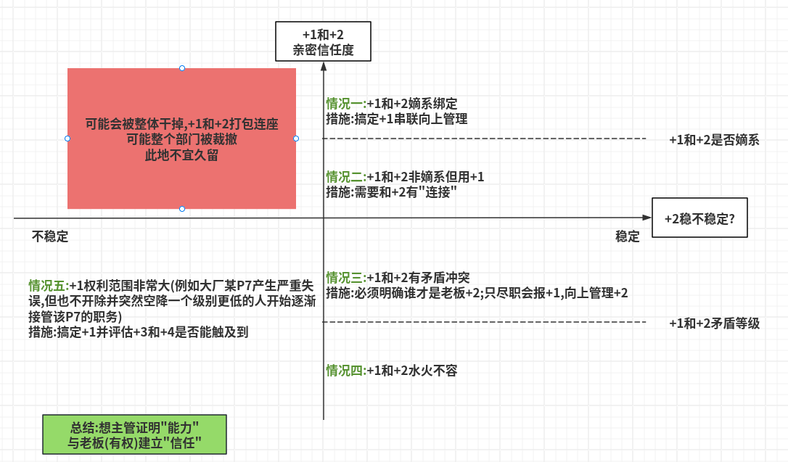
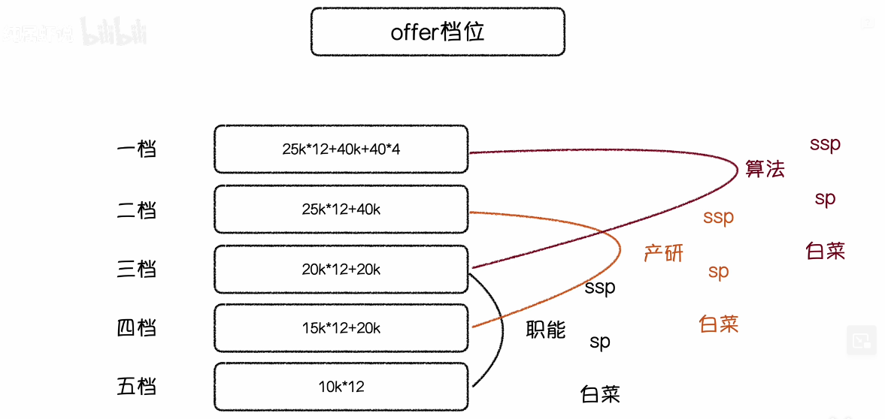
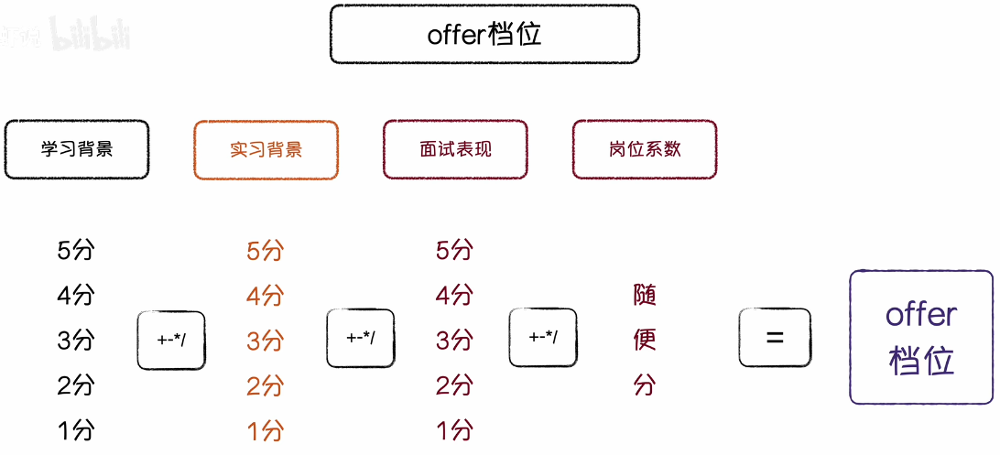
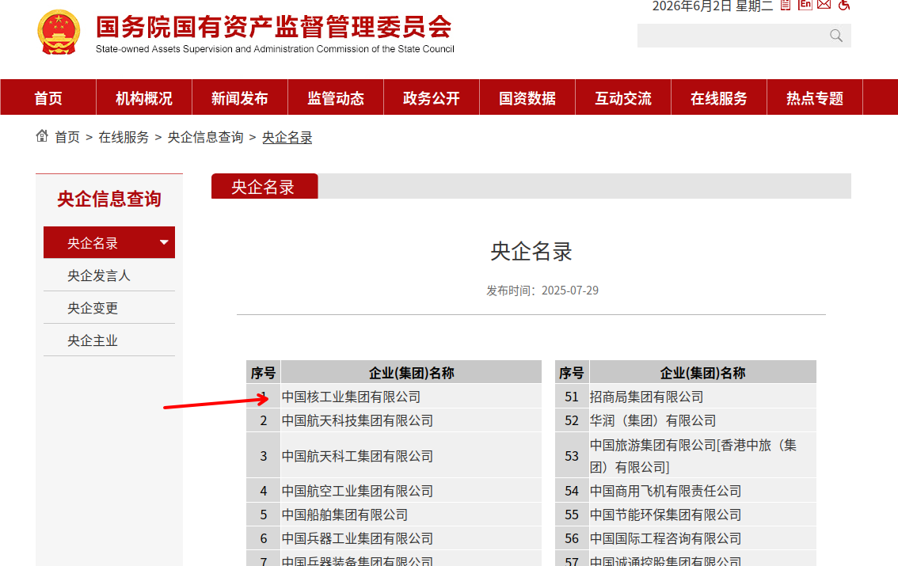
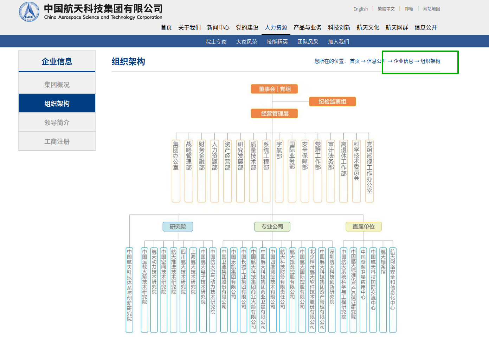
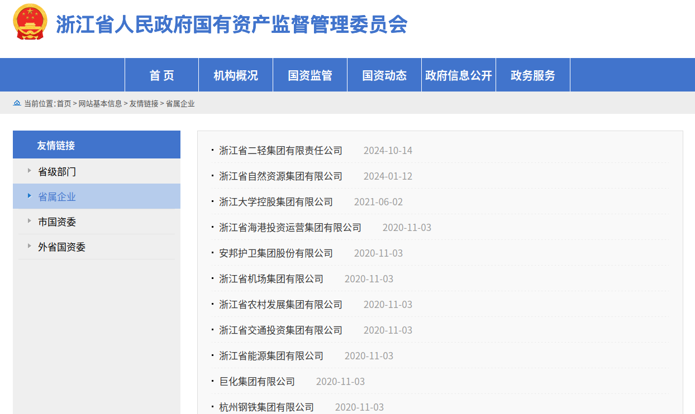
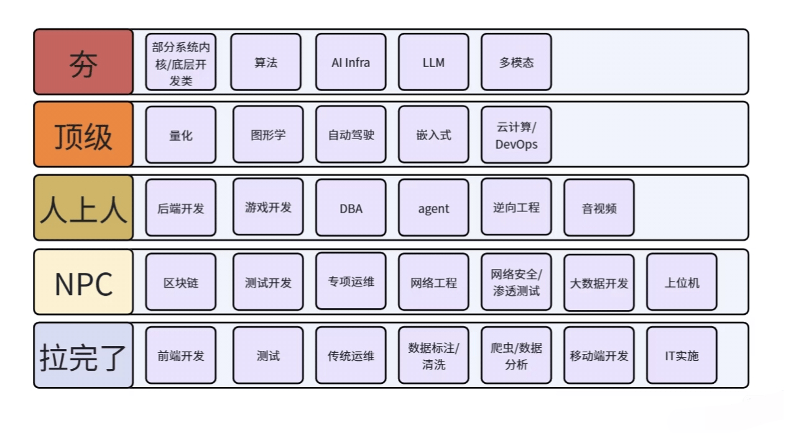

# 目录  
1.就业方向  
2.招聘科普  
3.具体岗位  
4.IT就业形势分析  

## 1.就业方向  
**目录**  
1.1 计划经济体系  
1.2 市场经济体系  
1.3 相关证书  

### 1.1 计划经济体系  
1.计划经济细分  
央国企、事业编、公务员  

2.计划经济体系  
该体系的核心在于"绩优主义",主要为学校好、绩点高、专业对口、简历干净、经历漂亮  
本质上是国家的人才贮备  

3.学历强+院校强(中央选调)  
* 工科生:科研机构、高校实验室(当导师)、航天、军工、国防机要单位
* 文科生:中枢文职部门、官员挂职
* 特点:工资可能八千,但事业的职务内容重大
* 优点:稳定、安全、体面;工作意义巨大不可替代
* 缺点:所有的付出换不来市场的价格只能换来系统的保障(就是钱少);饿不死富不来(其实不太可能毕竟到这个位子上了,小贪不算贪)

4.学历较高+院校还行(定向选调)  
* 工科生:没能进入核心系统的博士或硕士,这类工科生就业不难但是非核心技术人员;例如去高校当老师,要么就是没有编制的合同制、要么就是非生即走的压榨制度、去央国企搞应用工作每年的工作压力也非常大  
* 缺点:表面稳定实则内耗,越努力越发现上升通道被锁死
* 文科生:
  文科生最体面的是考公,最好是考入省直机关或厅级单位
  事业单位编制抢破头
  央国企需要专业对口+笔试面试强+后台
* 缺点:上岸率实在太低

5.学历一般+院校一般(普通选调)
* 工科生:大部分人都是劳务派遣,不是技术骨干仅仅是一个填表人,年年绩效评优但晋升永远轮不到,项目无数但只要领导不点头连调岗都无法满足,不是没有能力而是岗位注定无法被看见
* 文科生:集体失踪,没有编制岗、没有储备岗、没有专项招聘、没有内部通道;只能死磕末端公务员考试
  如果考上公务员(因为是末端的)可能要在镇里干十年,如果考不上很可能一辈子在这个系统

6.行业性质
* 国企:笔试要求高、面试要求中、薪资看行业垄断(烟草、电网和运营商就不能比)
* 公务员:笔试要求高、面试要求中、薪资看地方(江浙和欠发达地区的薪资肯定不一样)
* 事业编:笔试要求高、面试要求中、薪资看地方、总体肯定不如公务员

### 1.2 市场经济体系  
1.市场经济细分  
民营企业、上市公司、合资外企、自媒体、创业、自由职业  

2.市场经济体系
该体系的核心在于"实用",能解决问题就留下不能解决问题就裁员,学历高不高不是重点重点是你值不值得这个工资  

3.学历好+学校好+项目经历好+人设包装完整  
* 就业方向:大厂、投行、咨询公司、互联网平台;一张图能讲十个商业模型;起薪高发展快跳槽空间大,三年做到主管,五年能独当一面,十年有望进入公司核心管理层
* 问题:这些岗位不看运气只看项目背景
  优质学历(C9)+大厂实习+英文学术+三段项目+会点数据分析,能讲出产品逻辑,会写方案,能加班不叫苦
  学历是门票,项目是敲门砖,能力才是留在牌桌上的筹码(能力是多方面的能力指代)
* 文科生:非常非常卷,一个大厂运营岗位招50个500个硕士投递

4.学历一般+能力不差+缺乏精英感  
* 就业方向:中型民营+区域公司+传统行业+制造业+医疗企业+教育集团+TOB软件服务商+地方金融机构+贸易公司
* 优势:岗位稳定+节奏相对舒缓+虽然无法一飞冲天但胜在,有事干不闹腾;有工资不拖;有团队不压力;干三年跳槽不至于掉档

5.学历一般+能力一般+没有资源  
* 就业方向:销售、客服、教培、电商助力、会展执行、行政助理、人事专员、短视频剪辑、导购、渠道、招商、央国企的外包员工
* 特点:进得去但留不下;太卷+太压抑+太快被替代;能力强公司把你榨干,能力弱公司直接换人;试图跳槽发现所有公司都一样,换了公司没换命运

6.行业性质  
* 私企:笔试要求中、面试要求高、薪资看行业
* 外企:笔试要求中、面试要求高、薪资和晋升不如大厂、且外企的晋升类似体制内,增长速度一般、外企的优点是有人文关怀福利待遇比较好

### 1.3 相关证书  
* 六级
* 雅思
* 教师资格证
* 软考

## 2.招聘科普  
**目录:**  
2.1 招聘流程  
2.2 招聘术语  
2.3 薪资构成  
2.4 校招谈薪战术大全  
2.5 实习相关  
2.6 体制内  
2.7 学历问题  

### 2.1 招聘流程  
**目录:**  
2.1.1 招聘流程时间线  
2.1.2 秋招  
2.1.3 春招  
2.1.4 招聘能力需求  
2.1.5 性格测试  

#### 2.1.1 招聘流程时间线
网申/内推->笔试->面试->业务面->HR面->OC->开奖->三方->报道  

*提示:* 开奖之后如果确认薪资就要签订三方,参考当时特来点  

#### 2.1.2 秋招  
1.体制内时间线  
* 9.1-9.31:如果是C9/985有资格参加选调的,各省份的选调是在9月份
* 10-12月:国考(国家公务员考试)会在10和11月份发考试公告,12月考试
* 2-3月:各省省考
* 4月左右:省市区各个局系统的事业编统考

2.网申时间(秋招时间线)  
offer还是需要尽早投递,不管是秋招offer还是日常实习offer,不要心里想着算法再熟练一点、八股再熟一点再去投递,应该把简历上的内容差不多熟悉+面经+算法一轮后就直接去投递,直接通过面试来检验,不可能是达到完美的准备状态再去投递offer,不要期望很完美再去投递offer!!要快一定要快直接上手  
* 6.1-8.31秋招提前批:集中于互联网大厂+少部分金融机构技术岗
* 8.1-8.31:秋招正式批(主要是互联网大厂)+少量央国企
* 9.1-10.31:秋招高峰(这个时间持续两个月);金融+快消+互联网中小厂+国央企

面试能否通过不在于你多优秀也不在于多努力,而不在于该公司是否缺人,越早捞人的组往往对校招这件事越重视,很晚才开始的组说明小组很忙没有时间捞人,即使不招人也能证明这家公司能够长期运行下去,此时被养鱼的概率就大,offer还是要尽早投递  
另外简历的投递顺序应该是从小到大,从小厂一步步到大厂,而不是上来就先投大厂,当然大厂的招聘时间比较早可以先投一点碰运气,当过了大厂的招聘时间后应从小厂开始,先确定自已能拿到什么层级的offer,然后在此之上不断地去突破上限  
其实简历的投递时间也是有说法的,有一点比较有用,如果这家公司允许更新简历,则投递简历之后如果两三天没有动作,可以修改简历中的一个标点,因为修改简历就相当于重新投递,这样会更容易被HR看到  
投递简历一定要按冲稳保的策略去投递,一定要拉开梯度,不要只盯着头部大厂投递,且投递的时候要投递多个志愿,不要只盯着后端,擦边的岗位比如运维/测开/大数据都可以尝试  
找工作有很多的运气成分,永远不要PUA自已能力不行也有可能是业务不行,团队不行,所以山穷水复疑无路柳暗花明又一村,外面根本没有下雨  

3.投递渠道  
* 官网投递(最推荐):企业官网/企业官方微信公众号
  如果你一次性投递一家公司的多个岗位,当某个岗位捞你的时候,你的简历就被该组锁定,无法同时面试多个岗位  
* 国央企:中国国央企名录
* 公务员:所在省份的考试录用公务员公告
* 三方招聘平台:XX直聘、XX招聘、牛客
  优点:可以同时有多个流程,且很多中小公司没有官网只有这种第三方招聘平台
  缺点:容易造成信息泄露
   
*提示:* 官网投递简历的时候需要一份PDF简历,同时官网本身的系统也需要认真填写,因为系统填写完毕之后会生成对应的表格方便筛选,然后面试官才会下载PDF简历,所以系统优先级>PDF优先级  
如果长时间没有人捞,可以尝试更新一下简历内容(修改一个字/标点符号)会更容易被捞

*建立简历的投递习惯:*  
比如可以每周拿出一个晚上进行专门的网申,也可以每天利用碎片的时间去投递两三个岗位,千万不要长时间堆着不投递,因为岗位一旦堆起来几十个网申摆在你面前你就会天然抗拒(我当时就是),任何时候都不要说自已不行,特别是学历自卑不敢投递那更是不可取  
学历不好,大胆投递简历->每人要  
学历不好,不敢投递简历->每人要  
反正都是每人要的结果,为什么不投递呢?  

4.笔试时间  
这个一般是9月份高峰期,但也不需要太关注笔试时间,因为往往网申通过都非常难(简历关都没法过),甚至大部分企业都没有笔试的机会,有笔试就去做题就行了  

5.面试时间  
10月份和11月份网申和笔试基本上已经结束了,进入到面试高峰期到11月底面试基本上就结束了,此时可以说今年的秋招就到此为止了  
此时如果被录取可以在12月份去实习,但不管有没有offer都需要按照秋招的核心策略持续关注招聘信息+多拿offer  

6.卡专业  
计划经济体系是十分卡专业的对专业代码要求非常严格,一般来说如果体制内招聘要求有基层工作经验的,并不是要下基层而是只要有企事业单位的工作经验都能算做基层工作经验(核心是有没有交过社保)  
体制外就相对宽松  

7.笔试考察内容  
行测、公基、常识、申论、心理测评、主观题  
计划经济体系对笔试的结果十分看重,最后是要按照分数来刷人的(国企除外)  
市场经济体系相对来说笔试只是敲门砖(当然也很重要)  
计划经济体系(公务员和事业编还好因为笔试次数相对固定且少)主要说的就是国央企,往往会考察很多行测常识(这个很容易做吐,当年我就是搞到最后每一家都不重视,但其实这个笔试很重要),国企的笔试不要太当真,除了能源类、烟草、特别看重笔试之外,其他国企的笔试就当作期末考试,它是通过性的而不是选拔性的,不需要花很长时间考很高的分数  
只有明确线下笔试的单位才可能比较重视笔试,国内的国企只有国有行、政策行、电网、烟草以及三桶油中的中石化和中石油是线下笔试,其他还有部分发电集团的二级单位是线下考试,在有一定规模的考试中,国有行和三桶油也不是很看重笔试成绩,三桶油的学历歧视十分严重,所以如果学历一般指望靠笔试进入三桶油几乎是没有太大希望的,所以花很长时间准备国企的行测笔试的性价比是极低的,稍微看一看了解一下刷两套试卷就可以了,将整体正确率保证在60%-70%即可如果是秋招的话8月份开始看就算早的,申论更是没必要准备  
什么人需要准备行测?(1)考公和烟草岗位(考公自不必多说,烟草几乎和公务员是一样的)、(2)电网一批和二批考试(电网一批二批的考试时所有央国企里最公平的,但是电网只有20%的行测,剩下80%都是专业知识)、(3)高学历且极度厌恶技术工作
笔试该上的科技必须得上  
*介绍:* 行测就是考脑筋急转弯,找出下面最特殊的词语/图形,就是那种恶心的题目  
*提示:有的时候可能还会有性格测试,性格测试一般都不会挂,只要体现出自已吃苦耐劳、团队合作、奉献意识就可以了*  

8.面试考察内容  
* 市场经济体系
  深度挖掘个人简历中的内容,例如项目、实习、竞赛;还有很多专业知识层面的考察,其实互联网的面试更多的是一种表演性质,特别是对于校招很难完美回答面试官的问题,所以面试主要是说话得有逻辑
  如果某个岗位铁定去不了了,不管是实习还是正式招聘,要立马跟面试官说结束本次面试,不要想着拿这次面试练手,因为面试后面试官是要写面评的,如果面试地不好这个面评会一直保留,特别是大厂以后再想面试这家公司,一旦调入以往的面评就不利于你的面试,所以不要给面试官写面评的机会,直接终止本次面试  
  如果以后再遇到多人同时面试的情况(多个招聘者同时面试即面试官一对多面试者),一定要警惕这家公司,因为这种群面就不可能照顾到你的个人履历,压根没办法深度挖掘你的项目,只能问一些很通用的问题(其实就是结构化面试,也就是说如果某家市场经济体系的公司采用结构化面试那就直接pass就行了),结构化面试都是很离谱的,如果遇到什么让你玩狼人杀来面试的这种公司,直接pass直接中途退出也可以,首先浪费的是自已的时间其次不要给他写面评的机会  
  市场经济体系
  * 一面和二面基本上是组内同事面试(侧重技术深挖简历)
    * 一面的面试官是未来的直属上级,是未来与你合作最紧密的人(+1)  
    * 二面的面试官一般是一面面试官的同事,或者是一面的直属上级(+2)
  * 三面和四面是总监面(简单问简历,总监面的视角更加宏观可能问你对于行业趋势的理解/看法的一些开放性问题)
  * 最后一面是HR面,一般来说HR面是不刷人的,只有类似阿里这样的公司HR的权力比较大会刷人  
    还有一种被HR刷掉的原因是被养鱼了,同时通过了几个人的面试后综合考虑没有选择你
    HR面不要谈薪资,重点是要表演能努力工作啥的,谈薪资要等到OC再谈
* 计划经济体系
  泛体制内的面试一般称其为结构化面试;比如组里的一个同事和领导发生矛盾了,你会怎么劝他(一般都是这种没有卵用的问题);完全不涉及专业问题,即使涉及专业问题也是非常浅显的
  但是国企技术岗是例外,国企技术岗一般是半结构化面试也会考察八股以及简历上的技术问题,有些大型公司会针对管培性质的岗位设置无领导
  计划经济体系一般只有一次面试,比如很多人一起面试(面试官一对多面试者,这种一般就是结构化面试)这种面试的核心就是领导要看各个面试者的表现,然后评估出最好的面试者

9.OC+开奖薪资  
10月份和11月份是每年的开奖薪资时间,应届生很难Argue薪资  

10.签三方  
详情见:*2.招聘科普->2.5 三方*  

#### 2.1.3 春招  
1.春招岗位  
秋招的岗位一般是由去年秋招的集邮大佬拿了很多offer后剩下没选的offer+2月份发放年终奖之后一部分人员离职后空出的岗位
春招的岗位特点:岗位相对较少、流程非常快、难度相较于秋招会更低  

2.春招实习  
春招的实习分为日常实习和暑期实习  
* 日常实习:公司日常缺人干活,但是又没办法招聘正式员工,因为正式员工招聘流程长/没有HC来招聘正式员工/正式员工工资太高
* 暑期实习:时间在暑期的实习

区别:之前的说法是暑期实习可能要比日常实习重要,一般来说暑期实习是核心业务或者和秋招转正强相关的实习,但最近日常实习和暑期实习的区别已经很小
首先日常实习也能转正,而且日常实习会应为比暑期实习来的时间更早,转正时能提供的述职报告内容也会更多,其次是业务团队和HR往往是相当割裂的,业务团队压根分不清日常实习和暑期实习,往往是招聘需求产生的时间节点在春招期间就挂上暑期实习,如果不在春招期间就挂上日常实习,所以两种实习实际上是差不多的  
* 暑期实习的工资可能高一点(大厂是5000一个月),日常实习大概200一天
* 有些大厂的核心业务确实是只收暑期实习

3.春招时间线(网申时间)  
春招没有那么多批次,就是每年的二月底到三月初  
一般来说岗位放出是大厂在前,中小厂在后,一般来说春招没有截止时间,什么时候招满什么时停,所以一定要尽早开始投递  
1月互联网公司、2月国企子公司(比如数科科技之类的子公司)、3月国企/互联网正式春招投递简历  
3月份相关的笔试就开始了,比如四大国有行、烟草电网二批的笔试、子公司研究院的线上面试也基本上是这个时间段  
3-4月会开启面试的高峰期,国企的面试一般都是线下面试
5.1结束后可以说春招就结束了,陆陆续续会进行签约

#### 2.1.4 招聘能力需求  
1.学生工作  
如果想去央国企总部,学生工作还是比较重要的  

2.奖学金  
只有本科和研一的奖学金对秋招有用(研二拿奖时网申已结束)  
本科是拿国家奖学金最简单的时候,一旦读研整个评价体系完全就变了,此时再去拿国家奖学金不仅要有个人的努力而且还要和课题组的情况息息相关,总之读研后的国家奖学金也是性价比极低的一件事  

3.科研  
论文只是毕业门票,对实际找工作的效益极低,想通过科研来求职是一件效率极低的事件,甚至可以说科研对找工作几乎零作用  

4.研究生阶段(一并在这里说了)  
* 一定要判断哪个老师放养哪个导师的学生最舒服,那些老师放养那些老师push,一般越是push的老师他招的学生就越多,管的严的老师不说放实习了(找工作最重要的就是实习),甚至秋招面试都卡着不让你走  
* 研一上:研一进入学校后,距离秋招只剩2年,距离第一次实习机会只剩1年,研一上就正常上课修学分,把所有的课都挪到研一上,上课之余抽空写论文然后尽快投稿;最理想的情况在研一上要达到,顺利把文章发出去(不一定要中)、把大部分课程放到上学期、找前辈完全了解当前就业的情况/准备路线、没有挂科  
* 研一下:此时距离秋招还有1年半,距离第一次实习还有4个月(也就是研一的暑期实习),对于个人可以功利一点,不要一点点地去背八股,可以直接去刷面经,效率最重要
* 研一暑期:投递日常实习(不是暑期实习,暑期实习针对应届生),HC最多的时候就是7月份的时候,然后就是10月份左右HC也多,日常实习黄金时间是7月份、10月份,直接去刷面经+背诵算法题hot100
* 研二上:7月拿到日常实习的offer后,一般是8月入职,十一月离职(再远的地方也要去)
  谁适合互联网:
  * 家庭条件极好:家里有钱无所谓
  * 家庭条件极差:别谈35岁危机,穷人的危机是没钱,而不是失业
  * 技术狂热者/极度厌恶官僚
  谁适合国企:
  * 家庭中等&恋家:核心动力
  * 回家才是选择国企的第一动力,轻松/稳定都是次要的
* 研二下:继续投递日常实习/春招实习,然后按照对应的时间去实习就可以了
* 研二暑期实习:继续投递暑期实习
* 研三:秋招开始,下面的内容参考,*重点看2.1.2秋招*
  8-9月:军工研究所、互联网公司、手机厂、科技子公司
  10月:电网提前批、运营商本部
  11月:银行、能源类公司(三桶油、国家管网、发电集团)
  12月:体检、签约

#### 2.1.5 性格测试  
1.性格测试会不会筛人  
实际上是会因为性格测试筛人,如果有偏激性格的会直接挂掉,很符合企业人才观的优先考虑,预算比较高的企业且有明确的人才观要求的企业会和测评机构定制专用的可以输出自已人才观匹配程度的试卷  
这个性格测试是挺难作假的,因为现在的性格测试机构都有很多手段来规避你是乱答/有倾向性答题  

2.小技巧  
* 作答时间不能太短
* 在做题之前先了解一下这家企业的人才价值观,把这些关键词写下来,做题的时候往这些方面靠拢
* 不要害怕极端选项

### 2.2 招聘术语  
**目录:**  
2.2.1 内推  
2.2.2 Argue  
2.2.3 秋招实习(实习offer)  
2.2.4 20XX届校招  
2.2.5 +1和+2  
2.2.6 竞业协议  
2.2.7 劳务派遣和正式工  
2.2.8 三方  
2.2.9 实习和试用期  
2.2.10 辨别公司老板  
2.2.11 家庭和事业  
2.2.12 无领导  
2.2.13 管培生  
2.2.10 其他  

#### 2.2.1 内推
内推不是内推码,是通过人脉资源把简历直接给内推给面试官的,只有这种内推才是有用的  
内推码没什么用  

#### 2.2.2 Argue
argue也称为A,简单来说就是薪资议价,校招一般不太好讨论薪资的,除非能拿大厂的offer去argue小厂,校招给你多少薪资接着就行了  
Argue的核心就是offer,所以秋招的核心就是多面试多拿offer不要停下,一般只有两种情况可以A薪资  
情况一:有一家大厂的offer去argue中小厂的offer  
情况一:同时有多家大厂的核心业务offer时,可以相互A薪资  
*提示:详情参考2.4校招谈薪战术大全*  

#### 2.2.3 秋招实习(实习offer)   
一般来说正经的招聘是不存在实习这个东西的,顶多只有两个月的实习也是为了能够让你了解团队的氛围,但是中小厂一般都有招聘实习(白嫖劳动力)实地情况就是中小厂不实习就是没有offer  
一定是先发offer再实习,或者直接发offer  
不能说先发实习offer再转正这种就太坑了,如果确实是不好找这种也能接,毕竟不是人人背景(BG)都很好  
*提示:本节的详情内容可见2.6.4 实习offer*  

#### 2.2.4 20XX届校招  
毕业年份就是对应的某届校招,比如2024年毕业则应该参加24届校招  

#### 2.2.5 +1和+2  
1.+1就是直属主管,他负责你的工作内容分工以及管理考核标准,冲哥就是+1  
工作内容分工->工作舒适度(脏活/价值/资源/卷)  
管理考核标准->绩效表现的一部分(生态位/奖金/评优)  

2.+2  
+2就是有决策权的老板,他会最终审查所有直属下属的考核情况,你的绩效最终由+2拍板,所以+1的管理考核标准只是部分决定,实权还是+2,地哥就是+2  
+2决定职级、薪资、管理团队的人员、人设定位、是否是高潜/晋升->决定你的发展空间、稳定性、变现能力  

3.评估四象限  
  

#### 2.2.6 竞业协议  
1.概述  
竞业协议就是公司防止你去别的公司,与你签订的一份"封口+封路"合约,一般是入职时签订,也有升职/调岗时补签  
此时在离职时就有三种情况:2-4 
竞业协议最长能签2年,但现实中大多只启动1-3个月,公司没那么多闲钱白养人,而且公司可以随时单方面终止协议,主要就是吓唬你,而且不要相信下家帮你赔竞业协议,除非你是顶尖稀缺人才  

2.公司启动竞业协议  
此时公司需要每个月给你一定的补偿金,换取你在竞业限制期限内,不能在同行业竞争公司任职或自已创业的承诺  
补偿金通常为离职前月薪的30%-50%,这笔钱是公司对你不能去竞品公司工作的直接经济补贴  
如果公司连续三个月未支付补偿金,则你有权主动通知公司接触竞业限制协议,恢复职业"自由身"  

3.公司不启动竞业协议  
此时一定要保留公司发出的"不启动竞业协议"正式书面通知、公司邮件邮箱、工作聊天记录截图等,确保此事无懈可击、一定要保留公司不启动竞业协议的证据  

4.公司沉默  
此时竞业协议并未生效,而是处于"待生效"状态,公司仍握有主动权,在此期间你仍有竞业限制义务,切勿贸然入职竞品公司,否则可能面临违约风险,若离职后满3个月且公司未支付任何补偿金,协议才自动解除,在此期间变数较大  
所以离职的时候一定要弄清楚是否启动竞业协议  

#### 2.2.7 劳务派遣和正式工  
正式工是直接和目标公司签订劳动合同,属于目标公司的员工  
劳务派遣的目标公式是不直接招聘你的,而是找到一家中介公司,你直接与中介公司签劳动合同属于中介公司的员工
劳务派遣的薪资相比正式工普遍更低(同工不同酬),如果工作期间受伤面对正式工企业会承担相关责任,而劳务派遣会因为不是该公司的员工就推卸责任,回头找中介公司会因为各种理由推诿扯皮  
正式工的稳定性大于劳务派遣,劳务派遣不需要任何正当理由就可以随意辞退

#### 2.2.8 三方  
1.什么是三方  
三方就是学校、企业、学生之间签订的一个协议,一共是三方所以称为三方协议  
签完三方协议之后这个协议是学校、企业、学生各留一份的,但如果要毁约必须要把公司那边的协议要回来,但是这个协议是有可能被卡的  
三方一定是能拖就拖  

2.拖延三方  
这个可以到时候再去网上搜罗一下话术,也可以直接说学校要等到xxx时间才会开三方,或者直接说有某一家要开薪资了想对比一下  
如果自已手上有其他家的offer且马上要开奖了,则可以适当拖一拖,还有一种情况是手里没有其他家的offer了,只有当前这一家的offer,此时就可以签约三方,大不了再毁约就是了  

3.注意事项  
3.1 拖延三方只适用于市场经济体系,如果是计划经济体系就别耍心思了(泛体制内对程序这一块是很严格的,包括专转本学历不能在泛体制招聘过程中隐瞒)
3.2 拖三方一般不会收回offer,offer一旦发出就具有法律效应一般不会收回
3.3 千万不能有道德感,太老实只能饿死自已

#### 2.2.9 实习和试用期  
1.实习  
实习签订的是实习协议,不是劳动合同,工资叫实习补贴,正常工资一天100-200  
但是从2026年字节有500一天的实习生  

2.试用期  
毕业后入职,公司签订劳动合同入职一个月内必须签订,不签订第二个月起赔双倍工资,试用期工资会打折但不能低于合同工资的80%,且不能低于当地的最低工资标准,五险一金从入职当月就得缴纳,没有转正后再缴纳这一说法  
试用期时长和合同期限强相关:
* 劳动合同在一年以内的试用期不得超过一个月
* 劳动合同在1-3年的,试用期不得超过2个月
* 劳动合同在3年以上的(必须是超过3年,恰好3年是前一种情况)试用期不得超过6个月  

试用期内如果公司想要辞退你,必须证明你不符合录用条件,必须有考核、记录、证据,如果对公司不满意只需提前3日通知公司即可解除劳动合同,没有所谓的试岗期这个东西,先试岗几天如果合适再签劳动合同,这种是不合法的

3.劳动合同续签问题  
假设第一份劳动合同到期后(3年),公司有权利不与你续签,但有几种情况公司是需要赔偿的  
|     谁不想续签     |          续签条件          |                              结果与经济补偿                              |
|:------------------:|:--------------------------:|:------------------------------------------------------------------------:|
|     公司不想续     |          任何条件          | 公司必须支付经济补偿金工作满N年 补偿3个月的工资(3\*过去12个月的平均工资) |
| 公司想续,你不想续 | 降低了原合同待遇(如降薪) |        公司仍需支付经济补偿金 因为由于公司条件变差导致你无法续签        |
| 公司想续,你不想续 |    维持或提高原合同待遇    |              公司不需要支付任何经济补偿金 是你自己选择离开              |

4.无固定期限劳动合同  
在3.劳动合同续签问题中提到,如果第一份合同到期公司可以选择不续签,直接给N的赔偿,但如果第二个合同到期(也就是说第一个合同到期后续签第二份合同,不管第二份合同签了多少年此时如果第二份合同也到期了),那么只要你主动提出,公司将必须和你签订无固定期限劳动合同,此时除非你主动想走,否则公式就不能再以合同到期为由不再续签了  

#### 2.2.10 辨别公司老板  
1.使用爱企查  
看当前公司是否有关联风险,如果关联风险非常多就需要警惕了  

2.劳动争议  
看这家企业有没有劳资纠纷,尤其是官司已经打完的,可以去里面看一下法院的民事判决书,它会非常详细地记录真个纠纷的具体信息,以及法院最后的判决  

3.提前实习去了解公司

#### 2.2.11 家庭和事业  
家庭和事业很难兼顾,要么事业要么家庭,关键在于你如何去balance,这个问题一定要想清楚  

#### 2.2.12 无领导  
这是一种非常经典的集体面试(群面)形式;简单来说,就是把6到12个互不相识的应聘者放进同一个房间,给你们一个具有争议性或选择性的题目,在没有任何人指定"谁是组长"的情况下,让你们在规定时间内(通常40-50分钟)通过讨论达成一致意见,并派代表进行汇报  
面试官(通常是国企的人资HR和中高层领导)会退到房间的角落,全程不参与、不引导,只是默默观察你们每个人的表现并打分  

#### 2.2.13 管培生  
1.基本介绍  
管培生就是挖掘一些有潜力的学生,通过相应的培训培养成企业未来的管理者,管培生理论上是很好的理念,但实际层面必须有对应的资源支持,就目前而言国内的大部分企业实际上是没有管培生的需求,所以其实很多公司并没有成熟的校招团队,所以很多管培生只是给普通的岗位换了一个名字而已  

2.如何辨别好的管培生  
* 去看这家公司中层以上的管理者有多少是他们自家的管培生项目培养的,比例是多少,如果有而且挺多那么说明这家管培生是实打实培养出了人才
* 观察面试时的体验和offer,真正的管培生项目企业会比较重视,一般会派高级别的面试官甚至直接由高管来面试,管培生的薪酬比普通岗位要高
* 看公司校招岗位结构,管培生的需求通常是根据3-5年之后部门管理需求、高潜人才率、组织架构调整预期等估算出来的,一般这个占比不会高于总需求的10%,所以如果在校招时看到这家公司有很多的普通岗位再加上一两个管培生,那么这种可信度大一点,如果这家公司大部分甚至全部都是管培生那么你就当这是普通岗位

#### 2.2.13 意向书  
1.基本介绍  
这个一般见于提前批、暑期实习转正的,也就是已经确定转正了,但是转正的时间比较早大概是8-9月份,此时各家都还没有开薪资,而互联网大厂一般都是统一开薪资比如10月份,所以先给你一个意向的意思就是你已经通过面试了,但是具体的薪资要等到发offer的时候再告知你  

2.注意事项  
* 可以同时接收多个意向书
* 和offer的本质一样,毁意向书约等于毁offer
* 口头意向书不能太当回事,意向书也是必须有书面意向书
* 意向书可以拒绝,无论是意向书、offer、三方都是可以拒绝的,唯一需要注意的就是不要玩消失

#### 2.2.10 其他  
泡池子:排队等offer  
捞简历:挂了又被捞起来  
pending:待定  
4\.HC:招聘人数
5\.OC:打电话沟通offer意向,此时薪资已经确定了,直接同意让HR发offer就可以了  
6\.开奖:就是给出具体薪资  
6\.JD:职位描述(包括岗位要求和工作内容)
7\.SP:比通常该岗位更高的薪资,也称小sp
8\.SSP:比SP更高的薪资,也称大sp
9\.OD:外包
10\.OT:加班
11\.OL:确定接受offer之后,公司发送的offer邮件
12\.BG:学历背景 
13\.OR:事业群
14\.BU:公司里的某个业务单元

### 2.3 薪资构成  
1.薪资构成=现金+福利  

2.现金  
* 底薪\*月份
  20K*16-多出来的4个月就是年终奖,20K是税前薪资
  一般互联网公司就是月base高但年终奖低,而体制内是月base低但年终奖高,这两种方式又有说法
  1.现金流与抗风险能力
  base高:每个月拿到的现金多,这意味着你每月的还贷能力强、消费自由度高
  年终高:这种结构具有极强的捆绑性;如果你年中想辞职,那大几十万的年终奖基本就泡汤了
  2.社保与公积金的基数
  base高:通常按实际月Base作为基数缴纳,如果Base高则住房公积金账户每个月进账就多,这对买房还贷是实打实的助力
  年终高:虽然体制内base低,但体制内的公积金缴纳比例通常是顶格的(12%),而且体制内有职业年金+极高的医保报销额度;所以这一项这两个差不多
  3.税务成本
  base高:每个月都会被按高税率扣税
  年终高:虽然年终奖也要扣税,但如果能使用一些政策且有操作空间的情况下,在同等总包下,体制内的综合税负往往更低,到手钱更多
  4.综合
  互联网绝对还是base高优先
* 年终奖
  理论上年终奖就是多出来的4个月乘底薪20K也就是8W,但实际上还需要乘一大堆系数,比如在原有的年终奖基础上x公司系数x部门系数x个人系数x时间系数
  提一嘴时间系数,因为校招生是每年的7月份入职,所以在公司的工作时间只有半年,所以第二年在发年终奖的时候直接就x时间系数0.5(不要对公司留有幻想)
  并且如果拿到年终奖立刻走入也是有损失的,坏就坏在一般都公司要到年后三四月份发,那么这几个月本来能算到今年的年终奖你就拿不到了
* 绩效
  就是提成,一般存在于销售岗或科研岗位签横向给提
* 期权+股权
  期权即一定时间之后允许你以一定价格买一定股份
  股权是你已经持有的公司利益
  所以一般说互联网百万年薪的offer一定是有股权的,不可能真的一个月工资10W太夸张了
  与此同时股权是有解锁时间+解锁条件,并不是说拿到股权就立马能够变现,比如解锁时间3年就必须等3年之后才能拿到这笔钱,如果中间走了就一分没有
* 加班费
  没有

3.福利  
* 补贴=政府补贴+公司补贴
  * 政府补贴:一般是人才引进的,例如生活补贴、租房补贴、安家费
    人才引进的坑详情见:*6.总包40W的offer案例->6.3 人才补贴*  
  * 公司补贴:各公司政策可能不一致,例如租房补贴、交通补贴、油补、过节费、通讯费、电脑补贴、补充养老、补充医疗、供暖补贴、职称津贴、高温补贴、餐补、儿童节补贴
    这些补贴你并不一定是全能拿到手的,比如租房补贴必须租指定的房子才有的补贴、交通补贴必须有车才有的补贴、职称津贴的前提是你有职称、儿童节补贴的前提是你有孩子;实际上绝大部分你都不满足条件压根拿不到,再提一嘴租房补贴如果是限制距离公司多少公里的房子才有补贴,这种巨坑,因为狗中介也知道这个地方的房子有公司补贴,所以房租反而会异常高导致这部分补贴被中介吃掉,即补了个寂寞  
  注意这些补贴不管是政府的还是公司的补贴也是一律要缴税的,只有极少特定项目不要缴税(差旅费津贴、独生子女补贴)
* 类现金=五险一金+卡券
  * 五险一金=医保+医疗+生育+工伤+失业保险+住房公积金
    体制内的五险一金是拉满的,甚至还有很多补充公积金、补充医疗保险
    大厂的五险一金基本也是拉满的,按照五险一金的最高比例12%缴纳
    这里参考下面的补充5.缴纳基数和缴纳比例  
  * 卡券
    没什么用,打车卡、蛋糕卡、读书卡

4.听上去是福利实际上是坑的
* 十点以后的打车报销->加班
* 弹性工作制->上班不弹性,下班弹性
* 零食不间断供应
* 团队年轻化->离职率高
* 重点发展创新业务->赛酷体育(业务随时裁撤)
* 8点有夜宵卷->加班
* 工位很大能堆满个人的私人物品->加班
* 吃饭时间不是6点->可能存在隐形加班
* 包括上述3.福利里的各种补贴也不一定是你全部都能拿到手的
- - -
下面是工作一段时间之后如果有以下相应的政策变动,说明这家公司开始出问题了  
* 提前到岗时间
* 严抓考勤
* 取消普调
* 延迟晋升

5.五险一金  
五险一金=缴纳基数*缴纳比例 先算五险一金再扣税 

5.1 五险一金缴纳基数在不同时期的表现  
缴纳基数分为两种情况,如果是新人入职第一年,通常月Base就是缴纳基数,但实际上缴纳基数应该是你上一年度的基本薪资+年终奖+津贴等全部收入除12,所以因为第一年没有上一年的数据参考只能用月Base作为缴纳基数,但是到了第二年就会按上述算法修正过来  
*所以同样是40W的offer,如果一个是25K\*16和15K\*20最后更划算的一定是月Base高的即25K的*;但如果将范围就限定在五险一金而言,只有第一年月Base高的有优势,到了第二年月Base高和年终高的实际上是差不多的,但依旧月Base的优先级最高 
比如8K\*28的薪资结构,这种月base低但年终高的之前说过符合体制内的特征,而国央企的公积金缴纳基数一般是全年收入/12,这个全年收入是包含年终奖的,但作为应届生由于你没有前一年的工资,所以只能按照月8K来作为缴纳基数,如果按照全年收入/12作为缴纳基数,则这个缴纳基数是能达到1W+的  
住房公积金缴纳比例一般是5%-12%,从基本工资中扣除一部分缴纳到公积金账户中,个人缴纳一部分公司缴纳一部分(公司和个人缴纳的比例相同)  

5.2 五险一金的上限和下限  
上限:如果你的实际工资很低,甚至低于当地社平工资的60%,那么系统会强制按照社平工资\*60%作为基数来扣你的8%  
上限:如果你是高薪技术人员或管理层,月薪高达5万元,而当地社平工资的3倍(300%)只有2.4万元,那么你的基数就会被封顶在2.4万元,超过的部分不计入缴费基数

5.3 五险一金具体项目
个人账户:个人缴纳的部分,缴纳的钱也是直接存给个人  
统筹账户:公司缴纳的部分,缴纳的钱是进入社会大水池的,大家一起交钱进去谁遇到困难谁就从里面拿  

* 养老保险(个人账户8%-统筹账户16%)
  只要在退休前累积缴满20年,退休后可按月领取养老金,它这个是累积缴纳中间断交不影响(江苏这边可能不允许断交,浙江那边可能好点),缴费年限越长缴费基数越高退休后领取的养老金就越多
  个人缴纳的直接存放到个人账户中,在退休后会按月发放给自已,公司缴纳的直接存放到统筹账户供当下的老年人领取,等我们退休后的养老金要靠那时候的统筹账户
* 医疗保险(个人账户2%-统筹账户8%)
  覆函门诊、住院及购药费用,大病住院报销比例可达50%以上
  累计缴纳医疗保险满30年,退休后可享受终身医保报销权益
  如果断缴后在3个月内补缴,则需要等4个月后才能恢复使用,小于6个月内补缴需等半年,超过12个月补缴需等一年恢复使用,医保最好不要断交,断交可能会将之前缴纳的医保清零
* 失业保险(个人账户0.5%-统筹账户0.5%)
  失业保险只需累计缴满一年后,因被裁员、合同到期等非本人意愿原因离职时可以申领,有些地方还要求出具失业证明/下岗证明,最常可以领取2年,领取区间医保由国家统一缴纳
* 工伤保险(个人账户0%-统筹账户不固定一般为0.2%-1.4%和工作危险程度相关)
  受保范围:工作时间工作场所受到的事故伤害、上下班途中受到非本人主要责任的交通事故、患职业病的情况
* 生育保险(个人账户0%-统筹账户不固定一般为0.5%-1%和地区相关)
  连续交满一年即可报销产检费、生产费等相关医疗费用、同时还可以领取生育津贴(相当于产假期间的工资补贴)、部分地区的已将福利扩展至男职工配偶
* 长期护理保险(补充医疗保险-费用完全由公司缴纳)
  补充医疗保险是商业保险,他没有缴纳基数和缴纳比例的说法,跟个人工资不挂钩,是目标保险公司对你的公司评估后给出每人每年的保险费用(每个人都是一样的费用),然后公司统一缴纳后你就享有了一年的补充医疗保险
  它的特点是相较于医疗保险而言,医保有起付线、报销比例、报销目录、以及封顶线,如果生大病或住院,个人依旧要花费不少钱,那么补充医疗保险会在医保报销的基础上,再次大比例报销,另外就是门诊也能报销
* 住房公积金(个人和单位共同缴纳相同金额,比例一般为5%-12%,但是该金额只进入个人账户不进入统筹账户)
  企业必须缴纳,资金全部存入个人账户,仅仅可用于租房/买房/装修等住房相关花销
  缴纳5%=>抠门/初创企业
  缴纳7%-8%=>中规中矩
  缴纳12%=>国企/大厂福利
* 企业年金(补充养老金)
  企业缴纳-不超过个人缴纳基数的8%
  个人缴费-企业和职工个人缴费合计不超过缴纳基数的12%(因为企业缴纳的比例是不固定的,所以这一项的意思就是企业缴纳的和个人缴纳的最终不超过缴纳基数的12%)
  缴纳的金额全部存入个人账户,企业及其职工在依法参加基本养老保险的基础上,自愿建立的补充养老保险制度;它属于第二支柱养老保险,用于提高职工退休后的生活水平,然后这里面还有坑,就是自已缴纳的那部分100%进入到个人账户,但公司缴纳的那部分可能会设置一个"工作年限",比如干满一年企业缴纳的20%属于你,干满3年企业缴纳的60%属于你,干满5年企业缴纳的100%才属于你
* 补充公积金
  简单理解就是和住房公积金的缴纳规则完全一致,比例一般为1%-5%,补上加补!

6.怎么看待薪资结构  
6.1 月base高是王道
6.2 看账期;所谓的账期就是之前包括*6.总包40W的offer案例*提到的各种需要延迟发放的资金,比如年终奖、股票、期权、签字费等等;账期长的一定要慎重,首先是这个钱不能立马给到你,其次就是时间越长未知数越高
6.3 校招一般不A,但是一定要问清楚细节,比如月base、五险一金的缴纳比例等等

7.总包40W的offer案例  
7.1 月薪
7K*12 = 8.4w-扣除个税大概到手6.7W
*提示:* 这里的个税都按照0.2的比例简单计算,也就是原收入乘0.8

7.2 年终奖
年终奖20个月 7K*20=14W-扣除个税大概到手11.2W
而且年终奖一般可能不是1月份发,大部分公司都要到年后甚至4月份之后发前一年的年终奖,所以如果你被裁掉,这部分最大的饼你就没了  

7.3 人才补贴  
补贴3.6W(基本上也只有杭州能给到这个数了),苏州的话本科生1W硕士2W-扣除个税大概2.88W  
人才补贴的坑就是,像苏州他是每年统一的时间申请并且申请的时候得有政策的社保缴纳,而且申请之后并不是一次性打给你8K,而是每个月打给你一点钱并且在这个过程中你不能有社保断交  

7.4 签字费  
签字费就是说校招的时候人家认可你,只要你签约了不去别的公司我就直接给你5W,这差不多是一种奖励政策,必须等到入职之后才会发放-扣除个税大概4W  
但是这里发放也是有坑的,和人才补贴一样,可能刚入职会给你2W,但是后面的3W可能得等到转正也可能是工作第一年发1W,第二年再发1W这种  

7.5 安家费  
很多地方都政策是必须在本地购房之后才会给这个安家费,如果是租房那是一分没有  

8.晋升  
国央企一般是通过普调涨薪,一次500(非常缓慢)重点在于国央企稳定  
市场经济体制一般是通过跳槽涨薪,一次20-30%,两三年一跳  

### 2.4 校招谈薪战术大全  
1.定底线  
一定要明确自已能够接受的底线薪资,可以通过offershow来横向对比,看各方面条件相同的  
在招聘软件上写的薪资区间只看最低价(不要幻想最高价那一档)  

2.判断岗位性质  
简单来说就是判断是计划经济体系还是市场经济体系,详情见*1.就业方向*  
体制内无法谈薪(只要了解薪资结构就可以了),只有体制外的少部分人可以A薪资,大部分也都是A不了的  
关于Argue详情见*2.2 招聘术语->2.Argue*  

3.1 谈薪时间  
一般有两个时间分别为体制内和体制外
一是立刻谈这种常见于体制内,比如国企就是众多领导来面试你把所有的候选人都面试完毕之后立马发offer  
二是体制外的谈薪一般只发生在两个环节,一个是HR面时的期望薪酬,另一次就是开奖的时候HR问你这个offer是否满意接受  

3.2 谈薪前
必须明确自已的底线薪资、筹码、目的  
最好能搞清这家公司近几年的薪酬情况,最好能搞清他们有几个薪酬档位,每个档位的薪酬结构是什么样子的

3.3 谈判时  
打太极->如果HR问薪资预期先不说自已的期望薪资,先问薪资结构->薪资结构聊完之后有两种可能  
情况一:HR直接出价格,如果符合预期就接受如果不符合预期就直接说距离心理预期有点远,说出自已手里有其他家的offer来压制HR,如果确实个人能力优秀+筹码够多+组内想要的情况下HR会给你去要薪资的  
情况二:HR还是不主动说薪资,还是问你心理的价位是多少,这个时候只能说出一个价格,出价的时候把个人的底线提高3-5K(因为会有还价过程),HR听完你的期望薪酬后大概率会有两个结果,一是HR自身没有权限调整你的结果,他只能给出一个对应的HR评价;二是HR有权限,他可以通过调整自已的HR评价,去调整你最终的offer档位,谈期望薪资的时候不要报得太高不要超出这家企业的承受范围  

3.4 谈判后  
当HR确认争取之后,过了一两天之后然后直接联系HR,就说其他家的offer的薪资方案已经确定下来了,然后问对方我这边的进展(施压),一定不能是虚假offer,必须得有真筹码  

4.别辩论多观察  
有的时候有些公司的薪资结构就是不透明的,HR很多时候也只能说出一个大概,所以这个时候就不要辩论要多观察这家公司总体的调性(真不真诚之类的)  

5.薪资很重要但也不是最重要的,特别是几家公司的薪资差距在3K以内时,就要慎重看业务是否健康/组内氛围是否push  
如果有机会一定要去公司提前实习(注意提前实习不代表是实习offer,提前实习一般只为期2个月)  
提前实习期间如果发现这家公司不对劲,一定要赶紧准备春招,即使希望渺茫也要下定决心,提前实习不需要担心表现不好被辞退  

6.高薪和Argue的核心就是offer得多,也就是说不管什么时候面试不能停,多面试多拿offer  
不能降低对外界的信息敏感度,即使拿到了满意的offer还是要经常留意招聘信息  
**完全不要对骑驴找马对公司offer放鸽子有任何的负罪感**  

7.offer薪资是怎么算的  
中大厂在制定校招薪资的时候,往往会根据金额的不同先初步分成3-6档薪资水平,同时企业会根据职位类别分成类似算法/研发/产品/运营/职能等不同的职位体系,这些不同的岗位和体系交叉后会形成大家所熟知的劝退价/白菜价/SP/SSP  
  
划分好档位之后HR会根据档位确定每一个档位要招聘的人才比例,也就是各个档位要发放多少offer,总体上遵循中间力量为主,也就是说sp和白菜的数量应该是差不多的  
此时HR会制定一套offer档位评级的规则,在这套规则里,简历内容、实习内容、面试表现都会具象化为一个个都面试指标,这些指标进行一些列的运算后你的offer结果就出来了  
  
以上图中的算法举例,在面试之前个人的学习背景、实习背景、岗位系数都已经确定了,所以当唯一不确定的面试评级确定好了之后,就能算出对应的offer档位  
对于HR来说开奖其实是非常谨慎的一个操作,有一个很重要的指标叫offer接受率,如果offer接受率很差且因为你的薪资给的不合理的话就是一个很大的问题,所以现在各家大厂的趋势是先把offer给发了,但是具体多少钱先不说先熬一熬其他大厂的情况,这个时候这些HR也会去论坛去蹲一下其他大厂开奖的情况,并且根据实时竞对公司开奖情况以及市场的反应去对自已的offer薪资做出一定的微调,所以只有开出一个HR满意、老板满意、学生满意的offer后HR心理的石头才落地,所以HR也挺卑微的  

8.要不要说已有的offer  
8.1 如果有其他的offer,但是更想去当前这家公司,可以说,我目前确实拿到了几个offer,但从平台上来说我觉得咱们公司更大,同时我和上一轮面试官沟通了不少关于团队业务的内容,聊的也很开心,如果有机会的话是更愿意来这里工作  
8.2 如果有其他offer,但是想拿其他的offer来A这家公司,可以说,我目前确实有几家在流程中,然后也拿到了几个offer,但其实我对咱们这边的业务和团队是比较感兴趣的,所以也会结合平台、薪资、培养以及成长空间来去做选择  
8.3 没有offer,因为我之前一直在实习做论文之类的事情,最近也是刚开始根据意向度按顺序投递简历,咱们公司也是我比较先投递的,目前还有几家是正在推进流程中的  

### 2.5 实习相关  
**目录:**  
2.5.1 实习  
2.5.2 暑期实习转正  
2.5.3 春招实习  
2.5.4 实习offer  
2.5.5 如何提炼实习经历

#### 2.5.1 实习
1.不要all in实习转正  

2.心态上要当大爷,日常实习不要被PUA了,反正不考虑转正,如果你离职了最后损失廉价劳动力的是对面的公司  
实习面试的时候要造火箭,面试通过进去了要学会装唐,实习不是去干活的  
一定要跟领导要求想要了解完整的项目,也就是要了解一个业务线完整的项目(可以是原型图/设计),最好就是能跟业务线走一个版本的需求,最后一定要按照 *2.6 实习相关->2.6.4 如何提炼实习经历* 提炼到简历里面以便后续面试的时候有东西聊  
实习的名声>实习的质量>实习的次数-实习的质量要自已提炼编故事到简历里面,以便正式秋招的时候能吹出来  

3.岗位投递  
比如研二的暑期实习一定要海投(从2月份开始一直都有岗位),最开始的时候可以先从中小厂的日常实习投递,然后尝试投递大厂的实习,不要想着一下子博个大的,饭要一口一口吃,目前大厂的面试是无限复活的,如果有信息是可以反复投递的也不需要害怕面评的事情  
没有约面->投递太少或者简历书写有问题  
一面挂->专业基础不扎实、面试能力欠缺
二面挂->运气问题  

4.不要沉迷文档(前期)  
刚进组不熟悉业务的情况下,领导会丢给你一堆文档熟悉业务,此时千万不要迷失在文档里面;应该先拆分框架提出与业务相关的"北极星"问题,也就是什么问题研究明白了该业务就明白了,此时要对业务框架进行拆分,然后把这些框架慢慢填充完整从而对整个业务有掌控感  

5.差不多意识(中期)  
互联网公司每天都工作量太多,必须要合理分配个人的时间和精力,最终批量化产生70分的内容(这就和当时华祥科技一样了,一个需求是能跑就行还是要完美?一定是完成>完美千万不要加班)  
一定要多提问工作留痕多同步进度  

6.观察判断意识(后期)  
在中后期一定要反复判断这家公司是否值得你留下,留下的概况有多大有没有发展空间,行业是否还是良好的发展趋势,这个组和导师值不值得你留下

7.补充说明  
日常实习、春招实习/暑期实习、实习offer(秋招实习)全都是不同的概念  

#### 2.5.2 暑期实习转正  
1.概述  
*提示:* 暑期实习转正和实习offer转正是不同的概念  
* 不要all in暑期实习转正,转正必压价但是可以留一个保底的暑期实习转正offer(如果投入精力不是很多的情况下可以争取一个保底),这样后续秋招的时候能够更加游刃有余  
* 但是从2026年开始,字节的实习生能拿到500一天的薪资,所以要不要all in暑期实习转正这点在未来可能有变数,就目前的情况而言大家还都是轻实习重秋招,但字节开了先河各家大厂后续如果更进的话,实习和秋招的天平可能会发生倾斜  
* 对于拿到暑期实习的资格,最重要的是八股和算法,至于项目、论文都是次要的  
* 暑期实习的招聘时间是每年的2-6月,实习时间是6月-10月,招聘对象为次年毕业生,难度较高,有明确转正机会  
* 暑期实习挂了不会对后续的秋招提前批、秋招正式批、春招产生影响
* 暑期实习的难度大概在提前批和秋招的中间,也就是比提前批难比秋招简单
* 暑期实习的offer可以拒绝,但是一定不要放鸽子
* 暑期实习收到转正offer一般是不包含薪资的,因为一般在8、9月份才能完成实习考核收到offer,但此时各家大厂还没有完成定薪,所以此时收到的是意向书

2.实习转正压价套路  
2.1 刚入职  
拿HC画饼(一开始进去说有转正HC,但是等到9月份的时候就没了)、表达对你的重视  

2.2 入职一段时间后  
营造良好的团队氛围(给你简单的需求+对应的资源)夸你能够独当一面-跟TM当时华祥一毛一样  

2.3 临近转正  
态度发生180度大转变-"之前的HC是有,但是现在的HC不太够,你放心我肯定帮你争取,最近产出不太够,项目未能按照既定时间交付(我TM太熟悉了)"(开始PUA)->为的就是压低价格给你白菜价,而且暑期转正时间都是9月份了,早已经过了提前批此时HR可以放心大胆地压低薪资  

3.不被压价的正确方法  
3.1 核心就是当海王;还是之前反复强调的那句话"多面试多拿offer"  
3.2 前期做好判断看组里面是否缺人
比如当时华祥那家的情况组里面就是不缺人的(有廉价劳动力更好,但我们两个走了完全不影响业务线)
如果遇到这种来人算"锦上添花"的小组要小心
另外一种情况就是组里只有两三个人而且每次都业务量很大,这种就属于很缺人的组,组里人数少不代表就缺人,比如赛酷体育人也少但业务量也少其实不算缺人  
还有一种情况就是7月份的时候,组里人数少且业务量也大完全是忙不过来的那种,一开始看着这家可以转正,但是到8月份突然社招了两个且又添加了一名实习生的情况下就没必要硬留了,所以策略是动态转变的  
3.3 中期的核心不是干活,而是必须把这段实习经历提炼到后续的面试,要充分挖掘当前的业务线填充简历形成面试模板话术,详情见4.工作相关->4.1 如何提炼实习经历  
3.4 后期要抓住校招提前批,越早投递越好2.1 招聘流程->2.1 网申时间(秋招时间)

4.核心就是当海王->出去了发现外面没有雨  

#### 2.5.3 春招实习
详情见2.1.3 春招->2.春招实习  

#### 2.5.4 实习offer  
1.分类  
一般实习offer又分成两种,一种是给你发秋招offer但需要你提前过来实习,另外一种情况是虽然是秋招的岗位但是得先来实习,实习结束表现好才发offer  

2.实习offer去不去?  
说实话得去,不能不食人间烟火  
实习的时候还是老生常谈,不要傻干活一定要骑驴找马,每天把会议室订满到点有面试的话直接会议室消失  

3.近些年实习的质量大于数量(当然数量依旧很重要)  
如果有很多段实习/工作经历,则面试官会深挖最近的几段实习经历和与当前项目最匹配的实习经历  

4.还可以参考 *2.2 招聘术语->3.秋招实习(实习offer)*  

#### 2.5.5 如何提炼实习经历
1.概述  
通过以下几种模型来总结日常实习中的内容点,主要有工作型、数学模型型、偷感很重型  
实习经历的提炼,要求我们尽量看到完整的业务流程和逻辑,了解业务的定位以及组织架构,包括实习生的定位、导师的定位、同事的定位、团队leader的定位,了解业务链条和流程,了解清楚上下游对接人的职责  

2.工作型  
把每一次任务都按照下面6点进行拆分回答>背景、目标、收益、行动、结果、复盘  
*补充:*  
收益-任务的预期收益是多少,通过什么样的方法估计出该收益,是否可量化
行动-如何把目标和收益拆分成一个个的seciton(片段),这些片段具体干了什么,为什么要这么干
结果-行动之后的收益如何,是否达到了之前的预期目标,达到了多少?没达到多少?达到的原因是什么?没达到的原因是什么?
复盘-能不能总结出一些可复用的方法论;或者在本次任务(assignment)中学到了什么经验教训  
平常每完成一次需求都需要进行整体的总结/复盘  

3.数学模型型  
在电商业务背景下,引入获取更高GMV的公式,即GMV=客单价\*购物频次;此时进一步说明当前组内的工作是通过提高购物频次来提高GMV的  
购物频次=看到商品的人数\*点击率\*下单率\*支付率\*复购率  
有了这个公式之后把自已的工作内容往里进行填充
* 完成投送广告业务提升看到商品的人数
* 优化商品卡样式提升商品的点击率
* 降价促销提升下单率
* 先用后付/运费险/仅退款提升支付率

4.偷感很重型  
组里多少人?怎么分工的?回报给谁?组织架构?产运研如何协作?评审周期是多少?决策者是谁?  
面试官的考量:用这种细节追问来打探获取其他公司的信息+测试你是否真的实习过+为了自已日后跳槽准备  

### 2.6 体制内  
**目录:**  
2.6.1 国央企  
2.6.2 选调  
2.6.3 国考/省考  
2.6.4 事业单位  
2.6.5 高校/科研院所/医院  
2.6.6 人才引进  
2.6.7 军队文职  
2.6.8 三支一扶  

#### 2.6.1 国央企  
*提示:本节可详情参考3.1 国企*  
1.国央企的招聘时间  
国央企的招聘时间是每年8月份有少部分提前批,高峰期从9.1开始基本上也是到11月底进入低谷期,但是国央企的招聘跨度是很长的,一般能够持续到毕业(其实私企也是这样),所以机会一直有要多面多拿offer,所以国央企是量大管饱的  

2.国央企早已没有编制  

3.国企只是相对稳定,真正好的国企就两个字"垄断",不要投市场化国企  

4.社招问题  
国央企很少社招,而且社招放出的岗位质量都比较低,大部分都是外包或劳务派遣  

5.投递国央企的简历之前,可以重点先复习一下行测和申论,大概花一点时间学一下就可以了  

#### 2.6.2 选调  
1.选调分类  
中央选调、定向选调、普通选调  

2.选调特点  
* 选调是学历大于一切  
* 选调生第一年在单位工作,第二年需要下基层工作2年  
* 选调很多是先考试再选岗位
* 选调可能会选而不调,就是下基层的2年工作完毕之后不给你调回原先的单位(这个是真实存在的)

2.选调发布时间  
选调是只针对应届生,发布时间最早一般是9月份,最晚是过年后的2-3月份  

3.中央选调  
直接去中央国家机关部委工作  
要求:清北独一档,大部分985/C9+中国政法和中央财经可以走央选(34所具备中央选调的学校,32所985和2所211)  

4.定向选调  
去各个省的省直,省会市直/地级市的市直
要求:剩下的985+211+一部分双一流可以走定向选调(39所985或本省的重点本科或5大政法大学的法学专业)  

5.普通选调(也成为非定向选调)  
如果没有资源和背景,大概率会出现选而不调的局面,下放到基层岗位后不调回原单位  
要求:几乎所有的大学都可以走普选  

6.去哪里收集信息  
定选/普选=>看学校的就业指导中心+选调生信息网+各个省的人力资源与社会保障厅人事考试网和省委组织部的定选/普选公告  
央选=>央选的信息不对外公布  

#### 2.6.3 国考/省考(公务员)
1.考试时间  
国考10月份报名,12月份考试  
省考分为联考和非联考;联考是来年的3月份,非联考是12月份    
国考进入国家公务员局网站查看相关招考信息  
省考的相关信息会放在各地的人社厅/局、组织/人事官网,各省的考试时间不同

2.特点  
国考/省考不看学历只看专业,国考/省考不需要下基层,国考/省考是先选岗位再考试  
国考/省考上岸的叫公务员属于行政编制,是国家的人  
* 公务员的福利待遇普遍比事业编要好,公务员各种补贴都有,但是事业编的补贴跟单位的绩效挂钩,公务员的稳定性>事业编
* 招聘数量:事业编>国考>省考
* 考试难度:国考>省考>事业编

3.基层工作经验  
一般来说如果体制内招聘要求有基层工作经验的,并不是要下基层而是只要有企事业单位的工作经验都能算做基层工作经验(核心是有没有交过社保)  

4.城市  
肯定不异地这个想都不用想  

5.平台  
平台直接决定收入和晋升,省级单位的收入往往不如省会市直,但是高平台的好处是晋升快,最主要的是不同的平台遇到不同的人,如果是好学校去偏基层的单位别人可能会蛐蛐你  
越高的平台备考难度也是越高的  
省>市>区/县>乡镇/街道(最后一档是拉完了,最少要保证区/县)  

6.考公考情分析  
考公不是保底,而是高风险竞争  
最好的建议就是优先准备秋招私企/央国企,在9-10月份尘埃落定拿到自已能拿到的最好offer之后,可以尝试再去准备公务员考试,相当于是一种摸奖的形式,也不枉曾经努力过  

#### 2.6.4 事业单位
1.分类  
事业单位也分为省属事业单位考试和市属事业单位考试  
省属->江苏省科技馆
市属->盐城市科技馆  
考试时间非常分散,从9月份到来年的3月份一直都有  

2.特点  
事业单位进来的叫事业编,是单位的人

3.岗位查询  
国家级事业编就去国家人社部官网,各省市也是在各地人力资源和社会保障厅/局官网上查找,但是事业编的信息比较零散,推荐用事业单位招聘考试网、公考雷达来快速收集信息

4.岗位排名  
税务、海关、审计岗位公务员>大型央国企>普通行政岗公务员(县区、街道、乡镇)>医生>图书馆/博物馆>公安系统>老师

5.经费来源  
全额拨款:中小学、图书馆、博物馆、疾控中心->经费完全由政府承担,稳定性最接近公务员
差额拨款:公立医院、大学->一部分靠财政支持,一部分靠业务绩效
自收自支:公办酒店、剧院、出版社、报社、电视台->完全靠自已创收,目前多数完成转企改制,趋势是走向市场化运行

#### 2.6.5 高校/科研院所/医院  
1.特点  
这些也是事业编,但他不像省属市属一样统一招聘,它们各自有各自的招聘网站
比如XXX高校、XXX科研院所、XXX医院都有各自的招聘需求  

2.副业  
所有的泛体制内的机会只有高校是鼓励搞副业的,其他的原则上都不允许  

#### 2.6.6 人才引进  
1.特点  
多见于欠发达地区,人才引进一般就是把你吸引过去,大部分都人才引进都是免笔试的,有优厚的人才补贴和安家费  
这个岗位比较少,很难得  

2.去哪里收集信息  
看学校的就业指导中心  

#### 2.6.7 军队文职  
1.招聘时间  
10月份出公告,12月份考试,竞争难度相对较低  

#### 2.6.8 三支一扶  
1.招聘时间
各个省份不太一样,从9月份到毕业前都有机会  

### 2.7 学历问题  
1.哪些企业学历歧视  
工作内容非市场化且招聘规则不清晰的工作  

2.如何破局  
还是那句话,外面没有下雨,这个世界上不是只有这一家公司果断换别的公司  
内推也是一条路径  

3.要不要隐瞒专转本  
一定要隐瞒  

## 3.具体岗位  
**目录:**  
3.1 国企  
3.2 外企  

### 3.1 国企  
**目录:**  
3.1.1 国企招聘能力需求  
3.1.2 国企岗位介绍  
3.1.3 央企和国企招聘  
3.1.4 国企实习  
3.1.5 六大行科技岗  
3.1.6 电网  
3.1.7 运营商  
3.1.8 烟草  
3.1.9 铁路  

#### 3.1.1 国企招聘能力需求
1.学历(最重要)  
博士≥硕士>>本科,军工单位/研究所/研究院会专门卡博士,一般只有央国企总部/军工科研单位/能源单位的提前批会卡双9  
国企的学历粗略分水岭是211的硕士,而且还卡本科学历(个人觉得是因为国企面试也不重视,行测申论也就那样,除了卡学历别的他们也没有办法来晒人了)所以就目前的学历来看,一定不能all in国企,优先按照私企的内容准备,因为在秋招时私企的能力需求和国企是差不多的,国企就当作是碰运气/另外一条路径,不能只盯着国企也不能一眼不看国企,多拿offer多尝试国企的竞争也非常强,国企从来不是退路,要考虑清楚自已是否真的想去国企  

2.学校  
院校档次>地域>对口程度,地域体现稳定性,对口院校体现专业性,本地强势双非≈外省211  

3.专业  
能源类:电网、石油;专业机构:银行软开、科技子公司都是严格卡专业  

4.英语  
硕士卡6级、本科卡4级  

5.实习  
对能力的背书,实习平台>实习的收获(平台名气>内容,和互联网正好相反),可塑性非常高,可以短期突击,军工/研究所/能源单位例外,这些单位不看重实习  

6.学生工作  
如果想去央国企总部,学生工作还是比较重要的  

6.籍贯  
国企看重稳定性,优先本地人/周边省份  

7.科研  
绝大多数国企不看重科研(包括互联网公司,别天天想科研了),因为面试官不了解学术、面试时间短,无法全面展示科研优势;军工/研究所/能源单位这些单位是例外  

8.竞赛/奖学金  
种类过于繁杂,很难分辨含金量,行业对口竞赛/知名度较高的奖学金可能会起到一定作用  

9.党员  
党员的重要性取决于投递的岗位,如果岗位的级别越高或者越偏向机关的岗位,此时党员的重要性会高一些,但如果打算投递一些数字公司/科技公司的理工男,是不是党员影响不是很大  

10.成绩  
影响因素最弱  

11.企业文化  
对于央企国而言,可以适当看看企业文化,私企有时间也可以简单看一些总结性的内容,效率要高不要浪费太多时间  

#### 3.1.2 国企岗位介绍  
1.岗位排序  
*提示:岗位按照机关>技术岗>营销/一线操作岗的算法来排序,岗位的稳定性优先,其次是发展机会,最后是岗位的待遇*  

1.1 T1  
* 金融类:六大行总行(建工农中交邮)、三大政策行总行、中债登、中投、中信、保险总部  
* 能源类:三桶油总部(‌石油‌、石化‌、海油‌)、国家电网总部、国家管网总部  
* 其他:三大运营商总部、国家烟草专卖局、烟草总公司  
* 特点:这类公司已经不能看作是企业,可以看作国家公务员,稳定+发展+待遇都好,唯一的缺点是在北京
* 招聘画像:京校、党员、实习经历、校园经历、谈吐大方

1.2 T2
* 金融类:政策行省行、农工省行真管培、头部股份制银行总行(招商、兴业、名生)、头部城商行总行(江苏、北京、成都)、农行二线城市直属中心(数据中心>软件中心)、农发软开、国开数据中心、昆仑银行
  银联总部、上交所、人保人寿省公司
* 能源类:国网分布、省公司、省会供电局、国网省公司部分直属中心(计量、技培、党校)、管网分布、三桶油省会机关、三桶油研究院(中心)
* 研究所:本地头部研究所(船舶、兵器、航天)(机关或者甲方部门)  
* 其他:央企财务类子公司、运营商省公司(移动金种子、电信优才)、省会烟草专卖局、本地垄断国企总部(茅台、山东高速)
* 特点:这些单位基本上是整个集团的二级单位,既不像总部有很大的工作压力,也不需要像一线生产部门接触生产营销工作,绝大多数都是上传下载的一种协调工作
  稳定+发展+待遇+轻松-是社会地位和薪资待遇之间的平衡
* 招聘画像:本地高校、本地人、对口经历、谈吐大方

1.3 T3
* 金融类:优质城商行总行(杭州、南京、上海)、股份制银行一级分行、中交直属银行、人寿研发中心、各类证劵
* 能源类:能建设计院>电建勘测院,国网产业公司(南瑞、许继)、华能国能研究院
* 研究所:研究所(船舶、兵器、航天)(热门科室)
* 其他:运营商直属单位(研究院)
* 特点:行业地位差一点,吃政策,最大的特点是辛苦但是待遇还是不错的,这些单位主要做专业性内容

1.4 T4
* 国企子公司(科技公司):中建数科、昆仑数智、天翼云、苏小研、国有行科技子公司(建信金科,工银金科)、科大讯飞
* 制造业:长安汽车、东风汽车研究总院、广汽研究总院、中国一汽研究总院、陕汽总部、中车株洲
* 央企:中广核、中交邮省公司、运营商市公司、工行直属公司、农行数字化运营中心、特路局
* 特点:在稳定、发展、待遇、轻松只能四选一

1.5 T5
* 各类郊区倒班电厂、运营商区县公司、中石油销售公司、普通城商行/农商行、省属国企(交投、城投、文旅、机场、城建)子公司、股份制银行子公司
* 中铁/中建/中交各类二三级子公司、银行网点、保险公司业务员
* 特点:一线从事生产或销售工作,承担所有基层的压力,工作非常辛苦,很多子公司说白了就是靠上级单位的项目活着,在这个级别一定不要纠结这个单位是不是市场化运行,这类企业选择的第一要素的地点>强度>平台

2.选岗关注点  
国企岗位记住 级别>工作地点>工作性质  
级别:同样是运营商区和县的岗位都要下沉营销,直面KPI和营销压力,如果是省公司后台部门更多的是政策制定不用接触客户没有很大的营销压力  
地点:中石油的单位同一个岗位在招聘的时候会有多个地点,但是只有在分配的时候才能确定自已被分配到哪里,只有那些工作地点更加确定的如省属/市属的单位才比较好  
性质:职能岗位要远超于技术岗/操作岗,其实国企里最香的岗位是机关相关的职能岗位,比如审计/宣传/人力资源/财务等,一方面这些岗位稳定性更好,另一方面整体压力相较于一线操作刚来说更低一些  

#### 3.1.3 央企和国企招聘  
1.基本介绍   
一般来说只要是正式校招进入的央国企都是非常稳定的,一般是不会被裁员的  
单位好和岗位好是两码事,顶级国企也会有牛马岗,牛马国企也有顶级岗位,还是那句话,公司再有钱跟你也没关系  
关注一下各大央国企的咨讯,有没有新开部门、新开子公司之类;虽然都说子公司都是坑,但也确实子公司是对双非硕来说机会最大的  
地方国企,尤其生产部门,常年有人说坑,但也常年有人进去躺;这个见仁见智吧  

2.央企
央企是由中央政府直接管理和控制的国有企业,股东一般都是财政部国资委等国家层面的机构,央企名单可以在"[国资委央企名单](http://www.sasac.gov.cn/n2588045/n27271785/n27271792/index.html)"上查到  
  
直接点击某个公司,在官网查看该公司的组织架构可以看到对应央企的所有部门  
  
央企的招聘几乎都是在统一的招聘网站上招聘,很少会在第三方平台发布  

3.国企  
国企(地方性国企),所有地方性国企都可以在对应省份"国资委"网站上进行查询,可以搜索"省份+国资委央企名单"下图以浙江为例  
  
一般来说省属企业稳定性都是很有保障的,并且不少宝藏单位都在省属企业里,地方国企的特点是一方面由国资委直接出资管理,另一方面主要是服务于本地发展,最常见的地方国企就是地铁、城投、文旅集团,编制和薪资受地方财政影响较大,并且非常偏向本地高校毕业的应届生,这类国企的招聘偏向线下招聘,如果想去这类单位一定要关注当地院校的就业公众号  

4.招聘避雷软件  
Boss、智联招聘、国聘APP、国资小新;好的国企一般不会在这些平台上招聘,一般好的国企都有自已的招聘网站,Boss、智联招聘主要还是发布国企实习的,如果有实习需求可以在这两个APP上看看  

5.看师兄和师姐(求职前)  
看师兄和师姐的去向,来判断自已的方向和上限,如果课题组之前有人去了算法则这个方向对自已来说还是有机会的,如果所有人都是开发/测试那就老老实实去干开发(不要在犹豫AI时代来临,干开发会不会被裁员的问题了)  

6.正式求职  
6.1 TO-学院官方就业群,能收集到非公开渠道招聘信息  
特别是对于985或者强势211(南理工),官方的就业群很强,这个跟我就没啥关系了

6.2 T1-高校就业官方公众号  
* 自已学校的就业公众号
* 目标base地学校的就业公众号

6.3 T2-企业官方招聘渠道+在线秋招表格(重点关注)  

#### 3.1.4 国企实习  
1.国企实习岗位分类  
金融、运营商、能源单位、军工研究所  

2.1 金融行业  
金融行业是国企实习生规模最大的,下面说的这些实习岗位一定要看自已的学历是否能够匹配地上  
* 银行总行实习
  中行、工行、招行,这类实习的认可度非常高,不仅仅是局限于金融行业,如果今后就业的目标是泛体制内,有一段总行的实习基本上是乱杀
* 直属中心实习
  中行软开、信用卡中心、银联、证劵,针对金融行业非常加分
* 省分行/市分行以及网点的实习:有科技岗,但更多的是业务岗,这类实习基本上就是打杂学不到任何东西,对后续的秋招帮助非常有限,性价比极低

2.2 运营商  
* 直属中心实习
  移动的信息技术中心、中移物联网、联通数科
* 省公司:强烈推荐

2.3 军工研究所  
军工研究所应该叫开放日,大概只有三四天,前几天去参观单位后几天进行面试,军工研究所对于学历以及研究方向的要求是很高的,如果不是985硕或者对应的军工院校的话机会其实很小,方向也是更加偏向于硬件、控制、电子,如果是纯软件基本上没有太大的机会  

2.4 能源单位  
中广核、国能、电投、能建设计院、电网,这些单位对非能源专业的HC都非常少  

3.国企实习特点  
国企实习除非是实习的单位特别高,比如央国企总部,否则大概率只会针对那一个行业有帮助,但是互联网的实习一般是万金油  
国企实习可能学不到很强的专业技能,更多的是了解国企的运行方式,如果指望通过国企实习去互联网则几乎是不可能的  
国企的实习非常在意地域,基本上单位只会招聘附近高校的学生  

4.国企实习的意义  
最大的意义在于转正,一个有转正机会的实习能够在秋招前获得一个保底的offer,但其实互联网也有转正offer,除非你实习的单位是诸如省运营商的实习,并且直接拿到了转正的offer,那可以说秋招就结束了,因为80%的国企都不如运营商省公司,但如果你的目标就是互联网大厂,想拿一个保底的国企offer,不如直接去互联网实习也有保底的转正offer  
所以就目前而言,国企的实习是很没有必要的在有选择的情况下  

5.谁适合国企:
家庭中等&恋家:核心动力  
回家才是选择国企的第一动力,轻松/稳定都是次要的  

#### 3.1.5 六大行科技岗  
1.科普  
* 网点:指的是银行设立在各个地理位置、直接面向客户办理业务的线下实体店面
* 假科技:银行绝大部分中后台岗位都需要前期去前台、网点轮岗熟悉业务,科技岗按照名字的意思应该是留在后台做技术工作,真科技在轮岗之后能顺利回到后台部门、假科技就只能一直留在网点做营销之类的工作
* 薪资待遇:银行的底薪很低,收入主要是绩效,绩效和地区、岗位、单位、职级关系很紧密,所以很难得出一个普适的结论,总的来说所有的国企都是多劳多得,收入一般是高于当地同级别公务员的
* 总行>省行>市行>支行(基层网点)
  总行:误闯天家
  省行(一级分行):负责管理全省境内所有的市级分行,一般不直接对外办零售业务
  市行(二级分行):管理全市的基层网点(支行)
  支行(基层网点):就是我们日常在马路上看到最密集的银行网点,直接面对老百姓和中小企业
  例外:对于直辖市,例如北京/上海/天津->他没有省行,例如"工行上海市分行"虽然是市级分行,但是它的实际级别是省行
  还有就是对于计划单列市与部分副省级城市,如如深圳、青岛、大连、厦门、宁波,这些城市的市行通常会脱离省行的管辖,升格为一级分行等级,比如"工行深圳市分行"和"广东省分行"是平级
* 城区:就是一个地级市下面掌管的区,比如盐城下的区包括亭湖区、盐都区、大丰区,别的东台、响水这些都只能算县/县级市;长期来看市行的幸福感>县/区公务员(公务员挺忙的)
* 郊区:郊区就是"城区"和"纯农村"之间的一个过渡地带,主要特点是建筑密度低、配套在大中型节点上、产业分布不同;高层住宅变少,更多的是中低层住宅、洋房或者别墅区,绿化率普遍比市中心高得多,很多占地面积大、有轻微噪音或对物流要求高的非核心产业(比如大学城、高新开发区、物流仓储基地、大型游乐园)通常都会选址在郊区

2.银行科技岗分类  
大致分为:金融科技、软件开发、数据运维  

2.1 金融科技  
更像是政府机关综合岗/互联网产品经理/项目经理,一般集中于总行  
离管理、业务、核心决策更近,后续更容易转业务、转管理  

2.2 软件开发  
手机银行、柜面系统、信贷系统、内部业务系统开发,后端开发最多、Java是最主流方向,银行开发和互联网完全不一样,银行开发的节奏更慢,流程更严格,项目周期更长  

2.3 运维  
保证系统、数据库、服务器、机房稳定运行,既然是运维加班肯定少不了的  
但是即使把开发开了也是不可能开运维的,所以运维的稳定性>开发  

3.1 工商银行(宇宙第一行)  
省行科技岗不错,科技岗非常多,但是市行一般都是假科技  

3.2 农业银行  
各个年份和地区基本都是真科技,有的省轮岗一年有的轮岗半年,农行甚至绝大部分市分行都是真科技,市科技其实比省科技爽很多  

3.3 交行  
交行科技岗分省份也分岗位,省行科技岗是能直接定岗,省行完全都不用轮岗  

3.4 邮储银行  
一级分行很少招科技岗,科技岗一般都是集中在总行或者直属中心  

3.5 建行  
假科技  

3.6 中行  
科技岗绝大多数都是假科技,比较推荐软开中心,中行一线员工的压力应该是六大行最小的,非常适合躺平,如果是假科技的身份进去一般都是能够直接定岗在城区网点直接开躺,中行的软开中心也是六大行里门槛最低的,但内部发展和薪资待遇都非常不错,性价比很高  

3.7 排名  
工商银行=农业银行>交行>邮储银行=中行>建行

3.8 学历要求排名  
* 第一档:门槛最高的总行体系
  六大国有行总行、三大政策行总行、头部股份制总行->双9
* 第二档:政策行省行/直属中心
  政策行的意思是该银行的客户主要面向政府机关,或者一些大型企业,他们没有个人业务,一共三家政策行,国开行负责基建、农发行负责农业相关的业务、进出口行主要是和一带一路外汇这些相关,不管是政策行还是国有行他们的稳定性都是非常稳定的
  * 省行科技岗->双9
  * 直属中心->卡9硕
    农发行软开中心
    国开行数据中心
* 第三档:国有行省行&直属中心
  * 国有行省行科技岗->211本科、985硕士常见
    如果定岗在省行,通常是真科技/真管培,工作节奏相对轻松,后续转业务、走管理更方便
  * 国有行直属中心->211硕士就有机会
    从事纯粹的技术工作,薪资通常高于省行,一般来说一线城市的直属中心竞争小于二线城市
* 第四档:股份制银行一级分行->211硕士
  有真科技岗、整体氛围更年轻、压力更大但收入更高、技术更新迭代速度比国有行更快,如果非常讨厌体制内官僚作风并且有一定技术追求,则股份制银行是不错的选择
  * 招商银行杭州分行、武汉分行,兴业、浙商等部分地区分行
* 第五档:银行金科公司->本科、双非硕士
  中银金科、招银网络、名生科技,这些都是银行的科技子公司,稳定性差一点工作强度高一点,但是对应的薪资待遇更高而且能完全从事技术岗位  
* 第六档:城商行、农商行、省联社、农信社
  和地区经济、银行规模强相关,差异极大,这些农商行总行一般都是真科技真管培,但是区别于国有行和股份制总行,这类银行的总行大部分是充当软件中心的职责ro
  头部城商行->本硕211
  普通地方银行->本科、普通硕士

4.普通学历  
4.1 国有行  
* 中行:对于普通学历的而言,性价比最高的银行,中行前期可能薪资会低,但是中后期的薪资都是差不多的
  * 软件中心:成都、武汉(18W)、北京(22W)
  * 科运中心(数据中心):北京、上海(22W)、合肥、内蒙古
    主要负责运维相关事宜,数据中心的性价比要比软件中心好不少的
  * 省分行科技岗:中行的真科技一般只在省行这个级别
* 工商银行:推荐数据中心>软件中心,工行的强度会大一点
  * 软件中心:珠海、广州、杭州、成都、西安(20W)、上海、北京
  * 数据中心:北京、上海(21W)、西安
* 交行
  * 软件中心:从26届开始基本上只从提前批招人了
  * 数据中心:上海、内蒙古、贵阳(20W)
    强度比其他国有行要稍微高一点
* 农行
  * 内蒙古数据中心(25W)、雄安研发中心
  * 市分行科技岗
    之前已经在2.2介绍过农行的各地区的科技岗基本都是真科技

4.2 城商行(重点关注)
城商行不是私企,国内民营的银行基本上只有微众银行、众邦等几个少数银行,大多数城商行都是区域性的国企,常见的城商行:北京银行、上海银行、江苏银行(20W)、苏州银行(苏州银行的行政级别要低于前面几个),相较于国有行城商行的工资压力会更大,但是对应的整体薪酬会更高一些,总行一般都是真科技,面试比较简单非常适合技术比较薄弱的学生,更多的是半结构化面试针对简历进行提问

4.3 股份制银行  
股份制银行不是很推荐,科技岗数量比较少,招行在一级分行里有少量的科技岗,其他的银行真科技几乎是没有的,股份制银行一般会将自已的科技工作外包给自已的科技公司

4.4 省联社&农商行  
农商行主要服务于三农,整体业务会更加下沉,相较来说农商行的薪资待遇是比较低的,但是他的工作压力也是最小的,适合学历普通但是追求想在本地有个比较轻松工作的同学

#### 3.1.6 电网  
1.招聘  
电网在各省之间招聘的差异非常大

2.组织架构  
电网分为:国家电网+南方电网+地方电网  
目前电网基本上还是指国家电网,它的组织架构分为三个部分:总部+直属单位+省公司  
* 总部:分为5个分部华北、华东、东北、西北、西南
  总部一般是制定宏观的政策发展,一般只在强校招聘,基本上是不招非电气专业,所以计算机专业直接放弃这部分的准备
* 直属单位:南瑞研究院、许继
* 省公司(重点关注):省公司本部+直属单位+市公司
  * 省公司本部:校招名额少
  * 直属单位
    * 省信通:负责通信网络的维护(通信相关专业,需要长期熬夜)+电网数字化转型(更多的是维护数字平台,也需要熬夜,主要是看住外包熬夜的强度不大但是频率和时间会比较长)
    * 电科院:电气专业优先,进去就是搞科研发专利,工作量和强度都很大,但是升值会比较快
    * 经研院:主要做经济分析
    * 党校:基本不校招
    * 培训中心:基本不校招
  * 市公司:岗位划分为核心的电网运营+辅助部门
    * 电网运营:具体岗位包括配电、变电、输电、调度;绝大多数省份把理工科专业招进来之后都是完全重新培训的,所以可能还是要爬电线杆
      变电:工作地点远离市区,去郊区的变电站,一定会倒班,好处是晋升快
      输电:主要做线路管理,也就是常说的爬电线杆,比变电更惨要去到深山老林,所以他的工资是最高的
      配电:主要负责最后的送电上门,以及出事后的配电抢修
      调度:电力调度是很重要的岗位,一定会倒班,工作压力很大
      辅助岗位:很少招应届生,市信通工作量很少因为都被省信通干了、客户经理

#### 3.1.7 运营商  
1.学历需求  
* 总部及一级科技子公司->9硕
* 大部分省级分公司->2硕或9本;薪资大概20W;大部分产品都研发应该会放到省级别
* 市级子公司:一级城市需一本院校硕士学历,有当地户口优先;二三线城市要求一本及以上学历,有当地户口优先;薪资大概11W左右;市级更多的是偏向运营,一线的话可能是别的专业去做
* 县级子公司:二本及以上学历可报考

#### 3.1.8 烟草  
1.基本介绍  
烟草看重党员、学生干部、社团经历要跟岗位沾边,烟草的笔试分为行测、申论、专业知识、烟草知识,一定要提前看公告明确考点再准备,烟草的行测是国企中比较重视的一类  
卷烟厂负责把复烤厂提供的复烤烟叶加工生成为成品卷烟,每年年初中烟公司会根据市场情况和相关政策制定当前的生产计划,生产好的卷烟会以调拨价出售给烟草公司(烟草局),每一家中烟公司都有自已的卷烟品牌,不同品牌的生产地也不相同,物流公司会把他们生产的烟草运往全国各地的烟草公司  
目前国内卷烟厂自动化程度较高,不存在强度大的体力劳动,涉及机器生产和烟草加工,粉尘和噪音是难免的,车间一般是三班两运转(两天白班两天中班休息两天)或两班倒(五天白班五天中班,周末休息)或者四班三运转(两天白班两天中班两天夜班休息两天)  
卷烟厂员工待遇与工厂的销售额、利润、产量、产品质量以及在岗员工数量直接相关,所以卷烟厂的薪资具体情况要分地方,各地中烟品牌香烟在全国卖的比较火他的收益高员工待遇自然高一些  
中烟薪资收入在当地一般属于中上水平  

2.岗位情况
卷包、制丝、动力车间主要岗位:操作工、维修工、工艺员等
信息技术岗:系统维护员、网络安全管理员  
管理岗:会计、法律、营销专业等的岗位  

每年各个省份的中烟招聘,大致就是几十个人到两百个人最多,所以招聘的量其实是非常少的,全国的招聘量大概是2800人左右(2025年)  

全国一共19个中烟公司,每个中烟公司一般不超过四个卷烟厂,比如江苏中烟下有南京卷烟厂、徐州卷烟厂、淮阴卷烟厂,工作地点一般都在地级市市区,烟草专卖局分为省-市-区/县,每个县都有烟草局,如果你的家乡本地没有卷烟厂,想回到家乡工作的优先选择当地烟草局,根据岗位不同烟草局可能长时间往返于乡镇,有可能在固定地点办公,而卷烟厂一般都在厂区内工作  

中烟公司普遍招聘理工类专业,工科基本就是去卷烟厂,专业要求是自动化、机械、电气、计算机、电子信息、土木、食品、烟草工程  
烟草局普遍招聘烟草、农学、化学、工商管理、市场营销、经济、法律相关专业

3.晋升  
* 职级晋升:基层-科员-科级-处级-厅级->难度较大
* 技能晋升:初级、中级、高级-技师-高级技师-首席技师,可操作性强,少数情况下,操作工也可以转维修工
* 职称晋升:助理工程师-工程师-副高级工程师-正高级工程师,理论要求高

#### 3.1.9 铁路  
1.基本介绍  
每年招3-5W人,每年招人最多,招收专业排名为交通运输>电气>土木>通信>机械>车辆  

2.岗位  
* 车务段
  负责列车运行控制和指挥
* 机务段
  负责机车的运用、保养、检修、整备,包括机车乘务员、钳工、电工
* 电务段
  负责维护室外和室内设备
* 车辆段
  负责列车车辆的运营保养和维修
* 工务段
  铁路系统的基层单位,主要负责铁路路线和桥隧设备的保养和维修

### 3.2 外企  
1.外企基本介绍  
这几年由于地区局势的问题,外企都在陆陆续续地撤资,外企招聘的人数量太少了  
市面上招应届生的外企不少,只是招的人太少,这里的外企一定是真正的外企分公司,因为现在还有一些外企的上下游供应商在蹭这些外企的名头招人  

2.外企的优劣势  
2.1 优势  
* 外企的工作和生活能够平衡,外企假期多,大部分年假15天且有双休,双边公休,双边公休的意思的中国的法定假期和外国的法定假期都是放假的  
* 外企的工作时间就是早九晚五或者早十晚六,以及小部分的早九晚四,而且基本不加班,当然不少外企是没有午休时间的  
* 外企一般是在五险一金的基础上,额外给员工买一份补充商业险(六险一金),有的外企会缴纳补充公积金  
* 外企出差基本上是五星级酒店  
* 外企的节假日礼包是很务实的礼包  

2.2 劣势  
* 工资低,头部的外企非研发岗大概税前15-30W左右的年薪,研发岗税前大概是20-50W左右的年薪,算法岗另算  
* 晋升天花板比较低
* 在外企工作过后很难再适应别的公司的节奏了

3.如何加入外企  
3.1 外企招聘信息的获取  
* 外企的招聘十分低调,他们的招聘信息一般只在自家官网或者公众号发布,所以直接搜索自已感兴趣的外企的公众号,看看往年他们是什么时候开始春招/秋招的
* 关注传统求职类平台,例如前程无忧、智联招聘
* 有些博主在做校招招聘信息的合集,里面会有外企这个分类包括校招开始时间、投递时间、面试时间

3.2 加入外企所需能力  
* 外语能力,其实外企对于英语成绩往往是没有具体明确的要求,而且一般外企在招聘过程中不会特地考察英语水平,而是通过英文简历、英文自我介绍以及面试中随时可能无缝切换的英文面试这些环节顺便把英文水平给考察了
* 专业水平
* 外企也会额外关注个人的软性特质以及性格,这一步可以搜集企业信息将个人的经历往岗位JD和企业人才观方向靠拢

## 4.IT就业形势分析  
**目录:**  
4.1 行情一览  
4.2 语言选择 
4.3 Java  

### 4.1 行情一览  
  

### 4.2 语言选择  
1.AI的现状与发展  
* 未来数十年的热点,无论哪个方向,一定要拥抱AI
* AI工具使用 prompt
* 应用开发-如果说Java的岗位是10、C和C++的岗位是5,那么应用开发的岗位就是1-2,而且岗位基本上集中于一线城市
  * agent开发(网上教程很多);学习时间大概1个月,现在的岗位在逐渐增长,但是总体上的量还是不多,而且它的竞争会越来越激烈,因为目前的很多企业给这个岗位有溢价(和当初Java一样),如果只做agent的开发会面临两个问题,薪水不高、未来的发展不会太好;Python
  * 大模型工程师(调优/模型二次开发);目前很多的大模型是开源的,比如deepseek、千问,那么就在这些开源的模型的基础上做应用层面的开发,比如做外贸、法律、医学,甚至私有化部署然后用行业私有数据来喂养这个模型调教出一个新的模型;学习时间大概2个月;Python
* *算法工程师(够不上)*
  * 发明AI算法 发明deepseek、千问 薪水很高,难度极高,要求极高,需要9硕算法学历,就业岗位偏窄

2.AI、AI+Java、AI+C/C++怎么选  
* AI应用开发
  这个方向其实上限很低,薪资想要超过40W很难,因为到最后还是必须和业务挂钩
* AI + Java
  * 后端(业务)
* AI + C/CPP
  * 系统开发(系统软件的开发;数据库、操作系统)、QT、引擎(图形引擎、游戏引擎)、嵌入式(机器人 Aiot)、Linux服务开发、游戏开发...
* AI算法工程师 业务架构师
  * 业务需求 -> 技术架构
  * 大并发 大模型 大数据

3.Python  
* 重要(AI 大模型)
* 爬虫、服务、量化
* 非专业程序员的首选语言

4.golang  
* 不建议golang作为主流语言
* 游戏服务器很多用go,但是这个方向岗位不是很多
* Web3、区块链->国内的岗位和应用都太少
  * 远程开发;和菲律宾、印度人竞争;英语流利

5.数据
数据在未来是非常非常重要的,未来的AI是两方面,算力(芯片+电力)、数据  
* 数据分析;薪水不高要和AI以及具体的业务结合
* 大数据开发->要进入大企业,华东一带偏多,主要是上海这边金融业务多,薪资上限大概是三四十万

### 4.3 Java
1.1 云原生系统能力(必须)
重点不是"会不会用K8s",而是
* 为什么需要声明式系统？
* 为什么调度可以做到无状态？
* 为什么Service可以替代注册中心？
* 为什么Sidecar能解耦治理？

1.2 分布式系统基础(长期核心)
* 一致性(CAP / BASE)
* 共识算法(Raft)
* 分片 / 副本
* 高可用设计
* 延迟与吞吐权衡

1.3 网络与性能
* 网络、延迟、调用链、跨服务通信
* TCP/HTTP/gRPC
* DNS
* TLS
* 连接池
* 超时与重试风暴

1.4 可观测性
* OpenTelemetry
* Prometheus
* Grafana

1.5 AI+后端融合  
* Agent系统
* Tool Calling
* RAG(知识系统)
* Workflow编排

2.云原生和后端开发最核心的四大前沿发展方向  
2.1 从 Sidecar到Ambient Mesh(服务网格的"无感化")
Isti会在每个Java Pod旁边塞一个Envoy 容器(Sidecar 模式)正如你所担心的,这个Sidecar内存开销大(动辄上百MB),而且让网络链路变长了
* 现在的方向:Ambient Mesh(无边车网格)+ eBPF技术
* 怎么变:现在行业正在全面抛弃Sidecar模式通过Linux内核级的eBPF技术,流量治理直接在宿主机的操作系统内核层完成,或者通过共享的节点代理(Node Proxy)来处理
* 对你的利好:对Java程序员来说,微服务治理彻底变成了像空气一样透明的东西你连Sidecar都不用关心了,你只需要写纯粹的Spring Boot业务逻辑,底层网络会自动帮你处理好一切

2.2 AOT 编译与 GraalVM 的绝对普及
* 现在的方向:从JIT(即时编译)走向AOT(提前编译)
* 怎么变:随着Spring Boot 3.x的绝对普及,GraalVM原生镜像(Native Image)已经从实验性技术变成了生产标准它在编译时就把反射、动态代理、类加载全部搞定,直接把Java代码编译成跟Go一样的二进制机器码
* 实际效果:Java应用的启动时间从之前的8秒缩短到30毫秒,内存开销暴跌80%,Java成功在Serverless时代拿到了和Go语言同台竞技的入场券

2.3 K8s 正在成为"AI 基础设施的绝对骨座"
CNCF(云原生计算基金会)的数据显示,现在全世界绝大多数的生成式AI、大模型微调和推理(Inference)工作负载,全部都在向K8s集群迁移
* 现在的方向:GPU调度与MLOps(机器学习运维)平台化
* 怎么变:K8s现在大量在做GPU的切分、动态调度(如Kueue项目)和AI容器的极致弹性
* 对你的利好:作为后端Java程序员,你未来不需要去写底层的AI算法,但你大概率要写调用大模型、编排AI Agent(智能体集群)的后端工程而这些工程的最佳宿主就是K8s你懂容器,就能顺理成章地承接AI时代的后端红利

2.4 Platform Engineering(平台工程)
由于K8s的YAML 文件太复杂、概念太庞大,行业也发现让每个写业务的程序员去精通K8s是不现实的
* 现在的方向:不再推崇人人都是DevOps,而是兴起了一个新学科叫平台工程(Platform Engineering)
* 怎么变:大中型公司会由专门的团队搭建内部开发者平台(IDP)他们把 K8s、配置中心、CI/CD 流水线、云端 OSS 封装成一个简单的"自服务门户”或简单的内部命令行"
* 你的定位:你作为业务开发,平台会给你一条"黄金路径(Golden Paths)"你只需要一键Git Push,底层的云原生流水线会自动帮你完成:Java代码->GraalVM编译->Docker打包->K8s部署->自动扩容的全套闭环

