# 目录
1.docker基本知识介绍  
2.docker镜像  
3.DockerFile  
4.Docker网络  
5.DockerCompose  
6.容器监控  

**附录:**  
A.docker命令大全  
B.常用docker镜像大全  
C.Docker安装教程  


## 1.docker基本知识介绍  
**目录:**  
1.1 docker基本知识介绍  
1.2 Docker三大件  
1.3 Docker的虚悬镜像  
1.4 Docker镜像  


### 1.1 docker基本知识介绍
1.为什么出现docker  
使用docker就是为了解决云端环境和本地环境不一致的问题,开发人员可以利用docker消除协作编码时<font color="#00FF00">"在我的机器上可以正常工作"</font>的问题  
<font color="#00FF00">软件迁移时可以带环境迁移</font>  
<font color="#00FF00">一次镜像处处运行</font>

2.docker特点  
2.1 容器应该是解决某个问题的功能单元,让容器保持单一用途才是正确的方式.如果一个容器中包含多个功能模块,则这个容器是不对的  
2.2 docker最核心的功能是它的打包技术即<font color="#00FF00">容器镜像</font>  
2.3 docker的核心是<font color="#FF00FF">进程隔离(name space)、资源管理(cgroup)、文件系统(mount namespace)</font>  
2.4 容器内的应用进程复用宿主机的内核  
2.5 便捷的扩缩容  


3.容器与虚拟机有什么区别  
下面这张图很重要
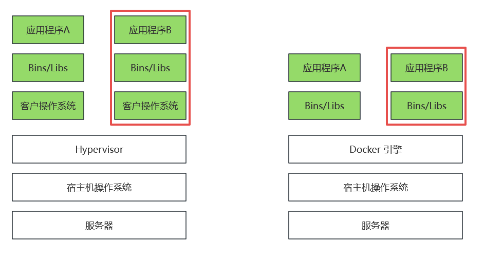  
* 传统虚拟机基于安装在主操作系统上的虚拟机管理系统(如VirtualBox和VMWare),创建虚拟机(<font color="#00FF00">虚拟出各种硬件</font>),在虚拟机上安装从操作系统,在从操作系统中安装部署各种应用  
  * 传统虚拟机的主要缺点是:资源占用多、冗余步骤多、启动慢、性能消耗大
		关于性能消耗大的解释:原本执行一条系统调用只需要从用户态切换到内核态,而现在在中间挡了一层虚拟机拦截,从而降低了性能
* 容器将软件运行所需的所有资源打包到一个隔离的容器中,容器与虚拟机不同,不需要捆绑一整套操作系统,<font color="#00FF00">只需提供该容器运行所需的全部文件即可</font>  
  * <font color="#FF00FF">容器内的应用进程复用宿主机的内核</font>
  * 进程隔离、资源管理、文件系统
  * 便捷的扩缩容

4.docker的交互原理  
docker启动时会创建一个守护线程用于接收用户的命令并管理docker容器;  
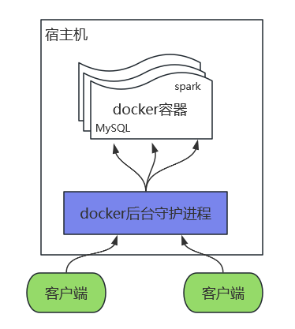  

5.docker运行流程  
Docker是一个C/S模式的架构,后端是一个松耦合架构,众多模块各司其职  
Docker运行的基本流程为:  
5.1 用户使用Docker Client与Docker Daemon建立通信,并发送请求给Docker Daemon  
5.2 Docker Daemon作为Docker架构中的主体部分,首先提供Docker Server的功能使其可以接受Docker Client的请求  
5.3 Docker Engine执行Docker内部的一些列工作,每一项工作都是以一个Job的形式存在  
5.4 Job的运行过程中,当需要容器镜像时,则从Docker Register中下载镜像,并通过镜像管理驱动Graph Driver将下载镜像以Graph的形式存储  
5.5 当需要为Docker创建网络环境时,通过网络管理驱动Network driver创建并配置<font color="#00FF00">Docker容器网络环境</font>  
5.6 当需要限制Docker容器运行资源或执行用户指令等操作时,则通过Exec driver来完成  
5.7 Libcontainer是一项独立的容器管理包,Network driver以及Exec driver都是通过Libcontainer来实现具体对容器进行的操作  

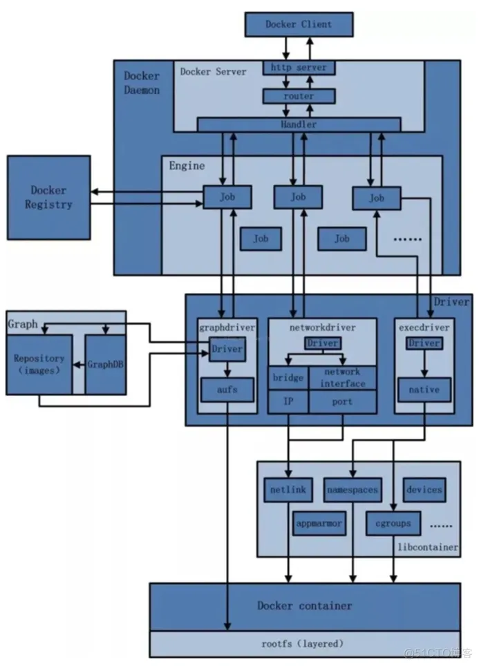  


### 1.2 Docker三大件
*提示:本章内容较为基础可以暂且略过*  
Docker的三大件指的是镜像、容器、仓库  
* 镜像:docker镜像是一个只读模板,<font color="#00FF00">一个镜像可以创建多个容器</font>;它包含应用程序的<font color="#FF00FF">最小运行环境</font>  
* 容器:<font color="#00FF00">容器是镜像创建的运行实例</font>  
* 仓库:仓库,集中存放镜像文件的场所;Docker仓库也分为<font color="#00FF00">公开仓库和私有仓库</font>两种形式;Docker官方仓库[Docker Hub](https://hub.docker.com/search?q=)  

### 1.3 Docker的虚悬镜像
<font color="#00FF00">镜像名称和镜像版本都是none的镜像,就是虚悬镜像(dangling image)</font>  
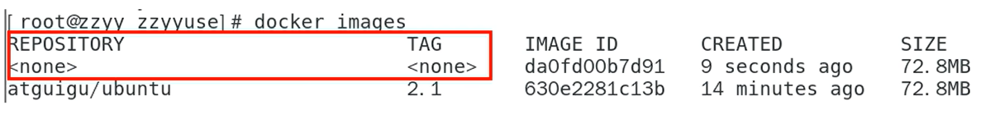  
碰到这种镜像把它删掉就行了  

1.使用Dockerfile编写一个虚悬镜像  
```dockerfile
FROM ubuntu
CMD echo 'action is success'
```

2.构建Dockerfile  
执行`docker build .`  

3.查看所有镜像  
此时再次执行`docker images`就可以看到一个虚悬镜像了  

4.删除虚悬镜像  
执行`docker image prune`

## 2.docker镜像
**目录:**  
2.1 docker镜像的基本概念介绍  
2.2 Docker Commit  
2.3 本地镜像发布到阿里云  
2.4 搭建Dokcker私有仓库  

### 2.1 docker镜像的基本概念介绍
1.UnionFS   
UnionFS(联合文件系统)即AFS<font color="#00FF00">支持对文件系统的修改作为一次提交来一层层的叠加</font>,<font color="#FF00FF">同时可以将不同目录挂载到同一个虚拟文件系统下</font>.UnionFS是docker镜像的基础,镜像可以通过分层来进行继承,基于基础镜像可以制作各种具体的应用镜像  
镜像的层都放置在/var/lib/docker/aufs/diff目录下,然后被联合挂载到/var/lib/docker/aufs/mnt中;从该结构可以看出容器的rootfs由三部分组成  
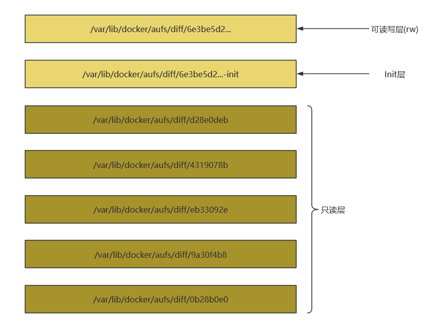  

2.Docker镜像加载原理  
Docker的镜像实际上是由一层层的文件系统组成的,这种层级的文件系统UnionFS  
bootfs主要包含bootloader和kernel,bootloader主要是引导加载kernel,Linux刚启动时会加载bootfs文件系统,<font color="#00FF00">在docker镜像的最底层是引导文件系统bootfs</font>.这一层与Linux操作系统是一样的,包含boot加载器和内核.当boot加载完成之后整个内核都在内存中了,此时内存的使用权已由bootfs转交给内核,此时系统也会卸载bootfs  
不同的Linux发行版本bootfs基本是一致的,rootfs可能会有差异(比如CentOS的根文件系统和Ubuntu的根文件系统就有差异);<font color="#00FF00">所以docker的根文件系统rootfs的底层也是基于bootfs的</font>  

3.Docker镜像采用分层的好处  
Docker镜像是一层层叠加最后利用UnionFS挂载到同一个目录下的结果,<font color="#00FF00">所以多个容器就可以共享一部分层、多个镜像也可以共享一部分层</font>,比如有多个镜像都从相同的base镜像构建而来,那么Docker Host只需要在磁盘上保存一份base镜像,同时内存中也只需加载一份base镜像,就可以为所有容器服务了  

### 2.2 Docker Commit
*提示:由于docker镜像只包含应用的最小运行环境,现在要通过docker commit的方式给容器添加vim命令的支持*  
**首先先安装一个Ubuntu的镜像并启动,作为本次的实验环境;即为Ubuntu添加vim命令的支持**  
1.运行`docker run -it ubuntu`拉取并运行最新的Ubuntu镜像并进入到容器  

2.安装vim  
运行`apt-get update` 更新apt安装工具  
运行`apt-get -y install vim` 安装vim

3.commit  
使用commit命令提交容器使之成为一个新的<font color="#00FF00">镜像</font>;此时该镜像就具备了vim指令  
运行`docker commit -m "vim add" -a "cnsukidayo" cea1b1d519dc cnsukidayo/iubuntu:1.3` 提交并创建一个新的镜像  
*提示:多提一嘴,按照docker镜像的命令规范,镜像名称之前可以加上公司名称(包名),例如这里的包名就是cnsukidayo;可以看到很多镜像都采用了这种命名规范*  

此时运行`docker images`就可以看到刚才提交的镜像了  

4.启动并进入新创建的镜像  
执行`docker run -it cnsukidayo/iubuntu:1.3`运行并进入刚才创建的镜像  
此时可以发现vim命令确实可以使用  

### 2.3 本地镜像发布到阿里云
1.本地镜像发布到阿里云流程  
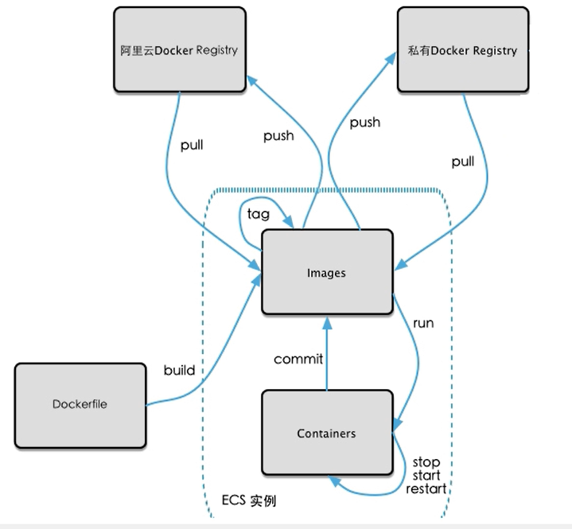  
**注意:** 之前提到过docker仓库分为两种,一种是公共仓库例如Docker Hub、阿里云Docker Registry;另外一种就是私有库(类似Git Lab)

2.阿里云镜像仓库注册流程  
2.1 进入容器镜像服务  
访问[阿里云](https://home.console.aliyun.com/home/dashboard/ProductAndService)进入控制台->选择容器镜像服务  
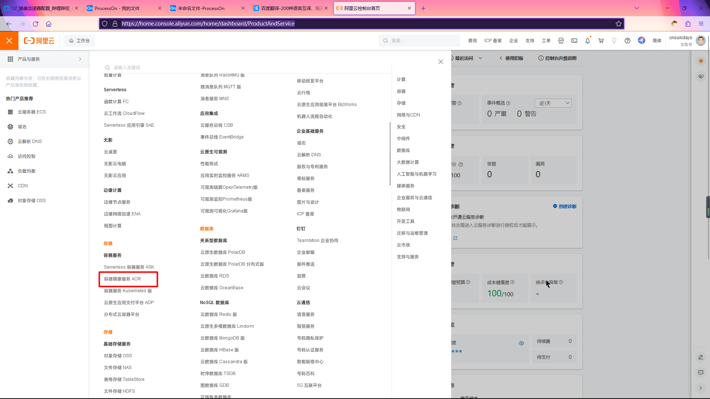  

2.2 配置镜像加速地址  
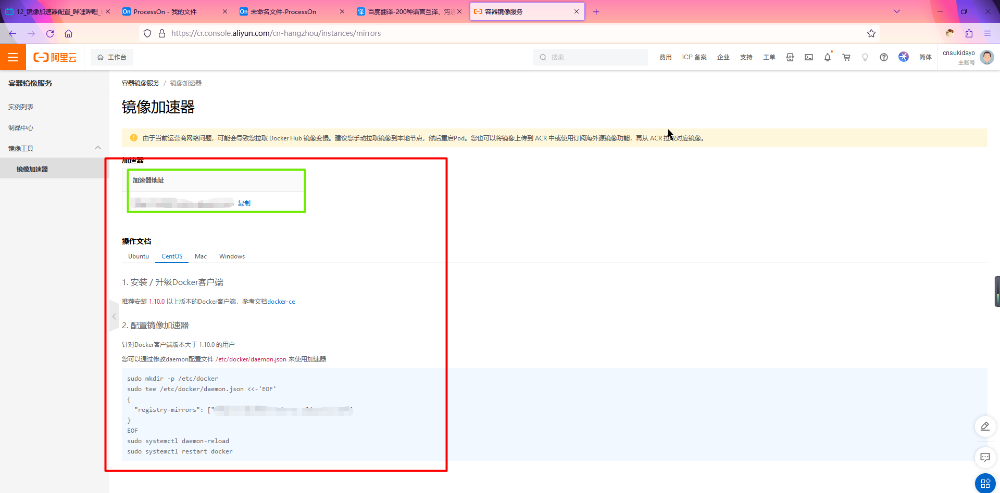  
可以使用开发者的个人镜像加速地址  

3.推送镜像  
3.1 个人中心  
点击左侧实例列表=>个人实例  
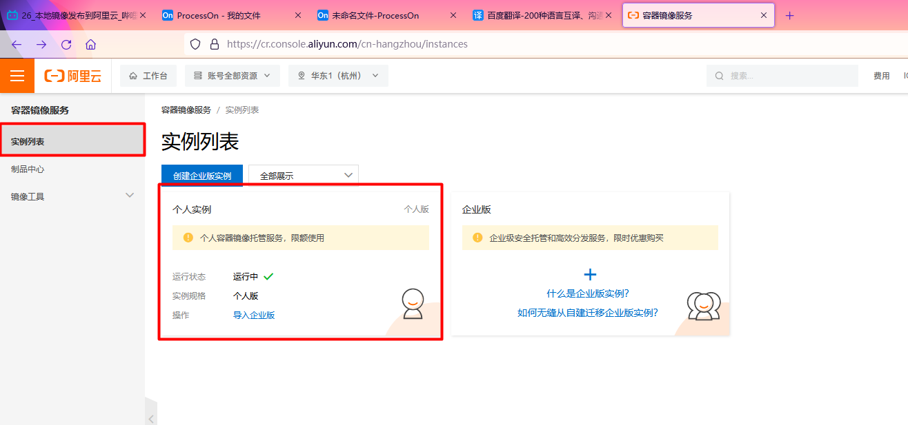  

3.2 创建命名空间  
点击个人中心页面左侧的创建命令空间,然后在创建命名空间中创建一个命名空间  
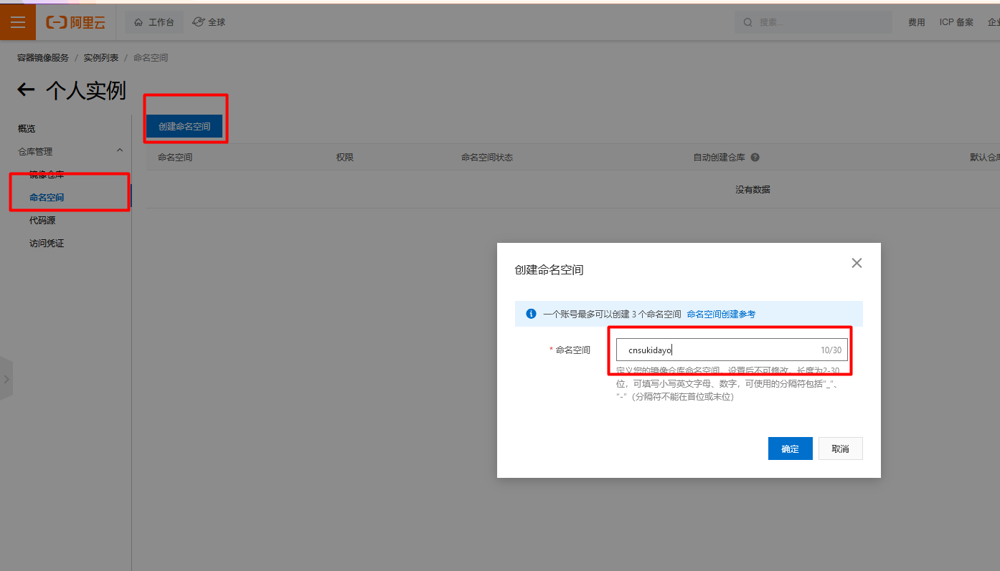  

3.3 创建镜像仓库  
点击个人中心页面左侧的创建仓库镜像,然后为当前的Ubuntu镜像创建一个仓库;注意这里选择的命名空间就是刚才创建的命名空间  
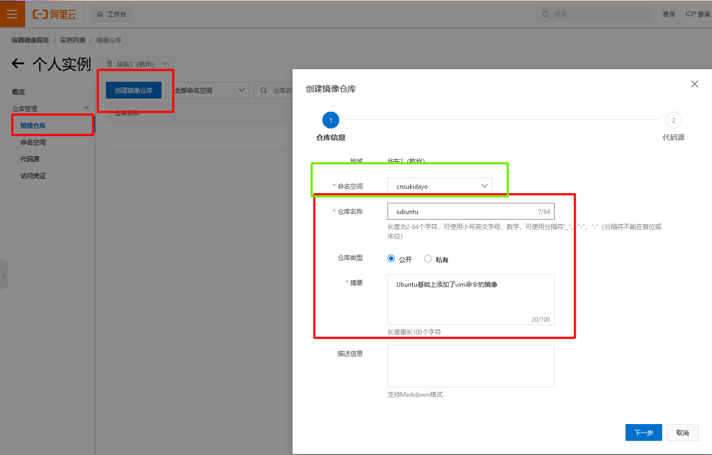  
接着在第二步代码源中选择本地仓库=>创建仓库镜像即可  

3.4 运行阿里云提供的命令  
创建好镜像仓库后在弹出的页面中有一个第三步"将镜像推送到Registry";重点关注这一步的三条命令  
*提示:这里强烈建议使用自已的镜像加速地址*

**登入阿里云**
```shell
# 登录阿里云镜像仓库;第一次需要输入密码
docker login --username=cnsukidayo registry.cn-hangzhou.aliyuncs.com
```

**给镜像打标记**  
```shell
# ImageId是我们镜像的ID
# registry.cn-hangzhou.aliyuncs.com/cnsukidayo/iubuntu这一段是远程仓库的地址
# 镜像版本号是远程仓库的镜像版本
docker tag [ImageId] registry.cn-hangzhou.aliyuncs.com/cnsukidayo/iubuntu:[镜像版本号]
```
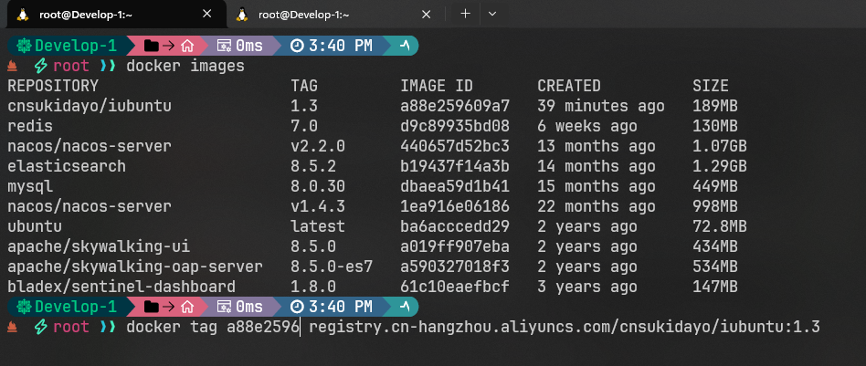  
打完标记之后会出现一个新的镜像,镜像仓库为`registry.cn-hangzhou.aliyuncs.com/cnsukidayo/iubuntu`,版本号为1.3;所以其实这一步相当于以ImageId镜像创建一个新的镜像  
但是这种说法又不准确,因为<font color="#00FF00">新创建的这个镜像的ID和老镜像的ID是一致的</font>

**推送镜像**  
```shell
# 推送镜像;把刚才创建的镜像推送到阿里云,所以其实这一步和我们最开始ImageId指定的镜像没什么关系了已经
docker push registry.cn-hangzhou.aliyuncs.com/cnsukidayo/iubuntu:[镜像版本号]
```

推送成功之后就可以在网页上看到刚才推送的镜像了  
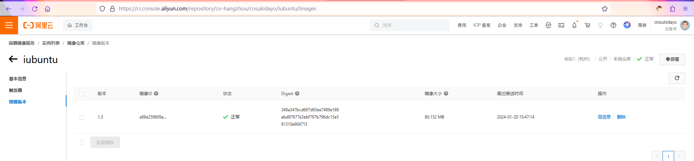  

4.拉取镜像  
在刚才iubuntu镜像仓库中还有一个第二步"从Registry中拉取镜像"  
```shell
docker pull registry.cn-hangzhou.aliyuncs.com/cnsukidayo/iubuntu:[镜像版本号]
```
此时运行该命令就可以从阿里云上拉取刚才推送的镜像了  

### 2.4 搭建Dokcker私有仓库
1.Docker Register  
Docker Register是docker官方提供的私有Docker仓库的平台(类似Git Lab)  

2.创建registry目录  
```shell
mkdir ~/software/registry
```

3.运行docker register容器  
```shell
docker run \
-p 5000:5000 \
-v ~/registry:/tmp/registry \
--privileged=true \
-d registry
```

4.查询本地私服库的所有镜像  
<font color="#00FF00">docker registry是以Restful风格进行交互的</font>  
```shell
# 查询registry仓库中的所有镜像 IP地址和端口号要对应宿主机
curl -XGET http://192.168.230.128:5000/v2/_catalog
```

5.给镜像打TAG标记  
*提示:这里还是提交cnsukidayo/iubuntu:1.3这个镜像*  
```shell
# 给镜像打TAG标记;IP地址和端口号要对应宿主机
docker tag [ImageId] [remoteAddress]/[imageName]:[imageVersion]
# 例如:
docker tag [ImageId] 192.168.230.128:5000/cnsukidayo/iubuntu:1.3
```
所以其实这里的TAG也可以理解为<font color="#FF00FF">关联远程仓库</font>,这里可以和之前发布到阿里云打TAG标记联系起来看;  
值得注意的是仓库地址是由<font color="#00FF00">远程地址+镜像名称</font>(镜像名称也称为是仓库地址,这里叫法有点乱但能明白意思就行)组成的  

6.修改配置文件使registry支持http  
*提示:默认情况下registry是不支持http的,所以现在要修改/etc/docker/daemon.json配置文件使它支持*  
```json
{
"registry-mirrors": ["https://xxxxx.mirror.aliyuncs.com"],
"insecure-registries":["192.168.230.128:5000"]
}
```
在insecure-registries里面填上私服的IP和端口即可,这里的话就是宿主机  

7.重启docker  
```shell
sudo systemctl daemon-reload
sudo systemctl restart docker
```
重启docker后记得重启registry私服  

8.推送镜像到registry私服  
```shell
docker push 192.168.230.128:5000/cnsukidayo/iubuntu:[镜像版本号]
```
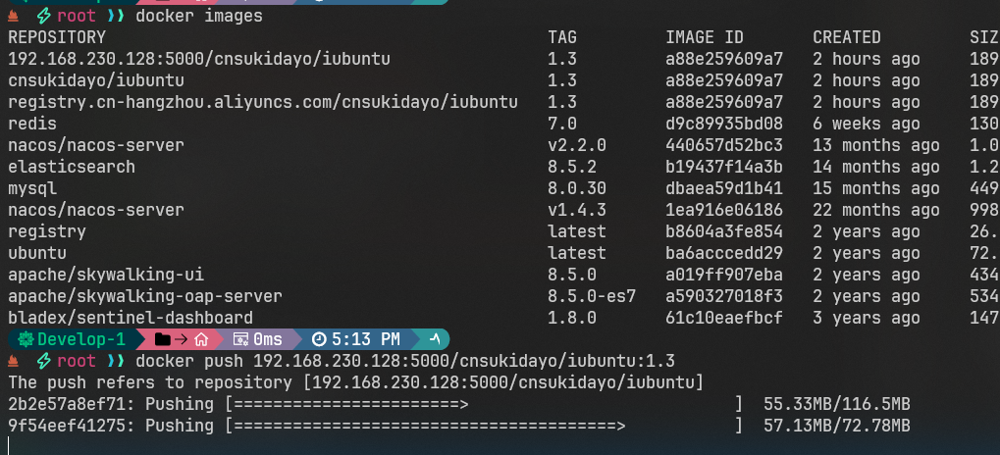  

9.再次查询私有仓库所有镜像  
返回如下结果:  
```json
{"repositories":["cnsukidayo/iubuntu"]}
```

10.拉取镜像  
此时就可以从私服库拉取镜像了,这里不再介绍了  

## 3.DockerFile
**目录:**  
3.1 DockerFile基本介绍  
3.2 DockerFile常用指令介绍  
3.3 使用DockerFile增强centos  
3.4 将微服务工程制作为docker镜像  


### 3.1 DockerFile基本介绍
DockerFile是用来构建Docker镜像的文本文件,是由一条条构建镜像所需的指令和参数构成的脚本  

1.DockerFile与commit  
如果要对镜像进行增强可以使用commit来实现,但每次新增一些内容的时候都需要commit会显得十分麻烦,因为每次commit之后都是一个新的镜像  
<font color="#00FF00">使用DockerFile就可以一次性列出所有本镜像需要的运行环境</font>  
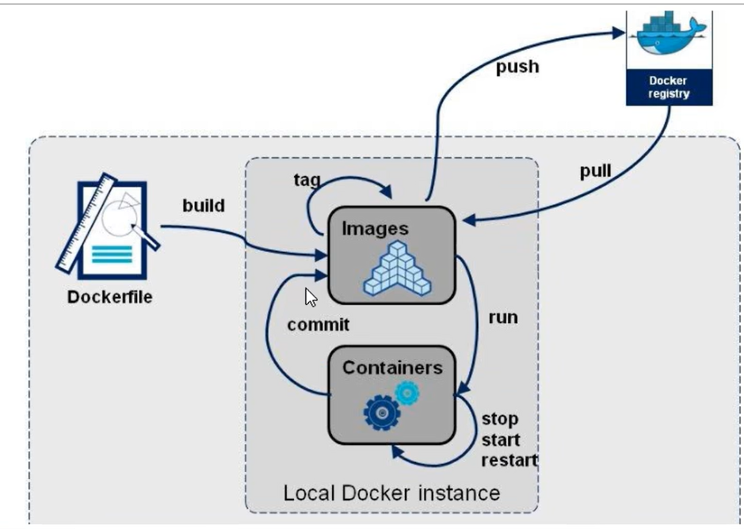  

2.官网  
[DockerFile](https://docs.docker.com/engine/reference/builder/)

3.DockerFile构建三步走  
3.1 编写DockerFile  
3.2 使用docker build构建镜像  
3.3 docker run运行镜像  

4.DockerFile编写基础知识  
* 每条DockerFile指令都必须全大写,并且至少要带一个参数
* 指令按照从上到下顺序执行
* #表示注释
* 每条指令都会创建一个新的镜像层并对镜像进行提交

5.Docker执行DockerFile的大致流程  
*提示:其实DockerFile中指令的执行就类似commit操作,每个指令也都是基于上一个创建的<font color="#00FF00">容器</font>来生成镜像的;因为commit只能对容器操作*  

5.1 docker从基础镜像运行一个容器  
5.2 执行一条指令并对容器做出修改  
5.3 执行类似docker commit的操作提交一个新的镜像层  
5.4 docker再基于刚提交的镜像运行一个新的容器  
5.5 执行dockerfile中的下一条指令知道所有指令都执行完成  


### 3.2 DockerFile常用指令介绍

* `FROM`
  指定基础镜像,当前新镜像是基于哪个镜像的,指定一个已存在的镜像作为模板,<font color="#00FF00">第一条指令必须是from</font>
* `MAINTAINER`
  镜像维护者的姓名和邮箱地址
* `RUN [shell]`
  * `shell`(必填):Linux脚本
  运行Linux的shell命令,该命令在docker build的时候运行  
  例如:之前想要为镜像安装vim工具就可以使用RUN命令来完成  
  `RUN apt-get -y install vim`
  `RUN ["apt-get","-y","install","vim"]` 这种形式等价于上面的方式,效果是一样的但是有点麻烦,所以这种形式的RUN命令不推荐
* `EXPOSE`
  设置当前容器对外暴露的端口
* `WORKDIR`
  指定一个目录,当容器运行后使用docker exec进入容器后终端进入的工作目录,一个落脚点  
  比如进入redis容器时默认的路径就在/data目录下  
* `USER`
  指定该镜像使用什么用户去执行,如果都不指定默认就是root
* `ENV [environmentKey] [environmentValue]`  
  用来在构建镜像过程中设置环境变量,这个环境变量在后续的任何RUN指令中使用;通过<font color="#00FF00">${environmentKey}</font>来引用
  **<font color="#FF00FF">这里的环境变量就是我们平常说的系统环境变量</font>**  
  * `environmentKey`:环境变量的key
  * `environmentValue`:环境变量的value
* `VOLUME`
  相当于容器启动时的-v参数,用来指定宿主机与容器内文件的映射  
* `ADD`
  将宿主机下的文件拷贝进镜像且会自动处理URL和解压tar压缩包
* `COPY [src] [dest]`
  * `src`:源路径
  * `dest`:目标路径
  类似ADD命令,拷贝宿主机文件和目录到镜像中
* `ENTRYPOINT`  
  类似CMD也是用于指定容器启动时要运行的命令  
  <font color="#00FF00">但是ENTRYPOINT命令不会被docker run后面的[command]命令覆盖;而且这些命令行参数会当做参数传送给ENTRYPOINT指令指定的程序</font>  
  <font color="#FF00FF">  一般ENTRYPOINT可以和CMD一起使用,并且ENTRYPOINT都是卸载CMD命令之前的;并且当这两个命令连用时CMD命令的含义会发生变化</font>
  例子:  
  假设已经通过DockerFile构建如下nginx:test镜像  
  ```dockerfile
  FROM nginx
  ENTRYPOINT ["nginx","-c"] # 定参
  CMD ["/etc/nginx/nginx.conf"] # 变参 
  ```
  当ENTRYPOINT后面根上CMD命令时,<font color="#00FF00">CMD相当于不再是一个命令而是进行传参</font>,将参数传递给ENTRYPOINT  
  例如:
  * docker运行 `docker run nginx:test`
    实际运行结果为:docker run nginx:test -c /etc/nginx/nginx.conf
  * docker运行 `docker run nginx:test /etc/nginx/`<font color="#00FF00">new.conf</font>
    实际运行结果为:docker run nginx:test -c /etc/nginx/<font color="#00FF00">new.conf</font>
* `CMD [shell]`
  <font color="#FF00FF">容器启动后要执行的命令,CMD命令不在build阶段执行</font>;CMD命令一般作为DockerFile的最后一条指令;DockerFile中可以有多个CMD命令,但只有最后一个会生效  
  并且CMD命令的参数会被`docker run ... [command]`容器启动时附带的`command`参数覆盖;这个可以参考之前docker run的命令
  例如容器最后一行的运行命令:CMD echo Hello  
  docker启动的命令是:docker run ... World  
  则最终会输出World,<font color="#00FF00">注意echo命令本身是不会受影响的</font>,因为影响的只是shell命令的参数
  * `shell`(必填):shell命令

### 3.3 使用DockerFile增强centos
1.需求梳理  
使用DockerFile构建出一个具有vim+ifconfig+jdk8的centos  
  
2.创建目录mkdir ~/software/centosPlus  

3.下载JDK8  
来到[https://www.oracle.com/java/technologies/downloads/#java8](https://www.oracle.com/java/technologies/downloads/#java8)网站找到x64 Compressed Archive后面对应的JDK8的包  
见该包导入到虚拟机中的~/software/centosPlus目录下  
这里下载的JDK8的名称为<font color="#00FF00">jdk-8u401-linux-x64.tar.gz</font>

4.编写Dockerfile  
在centosPlus目录下创建Dockerfile并编写如下内容  
```dockerfile
#基础镜像,继承于centos
FROM centos:centos7
#指定作者
MAINTAINER xxx<xxx@xxx.com>
#指定目录
ENV MYPATH /usr/local
#进入命令
WORKDIR $MYPATH
#安装vim编辑器
RUN yum -y install vim
#按装ifconfig命令查看网络IP
RUN yum -y install net-tools
#安装java8及lib库
#gcc的一个加强安装包
RUN yum -y install glibc.i686
#创建一个目录
RUN mkdir /usr/local/java
#ADD是相对路径jar,把jdk-8u171-linux-x64.tar.gz添加到容器中,安装包必须要和Dockerile文件在同一位置
ADD jdk-8u401-linux-x64.tar.gz /usr/local/java/
#配置java环境变量 
ENV JAVA_HOME /usr/local/java/jdk1.8.0_171
ENV JRE_HOME $JAVA_HOME/jre
ENV CLASSPATH $JAVA_HOME/lib/dt.jar:$JAVA_HOME/lib/tools.jar:$JRE_HOME/lib:$CLASSPATH
ENV PATH $JAVA_HOME/bin:$PATH

EXPOSE 80

CMD echo $MYPATH
CMD echo "success-------ok"
CMD /bin/bash
```
*困惑:这里有多个CMD,根据之前的知识这里的前两个CMD并不会执行成功,不太清楚为什么要这么编写*
*提示:这里要对应把Java的版本改成对应的,<font color="#00FF00">包括环境变量</font>*


5.构建镜像  
执行
```shell
# 格式
docker build -t [newImageName]:[newImageVersion] [path]
# 例子
docker build -t centosplus:1.0 .
```
* newImageName:构建的镜像名称
* newImageVersion:构建的镜像的版本
* path:Dockerfile所在的目录,因为一个目录只能存在一个Dockerfile所以Docker会去改路径下面找对应的Dockerfile文件进行构建

### 3.4 将微服务工程制作为docker镜像
1.构建微服务jar包  
把个人的微服务打成jar包上传到虚拟机  

2.编写Dockerfile  
```dockerfile
#基础镜像使用java
FROM java:8
#作者
MAINTAINER cnsukidayo<cnsukidayo@foxmail.com>
# VOLUME指定临时文件目录为/tmp,在主机 /var/lib/docker 目录下创建了一个临时文件并链接到容器的/tmp
VOLUME /tmp
#将微服务jar包添加到容器中并更名为xxx_docker. jar
ADD cloud-0.0.1-SNAPSHOT.jar  cloud_docker.jar
#运行jar包
RUN bash -C 'touch /cloud_docker.jar'
ENTRYPOINT ["java","-jar","/cloud_docker.jar"]
#暴露8080端口作为微服务
EXPOSE 8080
```

3.构建镜像  
```shell
docker build -t cloud_docker:1.0 .
```

4.运行容器启动测试  

## 4.Docker网络
**目录:**  
4.1 Docker网络基本概念介绍  
4.2 Docker网络模式  


### 4.1 Docker网络基本概念介绍  
1.查看网络情况  
执行`ifconfig`命令  
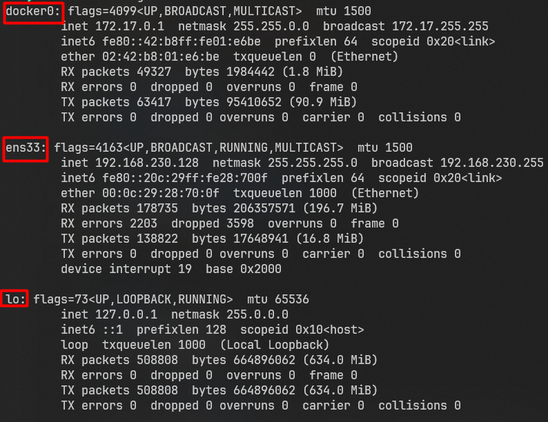  
* ens33:宿主机的网卡
* lo:localhost
* docker0:docker默认创建的网络配置

2.查看docker网络  
执行`docker network ls` 查看docker所有的网络  
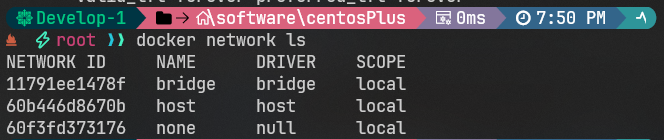  
Docker会默认创建三大网络模式  

3.Docker网络的作用  
* 进行Docker网络管理和容器调用之间的规划
* 容器IP变动时可以通过服务名直接网络通讯不受影响

假设在一台机器上的Docker想要调用另一台机器上的Docker服务,当地址配置正确时是没有问题的,但假如机器重启了dockerIP地址变化了,此时就无法调用了;  
所以能否通过像nacos注册中心那样通过服务名使docker利用服务名来调用另一台docker  

4.Docker网络模式  
* bridge:为每一个容器分配、设置IP等并将容器连接到一个docker0;虚拟网桥,<font color="#00FF00">默认为该模式</font>
* host:容器将不会虚拟出自已的网卡,配置自已的IP等;而是直接使用宿主机的IP和端口
* none:容器有独立的<font color="#FF00FF">Network namespace</font>,但并没有对其进行任何网络设置,如分配veth pair和网桥连接,IP等
* container:新创建的容器不会创建自已的网卡和配置自已的IP,而是<font color="#00FF00">和一个指定的容器共享IP和端口范围</font>

### 4.2 Docker网络模式
**目录:**  
4.2.1 bridge模式  
4.2.2 host模式  
4.2.3 none模式  
4.2.4 container模式  
4.2.5 自定义网络  

#### 4.2.1 bridge模式
1.docker0  
Docker服务默认会创建一个docker0网桥,它在内核层连通了其他的物理或虚拟网卡,这就将所有容器和本地主机都放到同一个物理网络.Docker默认指定了docker0接口的IP地址和子网掩码,<font color="#00FF00">让主机和容器之间可以通过网桥通信</font>  

2.网桥的工作方式  
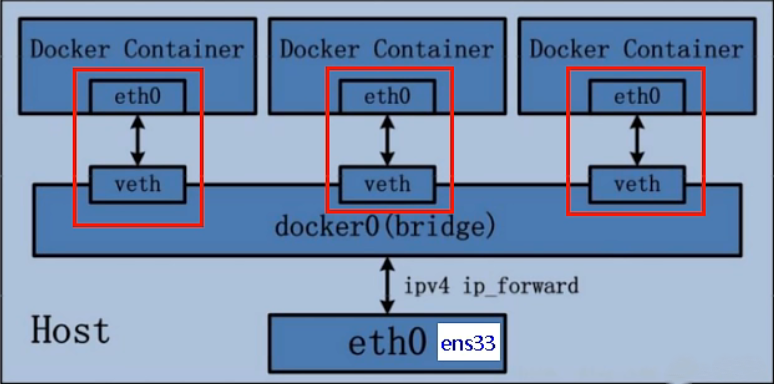  
如图所示,容器创建默认使用网桥模式,<font color="#00FF00">通过网桥模式就可以实现容器与宿主机之间的通信,容器与容器之间的通信</font>(容器与容器之间无法直接通信,需要通过网桥实现)  

Docker使用Linux桥接,在宿主机虚拟出一个Docker容器网桥(docker0),<font color="#00FF00">docker启动一个容器时会根据Docker网桥的网段分配给容器一个IP地址</font>,成为Container-IP,同时docker网桥是每个容器的默认网关;因为在同一个宿主机内的容器都接入同一个网桥,这样容器之间就能通过容器的Container-IP直接通信  

Docker run的时候,容器创建默认使用网桥模式,使用的就是docker0.在宿主机执行ifconfig就可以看到docker0和通过docker create的网络中出现eth0、eth1、eth2代表网卡一、网卡二、网卡三,lo代表localhost,inet add用来表示网卡的IP地址  

网桥docker0<font color="#00FF00">创建一对对等虚拟设备接口一个叫veth另一个叫eth0</font>,成对匹配  
整个宿主机的网桥模式都是docker0,类似一个交换机有一堆接口,每个接口叫veth,在宿主机和容器内分别创建一个虚拟接口,并让他们彼此联通(这样一对接口叫veth pair)  
每个容器实例内部也有一块网卡,每个接口叫eth0  
docker0上面的<font color="#00FF00">每个veth匹配某个容器实例内部的eth0</font>

*题外话:所以可以推出其实VMWare这种虚拟机软件的网桥也只有一份,通信的时候Windows操作系统通过该网桥与所有Linux虚拟机进行通信*  

3.代码验证  
运行两个容器  
```shell
docker run -d -p 8081:8080 --name tomcat81 billygoo/tomcat8-jdk8
docker run -d -p 8082:8080 --name tomcat82 billygoo/tomcat8-jdk8
```
执行`ip addr`命令查看发现多个两个eth,并且一个后缀是if4一个后缀是if6  
并且if4的前缀是5,if6的前缀是7
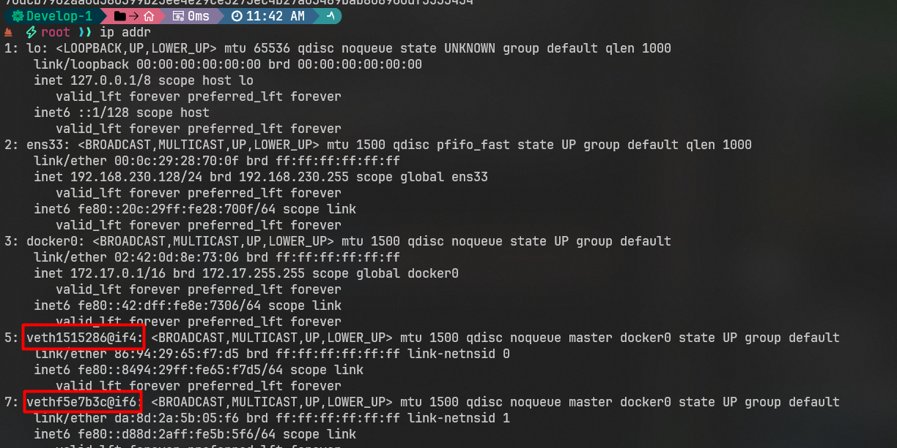  

4.进入容器  
分别进入两个容器执行`ip addr`可以发现确实每个容器都有一个eth,<font color="#00FF00">并且一个后缀是if5就对应上面的前缀5,一个后缀是if7就对应上面的前缀7</font>  
并且这里也有前缀一个是6一个是4,<font color="#00FF00">这也对应上面的后缀</font>
并且这里还有前缀需要
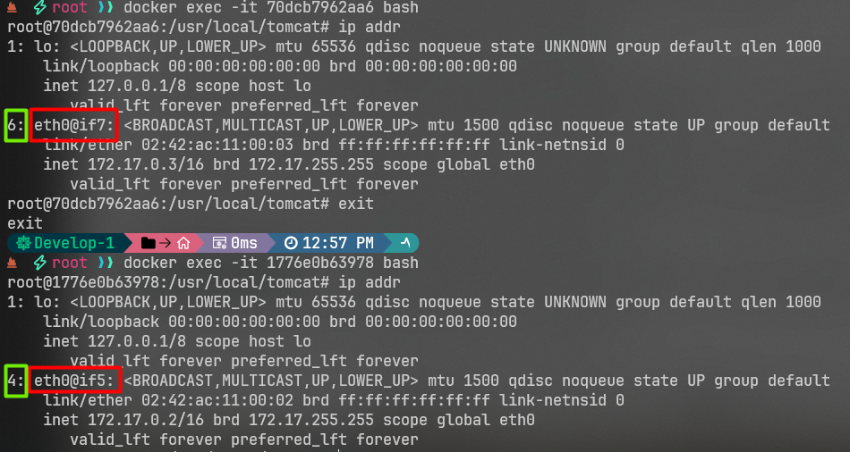  


#### 4.2.2 host模式
1.host模式介绍  
直接使用宿主机IP地址与外界通信,不在需要额外进行NAT转换  
容器将不会获得一个独立的Network Namespace,而是和宿主机共用一个Network Namespace.<font color="#00FF00">容器不会虚拟出自已的网卡而是使用宿主机的IP和端口</font>  
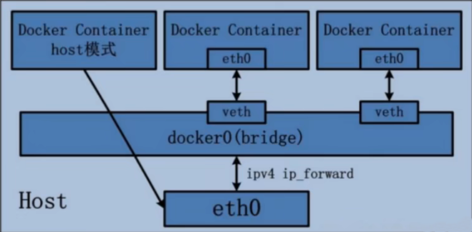

2.代码验证  
```shell
docker run -d --net host --name tomcat83 billygoo/tomcat8-jdk8
```
*提示:这里有个小坑,当使用host模式启动容器的时候就不需要指定-p了,因为此时使用的是宿主机的IP和端口,指定端口映射没有意义*  

3.进入容器  
执行`ip addr`会发现容器内网络的配置和宿主机网络的配置一致  
因为此时容器共同宿主机的网络设置  
显示的结果应该类似如下,<font color="#00FF00">可以看到刚才的两个veth在当前容器中也是能看到的</font>  
  


#### 4.2.3 none模式
1.none模式介绍  
none模式代表禁用网络功能,网卡设置显示只有lo标识  
在none模式下并不为docker容器进行任何网络配置  

2.代码验证  
```shell
docker run -d --net none --name tomcat84 billygoo/tomcat8-jdk8
```

#### 4.2.4 container模式
1.container模式介绍  
新建的容器和已经存在的一个容器共享一个网络IP配置而不是和宿主机共享  
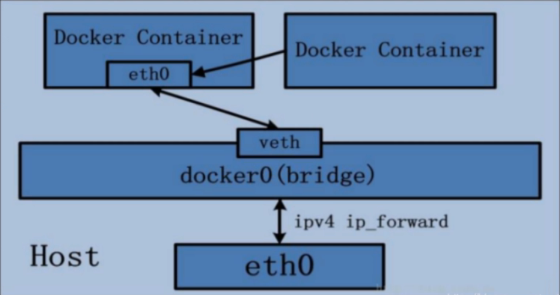  

2.代码验证  
假设这里还是启动两个Tomcat,即使指定两个Tomcat对外映射不同的端口但还是会报错,因为容器的网络出现了两个端口号为8080的程序,显示端口占用  
即使用container模式时,这种<font color="#00FF00">网络共享不管是对外还是对内都是共享的</font>  

3.网络关闭  
假设现在启动两个Ubuntu(Ubuntu不存在端口冲突),此时让后启动的Ubuntu共享先启动的Ubuntu的网络;如果此时Ubuntu1容器宕机,<font color="#FF00FF">则Ubuntu2的引用的Ubuntu1的网络会直接消失,只剩下lo本地网络</font>  


#### 4.2.5 自定义网络
1.创建自定义网络  
```shell
# 创建一个名为test_network的网络,网络的类型为bridge
docker network create test_network
```

2.启动容器  
```shell
docker run -d -p 8081:8080 --net test_network --name tomcat81 billygoo/tomcat8-jdk8
docker run -d -p 8082:8080 --net test_network --name tomcat82 billygoo/tomcat8-jdk8
```

3.进入容器  
进入tomcat81容器后执行`ping tomcat82`发行可以ping通;<font color="#00FF00">此时就可以使用服务名来进行远程调用</font>  
同理进入tomcat82中`ping tomcat81`也是可以生效的  
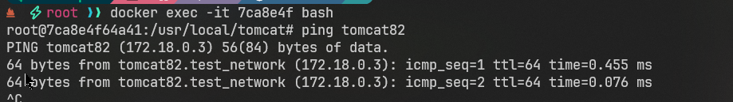  

*多提一嘴:此时在新网络中的两个容器如果想ping通默认bridge中的容器是ping不通的,因为跨网桥/网关了,不在同一个网段了*  

## 5.DockerCompose
**目录:**  
5.1 DockerCompose介绍  
5.2 DockerCompose基本环境搭建  
5.3 DockerCompose上手使用  
5.4 K8S  

### 5.1 DockerCompose介绍
DockerCompose是Docker官方的开源项目,负责实现对Docker容器集群的快速编排  
你需要定义一个YML格式的配置文件<font color="#FF00FF">docker-compose.yml</font>,<font color="#00FF00">写好多个容器之间的调用关系</font>,然后只需要一个命令,就能同时启动/关闭这些容器(感觉和K8S的声明式API有点像?)  

例如要实现一个WEB微服务项目,除了WEB服务容器本身,往往还需要再加上后端的数据库MySQL服务器、redis服务器等等  
<font color="#00FF00">Compose允许用户通过一个单独的docker-compose.yml模板文件来定义一组相关联的应用容器为一个项目(project)</font>  

1.官网  
[Docker-compose官网](https://docs.docker.com/compose/compose-file/)  
[Docker-compose下载地址](https://docs.docker.com/compose/install/)  

2.版本对照表  
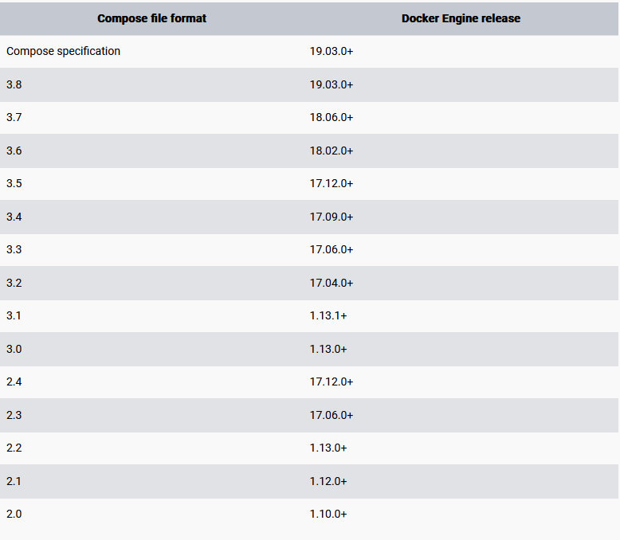  
这是docker引擎和docker-compose版本的对照表  

3.安装  
3.1 执行`uname -s`命令得到结果,例如是Linux  
3.2 执行`uname -m`命令得到结果,例如是x86_64  
3.3 去github上下载[https://github.com/docker/compose/releases/download/1.29.2/docker-compose-Linux-x86_64](https://github.com/docker/compose/releases/download/1.29.2/docker-compose-Linux-x86_64)  
这里的Linux和x86_64要替换为上面两步得到的结果  
实际上这里可以直接访问github的release地址,里面就有各种版本的下载地址  
3.4 将下载到的内容拷贝到<font color="#00FF00">/usr/local/bin/docker-compose</font>路径下
3.5 执行`chmod +x /usr/local/bin/docker-compose`  
3.7 执行`docker-compose --version` 如果显示版本号则代表安装成功  
3.6 卸载docker-compose可以执行`sudo rm /usr/1oca1/bin/docker-compose`  

4.两要素  
* 服务:一个个应用的容器实例,例如订单微服务、MySQL容器、redis容器
* 工程:由一组关联的应用容器组成的<font color="#00FF00">一个完整业务单元</font>,在docker-compose.yml文件中定义  

5.使用三步走  
* 编写Dockerfile定义各个微服务应用并构建出对应的镜像文件
* 使用docker-compose.yml定义一个完整业务单元,安排好整体应用中的各个容器服务
* 执行docker-compose up命令来启动并运行整个应用程序,<font color="#FF00FF">完成一键部署上线</font>  

<font color="#00FF00">说白了它的作用就是一键启动和关闭,准确点的说法是管理集群中的容器</font>  

### 5.2 DockerCompose基本环境搭建
1.微服务  
这里使用了之前springcloud的微服务,总之就是有一张订单表,对他进行CRUD  
接着这里将微服务导出为一个jar包并上传到Linux服务器中的~/software/docker_boot下  

2.编写Dockerfile文件制作镜像  
```shell
#基础镜像使用java
FROM java:8
#作者
MAINTAINER cnsukidayo<cnsukidayo@foxmail.com>
# VOLUME指定临时文件目录为/tmp, 在主机 /var/ib/docker 月录下创建了一个临时文件并链接到容器的/tmp
VOLUME /tmp
#将jar包添加到容器中并更名为zzyy_ dockerjar
ADD docker-boot.jar docker-boot.jar
#运行jar包
RUN bash -c 'touch docker-boot.jar'
ENTRYPOINT ["java","-jar","docker-boot.jar"]
#暴露8060端口作为微服务
EXPOSE 8060
```

3.构建镜像  
执行`docker build -t docker_boot:1.0 .`

4.不使用compose时该如何部署这个项目  
* 首先需要启动对应的数据库  
* 进入数据库创建相应的表结构
* 启动redis(如果有,本项目没有)
* 启动微服务

5.启动测试  
按照步骤4启动后进行测试,发现服务成功启动成功  
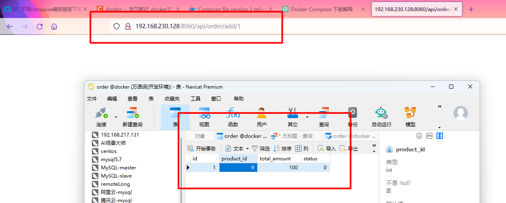

6.问题  
上述没有使用Compose虽然能够成功访问服务,但现在还存在如下问题  
* 先后启动顺序要求固定,先MySQL+redis服务才能访问成功
* 多个run命令,要启动多次容器;如果是线上集群,启死你
* 容器间的启停或宕机,有可能导致IP地址对应的容器实例变化,映射出错;解决方法要么是生产IP写死(不推荐),要么通过服务调用

### 5.3 DockerCompose上手使用
1.编写docker-compose.yml文件  
在当前目录~/software/docker_boot(存放Dockerfile文件的目录)下创建一个<font color="#FF00FF">docker-compose.yml</font>配置文件
```yml
version: "3" #compose版本号

services: #服务容器实例,下面写服务名
  dockerBoot: # 服务名 自定义即可;例如这里写成dockerboot服务
    image: docker_boot:1.2 # 镜像名:版本号,还可以用build构建
    container_name: ms01 # 容器名 --name 不加容器名会在显示的时候自动加前后缀   当前目录_服务名_数字标号
    ports: # 端口映射  -p
      - "8060:8060"
    volumes: # 容器数据卷  -v
      - ~/software/docker_boot:/data
    networks: #网络选择 --network
      - docker_boot_net # 最底下有定义
    depends_on: # 依赖项,依赖于下面的项目 项目名即服务名
      - mysql
  mysql:
    image: mysq:5.7
    #container_name: redis # 容器名 --name 不加容器名会在显示的时候自动加前后缀   当前目录_redis_1
    networks:
      - docker_boot_net
    ports:
      - "3306:3306"
    environment: # 环境配置
      MYSQL_ROOT_PASSWORD: '123456'
#      MYSQL_ALLOW_EMPTY_PASSWORD: 'no'
#      MYSQL_DATABASE: 'db2021"
#      MYSQL_USER: "root"
#      MYSQL_PASSWORD: "123456"
    volumes:
      - $PWD/mysql/db:/var/lib/mysql
      - $PWD/mysql/conf:/etc/mysql/conf
      - $PWD/mysql/init:/docker-entrypoint-initdb.d
    command: --default-authentication-plugin=mysql_native_password #解决外部无法访问问题

networks:
  docker_boot_net: #网络模式名字,相当于会执行docker network create docker_boot_net命令
```
*提示:实际上这种yml配置文件的结果就类似执行的一条条run命令*
*提示:这里的镜像docker_boot:1.2还不存在!不过当前目录下存在Dokcerfile文件,之后会说明*

2.修改微服务的yml配置文件  
原本的配置如下,可以看到这里指定了MySQL的地址为192.168.230.128:7901  
```yml
server:
  port: 8060
spring:
  application:
    name: docker-boot
  datasource:
    driverClassName: com.mysql.cj.jdbc.Driver
    username: root
    password: sukidayo
    url: jdbc:mysql://192.168.230.128:7901/docker?useUnicode=true&characterEncoding=utf8&characterSetResults=utf8&useSSL=false
mybatis:
  mapper-locations: classpath:mybatis/*.xml
  type-aliases-package: io.github.cnsukidayo.dockert.entity
  configuration:
    map-underscore-to-camel-case: true
```

由于现在使用docker-compose的方式组织,所以可以直接写成服务名(这个服务名是和docker-compose.yml配置文件中对应的)  
修改内容如下:  
```yml
server:
  port: 8060
spring:
  application:
    name: docker-boot
  datasource:
    driverClassName: com.mysql.cj.jdbc.Driver
    username: root
    password: sukidayo
    # 着重在这里
    url: jdbc:mysql://mysql/docker?useUnicode=true&characterEncoding=utf8&characterSetResults=utf8&useSSL=false
mybatis:
  mapper-locations: classpath:mybatis/*.xml
  type-aliases-package: io.github.cnsukidayo.dockert.entity
  configuration:
    map-underscore-to-camel-case: true
```
<font color="#00FF00">可以看到非常强大!</font>如果有redis的服务甚至也可以这么配置redis集群  

3.重写打包微服务上传到服务器  
现在在~/software/docker_boot目录下有三个文件docker-boot.jar、docker-compose.yml、Dockerfile  

4.构建镜像  
这里还是要先构建docker_boot微服务镜像的  
执行`docker build -t docker_boot:1.2 .`  

5.执行docker-compose  
执行`docker-compose up -d`  
一键部署成功!  

6.一键关闭  
执行`docker-compose stop`关闭所有的容器  

### 5.4 K8S
如果还有更多的容器,则需要使用K8S,详情见K8S  


## 6.容器监控
**目录:**  
6.1 Portainer  
6.2 CIG(CAdiisor+InfluxDB+Granfana)介绍  
6.3 CIG部署  

### 6.1 Portainer
1.Portainer介绍  
Portainer是<font color="#00FF00">轻量级</font>Docker的可视化工具,方便对docker进行监控;包括单击和集群环境  

2.官方  
[Portainer官网](https://www.portainer.io/)  

3.下载  
[Portainer下载地址](https://docs.portainer.io/start/install/server/docker/linux)  
Portainer也是一个容器,在Linux上执行以下命令安装Portainer  
```shell
docker run \
-p 8000:8000 \
-p 9000:9000 \
--name portainer \
-v /var/run/docker.sock:/var/run/docker.sock \
-v ~/software/portainer/portainer_data:/data \
-d portainer/portainer:latest
```

*提示:第一个挂载不能改/var/run/docker.sock*  

4.访问portainer  
访问:[http://192.168.230.128:9000/#/init/admin](http://192.168.230.128:9000/#/init/admin)  
第一次访问会让你注册admin账户  
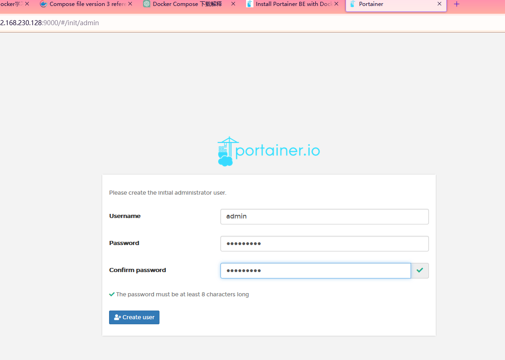  
这里密码设置为123456789  

5.选择管理的docker  
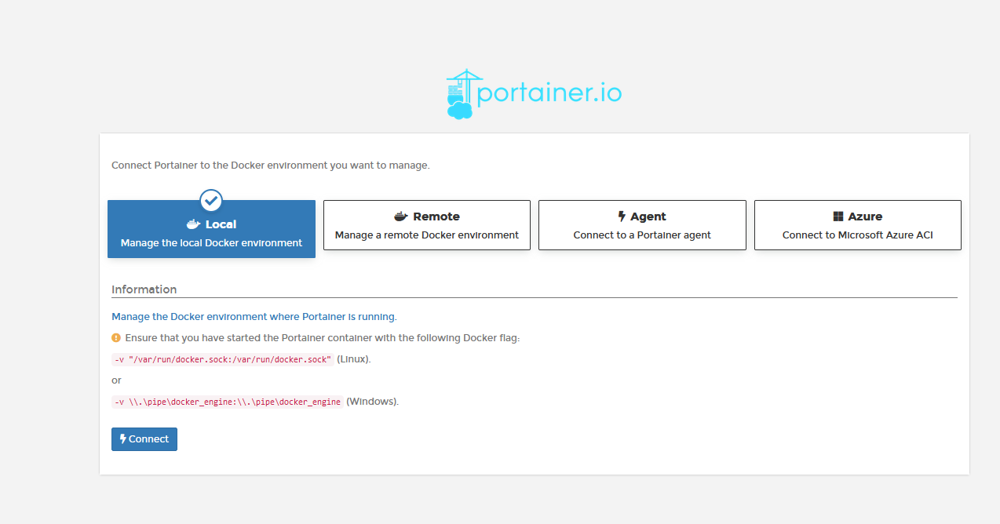  
这里选择<font color="#00FF00">local</font>管理本地的docker  

6.登入成功
访问portainer主页    
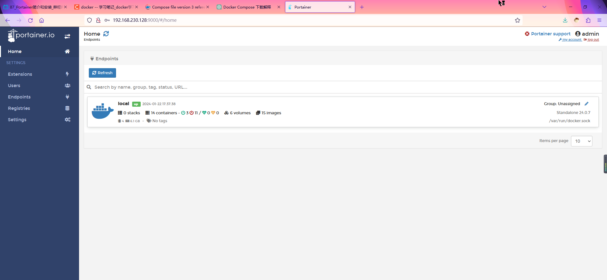  

7.常规操作  
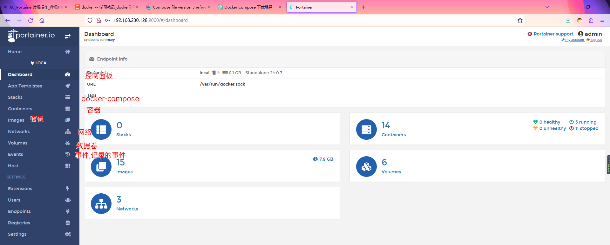  
docker路由的内容如图所示  
可以点击每个路由操作相关的内容  

### 6.2 CIG(CAdiisor+InfluxDB+Granfana)介绍
1.问题  
原生docker在性能监控这一块可以通过`docker stats`命令来完成,但是这就带来就几个问题;  
<font color="#00FF00">docker stats统计结果只能是当前宿主机的全部容器,数据资料是实时的,没有地方存储、没有健康指标过线预警等功能</font>  

2.监控三剑客  
这里的监控就类似收集分布式系统日志那样,<font color="#00FF00">Filebeat(日志采集)+ElasticSearch(存储数据)+kibana(页面展示)</font>  
也类似于Kong的监控,<font color="#00FF00">Prometheus(监控采集)+<font color="#FF00FF">Granfana(展示图表)</font></font> 
* CAdiisor:监控收集
  CAdiisor是一个容器资源监控工具,包括容器的内存、CPU、网络IO、磁盘IO等监控,CAdiisor默认存储两分钟的数据,而且只是针对单台物理机;可以将CAdiisor收集到的数据接入到InfluxDB(官方推荐)、redis、kafka、ElasticSearch
* InfluxDB:存储数据(时序数据库)
* Granfana:展示图表

### 6.3 CIG部署
*提示:这里使用docker-compose来部署CIG*  
1.创建目录  
执行`mkdir -p ~/software/cig`  

2.创建docker-compose.yml配置文件  
```yml
version: '3.1'
volumes:
  grafana_data: {}
services:
  influxdb:
    image: tutum/influxdb:0.9
    # restart: always 重启
    environment: #设置环境变量,预先创建一个数据库cadvisor
      - PRE_CREATE_DB=cadvisor
    ports:
      - "8083:8083"
      - "8086:8086"
    volumes: # 设置挂载容器卷
      - ./data/influxdb:/data

  cadvisor:
    image: google/cadvisor
    links: # 该命令可以连接到influxdb数据库
      - influxdb:influxsrv
    command: -storage_driver=influxdb -storage_driver_db=cadvisor -storage_driver_host=influxsrv:8086
    restart: always
    ports:
      - "8082:8080"
    volumes:
      - /:/rootfs:ro
      - /var/run:/var/run:rw
      - /sys:/sys:ro
      - /var/lib/docker/:/var/lib/docker:ro

  grafana:
    user: "104"
    image: grafana/grafana
    links:
      - influxdb:influxsrv
    ports:
      - "3000:3000"
    volumes:
      - grafana_data:/var/lib/grafana
    environment:
      - HTTP_USER=admin
      - HTTP_PASS=admin
      - INFLUXDB_HOST=influxsrv
      - INFLUXDB_PORT=8086 # 设置influxdb的端口
      - INFLUXDB_NAME=cadvisor
      - INFLUXDB_USER=root
      - INFLUXDB_PASS=root
```

3.执行docker-compose  
执行`docker-compose up -d`

4.查看是否启动成功  
执行`docker ps`查看刚才的三剑客是否全部启动成功  

5.浏览相关服务  
* CAdiisor:http://192.168.230.128:8082
* influxdb:http://192.168.230.128:8083
* grafana:http://192.168.230.128:3000
  默认登录时先使用admin进入然后再设置密码  


*提示:这三个服务组件都带有前端页面,不过这里主要看grafana*  
CAdiisor:  
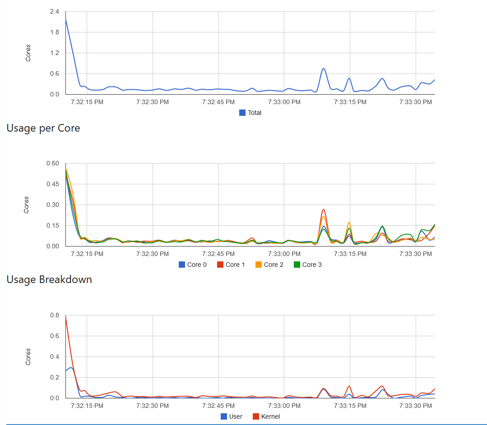  
influxdb:  
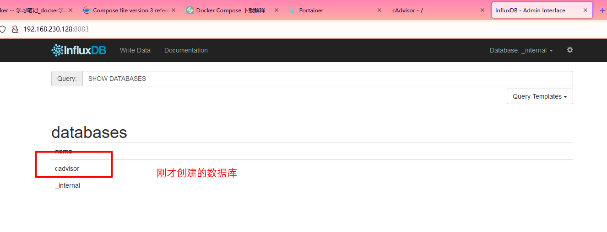  
grafana:  
  

6.配置grafana  
现在grafana还没有内容展示,所以需要配置grafana的数据源  
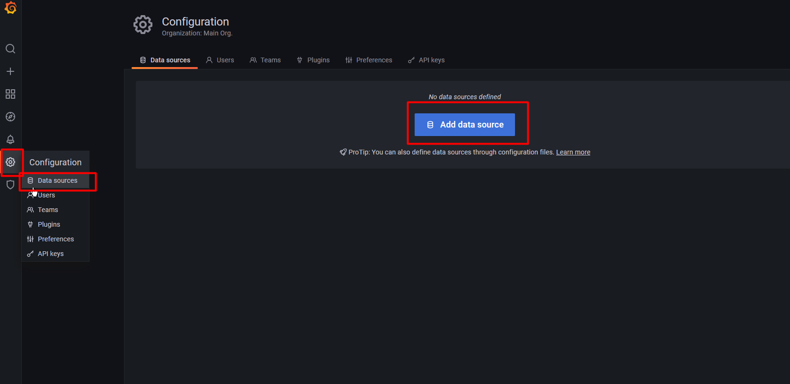  
如图中所示配置数据源,点击Add Data source按钮后可以选择数据库类型,可以看到grafana支持很多种数据库,比如PostgreSQL、MySQL、influxdb  
<font color="#00FF00">详细配置如下</font>:  
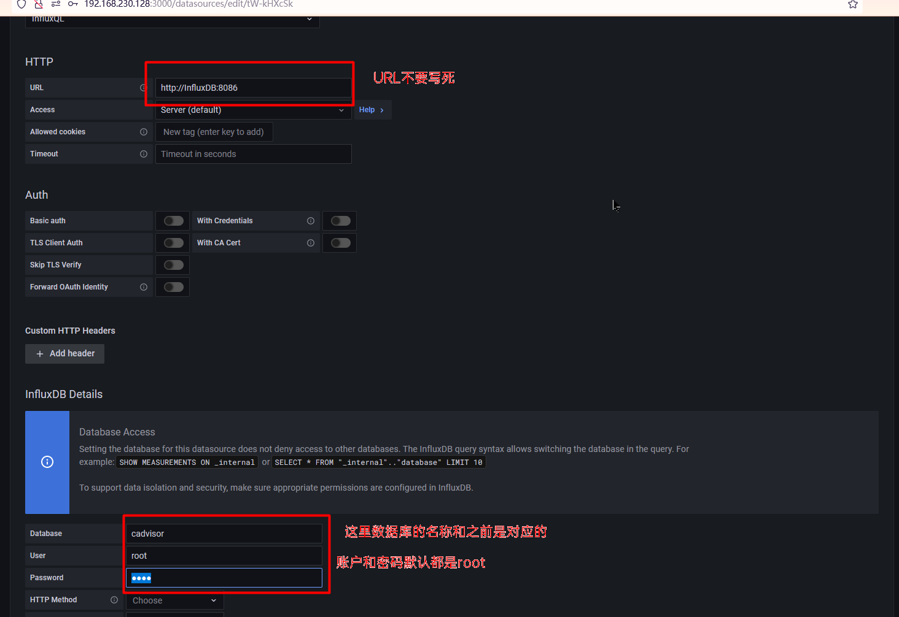  
URL要填写:`http://InfluxDB:8086`  
填写完毕之后点击下方的Save&test按钮,如果出现绿勾则代表成功  

7.创建新的观察页面  
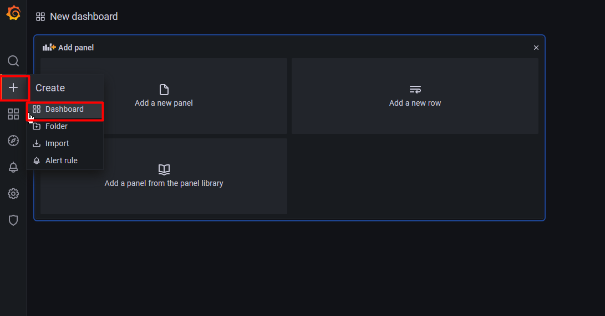  
点击左侧+号在点击Dashboard来到如上图所示的界面  
接着点击<font color="#00FF00">Add a new panel</font>  
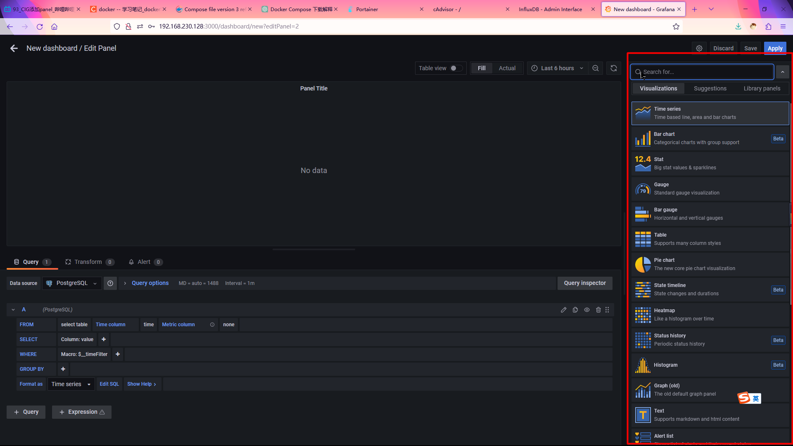  
在右侧随便选择一个图像化的面板,可以看到可供选择的面板还是挺多的;这里选择Graph(old)  
之后随便添加一些配置参数,设置标题信息啥的;设置完成后点击右上角save进行保存  

8.设置数据源  
点击save后会来到如下界面  
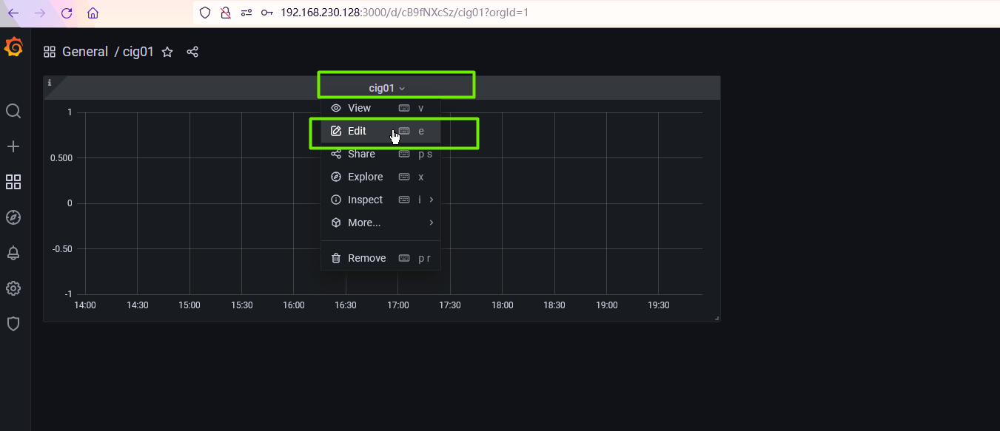  
可以看到此时还没有任何数据,这里按图中所示编辑cig01(刚才创建的面板)  

按照下图所示进行编辑;<font color="#00FF00">参数的说明看图中的文字</font>    
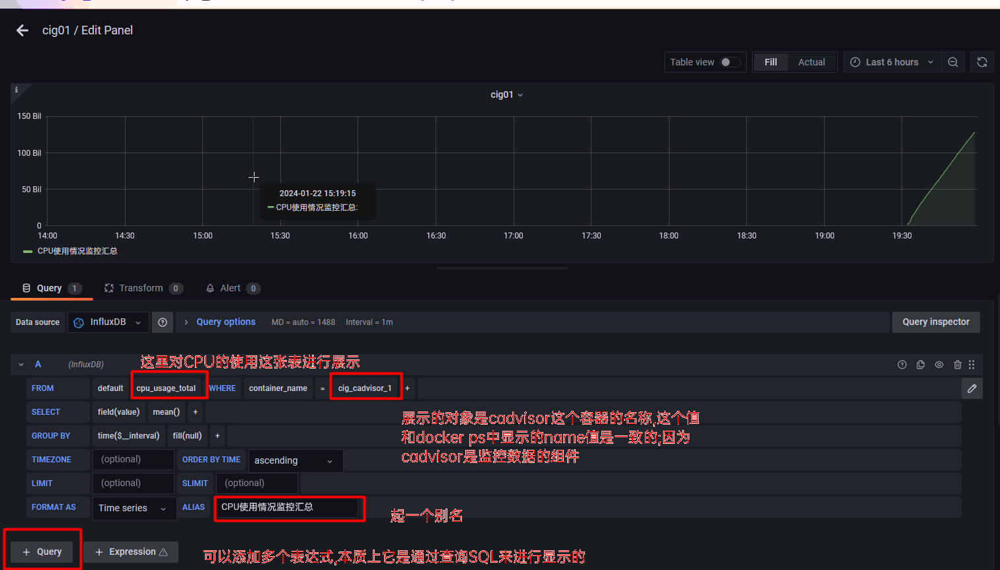  

9.监控成功  
退回到刚才的页面发现这个面板里面的信息开始丰富起来了  
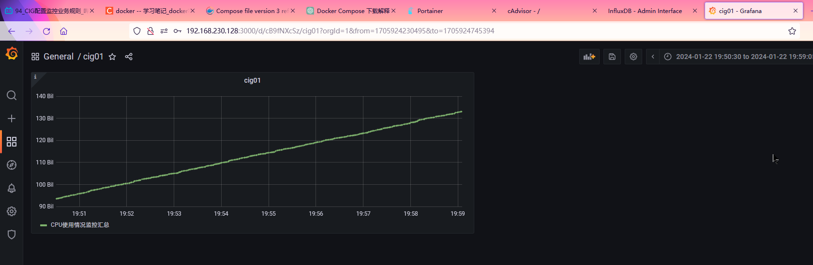  


## 附录:  
A. docker命令大全  
B. 常用docker镜像大全  
C. Docker安装教程  


### A. docker命令大全  
[docker命令官方网站](https://docs.docker.com/engine/reference/commandline/docker/)  

#### 1.镜像相关  
* `docker pull [image-name]:[version]` 拉取镜像  
  * `image-name`(必填):镜像名称
  * `version`(必填):镜像版本
* `docker images` 查看所有镜像  
* `docker exec -it [image-id] ` 进入一个镜像  
  * `image-id`(必填):image-id是容器的id(不是镜像的id;是docker ps结果的CONTAINER ID字段)
* `docker rmi [imageName0]:[imageTag0]/[imageId0] [imageName1...]:[imageTag1...]/[imageId1...]` 删除多个镜像
  * `imageName`(必填):镜像名称,与imageId二选一
  * `imageTag`(必填):镜像的TAG,和imageName一起使用
  * `imageId`(必填):镜像ID,与imageName二选一
	注意有的时候如果使用docker tag给镜像打标签,<font color="#00FF00">则打完标签后的镜像ID是不变的</font>,此时就会出现多个镜像ID相同的镜像,此时使用镜像ID删除镜像就不好使了;<font color="#FF00FF">此时只能通过镜像名称+TAG的方式进行删除</font>
* `docker rmi -f [imageName]/[imageId]` 强制删除一个镜像,推荐不使用-f参数,如果用上面没有-f删除docker镜像时出现问题(可能是当前要删除的镜像依赖某个容器,可以使用上面的docker rm [containerId]删除该容器后重试)
  * `imageName`(必填):镜像名称,与imageId二选一
  * `imageId`(必填):镜像ID,与imageName二选一
* ~~`docker rmi -f $(docker images -qa)`~~ <font color="#00FF00">组合命令</font>;强制删除所有镜像,该命令不要使用
  * `$(docker images -qa)` 这相当于一个表达式会将该命令执行的结果作为docker rmi -f命令的参数,docker images -qa的命令的意思是显示所有镜像的ID(不显示额外的信息)
* `docker system df` 查看镜像占用磁盘空间的情况

#### 2.容器相关  
* `docker ps [-a] [-l] [-n [number] -q]` 查询运行的所有镜像
  * `-a`:代表所有的镜像(包括没有正在运行的镜像)
  * `-l`:显示最近创建的容器
  * `-n [number]`:显示最近创建的number个容器
  * `-q`:静默模式,只显示容器ID(不显示额外的信息)
* `docker exec -it [containerId] /bin/bash` 进入一个容器  
  注意:/bin/bash也可以是/bin/sh、bash
* `docker attach [containerId]` 进入一个容器;这种方式进入容器用exit退出容器时会导致容器停止
* `docker rm [containerId] [-f]` 删除一个容器(是容器不是镜像)  
  * `-f`:强制删除
* `docker run [--name=[containerName]] [--privileged] [-d] [-p masterPort:containerPort] [-v [hostPath]:[containerPaht]:[mode(default=rw)]] [-e environmentKey=environmentValue] [--net networkMode] [-it bin/bash] [--restart always] [command] [imageName]:[imageVersion] ` 运行一个镜像(注意和start区分)
  * `imageName`(必填):镜像名称
  * `imageVersion`(必填):镜像版本
  * `--privileged`(必填):加强挂载权限,推荐使用以后就带上该参数就行
  - - -
  * `-e environmentKey=environmentValue` 指定环境变量
  * `--name [containerName]`:将容器取名为containerName
  * `-d`:以后台运行方式运行容器并返回容器ID;与`-it`互斥使用
  * `-p masterPort:containerPort`:将容器的containerPort端口映射到宿主机的masterPort
  * `--net networkMode`:指定容器启动时的网络模式
    * `networkMode`取值如下,详情见4.1 Docker网络基本概念介绍=>4.Docker网络模式
      * `bridge`:网桥模式
      * `host`:主机模式
      * `none`:none模式
      * `container:containerID` containerID为目标容器的ID
      * `customeNetWork` 自定义网络
  * `-it  bin/bash`:以交互模式运行容器;它与<font color="#00FF00">docker exec -it [containerId] /bin/bash</font>命令的区别在于,docker exec是容器已经启动的情况下进入容器
  * `-v [hostPath]:[containerPaht]:[mode(default=rw)]`  挂载容器文件路径到本机;将containerPaht(容器)路径的文件挂载到hostPath(主机)
    * `mode`:容器读写挂载文件的模式;有rw和ro两种模式
      * `rw`(默认):容器内部可以读写挂载的目录
      * `ro`:容器内部只能读取挂载的目录,<font color="#00FF00">主机不受限制</font>
  * `--restart always`:是否失败重启/开机启动
  * `command`:启动参数
  * 退出容器的时候有两种退出方式,<font color="#00FF00">一种是使用exit直接退出,另一种是使用Ctrl+p+q</font>  
  	<font color="#FF00FF">如果是利用docker run命令进入的容器,则exit的退出方式会连带将容器停止</font>  
		如果是docker exec -it的方式进入容器,则可以随意退出容器,容器不会停止
  - - -
  如果后续想修改环境变量可以进入容器使用`env`命令查看所有的环境变量;使用`export [environmentKey]=[environmentvalue]`命令修改环境变量
* `docker stop [containerId]` 停止一个容器  
* `docker start [containerId]` 启动一个容器  
* `docker restart [containerId]` 重启一个容器  
* `docker kill [containerId]` 强制停止一个容器
* `docker container update --mount type=bind,source=[hostPath],target=[containerPath] [containerId]` 挂载已经启动的容器目录(需要先将容器stop);source是宿主机的路径,target是容器内的路径.
* `docker cp [hostPath] [containerId]:[containerPath]` 将宿主机的文件拷贝到容器中
* `docker cp [containerId]:[containerPath] [hostPath]` 将容器中的内容拷贝到宿主机
* `docker logs [containerId]` 查看容器启动的日志
* `docker top [containerId]` 监控容器内运行的进程情况
* `docker inspect [containerId]` 查看容器的内部细节;该命令会以Json串返回容器的详情情况
  - - -
	* "Mounts":容器挂载情况  
	* "Config:"  
    	* "Cmd":启动附加参数

* `docker export [containerId] > [fileName].tar` 
  将整个容器导出为一个tar归档文件;采用这种导出方式,可以保留在容器内部修改的文件  
	这个命令就相当于一个压缩
	* `containerId`(必填):容器ID
	* `fileName`(必填):导出的文件名
* `cat [fileName].tar | docker import - [imageName]:[imageVersion]` 导入一个镜像
  以fileName.tar对应的容器备份文件创建一个新的镜像(注意是镜像),镜像名称为imageName,版本为imageVersion
	* `fileName`(必填):要导入的镜像压缩包
	* `imageName`(必填):镜像名称,该名称自拟
	* `imageVersion`(必填):镜像版本,该版本自拟
* `docker stats` 监控容器运行的资源占用情况

#### 3.版本控制相关  
* `docker commit -m "[commitMessage]" -a "[author]" [containerId] [targetImageName]:[targetImageVersion]` 提交containerId对应的容器并创建一个新的镜像
  * `commitMessage`(必填):提交的信息
  * `author`(必填):作者
  * `containerId`(必填):<font color="#00FF00">commit命令是基于容器的</font>;将该容器提交创建一个新的镜像
  * `targetImageName`(必填):创建的新镜像的名称
  * `targetImageVersion`(必填):创建的新镜像的版本
* `docker tag [imageId] [remoteAddress]/[imageName]:[imageVersion]` 给某个镜像打标签
	详情见:2.3 本地镜像发布到阿里云  
	**注意:因为是给镜像打标签,所以打完标签前后镜像的ID是不变的,所以此时就会存在多个镜像ID相同的镜像,可以通过docker images查看所有镜像,包括打标签的镜像**
  * `ImageId`(必填):镜像的id
  * `remoteAddress`(必填):镜像的远程地址,这个值一般都会给出
  * `[imageName]:[imageVersion]`(必填):镜像的名称和版本;自已拟定
* `docker push [remoteAddress]/[imageName]:[imageVersion]` 发布镜像
* `docker pull [remoteAddress]/[image-name]:[version]` 拉取镜像
  所以之前拉取镜像的时候理论上是要填写`remoteAddress`远程地址的,<font color="#00FF00">没有填写意味着默认从docker官方仓库拉取</font>
* `docker build -t [newImageName]:[newImageVersion] [path]` 通过Dockerfile构建Docker镜像
  * `newImageName`(必填):构建的镜像名称
  * `newImageVersion`(必填):构建的镜像的版本
  * `path`(必填):Dockerfile所在的目录,因为一个目录只能存在一个Dockerfile所以Docker会去改路径下面找对应的Dockerfile文件进行构建

#### 4.网络相关
* `docker network ls` 查看docker所有的网络
* `docker network rm [netWorkId]` 根据network的ID移除一个docker网络
* `docker network create [netWordName] [-d networkdMode]` 创建一个docker网络,网络名称为[netWordName]
  * `-d networkdMode` 网络的模式,可以取bridge(默认)、host、none
* `docker network connect`
* `docker network disconnect`
* `docker network inspect [netWorkId]` 查看某个网络的详细信息
* `docker network prune` 删除所有无效网络

#### 4.Compose相关
* `docker-compose -h` 查看帮助
* `docker-compose up [-d]` 启动所有docker-compose服务
  * `-d`:启动所有docker-compose服务并后台运行
* `docker-compose down` 停止并删除容器、网络、卷、镜像
* `docker-compose exec [ymlID]` 进入容器实例内部
  * `ymlID`:这里进入某个容器时是根据yml配置文件中定义的容器id
* `docker-compose ps` 展示当前docker-compose编排过的运行的所有的容器 
* `docker-compose top` 展示当前docker-compose编排过的容器进程 
* `docker-compose logs [ymlId]` 查看ymlID指定的容器日志  
  * `ymlID`:yml配置文件中指定的某容器ID
* `docker-compose config [-q]` 检查当前路径下的yml配置文件是否有语法错误
  * `-q` 只输出错误信息
* `docker-compose restart` 重启服务
* `docker-compose start` 启动服务
* `docker-compose stop` 停止服务

#### 6.其它  
* `docker version` 查看docker版本信息
* `docker info` docke概要说明
* `docker --help` docker帮助命令
* `docker [command] --help` 查看docker某条命令的帮助
* `sudo systemctl start docker` 启动docker
* `sudo systemctl stop docker` 停止docker
* `sudo systemctl restart docker` 重启docker
* `sudo systemctl status docker` 查看docker状态
* `sudo systemctl enable docker` 开机启动docker

### B. 常用docker镜像大全  
**目录:**  
1.MySQL  
2.Redis  
3.Nacos  
4.RabbitMQ  
5.ElasticSearch  
6.Nginx  


#### 1.MySQL安装  
**目录:**  
1.1 MySQL单机安装  
1.2 MySQL主从复制安装  

##### 1.1 MySQL单机安装
1.下载镜像  
`docker pull mysql:8.0.30`  

2.创建实例并启动  
```shell
docker run -p 7901:3306 --name mysql8.0 \
-v ~/software/mysql8.0/log:/var/log/mysql \
-v ~/software/mysql8.0/data:/var/lib/mysql \
-v ~/software/mysql8.0/conf:/etc/mysql/conf.d:rw \
-e MYSQL_ROOT_PASSWORD=root \
-d mysql:8.0.30
```

参数解释:  
* -v [hostPath]:[containerPaht]  挂载容器文件路径到本机;将containerPaht(容器)路径的文件挂载到(hostPath)  
* -e MYSQL_ROOT_PASSWORD=[password] -e参数的本质是启动容器时给容器设置参数,这里的参数意思是设置MySQL root用户的密码为root(看上面的例子)  
* --name 给当前容器其名  
* -p [hostPort]:[containerPort] 将容器的容器的端口(containerPort)映射到宿主机的端口(hostPort).  
* -d [repository]:[version] 启动的目标镜像坐标,通过docker images 命令可以查看到所有的镜像,目标镜像有仓库+version来决定  

3.进入到容器中修改密码  
`ALTER USER 'root'@'%' IDENTIFIED BY '这里是你要设置的密码';`

`flush privileges;` 刷新权限  

4.注意可能需要删除用户  

##### 1.2 MySQL主从复制安装
1.需求梳理  
有两台MySQL,主服务器3307从服务器3308  
主服务器插入一条数据,从服务器相应收到一条数据  

2.创建配置文件  
先创建配置文件目录:  
```shell
mkdir -p {~/software/mysql-master/conf,~/software/mysql-slave/conf}
```

在~/software/mysql-master/conf目录下创建my.cnf配置文件  
```shell
[mysqld]
## 设置service_id,同一局域网内需要唯一
server_id=101
## 指定不需要同步的数据库
binlog-ignore-db=mysql
## 开启二进制日志功能,日志名称为mall-mysql-bin
log-bin=mall-mysql-bin
## 设置二进制日志使用内存大小(事务)
binlog_cache_size=1M
## 设置使用的二进制日志格式(mixed,statement,row)
binlog_format=mixed
## 二进制日志过期清理时间.默认值为0表示不自动清理
expire_logs_days=7
## 跳过主从复制中遇到的所有错误或指定类型的错误,避免slave端复制中断
## 如:1062错误是指一些主键错误,1032错误是因为主从数据库数据不一致
slave_skip_errors=1062
```

在~/software/mysql-slave/conf目录下创建my.cnf配置文件
```shell
[mysqld]
## 设置service_id,同一局域网内需要唯一
server_id=102
## 指定不需要同步的数据库
binlog-ignore-db=mysql
## 开启二进制日志功能,日志名称为mall-mysql-bin
log-bin=mall-mysql-bin
## 设置二进制日志使用内存大小(事务)
binlog_cache_size=1M
## 设置使用的二进制日志格式(mixed,statement,row)
binlog_format=mixed
## 二进制日志过期清理时间.默认值为0表示不自动清理
expire_logs_days=7
## 跳过主从复制中遇到的所有错误或指定类型的错误,避免slave端复制中断
## 如:1062错误是指一些主键错误,1032错误是因为主从数据库数据不一致
slave_skip_errors=1062
## relay_log配置中继日志
relay_log=mall-mysql-relay-bin
## log_slave_updates表示slave将复制事件写进自已的二进制日志
log_slave_updates=1
## slave设置为只读(具有super权限的用户除外)
read_only=1
```

3.运行Master容器  
```shell
docker run -p 3307:3306 --name mysql-master \
-v ~/software/mysql-master/log:/var/log/mysql \
-v ~/software/mysql-master/data:/var/lib/mysql \
-v ~/software/mysql-master/conf:/etc/mysql/conf.d \
-e MYSQL_ROOT_PASSWORD=root \
-d mysql:8.0.30
```

4.在master数据库中创建用户  
创建一个slave用户,用于从master数据库中读取数据;相当于一种权限的约束  
```shell
# 创建slave用户
create user 'slave'@'%' IDENTIFIED BY '123456'
# 给slave用户分配权限
grant replication slave,replication client on *.* to 'slave'@'%'
```

5.运行slave容器  
```shell
docker run -p 3308:3306 --name mysql-slave \
-v ~/software/mysql-slave/log:/var/log/mysql \
-v ~/software/mysql-slave/data:/var/lib/mysql \
-v ~/software/mysql-slave/conf:/etc/mysql/conf.d \
-e MYSQL_ROOT_PASSWORD=root \
-d mysql:8.0.30
```

6.查看master状态  
*提示:如果这里执行命令不方便可以在Navicat中执行*
在master服务器中运行以下命令,<font color="#00FF00">该命令得到的参数将用于第7步</font>  
`show master status`  
显示的结果为  
|File|Position|Binlog_Do_DB|Binlog_Ignore_DB|Executed_Gtid_Set|
|:-:|:-:|:-:|:-:|:-:|
|mall-mysql-bin.000003|741||mysql||


7.在slave中配置主从复制  
```shell
change master to master_host='[masterIP]', master_user='user',master_password='[master_password]',master_port=[master_port],master_log_file='mall-mysql-bin.000003',master_log_pos=741,master_connect_retry=30;
```
* masterIP:主机的IP
* user:从机访问主机的用户名
* master_password:从机访问主机的用户名对应的密码
* master_port:主机的端口
* master_log_file:这个参数和第6步得到的结果对应上
* master_log_pos:这个参数和第6步得到的结果对应上
* master_connect_retry:连接失败的重试时间

例如:  
```shell
change master to master_host='192.168.230.128', master_user='slave',master_password='123456',master_port=3307,master_log_file='mall-mysql-bin.000003',master_log_pos=741,master_connect_retry=30;
```

8.查看slave状态  
执行`show master status`  
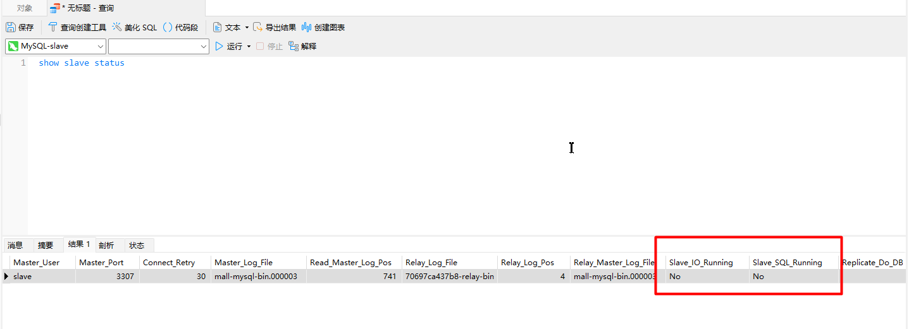  
可以看到此时还没有进行主从同步  

9.在slave中开启主从同步  
执行`start slave`  

10.再次查看slave状态  
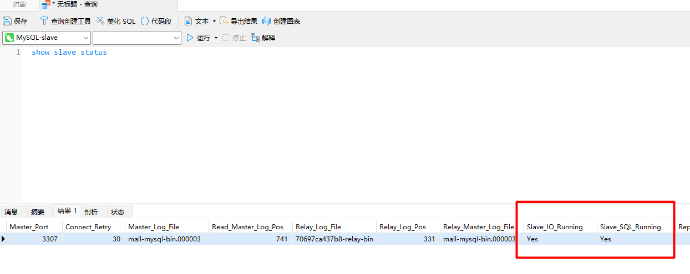  
此时发现已经开启同步  

11.测试主从同步  
主机新建库=>新建表=>插数据  
从机=>查看记录  


#### 2.Redis  
**目录:**  
2.1 Redis单机安装  
2.2 Redis三主三从集群  


##### 2.1 Redis单机安装
1.下载镜像  
`docker pull redis:7.0`  

2.先创建配置文件  
**解释:** 这有个小坑,在docker挂载的时候有可能将最后一个文件识别成目录,所有这里要先创建Redis配置文件的.  
`mkdir -p ~/software/redis/conf`  创建配置文件目录  
`touch ~/software/redis/conf/redis.conf` 创建Redis配置文件  
*提示:这个配置文件来源于Redis的官方github*  
**[redis.conf](resources/redis/redis.conf)**  

<font color="#00FF00">对于拷贝过来的配置文件需做如下修改否则导致容器启动失败:</font>  
* 注释掉 bind 127.0.0.1
* 将daemonize的值改为no
* `requirepass [password]` 在配置文件中设置Redis密码
* 将appendonly的值改为yes,开启持久化

3.创建容器并启动
```shell
docker run \
--name redis \
-p 7902:6379 \
-v ~/software/redis/data:/data \
-v ~/software/redis/conf/redis.conf:/etc/redis/redis.conf \
--privileged=true \
-d redis:7.0 \
/etc/redis/redis.conf
```

**解释:** 后面的/etc/redis/redis.conf是容器启动参数[command];redis.conf是容器里面的配置文件,意思是启动redis的时候携带的配置文件  

4.客户端连接redis    
`redis-cli -a [password] --raw -h [host] -p [port]` 使用密码连接Redis客户局
* `-a [password]` 设置密码启动客户端
* `--raw` 解决中文乱码问题  
* `-h [host]`(非必填):连接的目标RedisIP  
* `-p [port]`(非必填):连接的目标Redis的port

**Redis详细配置见:Redis=>B.Redis命令大全=>5.redis.conf**  

5.Redis默认安装路径 /usr/local/bin(可以进入容器中访问)  

~~6.Redis中sentinel.conf配置文件~~  
该配置文件存放的路径应该与redis.conf配置文件中设置的`dir`路径的目录一致;sentinel.conf是Redis负载均衡的配置.  
如果redis.conf没有指定dir,则将sentinel.conf配置文件放到与redis.conf配置文件相同的目录下.  

~~7.启动sentinel~~  
sentinel的启动和Redis服务的启动是完全不一样的,虽然可以使用同一个镜像来完成  
```shell
docker run -p 7903:26379 --name redis-sentinel \
-v ~/software/redis/data:/data \
-v ~/software/redis/conf/sentinel.conf:/etc/redis/sentinel.conf \
-e --sentinel \
-d redis:7.0 redis-sentinel /etc/redis/sentinel.conf
```
**解释:**  
* -e --sentinel 启动sentinel时需要带上的参数

~~8.启动集群~~  
```shell
docker run -p 7903:26379 --name redis-sentinel \
-v ~/software/redis/data:/data \
-v ~/software/redis/conf/sentinel.conf:/etc/redis/sentinel.conf \
-e -c \
-d redis:7.0 redis-sentinel /etc/redis/sentinel.conf
```

**解释:**  
* -e -c 代表启动的有路由(这是集群中的概念,详情见Redis.md=>基础篇=>8.Redis集群=>8.3 三主三从集群环境=>8.3.3 主从容错切换迁移案例)

##### 2.2 Redis三主三从集群
1.需求梳理  
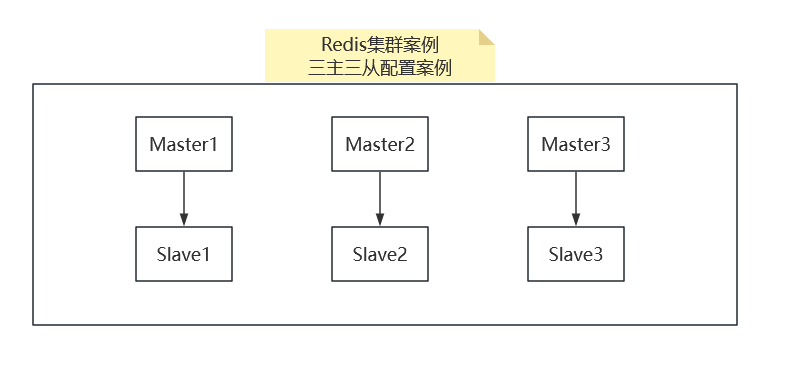  

2.启动6台Redis  
*提示:以下的启动方式使用的启动参数,实际上完全可以改为使用<font color="#00FF00">配置文件</font>的方式指定*
redis1:
```shell
docker run \
--name redis-node-1 \
-v ~/software/redisCluster/redis-node-1/data:/data \
--privileged=true \
--net host \
-d redis:7.0 \
--cluster-enabled yes \
--appendonly yes \
--port 6381
```
redis2:
```shell
docker run \
--name redis-node-2 \
-v ~/software/redisCluster/redis-node-2/data:/data \
--privileged=true \
--net host \
-d redis:7.0 \
--cluster-enabled yes \
--appendonly yes \
--port 6382
```
redis3:
```shell
docker run \
--name redis-node-3 \
-v ~/software/redisCluster/redis-node-3/data:/data \
--privileged=true \
--net host \
-d redis:7.0 \
--cluster-enabled yes \
--appendonly yes \
--port 6383
```
redis4:
```shell
docker run \
--name redis-node-4 \
-v ~/software/redisCluster/redis-node-4/data:/data \
--privileged=true \
--net host \
-d redis:7.0 \
--cluster-enabled yes \
--appendonly yes \
--port 6384
```
redis5:
```shell
docker run \
--name redis-node-5 \
-v ~/software/redisCluster/redis-node-5/data:/data \
--privileged=true \
--net host \
-d redis:7.0 \
--cluster-enabled yes \
--appendonly yes \
--port 6385
```
redis6:
```shell
docker run \
--name redis-node-6 \
-v ~/software/redisCluster/redis-node-6/data:/data \
--privileged=true \
--net host \
-d redis:7.0 \
--cluster-enabled yes \
--appendonly yes \
--port 6386
```

**解释:**  
* `--net host`:这里没有使用端口映射的原因是使用该参数直接使用物理机的IP和端口

3.进入redis-node-1容器  
执行:`redis-cli [-a [password]] --cluster create --cluster-replicas 1 [ipAddr]...`  
* `--cluster-replicas 1` 表示为每个master创建一个slave节点  
* `ipAddr` 是当前6台机器的IP和端口;IP地址就是宿主机的IP
* `password` 因为执行的是redis-cli命令,所以相当于要连接服务器(但实际并不连接服务器,也就是说这条命令执行完毕就会立即结束);如果服务器设置了密码这里需要填上密码

例如:  
`redis-cli --cluster create --cluster-replicas 1 192.168.230.128:6381 192.168.230.128:6382 192.168.230.128:6383 192.168.230.128:6384 192.168.230.128:6385 192.168.230.128:6386`

*提示:这里服务器没有配置密码所以不需要指定密码*  
该命令执行完毕之后,为每个master指定一个slave,<font color="#00FF00">一共6个节点所以就是一主一从共3组</font>  
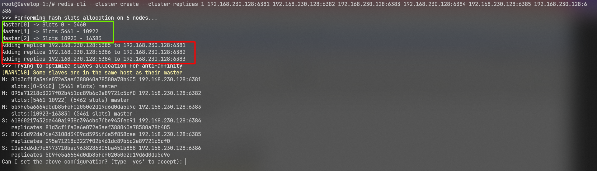  
<font color="#FF0000">红色方框</font>中的内容是主从节点同步的情况  
<font color="#00FF00">绿色方框</font>中的内容是哈希槽的分配情况  

接下来提示是否接受当前的分配情况,这里输入yes,成功之后显示内容如下图  
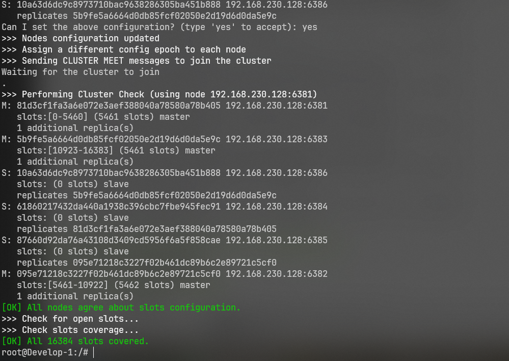  
*提示:<font color="#00FF00">集群的分配规则是由redis自动完成的</font>*

4.查看集群状态  
执行`redis-cli -p 6381`进入redis  
执行`cluster info` 查看集群情况  
执行`cluster nodes` 查看集群节点情况  

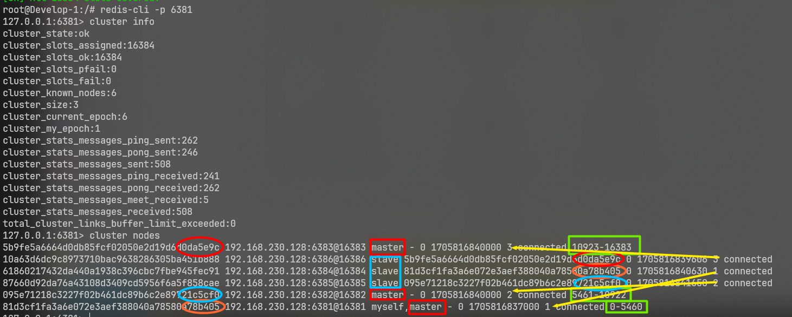  
注意图中信息的关联,这些信息指代了集群节点之间的关系  
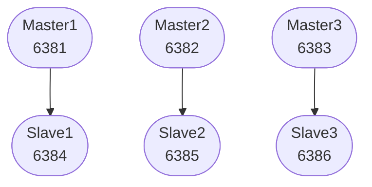
```mermaid
flowchart TD
    1(["
    Master1
    6381
    "]) --> 4(["
    Slave1
    6384
    "])
    2(["
    Master2
    6382
    "]) --> 5(["
    Slave2
    6385
    "])
    3(["
    Master3
    6383
    "]) --> 6(["
    Slave3
    6386
    "])
```

执行redis客户端命令`redis-cli -a [password] --cluster check [clusterIP]:[clusterPort]` 查看集群槽位分配数量、节点同步情况  
* `clusterIP`:集群中某个节点的IP
* `clusterPort`:集群中某个节点的Port

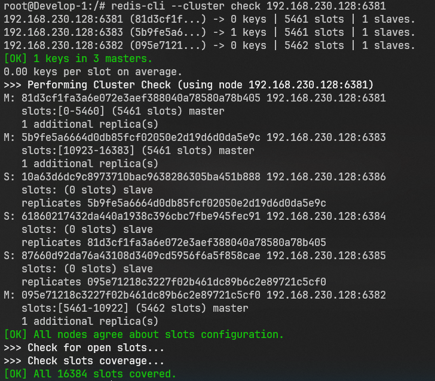  

5.集群读写redis  
之前在redis笔记中就有讲过,要想在redis集群中读写键值对必须在启动的时候带上`-c`参数,例如`redis-cli -c`  

6.主从扩缩容案例  
详情见redis笔记=>基础篇=>8.redis集群=>8.3 3主3从集群环境=>8.3.5 主从扩容案例和8.3.6 主从缩容案例  


#### 3.Nacos
1.下载镜像  
`docker pull nacos/nacos-server:v2.2.0`  

2.启动容器  
```shell
docker run \
-p 8848:8848 \
-p 9848:9848 \
-p 9849:9849 \
--name nacos2 \
--env MODE=standalone \
--env NACOS_AUTH_ENABLE=true \
--env NACOS_AUTH_TOKEN_EXPIRE_SECONDS=18000 \
--env NACOS_AUTH_TOKEN=VGhpc0lzTXlDdXN0b21TZWNyZXRLZXkwMTIzNDU2Nzg= \
-e JVM_XMS=256m \
-e JVM_XMX=256m \
-d nacos/nacos-server:v2.2.0
```
**解释:**  
* --env NACOS_AUTH_ENABLE=true 代表开启新版本nacos的鉴权  
* --restart=always 重启  
* --env MODE=standalone 启动模式为单击启动  
* --env NACOS_AUTH_TOKEN_EXPIRE_SECONDS=18000 token默认的时效时间  
* nacos2.0之后还需要加上9848、9849端口

3.挂载目录(先启动再挂载)  
**这个第三点是无效的,不用看了,所以nacos就不指定挂载就行了**  
这里逻辑会非常混乱,可以看帖子:[https://www.yii666.com/blog/511435.html](https://www.yii666.com/blog/511435.html)  

**环境:**  
我这里启动了两个nacos;一个是没有挂载目录的;一个是正常挂载目录的.  
挂载目录实际上是由两个文件来共同决定的:hostconfig.json和config.v2.json  

没有挂载的hostconfig.json文件:
```json
{
  "Binds": null,
  "ContainerIDFile": "",
  "...":"..." // 后面的内容省略了
}
```

有挂载的hostconfig.json文件:
```json
{
	"Binds": ["/root/software/nacos/conf:/home/nacos/conf", "/root/software/nacos/data:/home/nacos/data", "/root/software/nacos/logs:/home/nacos/logs"],
	"ContainerIDFile": "",
  "...":"..."
}
```
着重看Binds属性,可以看到和挂载一样,冒汗前面指定的是宿主机路径,冒号后面指定的是容器内路径.  

没有挂载的config.v2.json:
```json
{
  "MountPoints":{}
}
```

有挂载的config.v2.json(省略部分不重要内容):  
```json
{
  	"MountPoints": {
		"/home/nacos/conf": {
			"Source": "/root/software/nacos/conf",
			"Destination": "/home/nacos/conf",
			"RW": true,
			"Name": "",
			"Driver": "",
			"Type": "bind",
			"Propagation": "rprivate",
			"Spec": {
				"Type": "bind",
				"Source": "/root/software/nacos/conf",
				"Target": "/home/nacos/conf"
			},
			"SkipMountpointCreation": false
		},
		"/home/nacos/data": {
			"Source": "/root/software/nacos/data",
			"Destination": "/home/nacos/data",
			"RW": true,
			"Name": "",
			"Driver": "",
			"Type": "bind",
			"Propagation": "rprivate",
			"Spec": {
				"Type": "bind",
				"Source": "/root/software/nacos/data",
				"Target": "/home/nacos/data"
			},
			"SkipMountpointCreation": false
		},
		"/home/nacos/logs": {
			"Source": "/root/software/nacos/logs",
			"Destination": "/home/nacos/logs",
			"RW": true,
			"Name": "",
			"Driver": "",
			"Type": "bind",
			"Propagation": "rprivate",
			"Spec": {
				"Type": "bind",
				"Source": "/root/software/nacos/logs",
				"Target": "/home/nacos/logs"
			},
			"SkipMountpointCreation": false
		}
	}
}
```

那实际上我们就把有挂载的容器的配置复制到给没有挂载的容器配置上即可.  

#### 4.RabbitMQ  
1.拉取镜像  
`docker pull rabbitmq:3.12.4-management`  

2.启动容器  
```shell
docker run --name rabbitmq \
-p 4369:4369 \
-p 5671:5671 \
-p 5672:5672 \
-p 25672:25672 \
-p 15671:15671 \
-p 15672:15672 \
-d rabbitmq:3.12.4-management
```
**解释:**  
* 4369:Erlang发现端口(必须指定)  
* 15672:Web前端管理端口(可以不指定,推荐指定)  
* 25672:集群端口  
* 5672;5671:AMQP端口
  springboot连接时使用该端口
* 61613;61614:STOMP协议端口  
* 1883;8883:MQTT协议端口  

3.进入容器修改密码  
`docker exec -it [containerId] /bin/bash`

运行`rabbitmqctl  list_users` 查看当前所有用户  
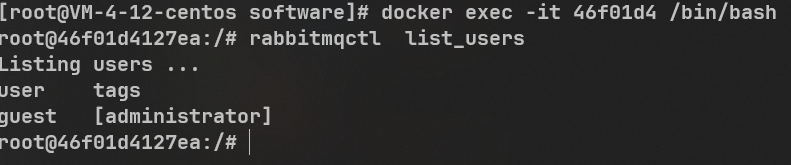  

运行`rabbitmqctl change_password [Username] [Newpassword]` 修改密码  


#### 5.ElasticSearch  
1.拉取镜像  
`docker pull elasticsearch:8.5.2`

2.在宿主机创建两个文件目录  
`mkdir -p ~/software/elasticsearch/plugins`  
`mkdir -p ~/software/elasticsearch/data`

3.运行容器  
```shell
docker run --name elasticsearch \
-p 9200:9200 \
-p 9300:9300 \
-e "discovery.type=single-node" \
-e ES_JAVA_OPTS="-Xms512m -Xmx512m" \
-e xpack.security.enabled=false \
-v ~/software/elasticsearch/plugins:/usr/share/elasticsearch/plugins \
-d elasticsearch:8.5.2
```

**解释:**
* 9200端口:HTTP协议(RESTful风格的接口)  
* 9300端口:TCP协议(主要是开放给java服务调用以及ES集群之间使用,微服务yml配置文件中配置该端口)  

4.停止容器  
`docker stop [containerId]`  

5.安装分词器插件  
分词器的下载见尚上优选  
将下载的分词器解压到~/elasticsearch/plugins 文件夹下(因为设置了挂载)  

`unzip -o -d [targetPath] [zipPath]`  解压zip到目标目录 -o 覆盖模式 -d 制定解压到的路径为(targetPath)  

当然可以先创建一个目录用于备份下载的分词插件压缩包,因为plugins目录下是不允许有压缩包的(只能有插件)  

6.进入容器
ElasticSearch8之后默认有权限验证,来到config/elasticsearch.yml配置文件,先备份该文件查看该文件内容:  
```yml
cluster.name: "docker-cluster"
network.host: 0.0.0.0

#----------------------- BEGIN SECURITY AUTO CONFIGURATION -----------------------
#
# The following settings, TLS certificates, and keys have been automatically
# generated to configure Elasticsearch security features on 16-09-2023 11:19:38
#
# --------------------------------------------------------------------------------

# Enable security features
xpack.security.enabled: true

xpack.security.enrollment.enabled: true

# Enable encryption for HTTP API client connections, such as Kibana, Logstash, and Agents
xpack.security.http.ssl:
  enabled: true
  keystore.path: certs/http.p12

# Enable encryption and mutual authentication between cluster nodes
xpack.security.transport.ssl:
  enabled: true
  verification_mode: certificate
  keystore.path: certs/transport.p12
  truststore.path: certs/transport.p12
#----------------------- END SECURITY AUTO CONFIGURATION -------------------------
```  

由于不好在容器内进行编辑,故先退出容器 来到容器外部  
在~/software/elasticsearch/config目录下创建elasticsearch.yml配置文件  
将配置改为以下内容:  
```yml
cluster.name: "docker-cluster"
network.host: 0.0.0.0

#----------------------- BEGIN SECURITY AUTO CONFIGURATION -----------------------
#
# The following settings, TLS certificates, and keys have been automatically
# generated to configure Elasticsearch security features on 16-09-2023 11:19:38
#
# --------------------------------------------------------------------------------

# Enable security features 是否开启权限校验
xpack.security.enabled: false

xpack.security.enrollment.enabled: false

# Enable encryption for HTTP API client connections, such as Kibana, Logstash, and Agents
xpack.security.http.ssl:
  enabled: false
  keystore.path: certs/http.p12

# Enable encryption and mutual authentication between cluster nodes 是否开启https
xpack.security.transport.ssl:
  enabled: false
  verification_mode: certificate
  keystore.path: certs/transport.p12
  truststore.path: certs/transport.p12
#----------------------- END SECURITY AUTO CONFIGURATION -------------------------
```
执行命令拷贝文件:  
`docker cp ./elasticsearch.yml [containerId]:/usr/share/elasticsearch/config `

7.重启容器
`docker start [containerId]`

#### 6.Nginx
1.拉取镜像  
`docker pull nginx`  

2.直接先启动(为了拷贝配置文件)  
*<font color="#00FF00">提示</font>:有的时候docker挂载配置文件,启动容器后会提示找不到conf,这是因为这种镜像在启动的时候并没有同步配置文件;那么一种解决方案就是先启动一个容器,把容器中的配置文件拷贝出来,然后把该容器删掉;之后再启动一次并且设置挂载*  
```shell
docker run \
-p 80:80 \
--name nginx \
-d nginx
```

3.拷贝文件  
```shell
mkdir {~/software/nginx,~/software/nginx/html,~/software/nginx/logs}
# 把containerID替换为你的NGINX镜像id
docker container cp [containerID]:/etc/nginx ~/software/nginx/conf/
```

4 停止容器删除容器  
```shell
docker stop [containerID]
docker rm [containerID]
```

5 启动nginx  
```shell
docker run -p 9001:80 --name nginx \
-v ~/software/nginx/html:/usr/share/nginx/html \
-v ~/software/nginx/logs:/var/log/nginx \
-v ~/software/nginx/conf:/etc/nginx \
-d nginx
```

此时访问`LinuxIP:9001`就能够看到nginx的响应信息了  


### C. Docker安装教程  
**目录:**  
1.1 安装docker  
1.2 安装JDK  

#### 1.1 安装docker  
*提示:内核版本需要3.8以上,通过uname -r命令查看当前Linux的内核版本*  

1.安装GCC  
*提示:该步骤非必要*  
```shell
yum -y install gcc \
yum -y install gcc-c++
```

2.卸载系统之前的 docker
```shell
sudo yum remove docker \
docker-client \
docker-client-latest \
docker-common \
docker-latest \
docker-latest-logrotate \
docker-logrotate \
docker-engine
```

3.安装Docker-CE
```shell
sudo yum install -y yum-utils \
device-mapper-persistent-data \
lvm2
```

4.设置docker-repo的yum位置(设置镜像仓库)
```shell
sudo yum-config-manager \
--add-repo \
https://download.docker.com/linux/centos/docker-ce.repo
```

5.安装docker引擎
```shell
sudo yum install docker-ce docker-ce-cli containerd.io
```

6.启动docker
```shell
sudo systemctl start docker
```

7.开机自启docker
```shell
sudo systemctl enable docker
```

8.配置阿里云镜像 **一共四条命令**  
```shell
sudo mkdir -p /etc/docker
```
```shell
sudo tee /etc/docker/daemon.json <<-'EOF'
{
"registry-mirrors": ["https://82m9ar63.mirror.aliyuncs.com","http://hub-mirror.c.163.com"]
}
EOF
```
```shell
sudo systemctl daemon-reload
```
```shell
sudo systemctl restart docker
```

**提示:** 这里的镜像加速地址可以配置成个人的镜像加速地址,详情见2.3 本地镜像发布到阿里云=>2.2 配置镜像加速地址

9.卸载docker  
```shell
systemctl stop docker \
yum remove docker-ce docker-ce-cli containerd.io \
rm -rf /var/lib/docker \
rm -rf /var/lib/containerd \
```


#### 1.2 安装JDK  
**详情可以看附录B的安装及各种参数解释**    

1.docker仓库[https://hub.docker.com/search?q=](https://hub.docker.com/search?q=)  

2.拉取JDK17镜像  
```shell
docker pull openjdk:17
```

3.查看所有镜像  
```shell
docker images
```
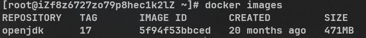  

4.启动容器  
```shell
docker run --name openjdk17 \
-v /jdk/bin:
-d openjdk:17
```

5.进入容器  
```shell
docker exec -it bf80164 /bin/bash
```
bf80164是容器的id(不是镜像的id);后面的bin/bash是必须的  

6.将