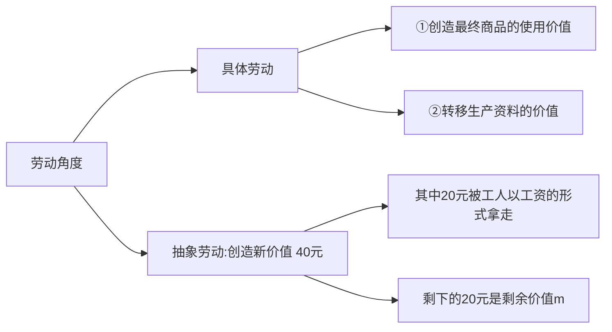
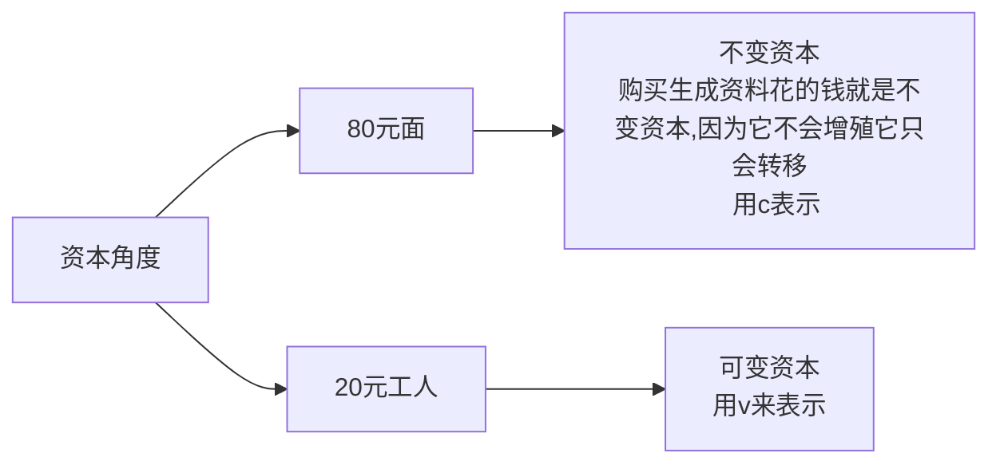
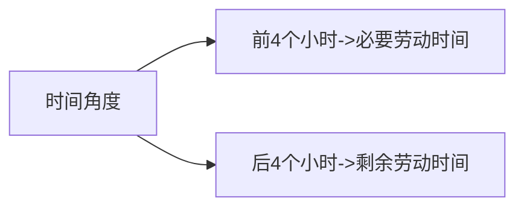
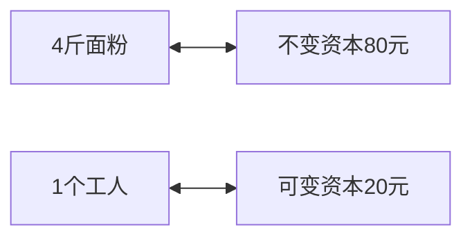
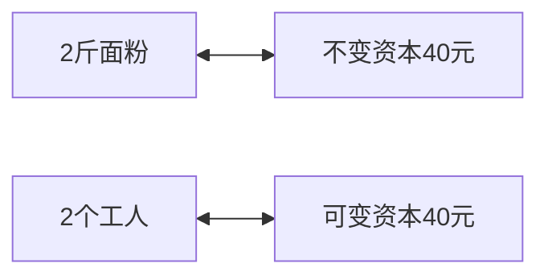
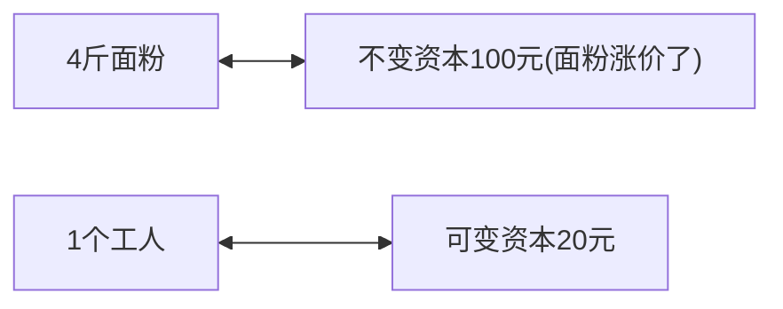
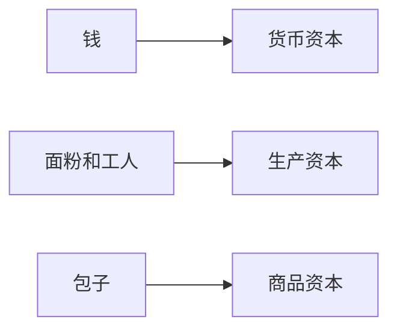
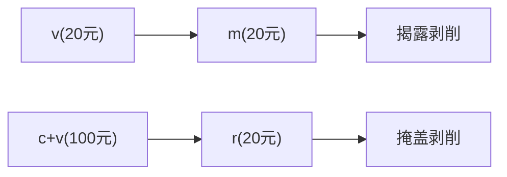
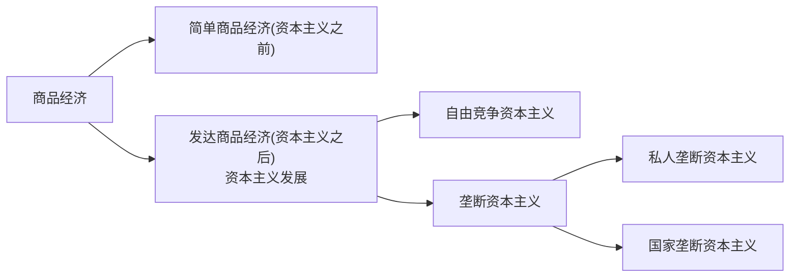

# 目录  
1.资本主义的本质及规律  
2.资本主义的发展及其趋势  

# 1.资本主义的本质及规律  
**目录:**  
1.1 商品经济和价值规律  
1.2 资本主义经济制度  
1.3 资本主义上层建筑  

## 1.1 商品经济和价值规律  
**目录:**  
1.1.1 价值是什么、如何衡量、如何表现、有何规律  
1.1.2 以私有制为基础的商品经济的基本矛盾  
1.1.3 马克思劳动价值论的意义  

### 1.1.1 价值是什么、如何衡量、如何表现、有何规律  
**目录:**  
1.1.1.1 价值是什么  
1.1.1.2 价值如何衡量  
1.1.1.3 价值如何表现  
1.1.1.4 价值有何规律  

#### 1.1.1.1 价值是什么  
1.商品经济产生的历史条件  
商品经济是以交换为目的而进行生产的经济形式,商品经济产生的社会历史条件有两个(1)社会分工的存在(2)生产资料和劳动产品属于不同的所有者  

*解释:所谓的分工就是男耕女织,但光有分工还不够,比如男耕田后回家穿女织的衣服就不算商品经济,应为生产资料和劳动产品属于同一个所有者*  

2.商品的二因素  
商品的概念及二因素:商品是用来交换、能满足人们的某种需要的劳动产品,具有使用价值和价值这两种属性,是使用价值和价值的矛盾统一体  
*注意:交换价值不属于商品的二因素*  

3.使用价值的概念  
使用价值是指商品能满足人的某种需要的属性,即商品的有用性,反应的是人与自然之间的物质关系,是商品的自然属性,是一切劳动产品所共有的属性,使用价值构成社会财富的物质内容  
*提示:劳动产品≠商品,比如一个由我生产的包子被我吃了那它就不是商品,但是它有使用价值,使用价值不管是不是商品都是具有的*  
*补充:社会财富=使用价值的总和,所以如果一个社会没有商品,则该社会的财富依旧可能非常巨大,比如共产主义社会,没有商品,但有很多具有使用价值的劳动产品*  

4.价值的概念  
价值是凝结在商品中的无差别的一般人类劳动(价值=劳动),即人的脑力和体力的耗费,价值是商品所特有的社会属性  
*判断:没有劳动、天然的东西一定没有价值,这句话是对的,因为价值=劳动,比如阳光它有使用价值但是没有价值*  
*解释:价值产生的条件,首先得是商品,而商品必须是劳动+交换的产品才能算商品,所以商品必然经过劳动,所以价值是商品的特有属性,所以如果这个世界上只有你一个人,那么就没有价值这个概念了,同时也没有社会这个概念了,所以价值是社会属性*  

5.交换价值  
使用价值是交换价值的物质承担者,交换价值首先表现为一种使用价值同另一种使用价值相交换的量的关系或比例  
决定商品交换比例的,不是商品的使用价值,而是价值  
*比如:一张显卡换十个苹果,这个交换的比例并不是按照它们的使用价值来决定的,因为对于不同的人来说显卡的使用价值不同,而应该由价值(劳动)来决定,即一张显卡的劳动要交换到对应数量苹果的劳动*  
*补充:这里还要看一下[[马政经#1112-价值如何衡量]]->3.简单劳动和复杂劳动*

6.使用价值和价值的关系  
使用价值和价值的关系是对立统一  
对立性表现在:商品的使用价值和价值是相互排斥的,二者不可兼得  
*解释:对于市场上所有的人来说不可能同时得到使用价值和价值,比如卖显卡的,让出了显卡的使用价值(任何产品都有使用价值),但获得了显卡的价值(背后的劳动),买显卡的人,让出了显卡的价值(劳动),但获得了显卡的使用价值*  
统一性表现在:商品的使用价值和价值二者缺一不可(根据上述的定义,任何商品都同时具备使用价值和价值)  

7.生产商品的劳动二重性  
*例子:劳动分为具体劳动和抽象劳动,具体劳动的形式是不同的,比如粮食生产、服装生产等,所以具体劳动生产出的商品的使用价值都不同,所以说具体劳动决定商品的使用价值;而不管是什么形式的劳动其本质都是体力和脑力的耗费,所以它们都是抽象劳动,所以人们生产出的东西都具有同性质的价值,每个商品都有价值(劳动),虽然价值大小不同但它们都有价值都可以交换*  

商品是劳动产品,生产商品的劳动可以区分为具体劳动和抽象劳动  
具体劳动:具体劳动是指生产一定使用价值的具体形式的劳动  
抽象劳动:指撇开一切具体形式、无差别的一般人类劳动,即人的脑力和体力的耗费  
劳动的二重性决定了商品的而因素:具体劳动创造商品的使用价值,抽象劳动形成商品的价值(**抽象劳动=价值**,价值就是隐藏在商品中的抽象劳动)  

8.具体劳动和抽象劳动的关系  
具体劳动和抽象劳动是同一劳动的两种规定  
*解释:也就是说,具体劳动和抽象劳动并不是二选其一,而是任何劳动都即是具体劳动又是抽象劳动,关键看角度,是同一劳动的两个方面*  

#### 1.1.1.2 价值如何衡量  
1.商品价值的决定  
*引子:商品价值只能由劳动来衡量*  
价值量是由劳动者生产商品所耗费的劳动量决定的,而劳动量则是按劳动时间来计量的,决定商品价值量的,不是生产商品的个别劳动时间,而是社会必要劳动时间  
**社会必要劳动时间**-是指在现有的社会正常的生产条件下,在社会平均的劳动熟程度和劳动强度下制造某种使用价值所需要的劳动时间  

2.商品价值量与劳动生产率队关系  
|            条件            | 单位商品的价值量(价值=劳动) | 单位时间生产商品数量 | 单位时间内生产商品价值总量 | 单位商品使用价值量 | 单位时间内生产商品使用价值总量 | 单位时间生产的社会财富总量 |
|:--------------------------:|:---------------------------:|:--------------------:|:--------------------------:|:------------------:|:------------------------------:|:--------------------------:|
| 全社会(部门)劳动生产率增加 |            减少             |         增多         |            不变            |        不变        |              增多              |            增多            |
|     个别劳动生产率增加     |            不变             |         增多         |            增多            |       不变关       |             不变多             |            增多            |

*全体解释版本*  
|            条件            |                                      单位商品的价值量(价值=劳动)                                       |               单位时间生产商品数量               |                         单位时间内生产商品价值总量                          |                      单位商品使用价值量                       |                      单位时间内生产商品使用价值总量                       |                   单位时间生产的社会财富总量                    |
|:--------------------------:|:------------------------------------------------------------------------------------------------------:|:------------------------------------------------:|:---------------------------------------------------------------------------:|:-------------------------------------------------------------:|:-------------------------------------------------------------------------:|:---------------------------------------------------------------:|
| 全社会(部门)劳动生产率增加 | 减少 因为全社会的生产率增加,导致单个商品所需的社会必要劳动时间减少,从而根据定义劳动减少商品价值下降 | 增多 同理生产效率的提升导致商品生产的数量增多 |   不变  因为商品的价值减少的同时商品数量增多从而导致商品的总价值量不变   | 不变 商品的使用价值和生产商品的速度无关,只和该商品本身有关 | 增多 每个商品的使用价值不变,但是因为生产效率的提升导致总的使用价值增多 | 增多 社会财富=使用价值,所以全社会的财富总量=商品使用价值总量 |
|     个别劳动生产率增加     |   不变 因为商品的价值只与全社会都必要劳动时间挂钩,所以个别劳动时间的缩短并不会使商品的价值量减少    |    增多 生产效率的提升必然导致商品数量增加    | 增多 增多的商品数量和不变的商品价值,必然导致单位时间内商品的总价值量上升 |                  不变 同理跟生产速度无关                   |                         不变 同理总价值量增多                          |                              增多                               |

*市场竞争的底层逻辑,在商品市场经济的环境下,因为个别劳动生产率的增加能够从总体上使得商品的总价值量的提升,所以大家争先恐后地提升自已的技术;甚至举个例子,如果所有人生产显卡的时间都是2个小时,现在有一家公司率先实现1小时生产一张显卡,但是它并不会按照2小时的劳动量去售卖这张显卡(自降身价),而是按照1小时半的劳动量卖这张显卡,这样就能把同行逼死,所以市场竞争就是这么激烈,哪怕自已少吃也要先搞死同行*  

商品的价值量会生产商品所耗费的社会必要劳动时间成正比,与劳动生产率成反比,影响劳动生产率的因素主要包括:(1)劳动者的平均劳动熟练程度、(2)科学技术的发展水平及其在生产中的应用程度、(3)生产过程的社会结合、(4)生产资料的规模和效能以及自然条件等

3.简单劳动和复杂劳动  
*提示:之前说过商品的交换价值以商品的价值(劳动时间)来衡量,假如生产一张显卡的社会必要劳动时间是10个小时,生产一个苹果是1个小时,难道说真的是一张显卡换10个苹果吗?显然不是,这里还需要考虑到它是简单劳动还是复杂劳动*  
简单劳动:不需要经过专门训练和培养的一般劳动者都能从事的劳动  
复杂劳动:需要经过专门训练和培养,具有一定文化知识和技术专长的劳动者所从事的劳动  
商品的价值量是以简单劳动为尺度计算的(价值=简单劳动),复杂劳动等于自乘的或多倍的简单劳动;这里的自乘意思是复杂劳动和简单劳动之间的换算比例并不是人为规定的,而是由市场自发调节出来的  

#### 1.1.1.3 价值如何表现  
*商品的价值必须通过交换进行表现(只有交换+劳动才算商品、价值是商品的特有的社会属性)*  
1.商品的价值形式  
商品的价值形式的发展经历了四个阶段:
(1)简单的或偶然的价值形式、(2)总和的或扩大的价值形式、(3)一般都价值形式、(4)货币形式  

(1) 简单的或偶然的价值形式:原始社会一只羊换两把石斧,但是这种交易一旦发生羊的价值被表达出来,就是它值得两把石斧,羊的价值被两把石斧表达出来了,这就是商品价值的初始外化形式,即用另一个商品的价值来表达本商品的价值(商品价值的初级表达形式)  

(2)和(3)不重要,简单来说就是后续将羊发展为一般等价物,可以用羊换取任何想要的东西,但是用羊交换实在是太麻烦,经过不断的发展最终找到了一个东西让其充当一般等价物,即金银等贵金属,从此一只羊=一两黄金,两把石斧=一两黄金  

(4) 所以商品的终极外化形式就是用货币来衡量商品的价值,注意货币仅仅指充当一般等价物的贵金属,即使贝壳、珍珠在某些阶段也充当一般等价物,但它并不能算做货币  

2.货币  
货币是商品交换的媒介,货币是在长期交换过程中形成的固定充当一般等价物的商品,货币也是商品(同样具有价值、使用价值)  

3.货币的五种基本职能  
价值尺度、流通手段、贮藏手段、支付手段和世界货币,其中价值尺度和流通手段是货币的两个最基本的职能  

(1) 价值尺度:衡量其他商品的价值;(1)因为货币本身也是商品也有价值,所以它就可以用自已的价值去衡量其他普通商品的价值;(2)当货币执行价值尺度功能的时候不需要真实的货币,它可以是观念的货币(头脑中的货币、想象中的货币)(比如你去买一件衣服,你并不需要真正持有这个货币才能衡量这件衣服的价值,所以货币在衡量其他商品的价值的时候并不一定需要存在)  

(2) 流通手段:货币可以充当商品交易的媒介(使用货币直接来购买东西);(1)且货币在交易商品时必须是现实的货币(买衣服必须给货币,不能是闹钟想象的货币);(2)可以不足值(比如一个原本标有一两大白银,在流通的过程中被磕掉了一脚,现在已经不足一两了,此时依旧可以用这个不足一两的货币去交换价值一两的衣服,这就叫流通可以不足值)  

*劣币驱逐良币:因为货币具有不足值的特点,所以古时候就有人将市面上的官银收纳后将其融掉变成私银,此时就不会再有人拿官银交易,因为别人拿私银跟你交易你就吃亏了,所以这就是劣币驱逐良币*  
*纸币:正因为货币在执行流通手段职能的时候可以不足值,所以干脆就让货币一点价值都没有,于是乎就出现了纸币,纸币这个商品本身是几乎没有价值的(当然纸币也是有价值的,毕竟生产纸币也是需要劳动的,但是几乎可以忽略不计),纸币并不具备价值尺度的职能,和贵重金属不同,纸币本身没有价值,所以它无法衡量其他商品的价值,所以即使一张显卡标价200元,并不能说是纸币衡量了这个显卡的价值,而是站在纸币背后的贵重金属、国家信誉在衡量*  

(4) 支付手段:货币具有清偿、偿付、结算的功能;(1)必须是显示的货币;(2)没有现货交易

4.货币产生后整个商品世界的变化  
分化为两极,一极是各种各样的具体商品,它们分别代表不同的使用价值;另一极是货币,它们只代表商品的价值  
这样商品内在的使用价值和价值的矛盾就转化为商品和货币的外在矛盾,货币的出现并没有从根本上消除商品经济矛盾,反而有可能使矛盾扩大和加深,所以马克思把商品转换成货币称为"商品的惊险的跳跃","这个跳跃如果不成功,摔坏的不是商品,但一定是商品占有者"  

*在没有货币存在的时候,在物物交换的时候,在生产一只羊换两把石斧的时候,当生产的目的是为了换另一个需要的商品的时候,有了货币之后世界就异化了,生产物品不是再为了换取另一个商品,生产的目的是为了换取更多的货币且无上限,所以就无限生产换取无限的货币,所以生产的规模就有无限放大的趋势,所以生产的商品能不能卖出去变成货币就是"商品的惊险跳跃",如果生产了一堆商品但是卖不出去则死的就不是商品,是商品的占有者*  

#### 1.1.1.4 价值有何规律  
1.价值规律是商品的基本经济规律,其基本内容  
(1)商品的价值量由生产商品的社会必要劳动时间决定  
(2)商品交换以价值量为基础,按照等价交换的原则进行  

2.价值规律的表现形式  
商品的价格围绕商品的价值自发波动,价格的形成由价值所决定,但受到多因素影响,如供需影响、币值影响  

*价格:就是交易商品需要的钱/货币*  

3.价值规律的积极作用  
(1)自发的调节生产资料和劳动力在社会各生产部门之间的分配比例  
(2)自发地刺激社会生产力的发展  
(3)自发的调节社会收入分配  

4.价值规律的消极作用  
(1)导致社会资源浪费  
(2)导致收入两极分化  
(3)阻碍技术进步  

### 1.1.2 以私有制为基础的商品经济的基本矛盾 
1.基本矛盾  
到目前为止的马政经已经接触到的矛盾有,价值和使用价值、具体劳动和抽象劳动、个别劳动时间和社会必要劳动时间、商品和货币  
整个市场经济商品经济中的所有矛盾,其都是根源于一对矛盾,即私有制基础上商品经济的基本矛盾,即私人劳动和社会劳动之间的矛盾  

私人劳动:从私有制的角度来看,每个人的劳动都是私人劳动  
社会劳动:从社会分工的角度来看,每个人的劳动都是社会劳动  

私人劳动和社会劳动是同一劳动的两个方面,劳动既是私人劳动又是社会劳动,每个生产者生产的目的都是为了把自已的私人劳动转换为社会劳动,只有通过交换才能将私人劳动转换为社会劳动  

2.资本主义的基本矛盾  
私人劳动和社会劳动之间的矛盾在资本主义制度下,进一步发展成资本主义的基本矛盾,即生产资料资本主义私人占有和生产社会化之间的矛盾,正是这一矛盾的不断运动,使资本主义制度最终被社会主义制度所代替具有了客观必然性  

### 1.1.3 马克思劳动价值论的意义  
1.马克思劳动价值论的理论和实践意义  
马克思在继承英国古典政治经济学劳动创造价值理论的同时,创立了劳动二重性理论  

2.深化对马克思劳动价值论的认识  

## 1.2 资本主义经济制度  
**目录:**  
1.2.1 资本主义经济制度的产生  
1.2.2 劳动力成为商品与货币转化为资本  
1.2.3 资本主义所有制的确立  
1.2.4 剩余价值的产生、积累、流通和分配  
1.2.5 马克思剩余价值理论的意义  
1.2.6 资本主义的基本矛盾与经济危机  

### 1.2.1 资本主义经济制度的产生  
1.资本主义生产关系产生的途径  
(1) 从小商品经济中分化出来  
(2) 从商人和高利贷者转化而来  

2.资本的原始积累  
**资本原始积累的概念**:以暴力手段使生产者与生产资料相分离,资本迅速集中于少数人手中,资本主义得以迅速发展的历史过程  

**资本原始积累的途径**:
(1) 用暴力手段剥夺农民的土地  
(2) 用暴力手段掠夺货币财富

### 1.2.2 劳动力成为商品与货币转化为资本  
1.发达商品经济  
在资本主义之前的商品经济叫简单商品经济,在资本主义及其之后的商品经济称为发达商品经济,资本主义和以前最大的不同在于劳动力成为了商品  

*各种名词概念的解释:*  
(1)劳动力:劳动力不是指一个人,而是指一个能身上的力气/脑中的智慧,能够进行生产社会活动的力气就是劳动力,那么无产阶级就可以将自已的劳动力出卖给资本家,无产阶级就替资本家干活,结束了一整天的劳动之后,劳动力耗尽,此时无产阶级劳动者就需要拿着工资吃饭、睡觉,第二天劳动力恢复就又可以继续出卖劳动力,所以劳动力就成为了一种资源、成为一种商品(所以劳动力也具备价值、使用价值)  
(2)劳动者:指代人,它不可以成为商品  
(3)劳动:劳动是使用劳动力的一个过程,它不是商品  

2.劳动力商品  
任何商品都具有两因素,即价值和使用价值,劳动力也不例外  

2.1 劳动力的价值如何衡量  
之前说过,商品的价值是其社会必要的劳动时间,所以劳动力的价值就是,资本家为了让劳动者的劳动力资源能够再生出来所要花费的价值(换句话说,为了维持你的这份源源不断的劳动力,资本家真正付出的价值就是劳动力的价值)  

劳动力的价值由三部分构成:  
(1)劳动者本人生活的价值(劳动者本人的吃、喝、住、行,无产阶级为了能让资本家继续剥削所需的价值)
(2)劳动者家属所需的价值(劳动者需要结婚、生育、抚养下一代、下一代成长为新的劳动力,是资本家为了能够继续剥削我们的下一代而支付的价值)  
(3)教育培训的价值(劳动者接受教育和训练的价值,无产阶级为了能够更好地被资本家剥削所需的价值)  

*所以只要这三部分给的合理到位了,那么在资本主义社会下就会产生源源不断的劳动力,所以没有下一代本质就是没给到位*  
*提示:所以由上可知,你今天获得多少工资跟你劳动了多长时间是无关的,只与上述的这三部分有关*  

2.2 劳动力的使用价值  
劳动力的使用价值就是劳动本身,而劳动本身又是一个可以创造新价值的过程(劳动力的使用价值是价值的源泉),所以当可以买到劳动力这种商品的时候,而使用这种商品的时候又会产生新的源源不断的价值,甚至创造出比购买该商品本身所需要的价值还要多的价值,此时就产生了增殖  

2.3 货币和资本  
当拿着100元去买面包吃掉此时是等价交换,吃掉了这100元就没有了,此时这些钱就称为货币,当拿着100元去购买劳动力,然后消费该劳动力的时候却创造了200元的价值,此时这些钱就称为资本,所以只有当货币能买到劳动力这种特殊商品的时候,钱就转化为了资本  

3.劳动力成为商品的两个基本条件  
(1) 劳动者在法律上是自由人,能够把自已的劳动力当作自已的商品来支配  
(2) 劳动者没有任何生产资料,没有别的商品可以出卖,"自由"地一无所有,没有任何实现自已的劳动力价值所必须的物质条件  

### ~~1.2.3 资本主义所有制的确立~~  

### 1.2.4 剩余价值的产生、积累、流通和分配
**目录:**  
1.2.4.1 剩余价值的生产  
1.2.4.2 资本积累  
1.2.4.3 资本的循环周转与再生产  
1.2.4.4 工资与剩余价值的分配  

#### 1.2.4.1 剩余价值的生产  
1.资本主义生产过程的二重性及其特点  
(1) 生产物质资料的劳动过程  
(2) 是生产剩余价值的过程,即价值增殖过过程

资本主义生产过程是劳动过程和价值增殖过程的统一  

资本主义劳动过程是生产使用价值的过程(劳动力的使用价值是价值的源泉),由于资本主义劳动过程的要素都被资本家所占有,这就决定了资本主义劳动过程的两个特点;(1)工人在资本家的监督下劳动,他们的劳动隶属于资本家;(2)劳动成果或劳动产品全部归资本家所有  

价值增殖过程是剩余价值的生产过程,这是资本主义生产过程的主要方面

2.买包子的例子  
一开始,资本家提供40元的面(生产资料),支付工人工资20元,工人劳动4小时并将这40元的面生产为包子,最终包子的价值为60元  
第二次,资本家提供80元的面(生产资料),支付工人工资20元(工人的工资与其工作的时长是无关的),工人劳动8小时并将这80元的面生产为包子,最终包子的价值为120元,此时资本家获得20元的剩余价值m  

3.劳动角度分析  

4.资本角度分析  

5.剩余价值率  
m'=剩余价值率=m/v=剩余价值/可变资本  

6.时间角度分析  
工人一天劳动8小时,创造40元的新价值,如果劳动是均匀的,前4个小时创造20元,后4个小时创造20元,前4个小时创造的20元由工人自已拿走(必要劳动时间),在这个时间内没有剥削,工人在为自已创造自已的价值,后4个小时的价值被资本家拿走,后4个小时就是剩余劳动时间,所以很明显的分界点是,工人自已为自已创造出自已工资所需要的时间  

所谓价值增殖过程,是超过劳动力价值的补偿这个一定点而延长了的价值形成过程(这个一定点,就是工人能够生产出自已工资的那个点,就是必要劳动时间的那个点,一旦超过了这个点就产生了剥削)  

7.资本的本质  
资本的本质不是物,而是一定点历史社会形态下的生产关系  

8.绝对剩余价值、相对剩余价值和超额剩余价值  
资本家提高对工人的剥削程度的方法是多种多样的,最基本的方法有两种,即绝对剩余价值的生产和相对剩余价值的生产  

8.1 绝对剩余价值  
绝对剩余价值是指在必要劳动时间不变的条件下,由于延长工作日的长度或提高劳动强度而生产的剩余价值  
*解释:简单来说就是通过加班来榨取更多的剩余价值,比如买包子的例子,再8小时工作制的基础上变成12小时工作制,多榨取4个小时的剩余价值*  

8.2 相对剩余价值  
相对剩余价值是指在工作日长度不变的条件下,通过缩短必要劳动时间而相对延长剩余劳动时间所生产的剩余价值  
*解释:简单来说就是提高技术、提高生产率来榨取更多的剩余价值,比如买包子的例子,原先工人需要4个小时来赚取自已的工资(必要劳动时间),现在提高了生产效率工人只需要2个小时的必要劳动时间,那么剩下的6个小时就都是剩余价值了*  

8.3 超额剩余价值  
超额剩余价值是指企业由于提高劳动生产率使商品的个别价值低于社会价值的差额(见[[马政经#1112-价值如何衡量]]的那张表,因为一个产品的价值只和社会必要劳动时间挂钩,所以单个工资提高生产率会使得单个产品的价值降低,从而使得个别价值低于社会价值,以此赚得利润)  
*解释:但是超额剩余价值很难保持,因为别人会很快学习你的新技术,一旦大家的生产率都上来,那么单个公司的超额就不存在了,此时该公司产品的价值又和社会必要劳动时间一致了,虽然超额已经没有了,但是每个资本家还是能获得相对剩余价值*  
由于每个资本家都想获得超额剩余价值,大家争先恐后地提升技术,其结果是最终大家都获得相对剩余价值

#### 1.2.4.2 资本积累  
1.概述  
把剩余价值转化为资本,或者说剩余价值的资本化,就是资本积累  
*解释:前面买包子的例子,经过工人一天的劳动,资本家赚取的剩余价值为20元,如果资本家把这部分钱花光,那么它的生产规模将不会扩大,但如果资本家将这部分剩余价值继续购买更多的劳动力,也就是将剩余价值资本化,这就是资本积累*  

2.资本主义简单再生产和扩大再生产  
资本家获得剩余价值后,如果全部用于个人消费,则生产就在原油规模的基础上重复进行,这叫资本主义简单再生产  
资本主义再生产的特点是扩大再生产,资本家将剩余价值的一部分转为资本,使生产在扩大的规模上重复进行,这就是资本主义扩大再生产,在这里,资本积累(剩余价值资本化)是资本主义扩大再生产的源泉  
*简单来说就是,资本家通过今天在你身上榨取到的剩余价值,明天进一步榨取你身上的剩余价值*  

3.资本积累的本质、源泉和后果  
资本积累的本质,就是资本家不断利用无偿占有的工人创造的剩余价值来扩大自已的资本规模,从而进一步扩大和加强对工人的剥削和统治  
资本积累的源泉是剩余价值,资本积累规模的大小(1)取决于资本家对工人的剥削程度、(2)劳动生产率的高低、(3)所用资本和所耗费资本之间的差额(所用资本就是投资额,所耗费资本就是在此轮生产中所耗费的资本)、(4)以及资本家预付资本的大小  

资本积累和生产规模的扩大,必然加剧社会的两极分化,即一极是财富越来越集中于少数人手中,另一极是多数人只拥有社会财富的较小部分,**资本积累不单是社会财富占有两极分化的重要原因,而且是资本主义社会失业现象产生的根源**  

4.资本有机构成  
4.1 资本的技术构成  
由生产的技术水平所决定的生产资料和劳动力之间的比例,叫做资本的技术构成  
*解释:80元购买4斤面粉就是生产资料,20元雇佣一个工人就是劳动力,所以技术构成就是生产资料和劳动力的比例,也就是4斤面比一个工人就是技术构成*  

4.2 资本的价值构成  
从价值形式上看,资本可分为不变资本和可变资本,这两部分资本价值之间的比例,叫做资本的价值构成  
*解释:80元的面粉不变资本c和20元的工人可变资本的比例,价值构成=c/v*  

所以这里技术构成和价值构成具有内在的一致性,这80元正好就是买面粉的钱,这20元正好就是买劳动力的钱,只不过,技术构成是物比物,价值构成是钱比钱  

4.3 资本的有机构成
这种由资本的技术构成决定并反映技术构成变化的资本价值构成,叫做资本的有机构成,通常用c:v来表示(所以有机构成就是价值构成)  

*解释:看上图,前面说过2斤面粉和2个工人都是资本的技术构成(物比物);这里明确的一点是资本的价值构成已经发生了改变,之前是80比20,现在是40比40,而这种改变是否是因为技术构成发生了改变,如果是则就是有机构成,显然这里是有机构成*  

*解释:看上图,在这个例子当中因为面粉涨价,所以资本的价值构成依旧发生了改变,但是技术构成没有变,依旧是4斤面粉和1个工人,但价值构成的改变不是由技术构成的改变而导致的,所以此时的价值构成及不是有机构成了*  

*总结:技术变导致价值变,则有机构成就一定变;如果技术不变价值自已变,则有机就不变*  

5.相对过剩人口  
在资本主义生产的过程中,资本有机构成呈现不断提高的趋势,这是由资本无限追逐剩余价值的本性决定的,资本家通过资本聚集和资本集中扩大生产规模,使资本有机构成不断提高,资本有机构成提高,可变资本相对量减少,资本对劳动力的需求日益相对地减少,其结果就不可变免地造成大批工人失业,形成相对过剩人口  

*解释:为什么资本的有机构成呈现不断提高的趋势?有机构成解释c:v,当资本家还没有很多钱的时候,它就会雇佣大量的工人进行传统的劳动生产,所以这个时候v的占比大,但是当资本家有了钱之后,就会购买各种先进的生产设备、人工智能、流水线,此时资本家在c部分的占比变大,且由于生产效率的提升v也同时在减少,所以有机构成总体就是不断提高的趋势*  
*所以其实这也变相告诉我们,越是成熟的行业c的占比就越是大,此时v就越小,所以不可避免造成大批工人的失业*  

6.资本积累的历史趋势  
资本积累的历史趋势是资本主义制度的必然灭亡和社会主义制度的必然胜利

#### 1.2.4.3 资本的循环周转与再生产  
1.资本循环及其职能形式  
资本循环是资本从一种形式出发,经过一系列形式的变化,又回到原来出发点的运动  
*解释:资本家拿着钱购买一天的面粉和工人,然后工人生产出包子,包子到市场上又卖成钱,也就是投进去的钱转一圈回来又是钱,这个过程就是资本循环*  

产业资本在循环过程中经历的三个不同阶段和三种不同职能:  
(1) 购买阶段-货币资本职能  
(2) 生产阶段-生产资本职能  
(3) 售卖阶段-商品资本职能  

2.产业资本运动的两个基本条件  
(1) 产业资本的三种职能形式必须在空间上并存
(2) 产业资本的三种职能形式必须在时间上继起  

*解释:空间上并存,也就是说购买阶段、生产阶段、售卖阶段这三个阶段必须是同时运行,也就是资本在空间上必须同时执行这三个阶段的职能,不可能说,先等你买完面粉之后在开工,等包子做出来后再卖,而是这三环同时执行,并且一环接一环丝丝相扣,时间上继起,任何一环出现纰漏也就是资金链断裂*  

3.资本周转及其速度  
资本是在运动中增殖的,资本周而复始、不断反复的循环,就叫资本的周转,如果每次资本周转带来的剩余价值一定,则资本周转越快,在一定时期内带来的剩余价值就越多,影响资本周转快慢的因素有很多,其中关键的因素有两个  
(1) 资本的周转时间(反比,周转时间越长转地将越慢)  
(2) 生产资本中固定资本和流转资本的构成(固定资本就是分多次转移到最终商品、流动资本是一次转移到最终商品;比如面粉就是流转资本只需要流转一次就能到最终商品,而擀面杖将属于固定资本,需要分多次才能转移到最终商品,可能一个擀面杖要周转100次才会坏掉)  
要加快资本周转速度,获得更多剩余价值,就要缩短资本周转时间,加快流动资本的周转速度  

4.社会再生产的核心问题及实现条件  
社会生产是连续不断地进行的,这种连续不断重复的生产就是再生产;社会再生产的核心问题是社会总产品的实现问题,即社会总产品的价值补偿和实物补偿问题  
*解释:价值补偿,就是生产出的商品都要被卖出去钱都要被收回来,实物补偿,就是生产完后原材料必须不断地被引进来;对于一个社会而言,如果原材料能够不断地被满足,商品能够不断地被卖出去,只要符合这两个条件生产就能有条不紊地运行,只有这两个补偿能源源不断地满足,整个社会的生产就能进行*  

5.社会再生产  
马克思将所有的企业分为两大类:(1)生产生产资料的部类、(2)生产生活资料的部类  
*解释:生产生产资料的部类,这个企业生产数控车床,这个产品是专门卖给别的企业,让别的企业当作生产资料来用的企业,这就是生产生产资料的企业,直接面向TOB*  
*解释:生产生活资料的部类,生产衣服、食物的企业,直接面向TOC*  

在之前卖包子的例子中,最终的价值为120元,这120由几个方面构成,即80元的面粉(c)、20元的工资(v)、20元的剩余价值(m);一个资本家的产品是c+v+m,那么将社会上所有资本家生产的产品放一起值多少?解释C+V+M(大写)这就是整个社会所有产品的总价值  

生产生产资料部类的总价值:①(C)+①(V)+①(M)  
生产生活资料部类的总价值:②(C)+②(V)+②(M)  

①(C)是生产生产资料部类的企业在购买生产资料时所花的钱,又由于该企业本身就是生产生产资料的,所以这类企业直接找本部门购买生产资料,所以这一部分的钱,部门内部自已消化了  
①(V)是生产生产资料部类的企业工作的工资,这部分工资会用来买吃的、穿的生活使用,所以这一部分钱是该部类的工人需要购买生活用品的钱  
①(M)是生产生产资料部类的企业家获得的剩余价值,先简化模型,现在暂不考虑资本家的生产规模扩大,每天赚得的剩余价值全部消费,所以这一部分钱是该部类的资本家需要购买生活用品的钱  
所以①(V)+①(M)就是该部类工人和资本家生活需要花费的钱,这些钱要找第二部类的人要商品,所以这里就涉及跨部门交换  
②(C)是生产生活资料部类的企业在购买生产资料时所花的钱,需要找第一部类购买  
②(V)是生产生活资料部类的企业工作的工资,这一部分钱是该部类的工人需要购买生活用品的钱  
②(M)是生产生活资料部类的企业家获得的剩余价值,所以这一部分钱是该部类的资本家需要购买生活用品的钱  
所以②(V)+②(M)就是该部类工人和资本家生活需要花费的钱,这些钱直接部门内部消化  

所以整个社会平衡发展的大条件即 **①(V)+①(M)=②(C)** 但由于在资本主义社会中缺乏国家对整体经济的干预和规划,是在市场规律的盲目操纵下进行生产的,所以这个平衡往往很难达到,经常处于失衡状态,当这种失衡处于极致状态时就会产生经济危机结果就是牛奶倒掉、开发商把楼炸掉强行使得两者平衡;经济危机实际上是资本主义条件下以强制的方式解决社会再生产的实现问题的途径  

生产资料的生产既要满足两大部类对所耗费掉的生产资料的补偿 *(生产生产资料部类的企业生产的商品要供两个部门的生产资料使用)* ,也要保证两大部类扩大生产规模后对追加生产资料的需求 *(刚才的例子是简单生产,如果有扩大再生产,则生产生产资料部类的企业除了满足消耗掉的补偿之外,还要满足对扩大的生产资料的要求要进一步生产)* ,消费资料的生产则既要满足两大部类劳动者的个人消费和社会消费,也要满足扩大生产规模后对追加消费资料的需求  

#### 1.2.4.4 工资与剩余价值的分配  
1.资本注意工资的本质或形式  
在资本主义制度下,工人的工资是劳动力的价值或价格(价值其实就是约等于价格),这是资本主义工资的本质;资本家购买工人的劳动力是以货币工资形式支付的,工资表现为"劳动的价格"或工人全部劳动的报酬,这就模糊了工人必要劳动和剩余劳动的界限,掩盖了资本主义的剥削关系  
*提示:反正就记住,工人的必要劳动时间的那个点*  
*道理:马克思的最终结论就是,一切由劳动人民创造的价值应该全部归于劳动人民,劳动机会不是资本主义所特有的,生产资料公有化照样可以使得每个人有劳动的机会*  

2.利润和平均利润  
剩余价值是利润的本质,利润是剩余价值的转换形式,当剩余价值转化为利润的时候,剩余价值和可变资本的关系就被掩盖了  
*解释:还是买包子的例子,马克思指出,虽然资本家的总投资是100元,但其中买工人的20元的v给它带来了20元的剩余价值m,但是在资本家的视角,它不会按这种结构分析,而是认为它的总投资额是100元(c+v),投资完成后赚得了20元,这20元就是它的利润,所以剩余价值和利润其实是一个东西,本质上一样数量上相等,仅仅只是看待角度的不同*  

3.平均利润与生产价格的形成  
资本主义生产是为了获得利润,因此不同部门之间如果利润率不同(部门不等于≠部类),资本家之间就会展开激烈的竞争,使资本从利润率低的部门转向利润率高的部门,从而导致利润率趋于平均化,不同部门的资本家按照等量资本获得等量利润的原则来瓜分剩余价值,按照平均利润来计算和获得的利润,叫做平均利润;随着利润转化为平均利润,商品价值就转化为生产价格(之前说价值=社会必要劳动时间),即商品的成本价格加平均利润  
生产价格=成本价格+平均利润  

*例子:买包子的例子中,假设平均利润为20%,则包子的生产价格=成本价格(100)+平均利润(20)=120元*  

4.价值规律  
生产价格形成以后,价值规律表现形式的变化为,在价值转化为生产价格的条件下,价值规律作用的形式发生了变化,商品不再以价值而是以生产价格为基础进行交换,市场价格的变动不再以价值为中心,而是以生产价格为中心  
[[马政经#1114-价值有何规律]]中在简单商品经济条件下,商品的价格围绕价值自发的波动  
而这里是说,在自由竞争资本主义条件下,商品的价格不再围绕价值波动,而是围绕生产价格波动  
*道理:所以真正的商人所说的成本是什么?商品的成本价格?错,是成本价格+平均利润后的生产价格才是商人眼中的成本,如果一件商品卖出去赚的钱还跑不赢通胀那也干脆别做生意了,早点倒闭*  
在后面垄断资本主义条件下,它的表现形式还会进一步改变  

在利润率平均化规律的作用下,产业资本家获得产业利润,商业资本家获得商业利润,银行资本家获得银行利润,农业资本家获得农业利润,**利润平均化规律反映了在瓜分剩余价值上,资本家之间存在竞争和矛盾,但在加强对工人阶级的剥削以榨取更大量的剩余价值这一点上,资本家之间有着共同的阶级利益**  

### 1.2.5 马克思剩余价值理论的意义
剩余价值理论揭露了资本主义生产关系的剥削本质,阐明了资产阶级与无产阶级之间阶级斗争的经济根源,指出了无产阶级革命的历史必然性.剩余价值理论是马克思经济学说的核心内容和基石,是无产阶级反对资产阶级、揭示资本主义制度剥削本质的锐利武器.由于唯物史观和剩余价值的发展,社会主义由空想变成科学  

### 1.2.6 资本主义的基本矛盾与经济危机  
1.资本主义基本矛盾及其尖锐化  
生产资料资本主义私人占有和生产社会化之间的矛盾,是资本主义的基本矛盾

2.资本主义经济危机的实质、根源、具体表现和周期性  
生产相对过剩是资本主义经济危机的本质特征;相对过剩是指相对于劳动人民有支付能力的需求来说社会生产的商品显得过剩(内需不足),而不是劳动人民的实际需求相比的绝对过剩  
*解释:牛奶被倒掉、房子被炸掉并不是劳动人民不需要食物和房屋,而是劳动人民的钱买不了那么多的东西,有限的支付能力买不了过剩的产品*  
经济危机的抽象的一般都可能性是由货币作为支付手段和流通手段引起的,但是这仅仅是危机在形式上的可能性,资本主义经济危机爆发的根本原因是资本主义的基本矛盾,这种基本矛盾具体表现为两个方面,(1)生产无限扩大的趋势与劳动人民有支付能力的需求相对缩小到矛盾,(2)单个企业内部生产的有组织性和整个社会生产的无政府状态之间的矛盾  

3.四个阶段  
资本主义经济危机周期性爆发的特点,使社会资本再生产也呈现周期性的特点,一般包括四个阶段:危机、萧条、复苏、高涨;其中危机是其本质阶段  

## ~~1.3 资本主义上层建筑~~  

# 2.资本主义的发展及其趋势 
**目录:**  
2.1 垄断资本主义的形成与发展  
2.2 正确认识当代资本主义的新变化  
2.3 资本主义的历史地位和发展趋势  

## 2.1 垄断资本主义的形成与发展  
**目录:**  
2.1.1 资本主义从自由竞争到垄断  
2.1.2 垄断资本主义的发展  
2.1.3 经济全球化及其影响  

### 2.1.1 资本主义从自由竞争到垄断  
1.资本主义发展的两个阶段  
资本主义的发展经历了自由竞争资本主义和垄断资本主义两个阶段,垄断资本主义的发展包括私人垄断资本主义和国家垄断资本主义两种形式  

2.生产集中和资本集中(垄断形成的方式)  
生产集中:生产资料、劳动力和商品的生产日益集中于少数大企业的过程,其结果是大企业在整个社会生产中所占的比例不断增加  
资本集中:大资本吞并小资本,或由许多小资本合并而成大资本的过程,其结果是越来越多的资本为少数大资本家所支配  

3.垄断的形成、本质及垄断组织  
垄断的概念:少数资本主义大企业为了获得高额利润,通过相互协议或联合,对一个或多个部门商品的生产、销售和价格进行操纵与控制  
垄断产生的原因:  
(1)生产集中发展到相当高的程度,极少数企业及会联合起来,操纵和控制本部门的生产和销售,实行垄断,以获得高额利润;*如果市场上的很多企业都在生产相同的商品,那么该企业就不敢涨价,因为一旦涨价那么消费者就不买你的产品了,而是找平替,但如果其他所有公司都破产了,整个市场上只有一家或几家企业在提供这种商品,那么想卖多少钱定价权就由该公司说了算,这样就可以获得高额利润,比如说英伟达的计算显卡*  
(2)积累的竞争给竞争给放带来的损失越来越严重,为了避免两败俱伤,企业之间会达成妥协,联合起来,实行垄断;*整个市场上就剩下两三家企业在提供这种产品,此时如果打价格战大家都捞不到好处,大家互相降价大家都没钱赚,此时大家坐下来一商量签订一个合同规定,至少要卖到多少钱不需再往下降了,这样大家就都有好处,比如SK、海力士、三星、长鑫*  
(3)企业规模巨大,形成对竞争的限制,也会产生垄断;*从最开始大家都是白手起家的时候,大家为了赚取阶段性超额利润,都拼命改进技术你追我赶,后来好不容易在竞争中存活下来一家独大,这个时候就要想办法防止别人来取代自已,所以就要限制竞争,限制别人的技术进步*  

垄断是通过一定的垄断组织形式实现的,最简单、初级的垄断组织形式是短期价格协定,常见的垄断组织有国家卡特尔、辛迪加、托拉斯和康采恩等,尽管垄断组织的形式多样,但它们在本质上是一样的,即通过联合实现独占和瓜分商品生产和销售市场,操纵垄断价格,从而攫取高额垄断利润  

4.垄断条件下竞争的特点  
*解释:即使已经垄断了,但依旧存在竞争*  
垄断资本主义阶段存在竞争的主要原因:
(1)垄断没有消除产生竞争的经济条件(即没有消除私有制,只要私有制依然存在就一定有竞争)  
(2)垄断必须通过竞争来维持;*要维持垄断地位来必须通过竞争,否则就有可能被别人取代*  
(3)社会生产是复杂多样的,任何垄断组织都不可能把包罗万象的社会生产全部包下来  

垄断条件下的竞争同自由竞争相比,具有一些新特点  
(1)在竞争目的上,自由竞争主要是为了获得更多的利润或超额利润,而垄断条件下竞争的主要目的是获取高额垄断利润  
(2)在竞争手段上,自由竞争主要是运用经济手段(比如提高产品质量、降低产品成本和价格),而垄断条件下竞争的手段更加多样,不仅采取经济手段还是采取非经济手段(与政府勾结、舆论抹黑)  
(3)在竞争范围上,自由竞争时期主要是在经济领域,而且主要在国内商场上进行,而在垄断时期,竞争的规模扩大,范围遍及各个领域和部门,并由国内扩展到国外  

5.金融资本与金融寡头  
*提示:之前说过垄断的形成方式有两个,生产集中和资本集中,当资本越来越集中就会形成金融资本和金融寡头*  

金融资本:金融资本是由工业垄断资本和银行垄断资本融合在一起而形成的一种垄断资本,金融资本形成的主要途径包括金融联系、资本参与和人事参与  
*简单来说,金融联系:借款、贷款、融资,资本参与:入股,人事参与:派几个高管到你的公司任职把控你的公司就是人事参与*  

金融寡头:金融寡头是指操纵国民经济命脉,并在实际上控制国家政权的少数垄断资本家或垄断资本家集团(*俄罗斯寡头*)  
(1)金融寡头在经济领域中的统治,主要是通过"参与制"(金融寡头通过掌握一定数量的股票来层层控制企业的制度)来实现的  
(2)金融寡头在政治上对国家机器的控制,主要是通过同政府的"个人联合"(亲自担任或指派代理人担任政府要职)来实现的(*比如美国的财政部长,可能在任职之前就是一家的银行经理,然后把它派过去为本企业谋得一些政策上的利益*)  
(3)金融寡头还通过建立政策咨询机构等方式对政府的政策施加影响,并通过掌握新闻出版、广播电视、科学教育、文化体育等上层建筑的各个领域,左右国家的内政外交及社会生活  

6.垄断利润和垄断价格  
垄断利润的来源:垄断资本所获得的高额利润,归根到底来自无产阶级和其他劳动人民创造的剩余价值  
垄断利润的来源包括:
(1)对本国无产阶级和其他劳动人民剥削的加强获得更多利润  
(2)由于垄断资本可以通过垄断高价和垄断低价来控制市场,使得它能获得一些其他企业特别是非垄断企业的利润,*比如你作为一家养鸡场,想把鸡卖给肯德基,由于肯德基是个大客户,每天都需求量都很大,所以这个时候肯德基就会压价,你不卖它就从别的地方卖,所以此时就把你本该赚得多利润让出给肯德基,让它赚钱*  
(3)通过加强对其他国家劳动人民的剥削和掠夺从国外获取利润,*比如一些国际垄断资本家来中国做生意,比如一个芭比娃娃在中国生产出来的成本可能就几毛钱,但是放到国外的商店上就是几十块钱,通过这种剥削他国人民的方式来获得高额利润*  
(4)通过资本主义国家政权进行有利于垄断资本的再分配,将其他劳动人民创造的国民收入的一部分变成垄断资本的收入,*比如制定一个政策,把劳动人民缴纳的税作为给它的补贴,这样它也可以获得高额垄断利润*  

生产价格=成本价格+平均利润  
垄断价格=成本价格+平均利润+垄断利润  
垄断价格=生产价格+垄断利润  

垄断价格的两种形式:垄断价格包括垄断高价和垄断低价两种形式,*就像刚才肯德基的例子,当肯德基收得你的鸡的时候是低价采购,另一方面它把它的产品卖给消费者的时候就又是高价*  
垄断价格的产生没有否定价值规律,它是价值规律在垄断资本主义阶段作用的具体体现

7.价值规律  
简单商品经济条件下,商品的价格围绕价值自发的波动->[[马政经#1114-价值有何规律]]
自由竞争资本主义条件下,商品的价格围绕生产价格波动->[[马政经#1244-工资与剩余价值的分配]]  
垄断资本主义条件下,商品的价格围绕垄断价格波动->[[马政经#211-资本主义从自由竞争到垄断]]  

### 2.1.2 垄断资本主义的发展  
1.国家垄断资本主义的形成、主要形式及作用  
国家垄断资本主义是国家政权和私人垄断资本融合在一起的的垄断资本主义  

国家垄断资本主义形成的原因:(1)社会生产力的发展(根本原因)、(2)经济波动和经济危机的深化、(3)缓和社会矛盾、协调利益关系的需求  

国家垄断资本主义的主要形式:(1)国家所有并直接经营的企业、(2)国家与私人共有、合营企业(*比如阿里、腾讯都有国家资本的参与*)、(3)国家通过多宗形式参与私人垄断资本的再生产过程(*比如联想企业,在早期的时候国家给予了它很多的扶持,当年体制内的电脑很多都是联想电脑*)、(4)宏观调节,主要是国家运用财政正则、货币政策等经济手段,对社会总提供和总需求进行调节,以实现经济快速增长、充分就业、物价稳定和国际收支平衡和基本目标、(5)微观规制,主要是国家运用法律手段规范市场秩序,限制垄断,保护竞争,维护社会公众的合法权益,微观控制主要有三种形式:反托拉斯法、公共事业规制、社会经济规制  

*解释:宏观调节的时候国家是不会针对某一家企业的,比如财政大放水比如今年要投放多少钱到居民的消费中,而微观规制就针对某个具体对象了,比如蚂蚁金服上市时就遭受监管控制*  

对国家垄断资本主义的评价:国家垄断资本主义是垄断资本主义的新发展,它对资本主义经济的发展产生了积极的作用,但是国家垄断资本主义的出现并没有根本改变垄断资本主义的性质,**国家垄断资本主义的出现是资本主义经济制度内的经济关系调整,并没有从根本上消除资本主义的基本矛盾**,国家垄断资本主义有各种不同的具体形式,其实质都是私人垄断资本利用国家机器来为其发展服务的手段,是私人垄断资本为了维护垄断统治和获取高额垄断利润而与国家政权相结合的一种垄断资本主义形式  

2.金融垄断资本的发展  
金融垄断资本形成的条件:(1)金融自由化与金融创新是金融垄断资本的得以形成和壮大的重要制度条件  
金融垄断资本扩张的后果:(1)金融业在国民经济中的地位大幅上升,(2)随着实体经济资本利润率下降,面对激烈竞争,实体经济部门不得不把利润的一部分投降金融领域,导致金融资本的急剧膨胀,制造业就业人数严重减少,以金融为核心的服务业就业人数逐步增加,虚拟经济越来越脱离实体经济  

3.垄断资本向世界范围的扩展及其后果(国际垄断)  
垄断资本向世界范围扩展的经济动因:(1)将国内过剩的资本输出,以便在国外谋求高额利润,(2)将部分非要害的技术转移到国外(只能学到一些皮毛,核心技术人家不可能给你),以取得在别国的垄断优势,攫取高额垄断利润,(3)争夺商品销售市场,(4)确保原材料和能源的可靠来源  

垄断资本向世界范围扩张的基本形式:(1)借贷资本输出,(2)生产资本输出,(3)商品资本输出  

垄断资本向世界范围的扩展,产生了一些列的经济社会后果:(1)对于资本输出国来讲,资本输出为其带来了巨额利润,带动和扩大了商品输出,大大改善了国际收支情况,对发展中国家的经济命脉形成控制,(2)对资本输入过主要是发展中国家而言,资本输入对其经济和社会发展产生了一定的积极作用,主要是吸收了经济发展所需要的资金,引进了比较先进的机械设备和工艺技术,培训了技术和管理人员,利用外资和技术办厂,促进了经济发展,增加了就业机会,扩大了外贸等.资本输入也给发展中国家带来一定程度的不利影响,主要是付出了较大的经济代价和环境污染、能源资源消耗低代价,冲击了本国的民族工业,债务负担加重,对国际资本的依赖性增强等  

4.垄断资本国际化条件下的垄断组织  
国家垄断同盟,(1)早期的国际垄断同盟主要是国际卡特尔,(2)当代国际垄断同盟的形式以国家垄断资本注意到国际联盟为主  
国际垄断资本还建立起国际经济调节体系,以加强国际协调,国际经济组织主要有三个:国际货币基金组织、世界银行、世界贸易组织  

垄断资本国家化在一定程度上促进了经济全球化的发展,但从根本上说,它们是为了维护资产阶级的利益,是为了资产阶级攫取高额垄断利润而服务的  

### 2.1.3 经济全球化及其影响  
1.经济全球化及其表现  
(1)生产全球化  
(2)贸易全球化  
(3)金融全球化  

2.经济全球化发展的动因和影响  
导致经济全球化迅速发展的因素主要有:  
(1)科学技术的进步和生产力的发展(根本原因)  
(2)跨国公司的发展为经济全球化提供了适宜的企业组织形式  
(3)各国经济体制的变革和国际经济组织的发展是经济全球化的体制与组织保障  

3.经济全球化对发展中国家的积极作用主要表现在  
(1)经济全球化为发展中国家提供先进技术和管理经验  
(2)经济全球化为发展中国家提供更多的就业机会  
(3)经济全球化推动发展中国家国际贸易的发展  
(4)经济全球化促进发展中国家跨国公司的发展  

经济全球化是一把双刃剑,它也带来了一些负面影响  
(1)发达国家与发展中国家在经济全球化进程中的地位和收益不平等、不平衡  
(2)家具了发展中国家资源短缺和环境污染  
(3)一定程度上增加了经济风险  

## 2.2 正确认识当代资本主义的新变化  
**目录:**  
2.2.1 第二次世界大战后资本主义的变化及其实质  
2.2.2 第二次世界大战后资本主义的新变化的原因和实质  
2.2.3 当代资本主义变化的新特征  

### 2.2.1 第二次世界大战后资本主义的变化及其实质  
1.生产资料所有制的变化  
私人资本所有制->私人股份所有制->国家资本所有制->法人资本所有制  
私人资本所有制:你有100万你开创了一家公司,这就是你的  
私人股份所有制:两个人各出50万创办一家公司,两个人各占一定股份  
国家资本所有制:国家出一部分钱入股你的公司  
法人资本所有制:法人就是企事业单位在法律上所获得的人格,如果一家公司犯法了需要由法人来承担责任,现在有两家公司A和B,现在公司B的企业家想要持股公司A,但是并不是以自已个人的名义去持股,而是企业家以公司B作为股东去持有公司A,那么这种形式就是法人资本所有制  

2.劳资关系和分配关系的变化  
这些制度主要有,(1)职工参与决策、(2)终身雇佣、(3)职工持股  

3.社会阶层和阶级结构的变化  
(1)资本家的地位和作用发生了很大的变化,拥有所有权的资本家一般不再直接经营和管理企业,而是靠拥有和掌握的企业股票等有价证劵的利息收入为主  
(2)高级职业经理成为大公司经营活动的实际控制者  
(3)知识型和服务型劳动者的数量不断增加,劳动方式发生了新变化  

4.经济调节机制和经济危机形态的变化  
周期性危机和结构性危机交织在一起,金融危机频发,全球经济屡受打击  

5.政治制度的变化  
政治制度出现多元化的趋势,其次法制建设得到重视和加强,最后改良主义在政治舞台上的影响日益扩大  

### 2.2.2 第二次世界大战后资本主义的新变化的原因和实质  
1.第二次世界大战后资本主义新变化的原因  
(1)科学及似乎革命和生产力的发展(根本原因)  
(2)工人阶级争取自身权利和利益的斗争  
(3)社会主义制度初步显示的优越性  
(4)主张改良主义的政党对资本主义制度的改革  

2.第二次世界大战后资本主义新变化的实质  
(1)第二次世界大战后资本主义发生的变化从根本上说是人类社会发展一般规律和资本主义经济规律作用的结果  
(2)是第二次世界大战后资本主义发生的变化是在资本主义制度基本框架内的变化,不意味着资本主义生产关系的根本性质发生了变化  

### 2.2.3 当代资本主义变化的新特征  
1.有哪些变化  
(1)科技创新加速资本主义生产方式变化  
(2)国际金融垄断资本主义影响日益显现,国际金融资本的垄断成为当代资本主义最突出、最鲜明、最主要的特征  
*当今世界不管是国内还是国外的大企业,苹果、微软、阿里、腾讯其背后都有如贝莱德、黑石集团等国际大资本,这些国际大资本几乎操纵了全世界所有的企业*  
(3)社会阶级层级结构呈现复杂性、多样化,由于新一轮信息技术体系在世界范围内掀起了新一轮的制造业退潮与服务业涨潮,传统技能逐渐被智能化、自动化所取代,从事信息、金融等中介服务业的"知识工人"数量的增加速度均超过"非知识工人",工人阶级内部因技能、收入等方面的差异逐渐分化  
*简单来说就是工人阶级内部分化严重,所以未来世界全世界的工人联合起来会很困难,有些无产阶级一年能赚上百万,有些一年只有几万,所以这部分工人很难跟你共情,甚至认为自已是中产阶级,但其实都是无产阶级*  
(4)发达资本主义国家凭借经济、科技、文化传播等超级优势,在世界范围内推行霸权主义和强权政治,①对发展中国家进行最大限度的经济剥削获得金融资本对于社会生产甚至社会生活的绝对统治地位,②利用强大的世界文化产业体系和传播媒介垄断权,直接严重威胁名族国家的文化认同和文化主权,撕裂价值观的共同基础,③利用知识产权和信息技术垄断,制造"信息鸿沟"、"数字鸿沟"、"技术鸿沟",构建"信息帝国主义"和"数字帝国主义",④利用集团政治操纵国际组织、干涉国际事务,把自已的一直和所谓规则强加于人,对他们进行政治、经济、科技等全方位制裁,逆历史潮流而动,破坏全球和平与稳定  

## ~~2.3 资本主义的历史地位和发展趋势~~  
